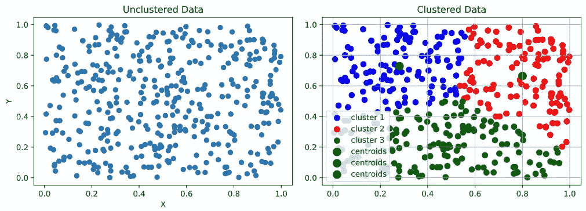
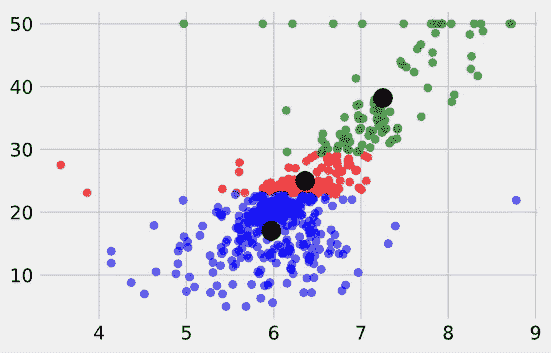
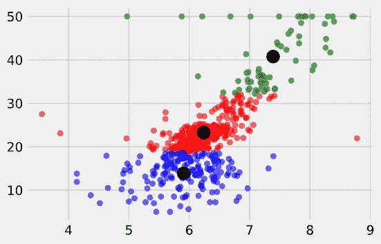
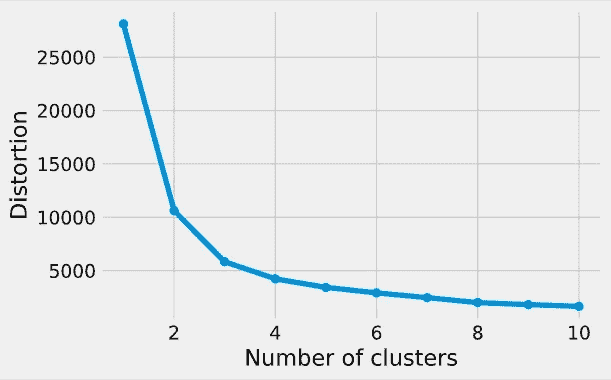

# k 表示没有库的集群

> 原文：<https://towardsdatascience.com/k-means-without-libraries-python-feb3572e2eef?source=collection_archive---------4----------------------->


Billy Huynh 在 [Unsplash](https://unsplash.com/s/photos/cluster?utm_source=unsplash&utm_medium=referral&utm_content=creditCopyText) 上拍摄的照片

## ***—使用 Python***

*Kmeans 是一种广泛使用的聚类工具，用于分析和分类数据。然而，我怀疑，人们往往并不完全了解幕后发生了什么。如果你理解最终产品传达了什么，这不一定是一件坏事，但是通过从头开始构建算法来了解发生了什么肯定会导致对其背后的推理的更深入的理解。*

我 **想先强调一下**互联网是程序员和工程师的绝佳去处。答案和资源随处可得，只需谷歌搜索即可。假装这一切都是我自己想出来的是愚蠢的。我很乐意承认，有时需要通读其他人在算法方面的工作，才能理解如何更好地接近它。代码的美妙之处在于它可以用许多不同的方式编写，每种方式强调的质量都略有不同。在你的学习中利用这一点。

既然我已经谈到了那一点，让我们开始吧！

**K 表示聚类**最简单的形式是一种算法，它在数据簇中找到密切的关系，并将它们分组以便于分类。



你在这里看到的是一种算法，根据特定的质量将不同的数据点分类成组或段…接近(或接近)一个中心点。

最常见的是 Scikit-Learn 的 KMeans 算法，看起来像这样:

```
from sklearn.cluster import KMeanskm = KMeans(
       *n_clusters*=3, *init*='random',
       *n_init*=10, *max_iter*=300,
       *random_state*=42
       )y_km = km.fit_predict(X)
```

您可能不太理解这些部分，但它的方法相当简单。它主要做的是，它说我们需要 3 个集群，从 10 次迭代开始(或运行，每次细化集群和位置)，3 个中心点的初始化是随机的，最大迭代次数是 300，随机状态只是指每次运行它，它都是相同的。然后我们运行预测。更多信息可在此处[阅读](https://scikit-learn.org/stable/modules/generated/sklearn.cluster.KMeans.html)关于可使用的不同参数。

那么，我们如何从头开始创建这些代码呢……尤其是在我们不确定发生了什么的情况下？我们来想办法吧！

第一步是思考并描述正在发生的事情。首先，[这篇文章](/how-does-k-means-clustering-in-machine-learning-work-fdaaaf5acfa0)很好地描述了每一步。总之，我们在散点图上绘制出 *k* 数量的点(也称为*质心)*，通常是随机的，并找到最接近这些点的数据。然后，我们不断地重新计算从数据到质心的平均距离和质心位置，直到每个 *k* 质心周围都有清晰的数据组。

我失去你了吗？希望不会。让我们浏览一下每个流程，看看发生了什么:

*   第一步是我们需要决定要将数据分成多少个簇。这有一个方法，但是为了简单起见，我们说我们将使用 3 个集群，或者， *k =* 3。代码看起来像这样:

```
k = 3
clusters = {}for i in range(k):
clusters[i] = []
```

你在上面看到的只是创建了 3 个空的集群。看起来是这样的…

```
{0: [], 1: [], 2: []}
```

很简单，对吧？

然后，我们以类似的方式设置质心，但这次我们使用我们正在使用的数据。在我的例子中，我使用的是[波士顿住房数据集](https://raw.githubusercontent.com/jbrownlee/Datasets/master/housing.data)。 *X，在本例中，*是我从数据集中选择的两个数据点的数组。

```
for i in range(k):
    centroids[i] = X[i]
```

接下来，我们需要找到每个数据点到质心的距离。这个概念很简单，但是下一个块一开始看起来有点混乱。我建议搜索和阅读这篇文章的不同部分，以便更好地了解正在发生的事情。*例如，如果你在谷歌上搜索“np.linalg.norm ”,你会发现* [*这个页面*](https://numpy.org/doc/stable/reference/generated/numpy.linalg.norm.html) *描述了它是什么以及它的作用。*

```
for data in X:
    euc_dist = []
    for j in range(k):
        euc_dist.append(np.linalg.norm(data - centroids[j]))
    clusters[euc_dist.index(min(euc_dist))].append(data)
```

初始化质心和聚类后，我们要重新计算这两个值！为什么？因为它们在某种程度上是随机初始化的，所以我们需要慢慢地将它们移向数据自然分段的最理想方式(如果有的话，*，但那是另一个讨论*)。

我写了两个函数来实现这个功能。让我们来看看:

```
def recalculate_clusters(*X*, *centroids*, *k*):
    """ Recalculates the clusters """
    # Initiate empty clusters
    clusters = {}
    # Set the range for value of k (number of centroids)
    for i in range(k):
        clusters[i] = []
    for data in X:
        euc_dist = []
        for j in range(k):
            euc_dist.append(np.linalg.norm(data - centroids[j]))
        # Append the cluster of data to the dictionary
        clusters[euc_dist.index(min(euc_dist))].append(data)
    return clustersdef recalculate_centroids(*centroids*, *clusters*, *k*):
    """ Recalculates the centroid position based on the plot """
    for i in range(k):
        centroids[i] = np.average(clusters[i], *axis*=0)
    return centroids
```

我希望您能在这两个函数中识别出一些相同的代码。请密切注意不同的零件和部件。学习的最好方法之一是剖析内在发生的事情。再一次，我要求你用谷歌搜索这段代码的个别部分。这就像把收音机拆开，然后再组装起来。把那个内在的工程师拿出来！

从那里，我们将把一个绘图函数放在一起，绘制每个集群，并为其分配不同的颜色。这就像将数据输入分拣机，分拣机根据数据的去向对不同的数据进行颜色编码。出来的东西看起来像这样:



我们可以看到数据被清晰地分割成不同的部分，尽管它们分布得不是很好。这是因为这仅仅是数据的第一次迭代！我还应该提到，这种形状并不完全适合于聚类，这本身就是一个关于算法的优点和缺点的教训。

那么，当我们希望在集群之间有更好的分布时，我们该怎么做呢？…重新计算，重新计算，重新计算！在这种情况下，如果我们运行它，比如说，10 次，它将如下所示:



现在有一个稍微好一点的分配，不是吗？我们看到的是数据中 3 种不同的非监督分类。算法告诉我们，这三种颜色可能意味着数据中至少值得研究的东西。请注意，这并不意味着它实际上很重要。这就是数据的有趣之处。计算机努力增强我们在数据中寻找关系的能力，但最终还是要由我们来决定这些关系(如果有的话)意味着什么。你的数据科学工作可能会持续一段时间。唷！

更有趣的旁注之一…当决定运行多少次迭代时(或者换句话说，你想要重新计算多少次)，你可以把通常所说的“肘图”放在一起，看看迭代真正开始失去区分能力的地方。我的看起来像这样:



您可以看到，大约 3 到 4 次重复后，它开始失去每次迭代在调整这些簇和质心时产生的动量。这是一个很好的检查有多少计算你真的想运行。毕竟这对于一个公司来说，时间就是金钱，资源一般都是有限的！当然，这是非常低级的东西，所以没什么大不了的，但它总是值得你和/或团队就项目和分析进行一次对话。

要查看整个(*进行中*)笔记本，请导航到我的 GitHub 库，这里是[T5！你将会看到我如何选择数据集以及最初探索数据集的一些细节。](https://github.com/lechemrc/CS-Build-Week)

我希望你喜欢 K 均值聚类的概述！请注意，我对数据科学的世界还相当陌生，所以我绝对愿意接受本文中详述的观点和方法的修正。毕竟，我觉得学习是持续的，我一点也不介意提高我解释和利用这些方法的能力。我们都从错误中学习！如果您觉得有任何错误或需要澄清的地方，请联系我们。谢谢大家！