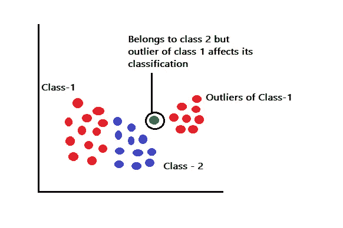

# k-最近邻

> 原文：<https://towardsdatascience.com/k-nearest-neighbor-85bd50ea3e4d?source=collection_archive---------30----------------------->

## 邻居很重要！！

照片由 [Pexels](https://www.pexels.com/photo/variety-of-food-2952869/?utm_content=attributionCopyText&utm_medium=referral&utm_source=pexels) 的 [Engin Akyurt](https://www.pexels.com/@enginakyurt?utm_content=attributionCopyText&utm_medium=referral&utm_source=pexels) 拍摄

## 介绍

KNN 或 k-最近邻是一种监督学习算法。它可以应用于回归和分类问题的解决。KNN 是一种基于其最近样本来识别样本空间中任何特定点的类别或类标签的技术。KNN 中的字母 k 表示我们将在邻域中考虑多少样本，以预测我们在样本空间中关注点的类别标签。

KNN 也被称为基于实例的学习算法**。在基于实例的学习中，当我们获得训练样本时，我们不会处理它们并学习模型，而是存储训练样本，当我们需要对实例进行分类时，我们会对测试样本进行训练和类标签关联。所以基于实例的学习算法也被称为**懒惰算法**。**

## 分类中的 KNN

作者图片

我们被给予不同的样本点(x₁,y₁),(x₂,y₂),(x₃,y₃),…..,(xₙ,yₙ).所有这些点都被归入类标签 1 或类标签 2。我们引入一个点(xₜ,yₜ)and 想预测它的类标签。因此，我们使用 KNN 方法，并遵循以下步骤。

**第一步:选择 k 的值**

我们可以决定 k 的值，它将决定我们需要考虑的预测测试 sample(xₜ,yₜ).值的最近样本的总数在我们的例子中，我们考虑 k=5。

**第二步:计算距离**

使用欧几里得距离公式确定 5 个最接近的样品 w.r.t 测试样品。对于任意两个给定点，欧几里德距离使用以下公式计算

作者图片

**步骤 3:根据类别对最近的点进行分类**

从图中可以观察到，在 5 个最近的点中，它们中的 3 个属于类别 label-2，它们中的两个属于类别 label-1。因此，根据大多数情况，可以得出结论，点(xₜ,yₜ)属于类 label-2。

## **回归中的 KNN**

作者图片

在 KNN 回归的情况下，我们将使用与分类几乎相同的方法。只有第 3 步有所不同，在这一步中，我们不会为测试样本取多数类别标签。相反，我们将取所有类标签的平均值，并将该值设置为测试样本的类标签。例如，在上图中，我们考虑 k=5 来确定测试样本的类别标签。通过使用距离公式，我们识别 5 个最近的训练样本点，并识别它们的类别标签。因为这是一个回归问题，所以所有 5 个训练样本的类别标签是相似的。因此，取所有测试样本的类别标签的平均值，就得到测试样本的类别标签。

## 属性和权重

我们看到每个样本点都有自己的 x 和 y 坐标。但是除了坐标之外，还有代表样本空间中的点的特征或属性。这些属性也非常有助于将点分成各种类别标签。因此，在寻找最近的 k 点时，也必须从所有这些属性计算欧几里德距离。

作者图片

现在我们知道我们考虑回归 KNN 问题的类别标签的平均值。当我们考虑 k 的大值时，那么在分类过程中有必要取类别标签的平均值，而不是多数考虑。以下是一些原因:

1.  属性中的噪声——由于噪声的存在，距离测试样本最近的样本点可能无法捕捉到测试样本的所有特征，而稍远的点可能能够捕捉到。
2.  类别标签中的噪声——由于类别标签中存在噪声，测试样本的错误分类几率很高
3.  部分重叠的类别标签-类别标签的重叠导致算法无法分配样本测试点的正确类别标签。

你有没有想过为什么我们不考虑属性的权重？如果认为所有属性的权重相等，则以下关于样本空间的假设将成立:

1.  所有属性都具有相同的比例。拥有相同的尺度意味着所有的属性都使用相同的单位来测量，也就是说，用厘米和英尺来测量学生的身高是不相关的。
2.  所有属性的范围必须相同。例如，所有属性的值必须从 0 到 100 变化，而不是从 0 到 1000。

## **限制**

**不平衡**

作者图片

考虑样本空间中的一种情况，其中大约有 1000 个点被分类为 A 类或 b 类。假设 1000 个点中有 800 个点属于 A 类，这表明数据集高度不平衡。这会影响新测试样本的分类吗？是的，肯定的！！考虑我们想要在样本空间中找到点 X 的类标签。如果我们认为 k 值非常大，比如大约 150，那么不平衡的数据集将迫使点 X 落入 A 类，这可能导致错误分类。

**异常值**

作者图片

考虑上面的图像具有属于类别 1 的异常值。假设我们想要预测 1 类标记异常值和 2 类标记训练点之间的点。测试点可能属于类别 2 标签，但由于类别 1 异常值的存在，这些点可能会被错误地分类到类别 1 中。

因此，KNN 的局限性在于，由于不平衡或异常数据集的存在，它可能会对点进行错误分类。

## 如何选择 K 的最佳值？

k 的最佳值是提供最小误差和最大精度的值。我们集中于为 k 取一组随机的值，并且在训练和测试模型时验证我们获得最小错误率的 k 值。

## 编码和学习

我们现在来看看 Kaggle 著名的 Pima Indian 糖尿病数据集任务，以便更好地理解 KNN 分类。这里，在给定的数据集中，我们有各种独立的特征，例如葡萄糖、血压、皮肤厚度、胰岛素、身体质量指数等，这些特征决定了该人是否患有糖尿病的结果。

作者图片

因此，最初我们做一些探索性的分析，以发现独立特性之间的相互依赖性和相关性。

作者图片

## 拆分测试和训练数据

## 调用 KNN 分类器对 k=1 的数据进行训练和测试

## 使用混淆矩阵和分类报告检查准确性

作者图片

## 基于从 1 到 50 的 k 值对数据进行训练和测试。

## 检查并绘制从 1 到 50 的所有 k 值的误差率。

作者图片

## k=13 时误差最小。训练和测试数据，同时检查准确性

作者图片

感谢您阅读文章！！