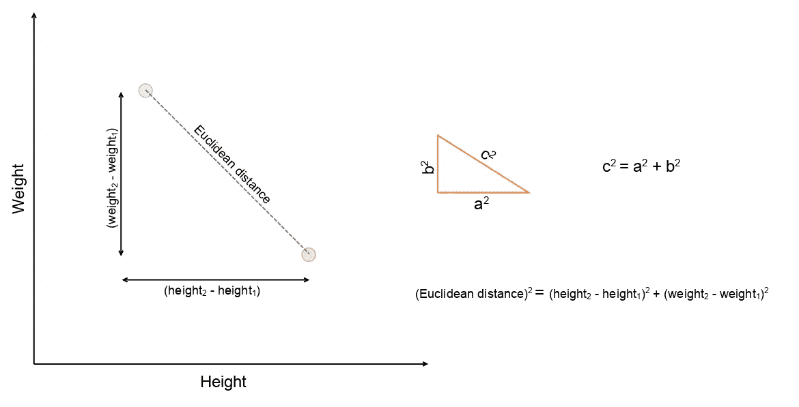
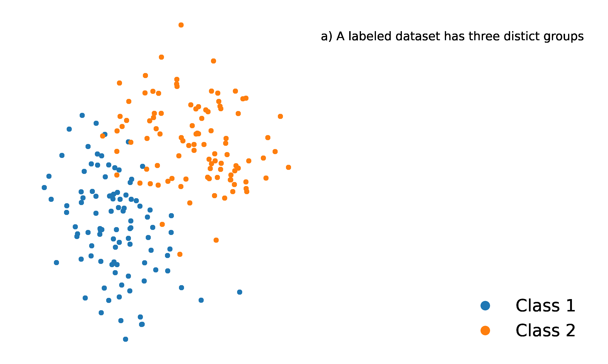

# k 近邻(KNN)算法

> 原文：<https://towardsdatascience.com/k-nearest-neighbor-knn-algorithm-3d16dc5c45ef?source=collection_archive---------38----------------------->

妮娜·斯特雷尔在 [Unsplash](https://unsplash.com/s/photos/neighbor?utm_source=unsplash&utm_medium=referral&utm_content=creditCopyText) 拍摄的照片

## 使用简单的东西在泰坦尼克号比赛中获得高分

数据科学很热门，似乎每个人都在从事某种涉及最新艺术(SOTA)算法的项目。当然有充分的理由，因为在许多情况下，我们可以使用数据来给出非常合理的预测，几乎在任何领域。虽然最近有很多人关注 SOTA 算法，但更简单的方法有时会被遗忘。

> 想入门 Python？[从这里开始](/master-python-in-10-minutes-a-day-ac32996b5ded)！

最近，我玩了一个 k 近邻(KNN)算法，我惊讶于它的强大。这项技术本身也用于许多其他领域。例如，我用它来识别我在博士期间的一个研究项目的高速记录的连续帧中的相同粒子。粒子的坐标是已知的，我们在下一帧中寻找该位置周围最近的粒子。当然，当有多个粒子非常接近时，你就有麻烦了。为此，您可以利用来自多个帧的高阶信息，如速度或加速度向量。对于机器学习中的 KNN，我们通常没有时态数据，因此，我们只使用它的一阶，这是最简单的形式。

当我们想用 KNN 对新数据进行分类，即进行预测时，我们使用已知数据(或标记数据)作为一种查找表。我们选择与我们想要预测的新数据相似的数据，并从该选择中选择最突出的类。所以我们将一个未知的例子和一个已知的数据集进行比较。没有训练，没有层次，没有重量。唯一的参数是 *k* ，它指定了预测类时要考虑的邻居数量。例如，为了对一种水果进行分类，我们可以从数据集中选择五个最相似的例子。现在我们说，那五个被选择的例子中最突出的类可能也是我们想要预测的类。如果我们发现了三个苹果和两个梨，我们也会预测一个苹果。

现在我们来看另一个问题:我们如何从特征列表中选择最相似的例子。当我们有一个单一的特征时，例如*高度*，这将是非常容易的。我们简单地计算差异并选择最接近的 *k* 个匹配。但是当我们也有*重量*和*宽度*的时候该怎么办呢？我们必须量化每个特性的差异，并将结果聚合成一个值。幸运的是，有很多方法可以做到这一点。其中最常见的是欧几里德距离，可以看作是两点之间最短的直线。

欧几里德距离:毕达哥拉斯引入的魔法！(我自己的图解技巧)

欧几里德距离适用于许多特征(或维度)，但是有一个缺点适用于一般的 KNN。特征必须是数字，为了计算距离，数字必须代表意义。高度特征具有与数字相关的含义。数字越大，物体越大。数字越小，物体越小。这使得距离，即两个高度之间的差异有意义，因为它是高度的差异。现在我们以颜色为特征。颜色不是数字(至少我们使用名称，而不是波长)，因此，我们需要将其转换为分类单位来创建数字。现在，绿色的值用 0 表示，红色用 1 表示，以此类推。虽然这些数字表示对象附带的颜色，但值本身没有实际意义。如果我们有一个颜色值为 100 的对象和另一个颜色值为 50 的对象，除了颜色不同之外，这些数字没有任何意义。因此，这些数字之间的差异(或距离)对 KNN 来说是没有意义和没有用的。

虽然真正的分类变量是不可用的，但并不是所有东西都丢失了。例如，我们可以使用诸如 is_green 的二进制指示器来指示一个对象是否是绿色的。尽管如此，如果我确信这些特性会增加预测，我还是会使用它们。

## 创建算法

我们将创建一个 KNN 算法，并将其用于著名的[泰坦尼克号数据集](https://www.kaggle.com/c/titanic/discussion/182810)，预测谁在这场悲惨的灾难中幸存下来。因此，所有函数都将与该数据集有某种链接。要创建 KNN 预测算法，我们必须执行以下步骤:

1.计算未知点和已知数据集之间的距离。
2。从该数据集中选择 k 个最近邻。
3。做一个预测

简单的 GIF 展示了 KNN 是如何工作的

如上图所示，我们只需应用毕达哥拉斯来计算欧几里得距离:

接下来我们需要做一个循环来计算和比较数据集与我们想要预测的点的所有距离:

现在我们有了一个函数，它给出了 k 个最近邻的列表。最后一步是从列表中选择最突出的类，并将其用作预测。这很容易通过取平均值和四舍五入来解决。请随意检查这是不是真的。

## 准备数据集

在测试算法之前，我们需要准备数据。这是读入数据并以巧妙的方式填充缺失的值。我们不会使用登船和客舱功能，所以我们不必担心这些。有一个票价缺失，我们将使用该 Pclass 的中间值来填充。有相当多的年龄数据丢失。我们将使用标题对每个缺失的年龄做一个很好的猜测。

接下来，我们创建几个附加特征(特征)。我最近在 Kaggle 上看到的一个是家庭生存。它假设家庭成员互相帮助，如果你的家人幸存下来，你也很可能幸存下来。这个想法来自于[徐顺江/血浓于水](https://www.kaggle.com/shunjiangxu/blood-is-thicker-than-water-friendship-forever)我认为这是相当惊人的。此外，我们将增加家庭规模，将性别更改为二元指标，缩放所有变量并将其拆分回训练/测试。

## 做预测

算法准备好了，数据准备好了，我们准备做一些预测！

这需要很长时间，因为我们的算法相当慢。如果都是正确的，你应该得到一个 **83.5%** 的准确度。我们唯一可以调整的参数是要考虑的邻居数量。我玩了一下，10 似乎给出了最好的结果。现在让我们制作一个 Kaggle 提交数据集！

把这个提交给 [Kaggle](https://www.kaggle.com/c/titanic/discussion/182810) 会得到 **81.3%** 的分数。略低于训练集，但仍然相当高。我们只用一个简单的 KNN 算法就做到了。

## 一些最后的想法

我们创造的算法强大而有效。唯一的缺点是我们的实现非常慢。对于每个向量，我们需要计算距离并与完整的数据集进行比较。Sci-kit learn 提供了更智能的实现，使用基于树的方法来最小化所需的计算量，并使其速度大大加快。

这里我们使用 KNN 作为分类器，但是，它的工作方式也非常类似于回归。对于回归，结果是连续的，因此，例如，在进行预测时对最近邻进行平均是有意义的。

我希望你和我一样开心。如有任何问题，欢迎通过 [LinkedIn](https://www.linkedin.com/in/dennisbakhuis/) 联系我。

所有代码都可以在我的 [Github](https://github.com/dennisbakhuis/algorithms_from_scratch/tree/master/KNN) 和 [Kaggle](https://www.kaggle.com/dennisbakhuis/titanic-k-nearest-neighbor-knn-frmscratch-0-813) 上获得。

我将*非常感谢*对我的 Kaggle 笔记本的任何支持。