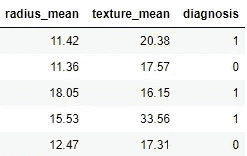
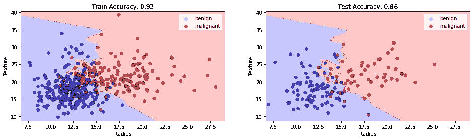
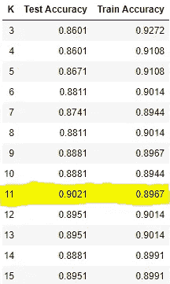
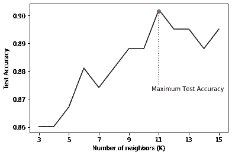
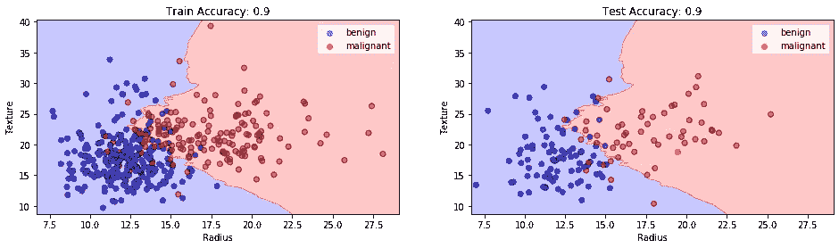
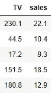
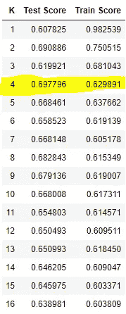
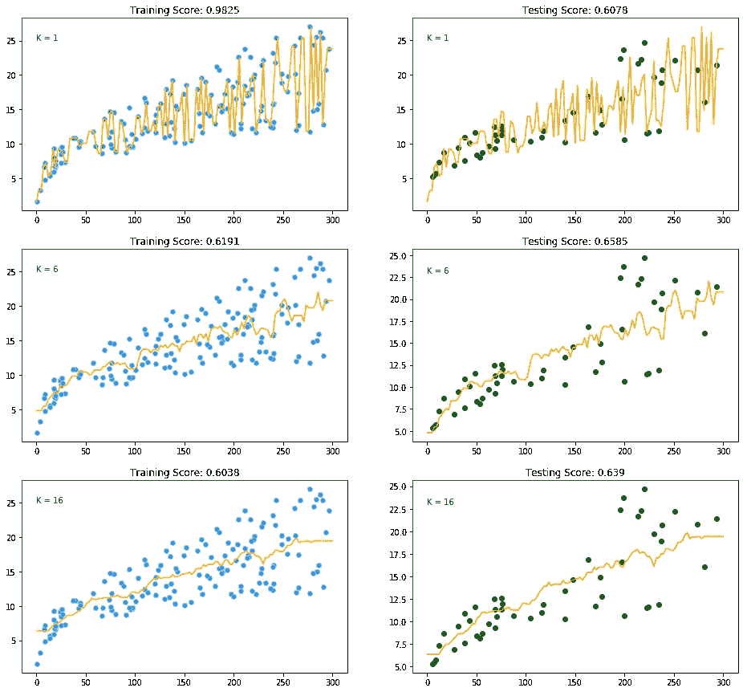
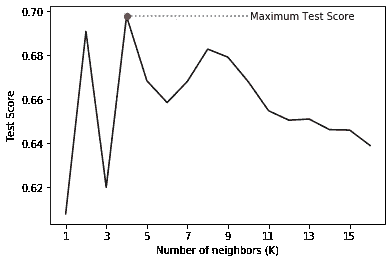

# k-最近邻

> 原文：<https://towardsdatascience.com/k-nearest-neighbors-94395f445221?source=collection_archive---------5----------------------->

## 关于 KNN 你需要知道的。


罗伯特·卡茨基在 [Unsplash](https://unsplash.com?utm_source=medium&utm_medium=referral) 上的照片

> "一个人因他交的朋友而出名。"

我必须说这是一个完美的开场白，用来展示 K 个最近的邻居。是的，这就是 KNN 背后的简单概念。它只是根据一个数据点最近的几个邻居对其进行分类。有多少邻居？这是我们的决定。

看起来你已经知道了很多关于这个简单模型的知识。让我们深入了解一下。

在继续之前，知道 KNN 可用于分类和回归问题是很重要的。我们将首先理解它是如何解决分类问题的，从而使可视化回归变得更容易。

## KNN 分类器

我们将要使用的数据是 [*乳腺癌威斯康星(诊断)数据集*](https://www.kaggle.com/uciml/breast-cancer-wisconsin-data?select=data.csv) *。*有 30 个属性对应于为考虑中的细胞核计算的实值特征。该数据中共有 569 个样本，其中 357 个被归类为*‘良性’*(无害)，其余 212 个被归类为*‘恶性’*(有害)。

*诊断*栏分别包含恶性和良性癌症的“M”或“B”值。为了更好的分析，我将这些值分别改为 1 和 0。

此外，为了这篇文章，我将只使用数据中的两个属性→“平均半径”和“平均纹理”。这将有助于我们理解 KNN 划定的决策界限。下面是最终数据的样子(洗牌后):



让我们给 KNN 编码:

```
# Defining X and y
X = data.drop('diagnosis',axis=1)
y = data.diagnosis# Splitting data into train and test
from sklearn.model_selection import train_test_split
X_train, X_test, y_train, y_test = train_test_split(X,y,test_size=0.25,random_state=42)# Importing and fitting KNN classifier for k=3
from sklearn.neighbors import KNeighborsClassifier
knn = KNeighborsClassifier(n_neighbors=3)
knn.fit(X_train,y_train)# Predicting results using Test data set
pred = knn.predict(X_test)
from sklearn.metrics import accuracy_score
accuracy_score(pred,y_test)
```

上面的代码应该会给你一个稍微不同的输出。

```
0.8601398601398601
```

刚刚发生了什么？当我们在训练数据上训练 KNN 时，它对每个数据样本采取以下步骤:

1.  借助欧几里得方法计算数据样本和其他样本之间的距离。
2.  按升序排列这些距离值。
3.  从排序的距离中选择前 K 个值。
4.  根据上述 K 值中最常见的类别将类别分配给样本。

让我们想象一下 KNN 是如何在训练数据集上画出一个决策边界的，以及这个边界是如何被用来对测试数据集进行分类的。



K=3 时的 KNN 分类。图片由 [Sangeet Aggarwal](https://medium.com/u/db3258338f2f?source=post_page-----94395f445221--------------------------------)

训练准确率为 93%,测试准确率为 86%,我们的模型在这里可能显示出过度拟合。为什么这样

当 K 值或邻域数太低时，模型仅选取最接近数据样本的值，从而形成如上所示的非常复杂的决策边界。这种模型无法在测试数据集上很好地概括，从而显示出较差的结果。

这个问题可以通过调整参数 *n_neighbors* 的值来解决。*随着我们增加邻居的数量，模型开始很好地泛化，但是增加太多的值会再次降低性能。*

因此，找到 K 的最佳值很重要，这样模型就能够在测试数据集上很好地分类。让我们观察训练，并随着邻居数量的增加测试精确度。



在 k=11 时观察到最佳结果

上面的结果可以通过下面的图得到最好的可视化。



图片由 [Sangeet Aggarwal](https://medium.com/u/db3258338f2f?source=post_page-----94395f445221--------------------------------)

该图显示了测试精度在某一点上的总体上升趋势，之后精度再次开始下降。这是最近邻的最佳数量，在本例中为 11，测试准确率为 90%。

让我们再次画出 k=11 的决策边界，看看它是什么样子。



K=11 时的 KNN 分类。图片由 [Sangeet Aggarwal](https://medium.com/u/db3258338f2f?source=post_page-----94395f445221--------------------------------) 提供

我们通过微调邻居的数量来改善结果。此外，KNN 的决策边界现在平滑得多，能够很好地概括测试数据。

现在让我们来理解 KNN 是如何用于回归的。

## KNN 回归量

*KNN 分类器返回最近 K 个邻居的模式，而 KNN 回归器返回最近 K 个邻居的平均值。*

我们将用[广告数据](http://faculty.marshall.usc.edu/gareth-james/ISL/data.html)来理解 KNN 的回归。下面是电视预算和销量的前几排。



```
# Defining X and Y
X_ad = ad.TV.values.reshape(-1,1)
y_ad = ad.sales# Splitting data into train and test
train_x, test_x, train_y, test_y = train_test_split(X_ad, y_ad, test_size=0.25, random_state=42)# Running KNN for various values of n_neighbors and storing results
knn_r_acc = []for i in range(1,17,1):
    knn = KNeighborsRegressor(n_neighbors=i)
    knn.fit(train_x,train_y) test_score = knn.score(test_x,test_y)
    train_score = knn.score(train_x,train_y) knn_r_acc.append((i, test_score ,train_score))df = pd.DataFrame(knn_r_acc, columns=['K','Test Score','Train Score'])
print(df)
```

上面的代码将针对不同的 K 值(从 1 到 16)运行 KNN，并将训练和测试分数存储在一个数据帧中。让我们看看当我们增加 *n_neighbors(或 K)* 的值时，这些分数是如何变化的。



K=4 时的最佳结果

在 K=1 时，KNN 倾向于紧密跟随训练数据，因此显示出高的训练分数。但相比较而言，测试分数相当低，从而说明过度拟合。

让我们想象一下 KNN 如何绘制不同 k 值的回归路径



**左:**用 KNN 回归器训练数据集**右:**用相同的 KNN 回归器测试数据集。图片由 [Sangeet Aggarwal](https://medium.com/u/db3258338f2f?source=post_page-----94395f445221--------------------------------) 提供

随着 K 的增加，KNN 将数据拟合为更平滑的曲线。这是因为 K 值越高，考虑的数据就越多，从而降低了模型的整体复杂性和灵活性。

正如我们之前看到的，增加 K 值会将分数提高到一定程度，之后分数会再次下降。这一点可以通过下面的情节更好的理解。



图片由 [Sangeet Aggarwal](https://medium.com/u/db3258338f2f?source=post_page-----94395f445221--------------------------------) 提供

正如我们在该图中看到的，该模型在 K=4 时产生最佳结果。我用 R 来评估这个模型，这是我们能得到的最好的结果。这是因为我们的数据集太小而且太分散。

关于 KNN，需要了解的其他几点很重要:

*   KNN 分类器没有任何专门的训练阶段，因为它使用所有的训练样本进行分类，并简单地将结果存储在内存中。
*   KNN 是一种非参数算法，因为它没有对训练数据做任何假设。这对于具有非线性数据的问题非常有用。
*   如果数据非常大，KNN 在时间和存储方面的计算都很昂贵，因为 KNN 必须存储训练数据才能工作。其他监督学习模型一般不会出现这种情况。
*   KNN 对数据的规模非常敏感，因为它依赖于计算距离。对于比例较高的要素，计算出的距离可能会很大，结果可能会很差。因此，建议在运行 KNN 之前缩放数据。

这个帖子到此为止。我希望你在学习 KNN 的时候过得愉快。欲知详情，敬请关注。