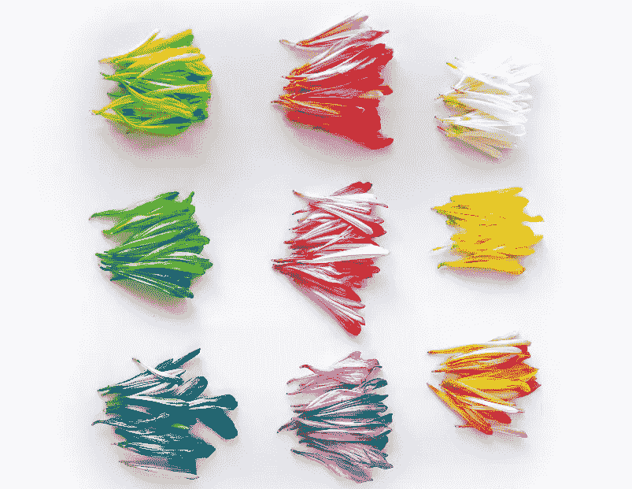
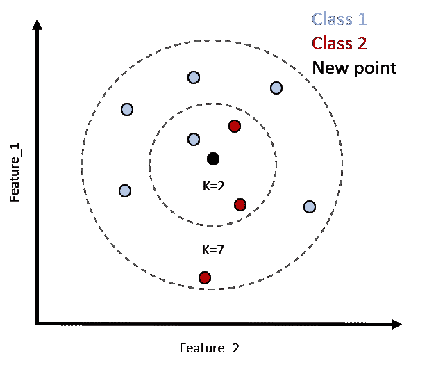
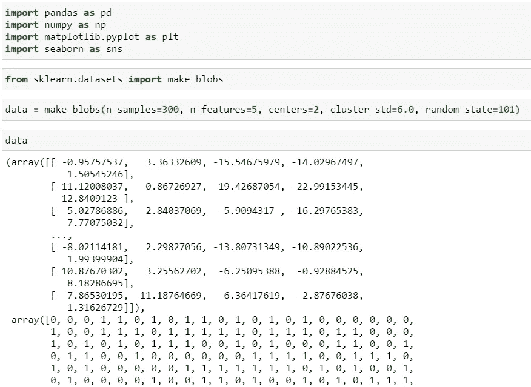
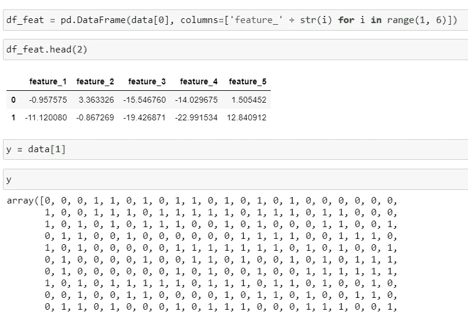
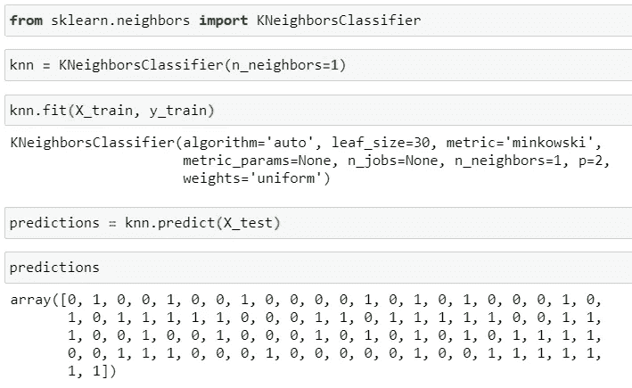
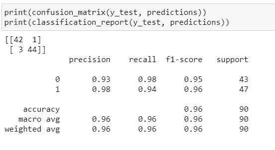
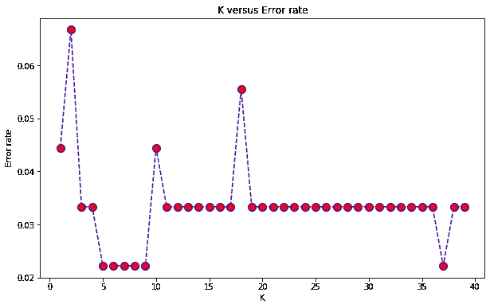
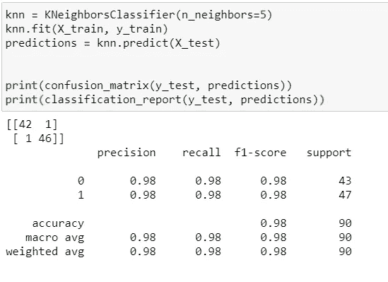
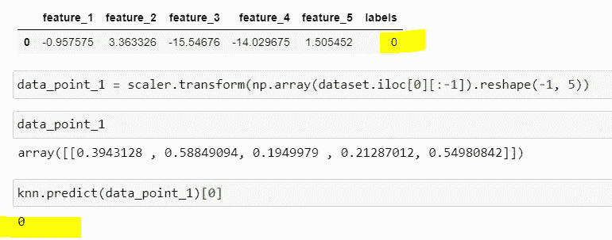

# 举例说明 Python 中的 k-最近邻算法

> 原文：<https://towardsdatascience.com/k-nearest-neighbors-algorithm-in-python-by-example-79abc37a4443?source=collection_archive---------17----------------------->

## 通过代码示例介绍 K-最近邻

图片由李可莹通过 [Unsplash](https://unsplash.com/photos/o5GGlwHfff8) 提供

## k-最近邻(KNN)

KNN 是一种受监督的机器学习算法，可用于解决分类和回归问题。KNN 的原理是一个数据点的值或类别由该值周围的数据点决定。

要理解 KNN 分类算法，最好通过例子来说明。本教程将演示如何在 Python 中使用 KNN 来解决自己的分类问题。与这个例子相对应的 Jupyter 笔记本可以在[这里](https://github.com/StephenFordham/KNN/blob/master/KNN_practise.ipynb)找到，如果你想跟随的话。

预测算法计算从未知点 x 到数据中所有点的距离。然后，数据中的点按离 x 的距离递增进行排序。通过从“K”个最近点预测多数标注来进行预测。

选择一个 K 会影响一个新点将被分配到什么类。

在下面的示例中，选择 K 值 2 会将未知点(黑色圆圈)分配给类别 2。但是，如果 K 值为 7，未知点将被分配到类别 1。

作者个人制作，[斯蒂芬·福特汉姆](https://medium.com/@stephenfordham)

## 创建假数据集

首先，我们导入我们需要的库，然后使用 sklearn 的 makeblobs 函数创建一个假数据集。我们可以传入样本数量、数据集中的特征、数据将落入多少个中心或类中，以及最终这些聚类的标准偏差。为了这个 Jupyter 笔记本的多次运行之间的一致性，我将整数 101 赋给了 random_state 参数。

注意，首先，我们将有一个大的集群标准偏差。这将在分类中引入方差，我们可以通过专门选择最佳 K 值来对其进行改进。这可以通过肘法来实现。

sklearn 的 makeblobs 函数返回一个 2 元素元组。我们可以使用 pd 创建我们特征的数据框架。DataFrame，并传入对应于特征数据的第一个元组的索引。数据元组的第二个元素对应于特征的标签。

我们现在可以通过从 Sklearn.preprocessing 导入 MinMaxScaler 来缩放数据。与其他机器学习算法不同，在执行我们的训练测试分割之前，我们在*上拟合和转换所有*训练数据。

## 预测算法和优化

为了在代码中实现预测，我们首先从 sklearn.neighbors 导入 KNeighborsClassifier，然后实例化 KNeighborsClassifier 的一个实例，将参数 1 传递给 n_neighbors，并将其赋给变量 knn。传递给 n_neighbors 的值表示 K 值。

然后，在进行预测之前，我们通过调用 KNeighborsClassifier 对象上的 predict 方法来拟合定型数据。

现在我们可以使用分类报告和混淆矩阵来评估预测的准确性。

这些指标表明准确性已经非常好了。这可能是因为我们用 makeblobs 制作了数据集，并特别要求了 2 个中心。然而，我们确实*故意*为集群标准偏差设置了一个大值，以引入方差。这导致了我们数据集中 4 个点的错误分类。

## 提高数据准确性

我们可以尝试通过修改邻居的数量来提高结果的准确性。这可以通过肘法来实现。

我们首先遍历 40 个邻居值，用这个数量的邻居实例化一个 KNeighborsClassifier 对象。然后，我们可以将训练数据拟合到此 KNN 模型，获得预测，并追加预测 pred_i 和正确值 y_test 之间的平均值。

如果 pred_i 和 y_test 在数组中不匹配，则返回值为 1 的真值。这个数字越高，分类就越不准确。

错误率的较低值将对应于性能更好的模型。

这些结果可以用 x 轴上的 I 值范围对 y 轴上的误差率来绘制。

现在我们可以选择返回的 K 的最低值，最低的错误率。在这里，我们可以选择 5。

现在，我们可以再次使用混淆矩阵和分类报告重新运行准确性评估，以查看我们是否能够更准确地对 4 个未对齐点进行分类。我们有所改进，从 4 个错误分类点减少到 2 个。

## 针对新数据点的培训

我们现在可以使用原始数据创建一个数据点。首先，我们创建两个数据帧；一个包含要素，一个包含标注，将它们连接成单个数据帧，并选择第一行作为预测标注的数据点。我们必须记住*缩放*数据点，因为模型是根据缩放后的数据训练的。

预测表明，数据点 1 将给出标签 0，这与原始数据集点相匹配，通过调用 df.head(1)进行验证。

## 摘要

KNN 很简单，训练也很简单，而且很容易添加更多的数据。此外，参数很少。在本教程中，我只在 KNeighborsClassifier 类的调用中包含了 K 参数(n_neighbors)。

然而，KNNs 也有缺点，包括高预测成本，这对于大型数据集来说更糟。KNN 对异常值也很敏感，因为异常值对最近的点有影响。此外，它们不适用于高维数据集，分类特征也不太适用。随着数据越来越多，KNN 算法变得越来越慢，因为模型需要存储所有这些数据点，以便确定它们之间的距离。

这个例子是人为设计的，主要是为了理解如何用 Python 编写 KNN。我特意使用 makeblobs 制作了数据集，以说明这个函数作为练习 KNNs 的工具是多么有用。如果你想得到我所有的 Jupyter 笔记本，可以在这里找到。

尝试将聚类标准差更改为更高的值，然后尝试使用错误率最低的 K 值来优化 KNN 分类。

此外，KNNs 可以与一起使用来对多个类进行分类。通过增加传递给中心的值，可以在 makeblobs 函数调用中进一步改变这一点。这些参数可以很容易地调整，将有助于理解 KNNs，所以我们可以有效地将它们纳入我们的分析。

快乐分类。