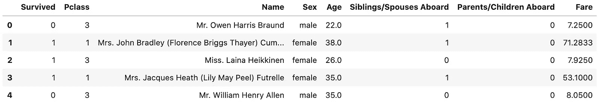
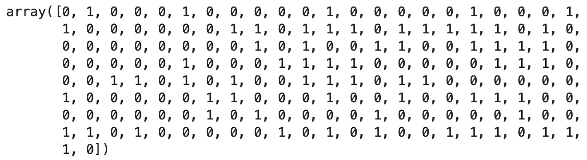
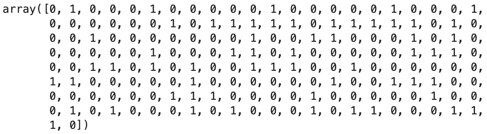

# k 手动最近邻:

> 原文：<https://towardsdatascience.com/k-nearest-neighbors-by-hand-a-computer-science-exercise-for-the-data-scientist-72b5821c8941?source=collection_archive---------36----------------------->

## 打开“黑匣子”并理解其中的算法

数据科学家有时谈论数据科学的“黑盒”方法；也就是说，当你理解了不同机器学习算法的用例，以及如何在不理解算法在表面下如何工作的情况下插入数据。但是*算法*仅仅是——它们是“算法”——一组用于解决特定类型问题的指令。

在这篇博客文章中，我将向您展示如何手工构建一个简单的机器学习算法。我们将要构建的模型是 knarestneighborsclassifier(KNN classifier)。

## 什么是 KNNClassifier，它是如何工作的？

KNNClassifier 是我用过的第一个机器学习算法。它很简单，但是非常强大。该算法被认为是“懒惰”的，因为它本身并不*学习*；该算法只是记忆数据，而不是在训练过程中学习数据中的模式，并根据这些模式对新数据进行预测。然后，该模型将数据与其自身相关联，并找到每个数据点之间的“[欧几里德距离](https://en.wikipedia.org/wiki/Euclidean_geometry#:~:text=Euclidean%20geometry%20is%20a%20mathematical,propositions%20(theorems)%20from%20these.)”(本质上是直线距离)。当添加新数据时，算法会根据我们指定的“最近邻”数据点的数量来预测该数据的目标。

举个简单的例子，假设一个数据集有两三个特征。将这些数据映射到 2D 或 3D 图形上，并找到每个点之间的距离非常简单——只要沿着轴，在图形上找到适当的点时添加数据点。然后，当我们向模型中输入新数据时，该算法会找到与新数据最近的 k 个数据点，并预测该目标是邻居中最常出现的目标。

如果这仍然令人困惑，不要害怕！一旦我们将它应用到真实的数据集，它将变得有意义。

**泰坦尼克号数据集**

*如果您想了解这个示例，只需在这里* *下载数据* [*，并将 csv 文件添加到与 Python 笔记本相同的文件夹中。(参见源代码*](https://web.stanford.edu/class/archive/cs/cs109/cs109.1166/stuff/titanic.csv) [*此处*](https://github.com/AndrewSLowe/KNN_from_Scratch) *)*

由于 KNNClassifier 是一个分类模型，我们需要一个数据集来预测一些离散的目标(与回归模型相反，回归模型预测连续统上的值)。在这个练习中，我们将使用可能是学习分类模型最流行的数据集 Titanic 数据集。我们试图预测的是，根据我们对一个人的一些特征的了解，这个人是否能在泰坦尼克号沉没后幸存下来。

下面是我们需要的导入和加载数据的代码:

如果我们接着运行`df.head()`，我们可以观察前 5 行，并看到我们正在处理的特性:

如果您不熟悉数据集，请花点时间尝试并预测哪些特征与存活率最相关。

## **预处理和列车测试分割**

`survived`列——最左边的列——是我们试图预测的(也称为 y 变量或“目标”)。其余的特征是我们用来预测目标的。我们现在需要做一些预处理工作，以最好地建立我们的模型来预测。由于这篇文章的重点是机器学习算法，我们将尽可能简单地进行预处理。

我们将首先删除“姓名”和“费用”列，因为“姓名”并不能决定某人是否幸存，而“费用”与“等级”密切相关。然后我们将使用`pd.get_dummies()`将“性别”列一次性编码成两列，男性和女性。代码如下所示:

现在，我们的数据已经处理完毕，我们可以执行训练测试分割。这是监督机器学习模型的标准——其思想是，我们在训练数据上训练算法，并通过在我们的测试数据上评估它来测试模型的性能。幸运的是，scikit-learn 库有一个内置模块可以轻松地执行分割:

**带 Scikit 的 KNN classifier-Learn**

首先让我们看看如何使用 scikit-learn 来编码这个问题。由于所有的预处理和训练-测试-拆分都已完成，因此根据数据训练模型并做出预测只需三行代码。我们将首先制作一个模型对象，然后使用`.fit`方法根据数据训练模型，使用`.predict`方法根据模型从训练数据中学到的知识对测试集中的每个值进行预测:

输出显示了测试数据中表示的每个人的生存状态预测。“1”表示模型预测此人幸存,“0”表示模型预测此人未能幸存:

**手动 KNN 算法**

既然我们已经使用 sklearn 库对测试集进行了预测，并且对幕后发生的事情有了基本的了解，那么让我们构建自己的 KNNClassifier 自制版本。我们将使用面向对象的编程来构建模型。(如果您对类和 OOP 不熟悉，请务必关注我的一系列博客文章，在这些文章中，我们将学习 OOP 并使用类来构建一个基于文本的冒险游戏！)

我们首先需要的是辅助函数。这些函数存在于类的外部，我们在类内部调用它们来执行一些操作。下面是一个自制的平方根函数和欧几里德距离公式:

如上所述，欧几里德距离本质上是两条数据之间的直线。该函数只是简单地将两行之间的每一列的值之间的距离相加，然后求出该和的平方根。

接下来我们将编写 KNNHomebrew 函数。该类中的方法模拟了 scikit-learn knnclassifier 模型完成的操作。我们有一个`model_fit()`方法，一个`model_predict`方法，它对一个新的数据点进行预测，还有一个`model_predict_all`方法，它对一组新的数据进行预测。文本注释中解释了每行代码的具体功能。

现在是关键时刻了！让我们看看是否可以像调用 scikit-learn 模型一样调用我们的模型:

输出应该如下所示:

*如果你继续下去，你会注意到 hombrew 模型比 scikit-learn 模型慢得多——可怜可怜我吧，我只是个初级开发人员。我可能会写一篇后续的博客文章，在那里我优化了算法，并使时间低于 1 秒，但现在，让我们看看我们的模型与 scikit-learn 模型的性能相比如何。*

## **比较型号**

现在是时候对比一下车型的性能了。首先，我们需要找到基线。在运行任何机器学习模型之前，这是最佳实践。对于分类问题，问题是，如果我们猜测所有新数据的主要类别，我们猜对的频率是多少？

这是一个非常简单的计算，我们需要做的就是将训练集中多数类的出现次数除以数据集中的观察总数。多数类为 0 或“未存活”。假设我们的训练数据是一个真正的随机样本，在我们进行任何机器学习或预测分析之前，我们应该用任何新数据来预测这个类。由于我们的准确率是 61.24%，我们可以假设这个天真的预测有 61.24%是正确的。

现在让我们看看我们的模型和 scikit-learn 模型是如何比较的。下面是查找 Scikit-Learn 模型和我们的 KNNHomebrew 模型的准确性的代码:

1.  Scikit-learn: `model.score(X_test, y_test)`
2.  KNNHomebrew: `knnHB.model_accuracy(X_test, y_test)`

结果是:

1.  科学知识-学习:75.84%
2.  KNNHomebrew: 72.47%

因此，在其当前的形式下，似乎 scikit-learn 模型将比我们的 KNNHomebrew 模型多正确预测新数据的生存大约 3.5%…失败:(

开玩笑！这个练习的目的不是要打败 Python 中最流行的机器学习库之一，而是要了解其背后的东西。

## 敬请关注。

揭示机器学习算法的所谓“黑盒”中的魔力是有趣且极具教育意义的。我计划在其他预测模型上发表更多这样的博文，所以请保持警惕！