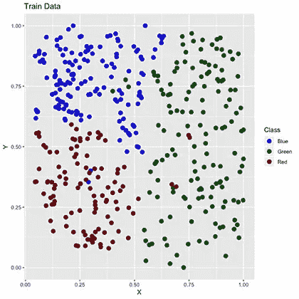
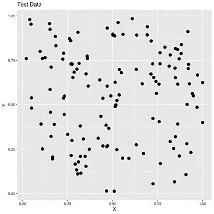
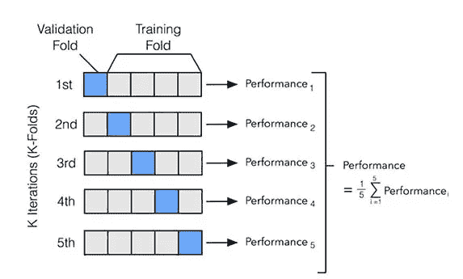
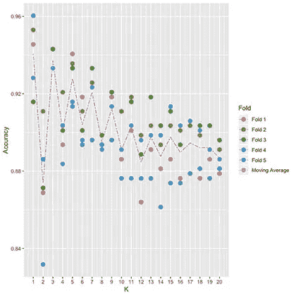
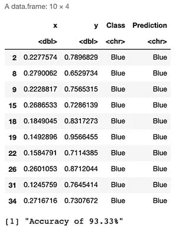
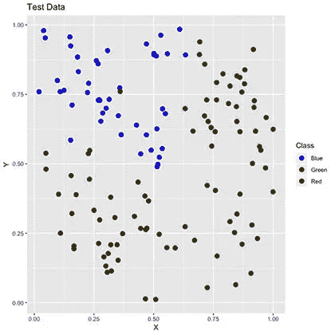
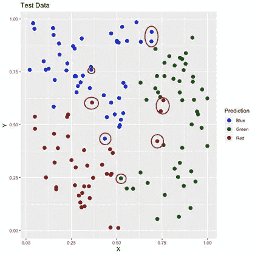
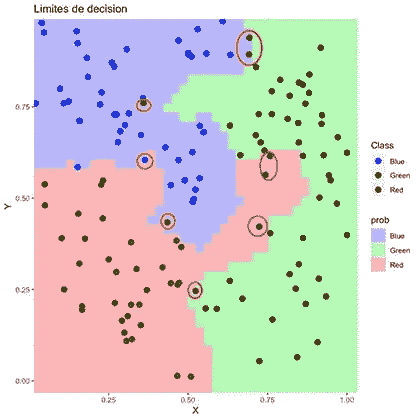

# k-最近邻分类从零开始

> 原文：<https://towardsdatascience.com/k-nearest-neighbors-classification-from-scratch-6b31751bed9b?source=collection_archive---------58----------------------->

## 没有第三方库的 R 中的分步示例

这篇文章旨在探索一步一步的方法来创建一个**K-最近邻算法**而不需要任何第三方库的帮助。在实践中，这种算法应该足够有用，每当我们已经进行了分类(在这种情况下，颜色)时，我们就可以对我们的数据进行分类，这将作为查找邻居的起点。

在这篇文章中，我们将使用一个特定的数据集，它可以在这里下载[。它包含 539 个二维数据点，每个数据点都有特定的颜色分类。我们的目标是将他们分成两组(训练和测试)，并根据我们的算法建议尝试猜测我们的测试样本颜色。](https://www.kaggle.com/tenaciousjay/knn-fromscratch?select=RGB.csv)

# 训练和测试样本生成

我们将创建两个不同的样品组:

*   **训练集:**这将包含我们 75%的工作数据，随机选择。这个集合将用于生成我们的模型。
*   **测试集:**我们剩余的 25%工作数据将用于测试我们模型的样本外准确性。一旦我们做出了 25%的预测，我们将通过比较预测值和实际值来检查“*正确分类的百分比*”。

```
*# Load Data*
library(readr)
RGB <- as.data.frame(read_csv("RGB.csv"))
RGB$x <- **as.numeric**(RGB$x)
RGB$y <- **as.numeric**(RGB$y)
print("Working data ready")*# Training Dataset*
smp_siz = **floor**(0.75*nrow(RGB))
train_ind = sample(**seq_len**(nrow(RGB)),size = smp_siz)
train =RGB[train_ind,]*# Testting Dataset*
test=RGB[-train_ind,]
OriginalTest <- test
paste("Training and test sets done")
```

# 培训用数据

我们可以看到，我们的训练数据根据颜色分为 3 类。

```
*# We plot test colored datapoints*
library(ggplot2)
colsdot <- **c**("Blue" = "blue", "Red" = "darkred", "Green" = "darkgreen")
ggplot() + 
  geom_tile(data=train,mapping=aes(x, y), alpha=0) +
  *##Ad tiles according to probabilities*
  *##add points*
  geom_point(data=train,mapping=aes(x,y, colour=Class),size=3 ) + 
  scale_color_manual(values=colsdot) +
  *#add the labels to the plots*
  xlab('X') + ylab('Y') + ggtitle('Train Data')+
  *#remove grey border from the tile*
  scale_x_continuous(expand=**c**(0,.05))+scale_y_continuous(expand=**c**(0,.05))
```



训练数据:我们可以观察 3 个类别(蓝色、绿色和红色)

# 测试数据

即使我们知道测试数据的原始颜色分类，我们也将尝试创建一个模型，该模型可以仅根据有根据的猜测来猜测它的颜色。为此，我们将删除它们的原始颜色，保存它们只是为了测试的目的；一旦我们的模型做出预测，我们将能够通过比较原始预测和我们的预测来计算我们的**模型精度**。

```
*# We plot test colored datapoints*
colsdot <- **c**("Blue" = "blue", "Red" = "darkred", "Green" = "darkgreen")
ggplot() + 
  geom_tile(data=test,mapping=aes(x, y), alpha=0) +
  *##Ad tiles according to probabilities*
  *##add points*
  geom_point(data=test,mapping=aes(x,y),size=3 ) + 
  scale_color_manual(values=colsdot) +
  *#add the labels to the plots*
  xlab('X') + ylab('Y') + ggtitle('Test Data')+
  *#remove grey border from the tile*
  scale_x_continuous(expand=**c**(0,.05))+scale_y_continuous(expand=**c**(0,.05))
```



测试数据:我们删除并故意忘记了它的分类颜色，以创建一个能够猜测它们的模型。

# k-最近邻算法

下面是实现该算法的分步示例。我们想要实现的是，对于上面每个选定的灰点(我们的测试值)，据称我们不知道它们的实际颜色，从我们的训练值中找到最近的邻居或最近的彩色数据点，并分配与此相同的颜色。

**具体来说，我们需要:**

*   **归一化数据:**即使在这种情况下不需要，因为所有值都是相同的标度(0 到 1 之间的小数)，建议归一化，以便有一个“标准距离度量”。
*   **定义我们如何度量距离:**我们可以将这个二维数据集中两点之间的距离定义为它们之间的欧氏距离。我们将计算 L1(绝对差之和)和 L2(平方差之和)距离，尽管最终结果将使用 L2 计算，因为它比 L1 更不宽容。
*   **计算距离:**我们需要计算每个测试数据点和训练数据集中每个值之间的距离。标准化在这里是至关重要的，因为在身体结构的情况下，体重(1 公斤)和身高(1 米)的距离是不可比的。我们可以预见到公斤比米的偏差更大，导致总距离不正确。
*   **排序距离:**一旦我们计算出每个测试点和训练点之间的距离，我们就需要按降序对它们进行排序。
*   **选择前 K 个最近的邻居:**我们将选择前 K 个最近的训练数据点，以检查它们属于哪个类别(颜色)，以便将该类别分配给我们的测试点。由于我们可能使用多个邻居，我们可能会有多个类别，在这种情况下，我们应该计算一个概率。

```
*# We define a function for prediction*
KnnL2Prediction <- function(x,y,K) {

  *# Train data*
  Train <- train
  *# This matrix will contain all X,Y values that we want test.*
  Test <- data.frame(X=x,Y=y)

  *# Data normalization*
  Test$X <- (Test$X - **min**(Train$x))/(**min**(Train$x) - **max**(Train$x))
  Test$Y <- (Test$Y - **min**(Train$y))/(**min**(Train$y) - **max**(Train$y))
  Train$x <- (Train$x - **min**(Train$x))/(**min**(Train$x) - **max**(Train$x))
  Train$y <- (Train$y - **min**(Train$y))/(**min**(Train$y) - **max**(Train$y)) *# We will calculate L1 and L2 distances between Test and Train values.*
  VarNum <- ncol(Train)-1
  L1 <- 0
  L2 <- 0
  for (i in 1:VarNum) {
    L1 <- L1 + (Train[,i] - Test[,i])
    L2 <- L2 + (Train[,i] - Test[,i])^2
  }

  *# We will use L2 Distance*
  L2 <- **sqrt**(L2)

  *# We add labels to distances and sort*
  Result <- data.frame(Label=Train$Class,L1=L1,L2=L2)

  *# We sort data based on score*
  ResultL1 <-Result[order(Result$L1),]
  ResultL2 <-Result[order(Result$L2),]

  *# Return Table of Possible classifications*
  a <- prop.table(table(head(ResultL2$Label,K)))
  b <- as.data.frame(a)
  **return**(**as.character**(b$Var1[b$Freq == **max**(b$Freq)]))
}
```

# 使用交叉验证找到正确的 K 参数

为此，我们将使用一种叫做“交叉验证”的方法。这意味着，我们将在训练数据本身中进行预测，并针对数据的许多不同折叠或排列，对许多不同的 K 值进行迭代。一旦我们完成，我们将平均我们的结果，并为我们的“K-最近邻”算法获得最佳 K。



```
*# We will use 5 folds*
FoldSize = **floor**(0.2*nrow(train)) *# Fold1*
piece1 = sample(**seq_len**(nrow(train)),size = FoldSize ) 
Fold1 = train[piece1,]
rest = train[-piece1,] *# Fold2*
piece2 = sample(**seq_len**(nrow(rest)),size = FoldSize)
Fold2 = rest[piece2,]
rest = rest[-piece2,] *# Fold3*
piece3 = sample(**seq_len**(nrow(rest)),size = FoldSize)
Fold3 = rest[piece3,]
rest = rest[-piece3,] *# Fold4*
piece4 = sample(**seq_len**(nrow(rest)),size = FoldSize)
Fold4 = rest[piece4,]
rest = rest[-piece4,] *# Fold5*
Fold5 <- rest*# We make folds*
Split1_Test <- rbind(Fold1,Fold2,Fold3,Fold4)
Split1_Train <- Fold5Split2_Test <- rbind(Fold1,Fold2,Fold3,Fold5)
Split2_Train <- Fold4Split3_Test <- rbind(Fold1,Fold2,Fold4,Fold5)
Split3_Train <- Fold3Split4_Test <- rbind(Fold1,Fold3,Fold4,Fold5)
Split4_Train <- Fold2Split5_Test <- rbind(Fold2,Fold3,Fold4,Fold5)
Split5_Train <- Fold1*# We select best K*
OptimumK <- data.frame(K=**NA**,Accuracy=**NA**,Fold=**NA**)
results <- trainfor (i in 1:5) {
  if(i == 1) {
    train <- Split1_Train
    test <- Split1_Test
  } else if(i == 2)  {
    train <- Split2_Train
    test <- Split2_Test
  } else if(i == 3)  {
    train <- Split3_Train
    test <- Split3_Test
  } else if(i == 4)  {
    train <- Split4_Train
    test <- Split4_Test
  } else if(i == 5)  {
    train <- Split5_Train
    test <- Split5_Test
  }
    for(j in 1:20) {
      results$Prediction <- mapply(KnnL2Prediction, results$x, results$y,j)
      *# We calculate accuracy*
      results$Match <- ifelse(results$Class == results$Prediction, 1, 0)
      Accuracy <- **round**(**sum**(results$Match)/nrow(results),4)
      OptimumK <- rbind(OptimumK,data.frame(K=j,Accuracy=Accuracy,Fold=paste("Fold",i)))

    }
}OptimumK <- OptimumK [-1,]
MeanK <- aggregate(Accuracy ~ K, OptimumK, mean)
ggplot() + 
  geom_point(data=OptimumK,mapping=aes(K,Accuracy, colour=Fold),size=3 ) +
  geom_line(aes(K, Accuracy, colour="Moving Average"), linetype="twodash", MeanK) +
  scale_x_continuous(breaks=seq(1, **max**(OptimumK$K), 1))
```



20 个不同 K 值的 5 倍

如上图所示，我们可以观察到，对于所有褶皱，我们算法的预测精度在 88%-95%的范围内，并且从 K=3 开始下降。我们可以在 K=1 (3 也是一个很好的选择)上观察到最高的一致精度结果。

# 基于前 1 个最近邻进行预测。

## 模型精度

```
*# Predictions over our Test sample*
test <- OriginalTest
K <- 1
test$Prediction <- mapply(KnnL2Prediction, test$x, test$y,K)
head(test,10)*# We calculate accuracy*
test$Match <- ifelse(test$Class == test$Prediction, 1, 0)
Accuracy <- **round**(**sum**(test$Match)/nrow(test),4)
print(paste("Accuracy of ",Accuracy*100,"%",sep=""))
```



使用 K=1 的前 10 个预测

从上面的结果可以看出，我们有望在 93%的时间里“猜出正确的类别或颜色”。

## **原始颜色**

下面我们可以观察测试样本的原始颜色或类别。

```
ggplot() + 
  geom_tile(data=test,mapping=aes(x, y), alpha=0) +
  geom_point(data=test,mapping=aes(x,y,colour=Class),size=3 ) + 
  scale_color_manual(values=colsdot) +
  xlab('X') + ylab('Y') + ggtitle('Test Data')+
  scale_x_continuous(expand=**c**(0,.05))+scale_y_continuous(expand=**c**(0,.05))
```



这是我们测试样品的原始颜色/等级

## **预测颜色**

使用我们的算法，我们为最初无色的样本数据集获得以下颜色。

```
ggplot() + 
  geom_tile(data=test,mapping=aes(x, y), alpha=0) +
  geom_point(data=test,mapping=aes(x,y,colour=Prediction),size=3 ) + 
  scale_color_manual(values=colsdot) +
  xlab('X') + ylab('Y') + ggtitle('Test Data')+
  scale_x_continuous(expand=**c**(0,.05))+scale_y_continuous(expand=**c**(0,.05))
```



在红圈里，我们标出了不同或不正确的分类。

从上面的图中可以看出，尽管我们的算法对大多数数据点进行了正确的分类，但其中一些数据点还是失败了(用红色标记)。

## **决策限制**

最后，我们可以可视化我们在原始测试数据集上的“决策限制”。这为我们的模型如何对数据进行分类以及其分类空间的限制提供了一个极好的可视化近似值。

简而言之，我们将在原始数据集的范围内模拟 160，000 个数据点(400x400 矩阵)，当稍后绘制时，将使用颜色填充大部分空白空间。这将帮助我们详细地表达我们的模型将如何在其学习的颜色类别中分类这个 2D 空间。我们生成的点数越多，我们的“分辨率”就越好，就像电视上的像素一样。

```
*# We calculate background colors*
x_coord = seq(**min**(train[,1]) - 0.02,**max**(train[,1]) + 0.02,length.out = 40)
y_coord = seq(**min**(train[,2]) - 0.02,**max**(train[,2]) + 0.02, length.out = 40)
coord = expand.grid(x = x_coord, y = y_coord)
coord[['prob']] = mapply(KnnL2Prediction, coord$x, coord$y,K)*# We calculate predictions and plot decition area*
colsdot <- **c**("Blue" = "blue", "Red" = "darkred", "Green" = "darkgreen")
colsfill <- **c**("Blue" = "#aaaaff", "Red" = "#ffaaaa", "Green" = "#aaffaa")
ggplot() + 
  geom_tile(data=coord,mapping=aes(x, y, fill=prob), alpha=0.8) +
  geom_point(data=test,mapping=aes(x,y, colour=Class),size=3 ) + 
  scale_color_manual(values=colsdot) +
  scale_fill_manual(values=colsfill) +
  xlab('X') + ylab('Y') + ggtitle('Decision Limits')+
  scale_x_continuous(expand=**c**(0,0))+scale_y_continuous(expand=**c**(0,0))
```



如上所述，彩色区域代表我们的算法将定义为“彩色数据点”的区域。显而易见，为什么它未能对其中一些进行正确分类。

# 最后的想法

k-最近邻是一种简单的算法，似乎可以提供很好的结果。尽管在这里我们可以用肉眼对物品进行分类，但是这个模型也适用于我们不能仅仅用肉眼观察的高维情况。为了实现这一点，我们需要一个具有现有分类的训练数据集，我们稍后将使用它来对周围的数据进行分类，这意味着它是一个由 T2 监督的机器学习算法。

遗憾的是，这种方法在一些情况下存在困难，例如在存在无法用简单的直线距离表示的复杂模式的情况下，比如在放射状或嵌套式集群的情况下。它还存在性能问题，因为对于新数据点的每个分类，我们需要将其与训练数据集中的每个点进行比较，这是资源和时间密集型的，因为它需要复制和迭代整个集合。