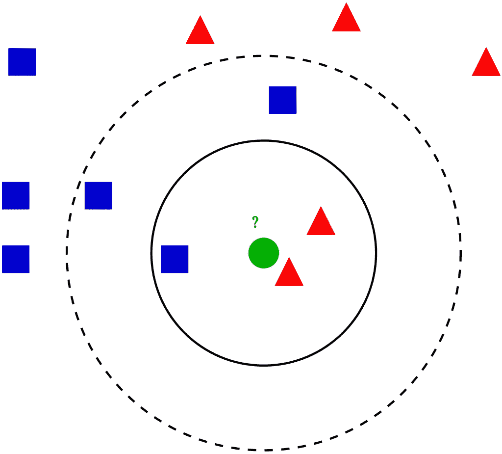

# k 近邻计算复杂度

> 原文：<https://towardsdatascience.com/k-nearest-neighbors-computational-complexity-502d2c440d5?source=collection_archive---------7----------------------->

## 了解 kNN 算法的计算成本，并提供案例研究示例



kNN 算法的可视化([来源](https://en.wikipedia.org/wiki/K-nearest_neighbors_algorithm#/media/File:KnnClassification.svg))

# **算法介绍**

kNN (k 最近邻)是最简单的最大似然算法之一，通常在入门课程中作为第一批算法之一讲授。它相对简单但非常强大，尽管很少有人花时间去理解它的计算复杂性和实际问题。它可以以相同的复杂度用于分类和回归，因此为了简单起见，我们将考虑 kNN 分类器。

kNN 是一种关联算法-在预测过程中，它会搜索最近的邻居，并将他们的多数投票作为样本的预测类别。训练阶段可能存在，也可能不存在，一般来说，我们有两种可能性:

1.  蛮力方法——计算从新点到训练数据矩阵 X 中每个点的距离，对距离进行排序并取 k 个最近的，然后进行多数投票。不需要单独训练，所以只考虑预测复杂度。
2.  使用数据结构-将 X 中的训练点组织到辅助数据结构中，以实现更快的最近邻查找。这种方法使用额外的空间和时间(用于在训练阶段创建数据结构)来进行更快的预测。

我们关注 Scikit-learn 中实现的方法，这是 Python 中最流行的 ML 库。它支持蛮力，k-d 树和球树数据结构。这些方法相对简单、高效，非常适合 kNN 算法。这些树的构造源于计算几何，而不是机器学习，与我们没有太大关系，所以我将在概念层面上更详细地介绍它。关于这方面的更多细节，请参见文章末尾的链接。

在下面的所有复杂性中，计算距离的时间被省略，因为与算法的其余部分相比，它们在大多数情况下是可以忽略的。此外，我们标记:

*   `n`:训练数据集中的点数
*   `d`:数据维度
*   `k`:我们考虑投票的邻居数量

# **暴力破解法**

**训练时间复杂度:**

**训练空间复杂度:** `O(1)`

**预测时间复杂度:** `O(k * n * d)`

**预测空间复杂度:** `O(1)`

训练阶段在技术上是不存在的，因为所有的计算都是在预测过程中完成的，所以我们在时间和空间上都有`O(1)`。

正如方法名所示，预测阶段是一个简单穷举搜索，在伪代码中是:

```
Loop through all points k times:
    1\. Compute the distance between currently classifier sample and 
       training points, remember the index of the element with the 
       smallest distance (ignore previously selected points)
    2\. Add the class at found index to the counterReturn the class with the most votes as a prediction
```

这是一个嵌套循环结构，其中外部循环执行`k`步，内部循环执行`n`步。第三点是`O(1)`，第四点是`O(# of classes)`，所以他们比较小。此外，我们必须考虑维度的数量`d`，更多的方向意味着更长的向量来计算距离。因此，我们有了`O(n * k * d)`时间复杂度。

至于空间复杂度，我们需要一个小向量来统计每个类的投票数。它几乎总是非常小并且是固定的，所以我们可以把它当作一个`O(1)`空间复杂度。

# **k-d 树方法**

**训练时间复杂度:** `O(d * n * log(n))`

**训练空间复杂度:** `O(d * n)`

**预测时间复杂度:** `O(k * log(n))`

**预测空间复杂度:** `O(1)`

在训练阶段，我们必须构建 k-d 树。这个数据结构拆分了 k 维空间(这里 k 是指空间的 k 维，不要把这个和 k 混淆为最近邻的个数！)并允许更快地搜索最近的点，因为我们“知道在那个空间中去哪里看”。你可能会认为它是 BST 在许多维度上的推广。它使用轴对齐的切割来“切割”空间，将点分成子节点中的组。

构建 k-d 树本身不是机器学习任务，因为它源于计算几何领域，所以我们不会详细讨论这一点，只在概念层面上讨论。时间复杂度通常是`O(d * n * log(n))`，因为插入是`O(log(n))`(类似于常规 BST)并且我们有来自训练数据集的`n`点，每个点有`d`个维度。我假设数据结构的有效实现，即它在`O(n)`中找到最佳分割点(维度中的中值),这对于中位数算法是可能的。空间复杂度是`O(d * n)` —注意，它取决于维度`d`，这是有意义的，因为更多的维度对应更多的空间划分和更大的树(除了同样原因的更大的时间复杂度)。

至于预测阶段，k-d 树结构自然支持“k 最近点邻居查询”操作，这正是我们对于 kNN 所需要的。简单的方法是只查询`k`次，删除每次找到的点——因为查询需要`O(log(n))`，所以总共是`O(k * log(n))`。但是由于 k-d 树已经在构造过程中减少了空间，所以在一次查询之后，我们大概知道在哪里寻找——我们可以搜索该点周围的“环境”。因此，k-d 树的实际实现支持一次查询整个`k`邻居，并且具有复杂度`O(sqrt(n) + k)`，这对于机器学习中非常常见的更大维度要好得多。

以上复杂度为**平均**复杂度，假设 k-d 树平衡。对于不平衡的树，上面假定的`O(log(n))`时间可能降低到`O(n)`，但是如果在树构造期间使用中间值，我们应该总是得到具有大约`O(log(n))`插入/删除/搜索复杂度的树。

# **球树法**

**训练时间复杂度:** `O(d * n * log(n))`

**训练空间复杂度:** `O(d * n)`

**预测时间复杂度:** `O(k * log(n))`

**预测空间复杂度:** `O(1)`

球树算法采用另一种方法来划分训练点所在的空间。与用中间值“切割”划分空间的 k-d 树相反，球树将点分组为组织成树结构的“球”。它们从最大的(根，有所有的点)到最小的(叶，只有几个甚至 1 个点)。它允许快速最近邻查找，因为附近的邻居在相同的或至少接近的“球”中。

在训练阶段，我们只需要构建球树。构造球树的算法有几种，但与 k-d 树(为此称为“k-d 构造算法”)最相似的是`O(d * n * log(n))`，与 k-d 树相同。

由于树构建的相似性，预测阶段的复杂性也与 k-d 树相同。

# **在实践中选择方法**

总结一下复杂度:蛮力是大 O 记法中最慢的，而 k-d 树和球树都有同样低的复杂度。那我们怎么知道用哪一个呢？

为了得到答案，我们必须同时考虑训练和预测时间，这就是为什么我提供了两者。蛮力算法只有一个复杂度，对于预测，`O(k * n)`。其他算法需要首先创建数据结构，因此对于训练和预测，它们得到`O(d * n * log(n) + k * log(n))`，没有考虑空间复杂性，这可能也是重要的。因此，在频繁构建树的情况下，训练阶段可能会超过其更快的最近邻查找的优势。

应该用 k-d 树还是球树？这取决于数据结构-相对均匀或“表现良好”的数据将更好地利用 k-d 树，因为空间的切割将很好地工作(在所有切割之后，近点将在树叶中接近)。对于更聚类的数据，来自球树的“球”将更好地反映结构，因此允许更快的最近邻搜索。幸运的是，Scikit-learn 支持“auto”选项，它会自动从数据中推断出最佳的数据结构。

让我们通过两个案例来看看这一点，这两个案例是我在学习和工作中遇到的。

# **案例研究 1:分类**

kNN 更“传统”的应用是数据分类。它通常有相当多的点，例如 MNIST 有 60k 的训练图像和 10k 的测试图像。分类是离线完成的，这意味着我们首先进行训练阶段，然后在预测过程中使用结果。因此，如果我们要构造数据结构，我们只需要这样做一次。对于 10k 测试图像，让我们比较蛮力(每次计算所有距离)和 3 个邻居的 k-d 树:

蛮力(`O(k * n)` ): `3 * 10,000 = 30,000`

k 线树(`O(k * log(n))` ): `3 * log(10,000) ~ 3 * 13 = 39`

对比:`39 / 30,000 = 0.0013`

如您所见，性能提升是巨大的！数据结构方法只使用了蛮力时间的很小一部分。对于大多数数据集，这种方法是一个明显的赢家。

# **案例研究 2:实时智能监控**

机器学习通常用于图像识别，通常使用神经网络。它对于实时应用非常有用，在实时应用中，它通常与摄像机、警报器等集成在一起。神经网络的问题是，它们经常检测同一个对象两次或更多次——即使是像 YOLO 这样最好的架构也有这个问题。实际上，我们可以通过最近邻搜索用一种简单的方法来解决这个问题:

1.  计算每个边界框(矩形)的中心
2.  对于每个矩形，搜索其最近的邻居(1NN)
3.  如果点比选定的阈值更近，则合并它们(它们检测到相同的对象)

关键部分是寻找另一个包围盒的最近中心(点 2)。这里应该使用哪种算法？通常我们只有几个运动物体在摄像机上，可能多达 30-40 个。对于这样一个小数字，使用数据结构进行快速查找所带来的加速可以忽略不计。每一帧都是一个独立的图像，所以如果我们想要构建一个 k-d 树，我们必须对每一帧都这样做，这可能意味着每秒 30 次——总的来说是一个巨大的成本。因此，对于这种情况，简单的强力方法工作最快，并且具有最小的空间需求(对于重型神经网络或对于相机中的嵌入式 CPU，这可能是重要的)。

# **总结**

kNN 算法是机器学习中一种流行、简单且有用的技术，我希望在阅读完这篇文章后，你能理解它的复杂性以及你可以在哪里以及如何使用这种方法的真实场景。

# 参考资料:

*   [https://stats . stack exchange . com/questions/219655/k-nn-computational-computational-complexity](https://stats.stackexchange.com/questions/219655/k-nn-computational-complexity)
*   [https://en.wikipedia.org/wiki/K-d_tree](https://en.wikipedia.org/wiki/K-d_tree)
*   [https://www.alglib.net/other/nearestneighbors.php#header0](https://www.alglib.net/other/nearestneighbors.php#header0)
*   [http://www.cs.utah.edu/~lifeifei/cis5930/kdtree.pdf](http://www.cs.utah.edu/~lifeifei/cis5930/kdtree.pdf)
*   [https://towards data science . com/tree-algorithms-explained-ball-tree-algorithm-vs-KD-tree-vs-brute-force-9746 debcd 940](/tree-algorithms-explained-ball-tree-algorithm-vs-kd-tree-vs-brute-force-9746debcd940)