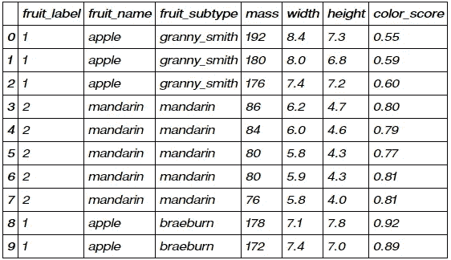
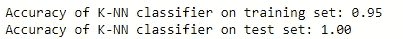
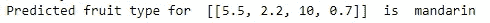
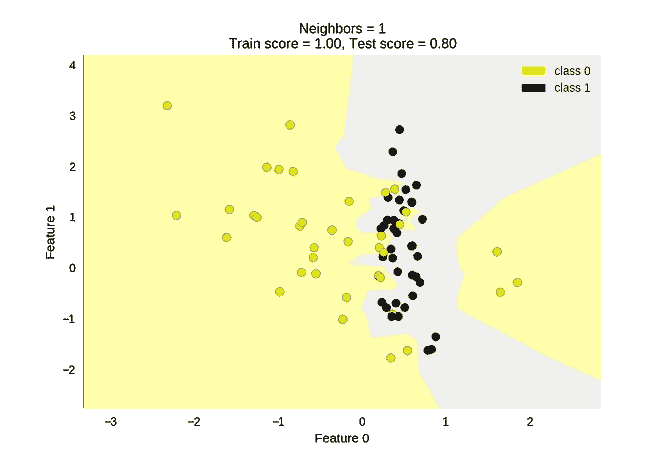
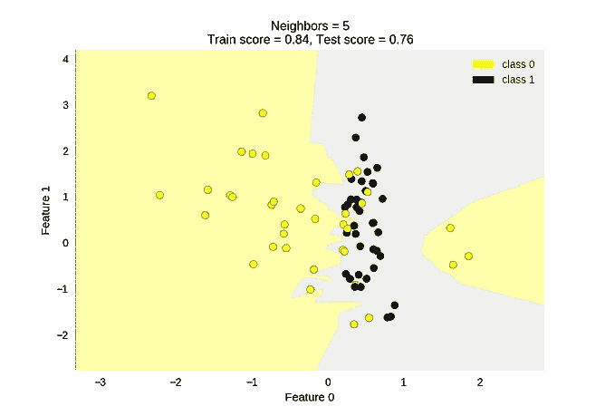
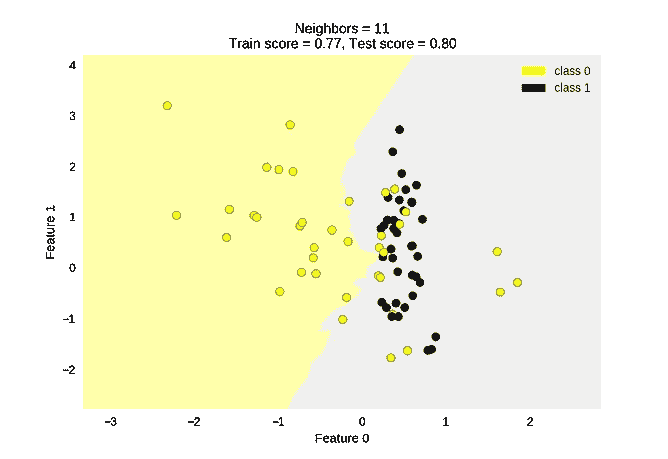

# 6 步 k 近邻

> 原文：<https://towardsdatascience.com/k-nearest-neighbors-in-6-steps-efbcbebce54d?source=collection_archive---------15----------------------->

## 使用 scikit-学习 python

本书旨在成为一个应用指南，介绍如何利用 K 近邻(KNN)方法来解决 python 中的商业问题。KNN 最流行的用例是在分类中。有趣的是，它也适用于 KNN 回归。


[法比奥](https://unsplash.com/@fabioha?utm_source=medium&utm_medium=referral)在 [Unsplash](https://unsplash.com?utm_source=medium&utm_medium=referral) 上的照片

## 这个概念

从 KNN 分类器模型的基础开始。KNN 分类器模型在 3 个主要步骤中工作，以预测前所未有的特征值(不在训练数据中)的标签。

1.  它会记住整个训练测试集——特别是哪个特征产生了哪个 y 标签。
2.  它定义了 K 个最近的最相似实例，其中 K 是用户定义的整数。对于给定的数据点，它会查看最近的要素及其各自的标注。
3.  它根据最近邻居的标签来预测新标签。通常，这是多数票。

回到 KNN 回归:不同之处在于，KNN 回归模型从前所未有的特征值的连续分布中预测新值。从概念上讲，它如何获得预测值与 KNN 分类模型类似，只是它将采用其 K 个最近邻的平均值。

# k 近邻分类器

## 包裹

让我们首先导入所需的包:

1.  numpy 和*pandas*:python 中的数据和数组操作
2.  *来自 *matplotlib 库的 pyploy 模块*:*数据可视化
3.  *sklearn 模块*用于创建列车测试分割，并创建 KNN 对象。

```
# Packages
%matplotlib notebook
import numpy as np
import pandas as pd
import matplotlib.pyplot as pltfrom sklearn.model_selection import train_test_split
from sklearn.neighbors import KNeighborsClassifier
from sklearn.preprocessing import MinMaxScaler
```

## 数据

数据集有 59 行和 7 列，前 10 行如下所示。为了简单起见，我们不会使用所有的特性；我们的目的是使用*质量*和*宽度*来预测标签*水果 _ 标签*。

```
#import data
fruits = pd.read_table('readonly/fruit_data_with_colors.txt')feature_names_fruits = ['height', 'width', 'mass', 'color_score'] #x variable names
X_fruits = fruits[feature_names_fruits] #setting the col names
y_fruits = fruits['fruit_label'] #setting the col names
target_names_fruits = ['apple', 'mandarin', 'orange', 'lemon'] #potential classesfruits.head(10)
```



水果.头(10)

## 1.特征工程

丢弃不需要的要素和标注。您将对数据集执行的要素工程的范围在很大程度上取决于您所操作的业务环境。

```
# setting up the 2 dimensional array of height and width predictors. other x vars discarded
X_fruits_2d = fruits[['height', 'width']]
y_fruits_2d = fruits['fruit_label'] #labels
```

## 2.列车测试分离

现在，我们将使用 75/25 的训练测试拆分来拆分 59 个条目，其中 75%的数据用于训练 KNN 分类模型，剩余的 25%从模型中“隐藏”出来，用于验证结果。75/25 分割是由 *train_test_split 执行的默认分割。*

```
#75 / 25 train test split
X_train, X_test, y_train, y_test = train_test_split(X_fruits, y_fruits, random_state=0)
```

## 3.特征最小-最大缩放

查看*质量*和*宽度*特征，我们注意到它们都在不同的尺度上:*质量*值的范围是两位数和三位数，而*宽度*值的范围通常是个位数。如果值的范围太大，目标函数可能无法正常工作，因为一些特征可能会无意中对预测产生更大的影响。

最小-最大缩放是一种相对简单的方法，类似于对分布应用 Z 分数归一化。相对于要素最小值和最大值，值被重新调整到-1 和 1 之间的范围内。

```
scaler = MinMaxScaler()
X_train_scaled = scaler.fit_transform(X_train)
# we must apply the scaling to the test set that we computed for the training set
X_test_scaled = scaler.transform(X_test)
```

## 4.创建适合的 KNN 对象

我们可以用第一行创建一个“空的”KNN 分类器模型。此外，*n _ neighbors*参数允许控制我们的‘K’值。接下来，模型将根据训练数据集中缩放后的 X 要素及其对应的 Y 标注进行拟合。

```
knn = KNeighborsClassifier(n_neighbors = 5) #setting up the KNN model to use 5NN
knn.fit(X_train_scaled, y_train) #fitting the KNN
```

## 5.评估绩效

类似于如何使用 *R 平方*度量来评估简单线性模型的拟合优度，我们可以使用 *F 值*来评估 KNN 分类器。 *F 值*衡量模型正确预测标签的准确性。我们可以观察到，该模型在 95%的训练数据时间和 100%的保留测试数据集时间上预测标签是正确的。

```
#Checking performance on the training set
print('Accuracy of K-NN classifier on training set: {:.2f}'
     .format(knn.score(X_train_scaled, y_train)))
#Checking performance on the test set
print('Accuracy of K-NN classifier on test set: {:.2f}'
     .format(knn.score(X_test_scaled, y_test)))
```



## 6.做一个预测

最后，我们想用这个模型来做预测。给定一个*质量、宽度、高度和 color_score* 分别为 5.5、2.2、10 和 0.70 的水果，这是什么水果？在适当的最小-最大缩放之后，模型预测它是普通话。

```
example_fruit = [[5.5, 2.2, 10, 0.70]]
example_fruit_scaled = scaler.transform(example_fruit)
#Making an prediction based on x values
print('Predicted fruit type for ', example_fruit, ' is ', 
          target_names_fruits[knn.predict(example_fruit_scaled)[0]-1])
```



## 7.测绘

让我们看看如何使用 *matplotlib* 库可视化数据。我们还可以进一步检查数据集在不同 K 值下的表现。下面我绘制了 K = 1，5，11。

通常，我们可以观察到，K 值越低，训练数据的过度拟合程度越高。该模型尝试使用较低的 K 值更准确地预测每个点。结果，我们可以观察到分类区域之间的边界是锯齿状的，并且随着局部变化而剧烈变化。

查看 K = 11 的 KNN，我们可以看到分类区域之间的边界相对更平滑。这种 KNN 模型在捕捉全球趋势方面变得相对更好，并允许它更通用于一个持续的测试集。

```
from adspy_shared_utilities import plot_two_class_knnX_train, X_test, y_train, y_test = train_test_split(X_C2, y_C2,
 random_state=0)plot_two_class_knn(X_train, y_train, 1, ‘uniform’, X_test, y_test)
plot_two_class_knn(X_train, y_train, 5, ‘uniform’, X_test, y_test)
plot_two_class_knn(X_train, y_train, 11, ‘uniform’, X_test, y_test)
```



K = 1，5，11

# 尾注

我通过由 Coursera 主办的密歇根大学 MOOC“Python 中的应用机器学习”了解到了这一点。

如果你有问题或者想讨论后新冠肺炎世界，请随时联系我，LinkedIn ！

我希望我能够以这样或那样的方式帮助您学习数据科学方法！

这是另一篇数据科学文章！

[](https://medium.com/python-in-plain-english/linear-regressions-with-scikitlearn-a5d54efe898f) [## 使用 scikit-learn 进行线性回归

### 本文应该足以涵盖如何在 python 中运行构造一个简单的线性回归；它还将包含…

medium.com](https://medium.com/python-in-plain-english/linear-regressions-with-scikitlearn-a5d54efe898f) 

*   [机器学习](https://medium.com/tag/machine-learning)
*   [数据分析](https://medium.com/tag/data-analysis)
*   [数据分析](https://medium.com/tag/data-analytics)