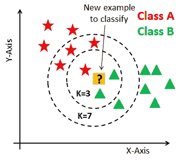
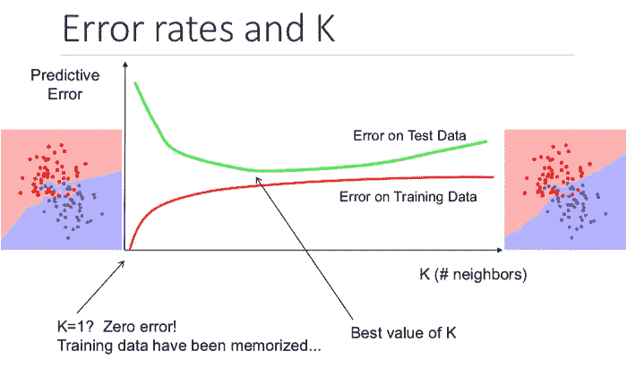

# k 近邻(KNN)算法

> 原文：<https://towardsdatascience.com/k-nearest-neighbors-knn-algorithm-23832490e3f4?source=collection_archive---------8----------------------->

## 寻找最近邻居的算法

图片来自 Unsplash 的 Joshua J. Cotten

# 目录:

1.  什么是 KNN？
2.  KNN 算法的工作原理
3.  K 变了会怎样？
4.  如何选择合适的 K？
5.  KNN 的局限性
6.  KNN 的实际应用
7.  结论

## 1.什么是 KNN？

k 近邻(KNN)是一种有监督的机器学习算法。监督机器学习算法的目标是学习一个函数，使得 f(X) = Y，其中 X 是输入，Y 是输出。KNN 既可用于分类，也可用于回归。在本文中，我们将只讨论分类。虽然对于回归来说，只是一个微小的变化。

KNN 的特性在于它是一种懒惰的学习算法和一种非参数方法。

懒学习是指算法学习时间几乎为零，因为它只存储训练部分的数据(没有学习一个函数)。然后，存储的数据将用于评估新的查询点。

非参数方法是指不假设任何分布的方法。因此，KNN 不必为分布寻找任何参数。而在参数方法中，模型发现新的参数，这些参数又将用于预测目的。KNN 唯一的超参数(由用户提供给模型)是 K，这是为了比较需要考虑的点数。

k-最近邻居。[来源](https://www.datacamp.com/community/tutorials/k-nearest-neighbor-classification-scikit-learn)

上图中，黄色是查询点，我们想知道它属于哪一类(红色还是绿色)。

K=3 时，考虑黄点的 3 个最近邻点，并且基于多数将类分配给查询点(例如，2 个绿色和 1 个红色-则它属于绿色类)。类似地，对于 K=5，5 个最近邻被考虑用于比较，并且大多数将决定查询点属于哪个类。这里需要注意的一点是，如果 K 的值是偶数，那么在进行多数表决时可能会产生问题，因为数据具有偶数个类(即 2 个)。因此，当数据具有偶数个类时，选择 K 作为奇数，当数据具有奇数个类时，选择偶数。

## 2.KNN 算法的工作原理

在训练阶段，模型将存储数据点。在测试阶段，计算从查询点到来自训练阶段的点的距离，以对测试数据集中的每个点进行分类。可以计算各种距离，但最流行的是欧几里德距离(用于较小维度的数据)。

查询点(q)和训练数据点(p)之间的欧几里德距离被定义为

点 p 和 q (n 维点)之间的欧几里德距离。[来源](https://en.wikipedia.org/wiki/Euclidean_distance)

也可以根据数据使用其他距离度量，如 Manhattan、Hamming 和 Chebyshev 距离，这超出了本文的范围。

让我们用一个例子来学习它:

我们有 500 个 N 维点，300 个是 0 类，200 个是 1 类。

计算查询点类别的步骤是:

1.  从查询点开始计算所有 500 个点的距离。
2.  基于 K 的值，K 个最近邻被用于比较目的。
3.  假设 K=7，7 个点中有 4 个是 0 类，3 个是 1 类。然后基于多数，查询点 p 被分配为类别 0。

## 3.K 变了会怎样？

分离红色和蓝色类的决策表面，k=1(左)和 k=5(右)。作者图片

K=1 意味着它将采用一个最近邻，并基于此对查询点进行分类。划分类别的表面将非常不平坦(许多顶点)。

这里出现的问题是，如果数据中存在异常值，决策面会将其视为数据点。因此，KNN 将在训练数据集上表现出色，但会在测试数据集(看不见的数据)上对许多点进行错误分类。这被认为是过度拟合，因此，KNN 对异常值很敏感。

随着 K 值的增加，表面变得平滑，不会将异常值视为数据点。这也将在测试数据集上更好地概括模型。

如果 K 值非常大，模型将会欠拟合，并且将无法对新的数据点进行分类。例如，如果 K 等于数据点的总数，则无论查询点位于何处，模型都会根据整个数据集的多数类对查询点进行分类。

选择正确的 K 值将给出准确的结果。但是如何选择呢？

## 4.如何选择合适的 K？

在实际问题中，数据集分为三个部分，即训练、验证和测试数据。在 KNN，训练数据点被存储，并且没有学习被执行。验证数据是用来检验模型性能的，测试数据是用来预测的。

要选择最佳 K，请在训练数据集和验证数据集上绘制模型的误差(误差= 1-精度)。最佳 K 是验证误差最低的地方，并且训练和验证误差彼此接近。

错误率和 K. [来源](http://sameersingh.org/courses/gml/fa17/sched.html)

## 5.KNN 的局限性

时间复杂度和空间复杂度是巨大的，这是 KNN 的一大劣势。时间复杂度指的是模型评估查询点的类别所花费的时间。空间复杂度是指算法使用的总内存。如果我们在训练中有 n 个数据点，并且每个点是 m 维的。那么时间复杂度是 O(nm)量级，如果我们有更高维的数据，这将是巨大的。因此，KNN 不适合高维数据。

另一个缺点是，如果数据点远离存在的类(没有相似性)，KNN 将分类该点，即使它是一个离群值。为了克服时间复杂性的问题，可以使用 KD-Tree 和 LSH(Locality Sensitive Hashing，Locality Sensitive Hashing)等算法，这不在本文讨论范围之内。

## 6.KNN 的实际应用

1.  KNN 可以用于推荐系统。虽然在现实世界中，推荐系统使用更复杂的算法。KNN 不适合高维数据，但 KNN 是一个很好的系统基线方法。许多公司为其消费者提供个性化推荐，如网飞、亚马逊、YouTube 等。
2.  KNN 可以搜索语义相似的文档。每个文档都被视为一个向量。如果文档彼此靠近，这意味着文档包含相同的主题。
3.  KNN 可以有效地用于检测异常值。一个这样的例子是信用卡欺诈检测。

## 7.结论

K-最近邻(KNN)是在给定 k 值的情况下识别最近邻。它是一种懒惰学习和非参数算法。KNN 在低维数据集上工作，而在处理高维数据时面临问题。