# k-最近邻(kNN)-解释

> 原文：<https://towardsdatascience.com/k-nearest-neighbors-knn-explained-cbc31849a7e3?source=collection_archive---------6----------------------->

## 详细的理论解释和 scikit-learn 实现

[图像来源](https://questioneverything39.wordpress.com/2018/04/16/no-matter-what-group-you-join-its-all-group-think/)

k-最近邻(kNN)是一种受监督的机器学习算法，可用于解决分类和回归任务。我认为 kNN 是一种来自*现实生活*的算法。人们往往会受到周围人的影响。我们的行为受到从小一起长大的朋友的指导。我们的父母也在某些方面塑造了我们的性格。如果你和热爱运动的人一起长大，你很可能最终也会热爱运动。当然也有例外。kNN 的工作原理类似。

> *一个数据点的价值是由其周围的数据点决定的。*

*   如果你有一个非常亲密的朋友，并且大部分时间都和他/她在一起，你们最终会分享相似的兴趣和享受相同的东西。也就是 k=1 的 kNN。
*   如果你总是和一群 *5 人在一起，*这个群体中的每个人都会对你的行为产生影响，你最终会成为 5 人中的平均水平。那就是 kNN，其中 *k=5* 。

kNN 分类器通过多数表决原则确定数据点的类别。如果 k 设置为 5，则检查 5 个最近点的类。根据多数类进行预测。类似地，kNN 回归取 5 个最近点的平均值。

我们观察接近的人，但是数据点是如何确定接近的？测量数据点之间的距离。测量距离的方法有很多。[欧几里德距离](https://en.wikipedia.org/wiki/Euclidean_distance)(闵可夫斯基距离与 p=2)是最常用的距离度量之一。下图显示了如何计算二维空间中两点之间的欧几里德距离。它是使用点的 x 和 y 坐标之差的平方来计算的。

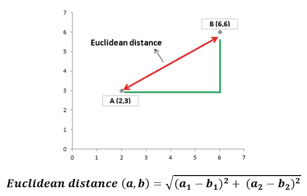

在上面的例子中，欧几里德距离是(16 + 9)的平方根，也就是 5。二维中的欧几里得距离让我们想起了著名的[勾股定理](https://en.wikipedia.org/wiki/Pythagorean_theorem)。

对于二维空间中的两个点来说，这似乎非常简单。每个维度代表数据集中的一个未来。我们通常有许多具有许多特征的样品。为了能够清楚地解释这个概念，我将回顾一个二维空间中的例子(即 2 个特征)。

> 你可以访问这个 github [repo](https://github.com/SonerYldrm/kNN_Algorithm) 中的所有代码。放心用吧！

让我们从导入库开始:

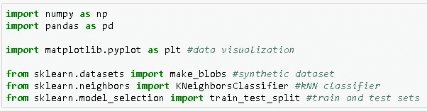

> Scikit-learn 提供了许多有用的功能来创建合成数据集，这对实践机器学习算法非常有帮助。我将使用***make _ blobs****函数。*

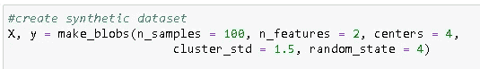

此代码创建了一个数据集，包含 100 个样本，分为 4 类，特征数为 2。使用相关参数可以轻松调整样本、特征和类别的数量。我们还可以调整每个集群(或类)的分布程度。让我们想象一下这个合成数据集:

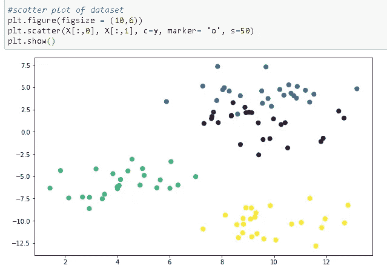

对于任何有监督的机器学习算法，将数据集划分为训练集和测试集是非常重要的。我们首先训练模型，并使用数据集的不同部分对其进行测试。如果这种分离没有完成，我们基本上是用模型已经知道的一些数据来测试模型。我们可以使用 **train_test_split** 函数轻松实现这种分离。

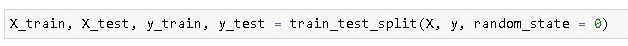

我们可以分别使用 **train_size** 或 **test_size** 参数指定有多少原始数据用于训练或测试集。训练集的默认分离度为 75%，测试集的默认分离度为 25%。

然后我们创建一个 kNN 分类器对象。为了显示 k 值的重要性之间的差异，我创建了 k 值为 1 和 5 的两个分类器。然后使用训练集训练这些模型。 **n_neighbors** 参数用于选择 k 值。默认值为 5，因此不必显式写入。

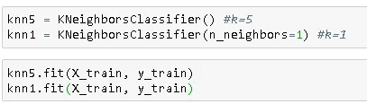

然后我们预测测试集中的目标值，并与实际值进行比较。

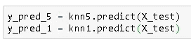

为了查看 k 值的影响，让我们可视化 k=5 和 k=1 的测试集和预测值。

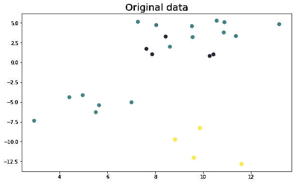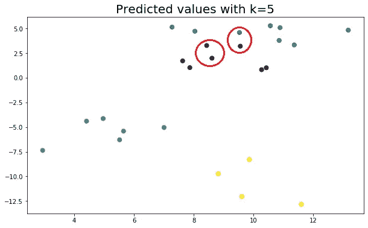

结果似乎非常相似，因为我们使用了一个非常小的数据集。然而，即使在小数据集上，不同的 k 值对某些点的预测也是不同的。

# 如何找到最佳 k 值

*   **k=1** :模型太具体，没有很好的概括。它对噪音也很敏感。该模型在训练集上实现了高精度，但是在新的、以前看不到的数据点上将是差的预测器。因此，我们很可能以一个过度拟合的模型而告终。
*   **k=100** :该模型过于一般化，在训练集和测试集上都不是一个好的预测器。这种情况被称为欠适配。

我们如何找到最佳的 k 值？Scikit-learn 提供了 **GridSearchCV** 函数，使我们能够轻松检查 k 的多个值。让我们使用 scikit-learn datasets 模块下的数据集来查看一个示例。

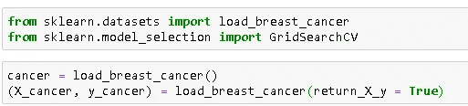

在导入所需的库并加载数据集之后，我们可以创建一个 GridSearchCV 对象。

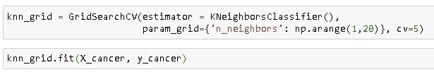

我们不需要分割数据集，因为 **cv** 参数分割数据集。cv 参数的缺省值是 5，但是我明确地写了它来强调为什么我们不需要使用 train_test_split。

cv=5 基本上将数据集分成 5 个子集。GridSearchCV 进行 5 次迭代，每次使用 4 个子集进行训练，1 个子集进行测试。通过这种方式，我们能够将所有数据点用于训练和测试。

我们可以使用 **best_params_** 方法检查哪些参数能给出最佳结果:

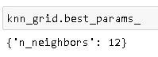

在这种情况下，k 的最佳值是 12。

# **k 近邻的利弊**

**优点**

*   简单易懂
*   不做任何假设，因此可以在非线性任务中实现。
*   适用于多个类别的分类
*   处理分类和回归任务

**缺点**

*   随着数据点数量的增加，会变得非常慢，因为模型需要存储所有的数据点。
*   内存效率不高
*   对异常值敏感。离群也有一票！

感谢您的阅读。如果您有任何反馈，请告诉我。

# 我关于机器学习算法的其他帖子

*   [朴素贝叶斯分类器—解释](/naive-bayes-classifier-explained-50f9723571ed)
*   [逻辑回归—已解释](/logistic-regression-explained-593e9ddb7c6c)
*   [支持向量机—解释](/support-vector-machine-explained-8d75fe8738fd)
*   [决策树和随机森林—解释](/decision-tree-and-random-forest-explained-8d20ddabc9dd)
*   [梯度增强决策树—解释](/gradient-boosted-decision-trees-explained-9259bd8205af)
*   [主成分分析—解释](/principal-component-analysis-explained-d404c34d76e7)
*   [用机器学习预测二手车价格](/predicting-used-car-prices-with-machine-learning-fea53811b1ab)