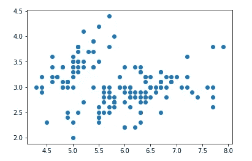
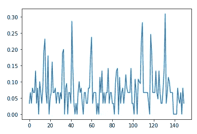
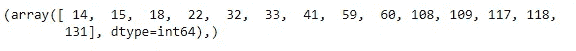
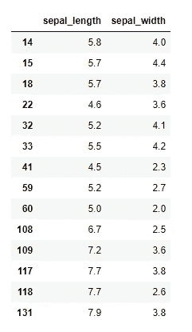
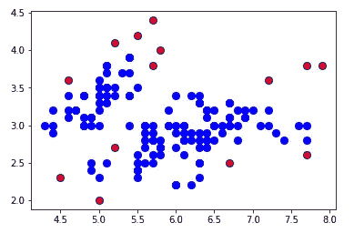

# 用于异常检测的 k-最近邻(kNN)

> 原文：<https://towardsdatascience.com/k-nearest-neighbors-knn-for-anomaly-detection-fdf8ee160d13?source=collection_archive---------1----------------------->

## 用于异常值和异常检测的小数据科学


妮娜·斯特雷尔在 Unsplash[拍摄的照片](https://unsplash.com?utm_source=medium&utm_medium=referral)

## k-最近邻

kNN 是一种监督 ML 算法，经常用于数据科学中的分类问题(有时也用于回归问题)。这是一种最简单但被广泛使用的算法，有很好的使用案例，如构建推荐系统、人脸检测应用等。

最近邻族的基本假设是相似的观测值彼此接近，异常值通常是孤立的观测值，远离相似观测值的聚类。


kNN 概念图(图片:作者)

由于本文的目的是讨论一个用例——异常检测，所以我不会深入讨论 kNN 的更多细节。但是如果你感兴趣的话，可以看看所有最近邻算法的文档，网上有很多描述 kNN 如何工作的资料。如果你在评论中留言，我可以提供一些有用的资源。

## 用于异常检测的 kNN

虽然 kNN 是一种有监督的 ML 算法，但当涉及到异常检测时，它采用一种无监督的方法。这是因为在该过程中没有实际的“学习”,并且在数据集中没有预先确定的“异常值”或“非异常值”的标记，相反，它完全基于阈值。数据科学家任意决定截止值，超过该值的所有观察结果都被称为异常(我们将在后面看到)。这也是为什么没有训练测试数据分割或准确性报告。

今天的文章是我的异常、异常值和欺诈检测算法系列的继续，并附有实际操作的示例代码。我之前的 8 篇文章谈到了异常检测领域中可用的不同工具和技术，如果您有兴趣了解它们，请访问以下链接:

*   [支持向量机(SVM)](/support-vector-machine-svm-for-anomaly-detection-73a8d676c331)
*   [DBSCAN，一种无监督算法](/dbscan-a-density-based-unsupervised-algorithm-for-fraud-detection-887c0f1016e9)
*   [椭圆形信封](/machine-learning-for-anomaly-detection-elliptic-envelope-2c90528df0a6)
*   [局部异常因子(LOF)](/anomaly-detection-with-local-outlier-factor-lof-d91e41df10f2)
*   [Z 分数](/z-score-for-anomaly-detection-d98b0006f510)
*   [箱线图](/boxplot-for-anomaly-detection-9eac783382fd)
*   [统计技术](/statistical-techniques-for-anomaly-detection-6ac89e32d17a)
*   [时间序列异常检测](/time-series-anomaly-detection-with-anomalize-library-67472003c003)

现在让我们继续用 Python 编程语言做一个 kNN 算法的简单演示。

## **步骤 1:导入库**

这个演示只需要很少的库:`pandas`和`numpy`用于处理数据，`matplotlib`用于可视化(可选)，而`sklearn`用于导入 kNN 算法。

```
# import libraries
import pandas as pd
import numpy as np
import matplotlib.pyplot as plt
from sklearn.neighbors import NearestNeighbors
```

## **第二步:数据准备**

我正在使用来自 Github repo 的著名的[虹膜数据集](https://raw.githubusercontent.com/uiuc-cse/data-fa14/gh-pages/data/iris.csv)，所以你可以跟着练习，不用担心从哪里得到数据，如何清理它。

```
# import data
data = pd.read_csv("[https://raw.githubusercontent.com/uiuc-cse/data-fa14/gh-pages/data/iris.csv](https://raw.githubusercontent.com/uiuc-cse/data-fa14/gh-pages/data/iris.csv)")# input data
df = data[["sepal_length", "sepal_width"]]
```

现在，让我们将选择用于建模的两个变量可视化。

```
# scatterplot of inputs data
plt.scatter(df["sepal_length"], df["sepal_width"])
```



数据准备的最后一步是将特征列转换为数组。

```
# create arrays
X = df.values
```

## **第三步:建模**

像大多数机器学习实现一样，实际建模只需很少的努力。首先，用您选择的参数实例化模型，然后使模型适合您的数据。就是这样！

kNN 中的关键参数是 *n_neighbors* ，它决定了用于计算测量点距离的邻居数量。

```
# instantiate model
nbrs = NearestNeighbors(n_neighbors = 3)# fit model
nbrs.fit(X)
```

## **步骤 4:异常检测**

既然我们已经拟合了模型，接下来是提取模型输出的时候了—(a)数据点之间的距离和(b)相关的指数值—这些输出可用于检测异常。

```
# distances and indexes of k-neaighbors from model outputs
distances, indexes = nbrs.kneighbors(X)# plot mean of k-distances of each observation
plt.plot(distances.mean(axis =1))
```

绘制数据集中每个观测值的平均距离。



正如我们所看到的，距离度量中有一些尖峰，这些尖峰是数据集中潜在的异常或异常值。

现在，数据科学家面临一个最重要的决策——确定过滤异常的截止值。

如上图所示，一些截止值可能是-0.25、0.20、0.15 (y 轴)，每个值过滤的异常值数量越来越多。

对于这个演示，让我们慷慨地选择 0.15 作为临界值，以获得更多的异常值。慷慨的原因是能够进一步检查数据，这样我们就不会遗漏异常值。

```
# visually determine cutoff values > 0.15
outlier_index = np.where(distances.mean(axis = 1) > 0.15)
outlier_index
```



```
# filter outlier values
outlier_values = df.iloc[outlier_index]
outlier_values
```



## **绘图 5(可选):绘制异常**

我们已经在步骤 4 中识别了异常数据点，但是我们可以采取额外的步骤来可视化异常数据点。

```
# plot data
plt.scatter(df["sepal_length"], df["sepal_width"], color = "b", s = 65)# plot outlier values
plt.scatter(outlier_values["sepal_length"], outlier_values["sepal_width"], color = "r")
```



# 摘要

在本文中，我演示了如何实现 kNN——一种机器学习算法——来识别数据集中的异常。目的是展示一些简单的步骤来建立直觉，但是当然，现实世界的实现需要更多的实验来找出对于特定的环境和行业什么是有效的，什么是无效的。例如，在本演示中，我们停在了第 4 步，但现实世界中的数据科学家会更进一步，检查并重新检查过滤器数据点，以便与其他工具或领域专家进行双重检查。

感谢关注，要了解更多关于我的工作，你可以在 [Twitter](https://twitter.com/DataEnthus) 或 [LinkedIn](https://www.linkedin.com/in/mab-alam/) 上关注我