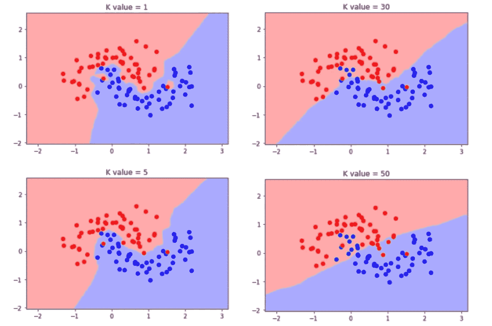
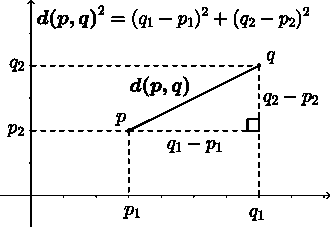
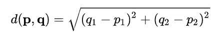
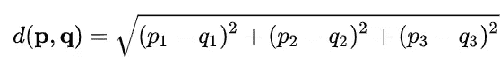
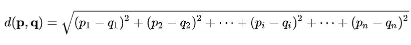
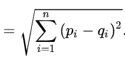
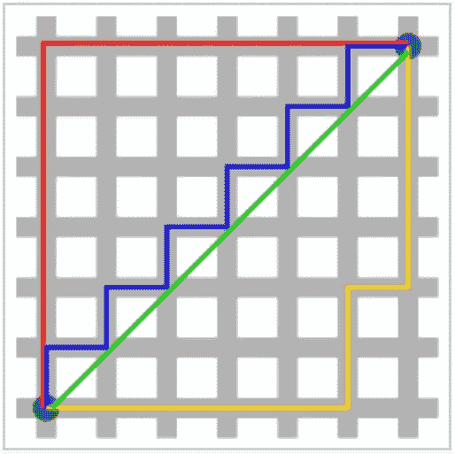
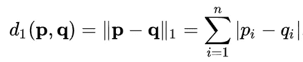
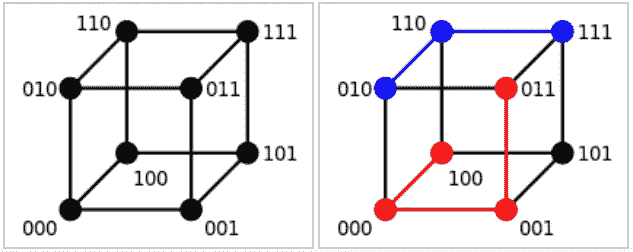

# k-最近邻解释-第 2 部分

> 原文：<https://towardsdatascience.com/k-nearest-neighbour-explained-part-2-f23d14fcb8c?source=collection_archive---------38----------------------->

## 了解最近邻的距离计算是如何进行数学计算的！

来源:[U 形数据上的 KNN](/k-nearest-neighbour-explained-part-1-5e5e9192050)

在这个故事中，我们将讨论用于计算两个向量之间距离的不同类型的距离测量指标。这个度量的应用是在 K-NN 算法中寻找最近的邻居。我们将研究这些距离在 Python 中的实现。

这篇文章是以前写的关于 K-NN 的第 1 部分的延续。如果你还没有读过，读一读再回来。

 [## k-最近邻解释-第 1 部分

### KNN 算法背后的科学解释！

medium.com](https://medium.com/analytics-vidhya/k-nearest-neighbour-explained-part-1-5e5e9192050) 

## 欧几里得距离

这是一种*距离测量技术*，通过直接将空间中的两点首尾相连来计算它们之间的距离。让我们看看下图所示的 2D 平面，平面上有点 **p(p1，p2)** 和 **q(q1，q2)** 。现在我们需要找到这些点之间的距离，所以我们使用毕达哥拉斯定理来计算两点之间的距离，这就是欧几里得距离。

来源:维基百科[上的欧几里德距离](https://en.wikipedia.org/wiki/Euclidean_distance)

对于点 **p(p1，p2)** 和 **q(q1，q2)** 我们有二维向量，因此使用以下公式计算距离:

现在，以同样的方式，我们应用坐标为 **p(p1，p2，p3)** 和 **q(q1，q2，q3)** 的三维向量

因此，如果我们在空间中有一个 n 维向量(我们不能直接可视化)，那么使用相同的模式，我们将计算两点之间的距离，

因此，作为一个结论，空间中任意两点之间的距离是通过使用一条称为欧几里德距离的直线直接将这些点首尾相连来计算的。

Python3.7 中 3D 矢量实现的欧几里德距离

## 曼哈顿距离

第二个令人惊叹的距离计算方法是曼哈顿距离，也称为 ***【出租车距离】*** 因为就像出租车穿过城市的街道到达城市中的一个点一样，曼哈顿距离是通过计算绝对距离的总和来计算的。

来源:[维基百科](https://en.wikipedia.org/wiki/Taxicab_geometry)上的曼哈顿距离

那么，为什么它被称为曼哈顿呢？曼哈顿距离被命名为 ***曼哈顿*** 是因为当我们从卫星上看纽约市的曼哈顿区域时，道路和车道看起来完全像是***对称网格图案*****因此，对于出租车来说，要在城市内从一个点行驶到另一个点，它必须遵循在 x 轴上移动一个动作和在 y 轴上移动一个动作的策略，这就是绝对行驶路径。**

****

**来源:纽约曼哈顿[谷歌地图](https://www.google.com/maps/place/Manhattan,+New+York,+NY,+USA/@40.7460163,-73.9981217,14z/data=!4m5!3m4!1s0x89c2588f046ee661:0xa0b3281fcecc08c!8m2!3d40.7830603!4d-73.9712488)**

**曼哈顿距离可以使用 [L1 范数](https://en.wikipedia.org/wiki/Norm_(mathematics))的概念来计算，其中 **p(p1，p2，…，pn)** 和 **q(q1，q2，…，qn)** 是 n 维向量。**

****

## **汉娩距**

**有一种惊人的距离查找技术叫做 ***【汉明距离】*** 它通常用于查找两个字符串之间的对称距离，计算方法是找出两个字符串中所有位置的不相等字符，然后将它们相加，计算出总的不相等字符值。**

****

**来源:汉明距离[维基百科](https://en.wikipedia.org/wiki/Hamming_distance)**

**为什么叫海明距离？汉明距离是以理查德·汉明的名字命名的，他在关于汉明码的基础论文中介绍了这个概念。**

**为了找出两个字符串 S1 和 S2 之间的距离，我们开始同时从左到右一个接一个地探索两个字符串中的所有字符，每当第一个字符串中的字符与第二个字符串中相同位置的字符不相等时，我们就将距离的计数增加 1，这仅仅意味着只有当两个字符串中的字符不匹配时，计数才增加。**

> **"汉明距离只在两个弦的长度完全相同时有效."**

**例如，“ **karolin** ”和“ **kathrin** ”之间的距离是 3，因为第一个字符串的位置 3、4 和 5 处的字符对于第二个字符串是不同的，这使距离值增加了 1。**

**汉明距离在 Python 3.7 中的实现**

## **余弦距离或余弦相似度**

**余弦相似度是在两个向量 X1 和 X2 之间测量的角距离，这意味着 X1 和 X2 之间的角度的*。角度越小，其 ***cos(角度)*** 越高，因此其余弦相似度越高。***

> **"余弦相似性表示两个向量之间的方向相似性"**

****

**来源:奥雷利[两个项目之间的余弦相似度](https://www.oreilly.com/library/view/statistics-for-machine/9781788295758/eb9cd609-e44a-40a2-9c3a-f16fc4f5289a.xhtml)**

**例如，角度为 **0** 的两个向量具有 **cos(0 )=1** ，这是最高的相似度，而角度为 **90** 的向量给出 **cos(90 )=0** ，从而给出向量之间的**‘0’**相似度。同样，当两个向量之间的角度达到 **180** 时，相似度甚至变成**'-1’**。**

**给定两个向量 X1 和 X2，它们的 Cos-Sim 可以计算为:**

****

**余弦相似距离在 Python 3.7 中的实现**

## **由 Paras Varshney 撰写的关于数据科学的更多文章:**

** [## 如何评价 Python 中机器学习模型性能？

### 一个实用的方法来计算模型的性能和在 Python 中的实现，涵盖了所有数学…

medium.com](https://medium.com/@pv009/how-to-evaluate-machine-learning-model-performance-in-python-135b4ae27f7e)  [## 如何建立一个能让你找到工作的数据科学投资组合？

### 学会制作一个关于你的强有力的作品集！

medium.com](https://medium.com/datadriveninvestor/how-to-build-a-data-science-portfolio-that-can-get-you-a-job-9f8d113739b3)  [## “正态分布”的功效

### 理解钟形曲线背后的科学！

medium.com](https://medium.com/analytics-vidhya/the-powers-of-normal-distribution-4cbb06e4a955) 

更多数据科学和机器学习相关文章关注我上 [**中**](https://medium.com/@pv009) 。想给我买杯咖啡吗？在 [**LinkedIn**](https://www.linkedin.com/in/pv009) 上和我连线。

## **谢谢！****