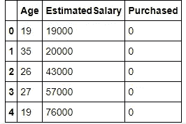
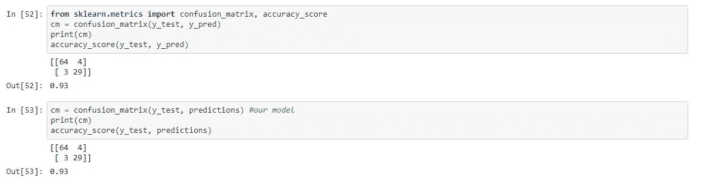
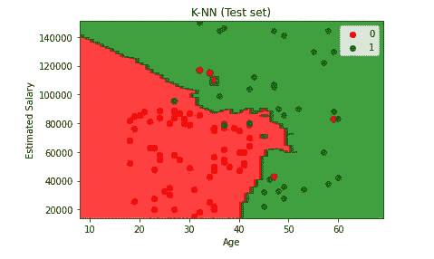

# k 近邻(kNN)算法:常见问题和 Python 实现

> 原文：<https://towardsdatascience.com/k-nearest-neighbours-knn-algorithm-common-questions-and-python-implementation-14377e45b738?source=collection_archive---------14----------------------->


由[妮娜·斯特雷尔](https://unsplash.com/@ninastrehl)在[上 Unsplash](https://unsplash.com/?utm_source=medium&utm_medium=referral)

## 测试数据科学家关于 kNN 算法及其 Python 实现的问题

k 近邻被认为是最直观的机器学习算法之一，因为它易于理解和解释。此外，直观地演示一切是如何进行的也很方便。然而，kNN 算法仍然是一种常见的非常有用的算法，用于各种分类问题。如果你是机器学习的新手，请确保测试自己对这个简单而又精彩的算法的理解。关于它是什么以及它是如何工作的，有很多有用的资料来源，因此我想以我个人的观点来看一下你应该知道的 5 个常见或有趣的问题。

> **k-NN 算法在测试时间而不是训练时间上做更多的计算。**

那绝对是真的。kNN 算法的思想是找到一个 k 长的样本列表，该列表接近我们想要分类的样本。因此，训练阶段基本上是存储训练集，而在预测阶段，算法使用存储的数据寻找 k 个邻居。

> **为什么需要为 k-NN 算法缩放数据？**

假设一个数据集有 *m* 个“示例”和 *n* 个“特征”。有一个特征维度的值正好在 0 和 1 之间。同时，还有一个从-99999 到 99999 不等的特征维度。考虑到*欧几里德距离的公式，*这将通过给予具有较高幅度的变量较高的权重来影响性能。

**阅读更多:**[**KNN 和 K-Means 为什么需要缩放？**](https://medium.com/analytics-vidhya/why-is-scaling-required-in-knn-and-k-means-8129e4d88ed7)

> **k-NN 算法可用于输入分类变量和连续变量的缺失值。**

这是真的。在处理缺失值时，k-NN 可以用作许多技术中的一种。通过确定训练集中“最接近”的样本来估算新样本，并对这些要估算的邻近点进行平均。scikit 学习库提供了一种使用这种技术快捷方便的方法。

注:在计算距离时，NaNs 被省略。

示例:

```
from sklearn.impute import KNNImputer
# define imputer
imputer = KNNImputer() #default k is 5=> *n_neighbors=5*
# fit on the dataset
imputer.fit(X)
# transform the dataset
Xtrans = imputer.transform(X)
```

因此，缺失值将被其“邻居”的平均值所替代。

> ***欧氏距离总是这样吗？***

虽然欧几里德距离是最常用和教授的方法，但它并不总是最佳决策。事实上，仅仅通过查看数据很难得出正确的指标，所以我建议尝试一组数据。但是，也有一些特殊情况。例如，汉明距离用于分类变量的情况。

**阅读更多:** [**每个数据科学家都应该知道的 3 个文本距离**](/3-text-distances-that-every-data-scientist-should-know-7fcdf850e510)

> **为什么我们不应该对大型数据集使用 KNN 算法？**

以下是 KNN 算法中出现的数据流的概述:

1.  计算到训练集中所有向量的距离并存储它们
2.  对计算的距离进行排序
3.  存储 K 个最近的向量
4.  计算 K 个最近向量显示的最频繁类别

假设你有一个非常大的数据集。因此，存储大量数据不仅是一个糟糕的决定，而且不断计算和排序所有值的计算成本也很高。

# Python 实现

我将把实施分为以下几个阶段:

1.  计算到训练集中所有向量的距离并存储它们
2.  对计算的距离进行排序
3.  计算 K 个最近向量显示的最频繁类别，并进行预测

> **计算训练集中所有向量的距离并存储它们**

值得注意的是，有大量不同的选项可供选择作为衡量标准；但是，我想用欧几里德距离作为例子。这是计算向量间距离最常用的度量，因为它简单明了，易于解释。一般公式如下:

> 欧几里德距离= sqrt(sum I to N(x1 _ I-x2 _ I))

因此，让我们用下面的 Python 代码来总结一下。 ***注意:不要忘记从“数学”模块导入 sqrt()。***

> **对计算出的距离进行排序**

首先，我们需要计算单个*测试样本*和我们训练集中所有样本之间的所有距离。获得距离后，我们应该对距离列表进行排序，并通过查看它们与测试样本的距离，从我们的训练集中挑选“最近”的 k 个向量。

> C ***计算 K 个最近向量显示的最频繁类别并进行预测***

最后，为了做一个预测，我们应该通过调用我在上面附上的函数来得到我们的 k 个“最近的”邻居。因此，剩下的唯一事情就是计算每个标签出现的次数，并选择最频繁的一个。

让我们通过将所有的函数组合成一个单独的类对象来总结一切。这里有一个更一般化的代码版本，请花些时间浏览一下。

> **比较**

让我们将我们的实现与 scikit learn 提供的实现进行比较。我将使用一个简单的玩具数据集，它包含两个预测值，即*年龄*和*薪水*。因此，我们希望预测客户是否愿意购买我们的产品。



显示前 5 个条目的表格

我将跳过预处理，因为这不是我想关注的；然而，我使用了一种训练测试分割技术，并在之后应用了一个标准缩放器。不管怎样，如果你感兴趣，我会在 Github 上提供源代码。

最后，我将定义两个模型并拟合我们的数据。请参考上面提供的 KNN 实现。我选择 5 作为我们的默认 k 值。注意，对于后一种模型，默认度量是*闵可夫斯基*，并且 p=2 相当于标准欧几里德度量。

```
model=KNN(5) *#our model* 
model.fit(X_train,y_train) predictions=model.predict(X_test)*#our model's predictions***from** **sklearn.neighbors** **import** KNeighborsClassifier
classifier = KNeighborsClassifier(n_neighbors = 5, metric = 'minkowski', p = 2)*#The default metric is minkowski, and with p=2 is equivalent to the standard Euclidean metric.*
classifier.fit(X_train, y_train)

y_pred = classifier.predict(X_test)
```

> **结果**



上图显示，两种型号表现出相同的性能。精度结果是 0.93，这是一个相当好的结果。下图是我们测试集结果的可视化。我提供一个单一的数字，因为两个模型是相同的。然而，我个人建议使用已经提供的实现，因为我们的实现简单而低效。此外，不要每次都写完全相同的代码会更方便。



我们测试集结果的可视化

# 摘要

总之，K-最近邻被认为是最直观的机器学习算法之一，因为它易于理解和解释。此外，直观地演示一切是如何进行的也很方便。在本文中，我们回答了以下问题:

*   k-NN 算法在测试时间而不是训练时间上做更多的计算。
*   为什么需要为 k-NN 算法缩放数据？
*   k-NN 算法可用于输入分类变量和连续变量的缺失值。
*   欧氏距离总是这样吗？
*   为什么我们不应该对大型数据集使用 KNN 算法？

此外，我提供了 KNN 算法的 python 实现，以便加深您对内部发生的事情的理解。完整的实现可以在我的 [Github](https://github.com/chingisooinar/KNN-python-implementation) 上找到。

**有用的资源**

[](https://medium.com/analytics-vidhya/why-is-scaling-required-in-knn-and-k-means-8129e4d88ed7) [## 为什么 KNN 和 K-Means 需要缩放？

### KNN 和 K-Means 是最常用和最广泛使用的机器学习算法之一。KNN 是监督学习…

medium.com](https://medium.com/analytics-vidhya/why-is-scaling-required-in-knn-and-k-means-8129e4d88ed7) [](/3-text-distances-that-every-data-scientist-should-know-7fcdf850e510) [## 每个数据科学家都应该知道的 3 种文本距离

### 无论您是刚刚开始接触数据科学，还是已经在该领域工作了很长时间，您都需要了解这三个文本…

towardsdatascience.com](/3-text-distances-that-every-data-scientist-should-know-7fcdf850e510) [](/machine-learning-basics-with-the-k-nearest-neighbors-algorithm-6a6e71d01761) [## 基于 K-最近邻算法的机器学习基础

### k-最近邻(KNN)算法是一个简单，易于实现的监督机器学习算法，可以…

towardsdatascience.com](/machine-learning-basics-with-the-k-nearest-neighbors-algorithm-6a6e71d01761)