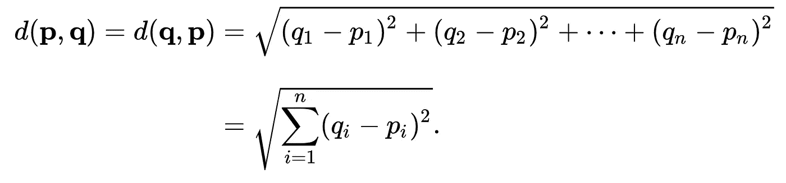
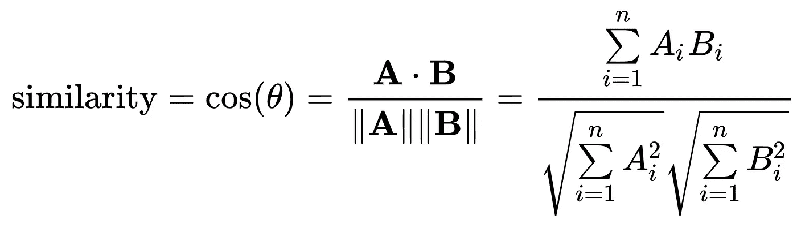
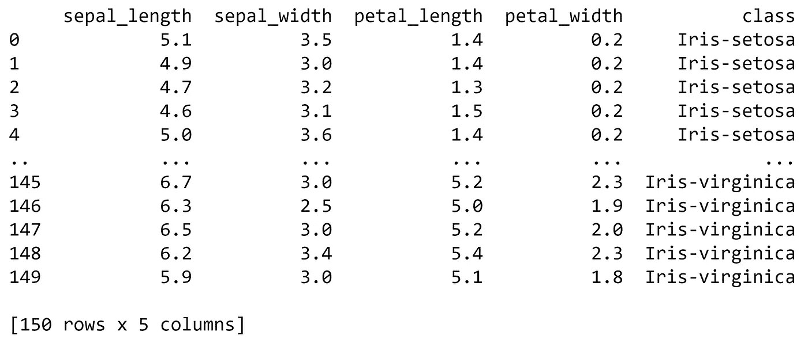
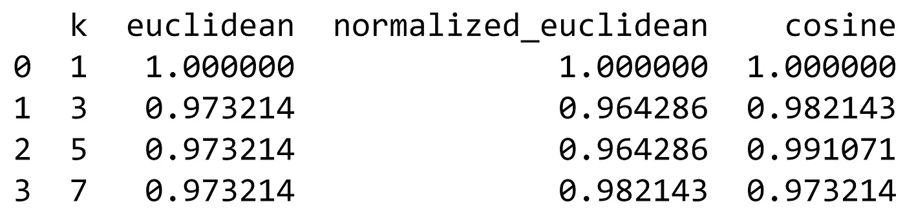
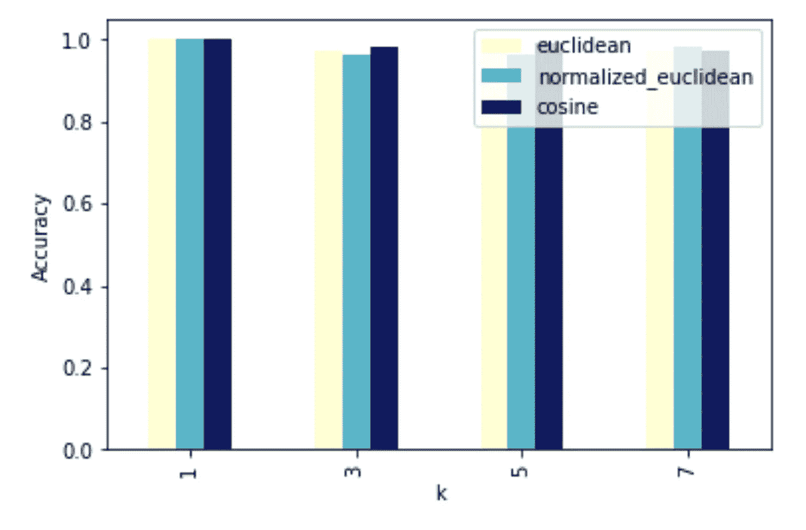
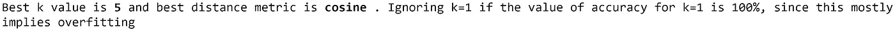
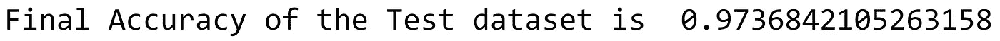

# 虹膜数据集上的 k-NN

> 原文：<https://towardsdatascience.com/k-nn-on-iris-dataset-3b827f2591e?source=collection_archive---------12----------------------->

## k-最近邻(k-NN)是一种基于实例的监督学习算法，它通过将一个新实例与在训练中已经看到的存储器中已经存储的实例进行比较来对该新实例进行分类。

使用以下步骤计算未知实例的类:

1.  计算未知实例和所有其他训练实例之间的距离。
2.  k 个最近邻居被识别。
3.  k 个最近邻居的类别标签被用于通过使用像多数投票这样的技术来确定未知实例的类别标签。


k-NN 分类示例[(图像源)](https://twitter.com/DataCamp/status/1037324501757976577/photo/1)

例如，在上面的图像中，如果 k 值为 3，分类器可以将未知实例分类为 B 类，如果 k 值为 7，则分类为 A 类。

这篇文章关注的是使用 Iris 数据集进行 kNN 的超参数调优。然后，使用最佳超参数对测试集实例进行分类，并计算模型的最终精度。实现是从零开始的，不依赖于现有的 python 数据科学库。

调整的超参数有:

1.  距离度量:欧几里德、归一化欧几里德和余弦相似性
2.  k 值:1、3、5 和 7

**欧几里德距离** 欧几里德空间中两点 p 和 q 之间的欧几里德距离计算如下:



[(图像来源)](https://en.wikipedia.org/wiki/Euclidean_distance)

**归一化欧几里德距离**
归一化欧几里德距离是指点经过归一化后，点与点之间的欧几里德距离。

**余弦相似度** 余弦相似度是两个非零向量之间的相似性度量。两个向量 A 和 B 之间的余弦相似度计算如下:



[(图片来源)](https://en.wikipedia.org/wiki/Cosine_similarity)


[(图片来源)](https://en.wikipedia.org/wiki/Iris_(plant))

现在，让我们进入用 Python 实现的分类器。为了便于理解，本节分为不同的步骤。

**第一步**。

加载所需的库。

```
**import** **pandas** **as** **pd**
**import** **numpy** **as** **np**
**import** **operator**
**import** **matplotlib.pyplot** **as** **plt**
```

**第二步。**

将虹膜数据集加载到 Jupyter 笔记本中。数据集是 csv 格式的，可以很容易地使用**熊猫**库读入数据帧。数据集有四个属性萼片长度、萼片宽度、花瓣长度和花瓣宽度，以及每个实例的类标签。

```
data = pd.read_csv('iris.data', header=**None**, names=['sepal_length', 'sepal_width', 'petal_length', 'petal_width', 'class'])
```

数据帧可以显示如下:

```
print(data)
```



**第三步。**

将数据集分为开发集和测试集。它可以通过随机化索引然后根据索引分割数据帧来划分。

```
indices = np.random.permutation(data.shape[0])
div = int(0.75 * len(indices))
development_id, test_id = indices[:div], indices[div:]

development_set, test_set = data.loc[development_id,:], data.loc[test_id,:]
print("Development Set:**\n**", development_set, "**\n\n**Test Set:**\n**", test_set)
```

计算开发集和测试集的平均值和标准偏差，以计算归一化的欧几里德距离。

```
mean_development_set = development_set.mean()
mean_test_set = test_set.mean()
std_development_set = development_set.std()
std_test_set = test_set.std()
```

从开发和测试集中检索“class”列，并将其存储在单独的列表中。

```
test_class = list(test_set.iloc[:,-1])
dev_class = list(development_set.iloc[:,-1])
```

**第四步。**

定义计算距离度量值的函数:欧几里德、归一化欧几里德和余弦相似性

```
**def** euclideanDistance(data_1, data_2, data_len):
    dist = 0
    **for** i **in** range(data_len):
        dist = dist + np.square(data_1[i] - data_2[i])
    **return** np.sqrt(dist)

**def** normalizedEuclideanDistance(data_1, data_2, data_len, data_mean, data_std):
    n_dist = 0
    **for** i **in** range(data_len):
        n_dist = n_dist + (np.square(((data_1[i] - data_mean[i])/data_std[i]) - ((data_2[i] - data_mean[i])/data_std[i])))
    **return** np.sqrt(n_dist)

**def** cosineSimilarity(data_1, data_2):
    dot = np.dot(data_1, data_2[:-1])
    norm_data_1 = np.linalg.norm(data_1)
    norm_data_2 = np.linalg.norm(data_2[:-1])
    cos = dot / (norm_data_1 * norm_data_2)
    **return** (1-cos)
```

定义返回 k 个最近邻的函数

```
**def** knn(dataset, testInstance, k, dist_method, dataset_mean, dataset_std): 
    distances = {}
    length = testInstance.shape[1]
    **if** dist_method == 'euclidean':
        **for** x **in** range(len(dataset)):
            dist_up = euclideanDistance(testInstance, dataset.iloc[x], length)
            distances[x] = dist_up[0]
    **elif** dist_method == 'normalized_euclidean':
        **for** x **in** range(len(dataset)):
            dist_up = normalizedEuclideanDistance(testInstance, dataset.iloc[x], length, dataset_mean, dataset_std)
            distances[x] = dist_up[0]
    **elif** dist_method == 'cosine':
        **for** x **in** range(len(dataset)):
            dist_up = cosineSimilarity(testInstance, dataset.iloc[x])
            distances[x] = dist_up[0]
    *# Sort values based on distance*
    sort_distances = sorted(distances.items(), key=operator.itemgetter(1))
    neighbors = []
    *# Extracting nearest k neighbors*
    **for** x **in** range(k):
        neighbors.append(sort_distances[x][0])
    *# Initializing counts for 'class' labels counts as 0*
    counts = {"Iris-setosa" : 0, "Iris-versicolor" : 0, "Iris-virginica" : 0}
    *# Computing the most frequent class*
    **for** x **in** range(len(neighbors)):
        response = dataset.iloc[neighbors[x]][-1] 
        **if** response **in** counts:
            counts[response] += 1
        **else**:
            counts[response] = 1
    *# Sorting the class in reverse order to get the most frequest class*
    sort_counts = sorted(counts.items(), key=operator.itemgetter(1), reverse=**True**)
    **return**(sort_counts[0][0])
```

**第五步。**

使用开发数据集，迭代所有开发数据实例，并计算每个 k 值和每个距离度量的类。

```
*# Creating a list of list of all columns except 'class' by iterating through the development set*
row_list = []
**for** index, rows **in** development_set.iterrows():
    my_list =[rows.sepal_length, rows.sepal_width, rows.petal_length, rows.petal_width]       
    row_list.append([my_list])
*# k values for the number of neighbors that need to be considered*
k_n = [1, 3, 5, 7]
*# Distance metrics*
distance_methods = ['euclidean', 'normalized_euclidean', 'cosine']
*# Performing kNN on the development set by iterating all of the development set data points and for each k and each distance metric*
obs_k = {}
**for** dist_method **in** distance_methods:
    development_set_obs_k = {}
    **for** k **in** k_n:
        development_set_obs = []
        **for** i **in** range(len(row_list)):
            development_set_obs.append(knn(development_set, pd.DataFrame(row_list[i]), k, dist_method, mean_development_set, std_development_set))
        development_set_obs_k[k] = development_set_obs
    *# Nested Dictionary containing the observed class for each k and each distance metric (obs_k of the form obs_k[dist_method][k])*
    obs_k[dist_method] = development_set_obs_k
*#print(obs_k)*
```

计算开发集的准确性

```
*# Calculating the accuracy of the development set by comparing it with the development set 'class' list created earlier*
accuracy = {}
**for** key **in** obs_k.keys():
    accuracy[key] = {}
    **for** k_value **in** obs_k[key].keys():
        *#print('k = ', key)*
        count = 0
        **for** i,j **in** zip(dev_class, obs_k[key][k_value]):
            **if** i == j:
                count = count + 1
            **else**:
                **pass**
        accuracy[key][k_value] = count/(len(dev_class))

*# Storing the accuracy for each k and each distance metric into a dataframe*
df_res = pd.DataFrame({'k': k_n})
**for** key **in** accuracy.keys():
    value = list(accuracy[key].values())
    df_res[key] = value
print(df_res)
```



绘制条形图以比较超参数的性能。

```
*# Plotting a Bar Chart for accuracy*
draw = df_res.plot(x='k', y=['euclidean', 'normalized_euclidean', 'cosine'], kind="bar", colormap='YlGnBu')
draw.set(ylabel='Accuracy')
```



***注意*** *:如果 k=1 的精度值为 100%，则忽略 k=1，因为这通常意味着过拟合。将其替换为 numpy.nan.* 的值

```
df_res.loc[df_res['k'] == 1.0, ['euclidean', 'normalized_euclidean', 'cosine']] = np.nan
```

**第六步。**

找到最佳超参数。

```
*# In case the accuracy is the same for different k and different distance metric selecting the first of all the same*
column_val = [c **for** c **in** df_res.columns **if** **not** c.startswith('k')]
col_max = df_res[column_val].max().idxmax(1)
best_dist_method = col_max
row_max = df_res[col_max].argmax()
best_k = int(df_res.iloc[row_max]['k'])
**if** df_res.isnull().values.any():
    print('**\n\n\n**Best k value is**\033**[1m', best_k, '**\033**[0mand best distance metric is**\033**[1m', best_dist_method, '**\033**[0m. Ignoring k=1 if the value of accuracy for k=1 is 100%, since this mostly implies overfitting')
**else**:
    print('**\n\n\n**Best k value is**\033**[1m', best_k, '**\033**[0mand best distance metric is**\033**[1m', best_dist_method, '**\033**[0m.')
```



**第七步。**

使用测试集和最佳超参数来计算最终精度。

```
*# Creating a list of list of all columns except 'class' by iterating through the development set*
row_list_test = []
**for** index, rows **in** test_set.iterrows(): 
    my_list =[rows.sepal_length, rows.sepal_width, rows.petal_length, rows.petal_width]       
    row_list_test.append([my_list])
test_set_obs = []
**for** i **in** range(len(row_list_test)):
    test_set_obs.append(knn(test_set, pd.DataFrame(row_list_test[i]), best_k, best_dist_method, mean_test_set, std_test_set))
*#print(test_set_obs)*

count = 0
**for** i,j **in** zip(test_class, test_set_obs):
    **if** i == j:
        count = count + 1
    **else**:
        **pass**
accuracy_test = count/(len(test_class))
print('Final Accuracy of the Test dataset is ', accuracy_test)
```



使用余弦相似性作为距离度量并且 k 值为 5，实现了大约 97%的最终精度。这个模型给出了非常好的结果。

完整的代码可以在 GitHub [库](https://github.com/ishita-kapur/data-mining/blob/master/kNN_iris.ipynb)中找到。

[1]:余弦相似度
[*https://stack overflow . com/questions/18424228/Cosine-Similarity-between-2-number-lists*](https://stackoverflow.com/questions/18424228/cosine-similarity-between-2-number-lists)

[2]:作为参考
*https://machine learning mastery . com/tutorial-to-implement-k-nearest-neighbors-in-python-from-scratch/*