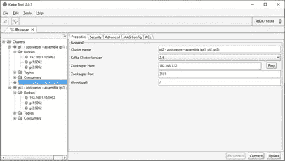
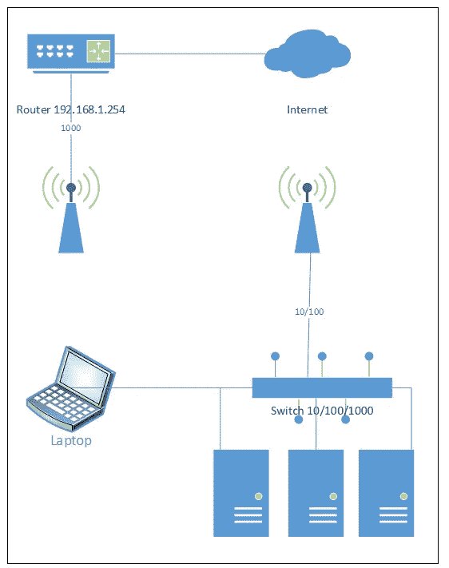
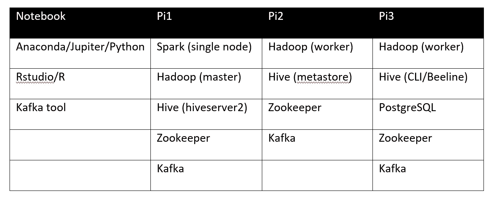

# 数据科学/大数据实验室——第 4 部分，共 4 部分:3 节点集群中的 Kafka 和 Zookeeper over Ubuntu

> 原文：<https://towardsdatascience.com/kafka-and-zookeeper-over-ubuntu-in-a-3-node-cluster-a-data-science-big-data-laboratory-part-4-of-4-47631730d240?source=collection_archive---------46----------------------->

## 实验室数据

## 使用 Hadoop、Spark、Hive、Kafka、Zookeeper 和 PostgreSQL 在 Raspberry Pi 4 或 VMs 集群中组建数据科学/大数据实验室

*这段文字可以用来支持在任何 Ubuntu 20.04 服务器集群中的安装，这就是设计良好的分层软件的妙处。此外，如果您有更多的节点，您可以随意分发软件。本文假设您知道 Linux 命令行，包括 ssh、vim 和 nano。*

*我不建议从少于三个树莓开始，因为你需要设置通信，并且 Zookeeper 和 Kafka 都需要奇数个节点。如果您尝试使用单个节点，可以使用本指南。尽管如此，性能可能会令人失望——对于单节点，我建议虚拟机具有合理数量的 RAM 和处理器。*

*由于篇幅原因，我不得不将教程分成四部分:*

*   [***第一部分:简介、操作系统和联网***](/assembling-a-personal-data-science-big-data-laboratory-in-a-raspberry-pi-4-or-vms-cluster-ff37759cb2ec?source=friends_link&sk=3a4b90e57dc0fc0ec44a39d1aee2145c)
*   [***第二部分:Hadoop 与 Spark***](/assembling-a-personal-data-science-big-data-laboratory-in-a-raspberry-pi-4-or-vms-cluster-e4c5a0473025?source=friends_link&sk=d9588dd1597ee9c0811e82666b002e43)
*   [***第三部分:PostgreSQL 和 Hive***](/assembling-a-personal-data-science-big-data-laboratory-in-a-raspberry-pi-4-or-vms-cluster-8a1da8d49b48?source=friends_link&sk=4a481ee4e3778d6c9d4e5a305a407bb6)
*   ***第四部分:卡夫卡、动物园管理员和结论***

*所有配置文件均可在【1】:*获得

[](https://github.com/ptaranti/RaspberryPiCluster) [## ptaranti/RaspberryPiCluster

### Hadoop+Spark+Hive+Kafka+Postgresql raspberry 集群(ubuntu 20.04)的配置文件

github.com](https://github.com/ptaranti/RaspberryPiCluster) 

*免责声明* : *此文免费提供给大家使用，风险自担。我小心地引用了我所有的资料来源，但是如果你觉得遗漏了什么，请给我发个短信。由于不同的软件版本可能会因其依赖性而表现出不同的行为，我建议使用我在第一次尝试中使用的相同版本。*


# 6.卡夫卡

Kafka(https://kafka.apache.org/)是一个健壮的消息代理，广泛用于实例化管道。它的保留功能可以处理激增的信息或让消费者离线进行维护的需求。

此外，与几乎所有大数据解决方案一样，Kafka 可以快速从单个节点升级到具有复制功能的完整集群。

学习卡夫卡的主要文献是《卡夫卡:权威指南》一书[2]。该电子书可在以下网址免费获得

[](https://www.confluent.io/resources/kafka-the-definitive-guide/) [## 阿帕奇卡夫卡:权威指南

### 什么是卡夫卡，它是如何工作的？在这本全面的电子书中，你会得到阿帕奇卡夫卡的全面介绍…

www.confluent.io](https://www.confluent.io/resources/kafka-the-definitive-guide/) 

非常感谢合流！

卡夫卡一天可以轻松处理从千兆字节到甚至千兆字节的数据。这远远超出了我的实验室集群能力。然而，我决定安装 Kafka 最初作为一个单一的节点，然后分发它以允许使用数据管道，例如从 Tweeter 收集实时信息。

# 6.1 动物园管理员

第一步是安装 zookeeper 服务器，因为 Kafka 依赖它来分发元数据。我在以下站点安装了最新的稳定版本:

[https://zookeeper.apache.org/releases.html](https://zookeeper.apache.org/releases.html)

[https://downloads . Apache . org/zookeeper/zookeeper-3 . 6 . 1/Apache-zookeeper-3 . 6 . 1 . tar . gz](https://downloads.apache.org/zookeeper/zookeeper-3.6.1/apache-zookeeper-3.6.1.tar.gz)

```
pi@pi3:~/tmp$ wget [https://downloads.apache.org/zookeeper/zookeeper-3.6.1/apache-zookeeper-3.6.1-bin.tar.gz](https://downloads.apache.org/zookeeper/zookeeper-3.6.1/apache-zookeeper-3.6.1-bin.tar.gz)
pi@pi3:~/tmp$ tar -xzvf apache-zookeeper-3.6.1-bin.tar.gz
pi@pi3:~/tmp$ sudo mv apache-zookeeper-3.6.1-bin /opt/zookeeper
pi@pi3:~/tmp$ cd /opt/
pi@pi3:/opt$ ls
**hadoop  hadoop_tmp  hive  zookeeper**
pi@pi3:/opt$ sudo chown -R pi:pi zookeeper
[sudo] password for pi:
pi@pi3:/opt$
pi@pi3: /opt$ sudo mkdir /opt/zookeeper_data
pi@pi3: /opt$ sudo chown -R pi:pi zookeeper_data
```

创建文件:

*/opt/zookeeper/conf/zoo . conf*

现在，您可以在单个节点中启动 zookeeper:

```
pi@pi3:/opt$ /opt/zookeeper/bin/zkServer.sh startZooKeeper JMX enabled by default
Using config: /opt/zookeeper/bin/../conf/zoo.cfg
Starting zookeeper ... STARTED
```

检查服务:

```
pi@pi3:/opt$ sudo netstat -plnt | grep 2181
tcp6  0  0 :::2181  :::*  LISTEN  2511/java
```

现在我们在 pi3 上本地运行 zookeeper。接下来，我们将安装卡夫卡。

# 6.2 卡夫卡

卡夫卡安装成单个音符就没那么麻烦了。我按照书上的说明做了，但是把安装文件夹改为/opt，我的用户是 pi。

我下载了最新的稳定版本

卡夫卡 _ 2.13–2 . 5 . 0 . tgz:

[](https://www.apache.org/dyn/closer.cgi?path=/kafka/2.5.0/kafka_2.13-2.5.0.tgz) [## Apache 下载镜像

### Apache 软件基金会主页

www.apache.org](https://www.apache.org/dyn/closer.cgi?path=/kafka/2.5.0/kafka_2.13-2.5.0.tgz) 

和往常一样，我把它保存在 */home/pi/tmp*

以下命令用于提取文件、将其发送到/opt 并调整文件夹和访问权限:

```
pi@pi3:~/tmp$ tar -xzvf kafka_2.13-2.5.0.tgz
pi@pi3:~/tmp$ sudo mv kafka_2.13-2.5.0 /opt/kafka
pi@pi3:~/tmp$ cd /opt/
pi@pi3:/opt$ ls
hadoop  hadoop_tmp  hive  kafka  zookeeper  zookeeper_data
pi@pi3:/opt$ sudo chown -R pi:pi kafkapi@pi3:/opt$ sudo mkdir /opt/kafka-data
pi@pi3:/opt$ sudo chown -R pi:pi  /opt/kafka_data
```

编辑文件

[*/opt/Kafka/config/server . property*](https://github.com/ptaranti/RaspberryPiCluster/blob/master/pi3/opt/kafka/config/server.properties)*s，*

*c* 悬挂以下参数:

```
log.dirs=/opt/kafka_data
```

开始卡夫卡:

```
pi@pi3:/opt$ /opt/kafka/bin/kafka-server-start.sh -daemon /opt/kafka/config/server.properties
```

注意:如果你没有指明另一种方式，卡夫卡和动物园管理员需要一个开放的终端。启动这些服务时。最初为每个服务使用一个终端/远程会话。之后教程将展示如何以透明的方式做到这一点。

检查端口 9092:

```
pi@pi3:/opt$ sudo netstat -plnt | grep 9092
tcp6  0  0 :::9092  :::*   LISTEN  3014/java
```

以下命令将允许您确保 Kafka 正常运行:

第一次启动动物园管理员:

```
pi@pi3:~$ /opt/zookeeper/bin/zkServer.sh start
ZooKeeper JMX enabled by default
Using config: /opt/zookeeper/bin/../conf/zoo.cfg
Starting zookeeper ... STARTED
```

现在，您可以启动 Kafka，用生产者和消费者创建一个 Kafka 主题并测试它:

```
pi@pi3:~$ /opt/kafka/bin/kafka-server-start.sh -daemon /opt/kafka/config/server.propertiespi@pi3:~$ /opt/kafka/bin/kafka-topics.sh --create --zookeeper localhost:2181 --replication-factor 1 --partitions 1 --topic test
Created topic test.pi@pi3:~$ /opt/kafka/bin/kafka-topics.sh --zookeeper localhost:2181 --describe --topic test
Topic: test     PartitionCount: 1       ReplicationFactor: 1    Configs:
        Topic: test     Partition: 0    Leader: 0       Replicas: 0     Isr: 0pi@pi3:~$ /opt/kafka/bin/kafka-console-producer.sh --broker-list localhost:9092 --topic test
>message test 1
>message test 2pi@pi3:~$ /opt/kafka/bin/kafka-console-consumer.sh  --bootstrap-server localhost:9092 --topic test --from-beginning
message test 1
message test 2
^C Processed a total of 2 messages
```

# 6.3 将 Zookeeper 和 Kafka 改为集群

注意:卡夫卡和动物园管理员都建议你有奇数个节点。我用了 3 个，没问题。

pi1

```
pi@pi1:~$  sudo mkdir /opt/zookeeper_data
pi@pi1:~$ sudo mkdir /opt/zookeeper
pi@pi1:~$ sudo mkdir /opt/kafka
pi@pi1:~$ sudo mkdir /opt/kafka_datapi@pi1:~$ sudo chown -R pi:pi /opt/zookeeper_data
pi@pi1:~$ sudo chown -R pi:pi /opt/zookeeper
pi@pi1:~$ sudo chown -R pi:pi /opt/kafka
pi@pi1:~$ sudo chown -R pi:pi /opt/kafka_data
```

pi2

```
pi@pi2:~$  sudo mkdir /opt/zookeeper_data
pi@pi2:~$ sudo mkdir /opt/zookeeper
pi@pi2:~$ sudo mkdir /opt/kafka
pi@pi2:~$ sudo mkdir /opt/kafka_datapi@pi2:~$ sudo chown -R pi:pi /opt/zookeeper_data
pi@pi2:~$ sudo chown -R pi:pi /opt/zookeeper
pi@pi2:~$ sudo chown -R pi:pi /opt/kafka
pi@pi2:~$ sudo chown -R pi:pi /opt/kafka_data
```

pi3

```
pi@pi3:/opt$ rsync -vaz  /opt/zookeeper/   pi2:/opt/zookeeper/
pi@pi3:/opt$ rsync -vaz  /opt/kafka/   pi2:/opt/kafka/
pi@pi3:/opt$ rsync -vaz  /opt/zookeeper/   pi1:/opt/zookeeper/
pi@pi3:/opt$ rsync -vaz  /opt/kafka/   pi1:/opt/kafka/
```

编辑删除以前的注释(pi1、pi2、pi3)

[/opt/zookeeper/conf/zoo . conf](https://github.com/ptaranti/RaspberryPiCluster/blob/master/pi3/opt/zookeeper/conf/zoo.cfg)

创建文件:

[/opt/zookeeper_data/myid](https://github.com/ptaranti/RaspberryPiCluster/blob/master/pi3/opt/zookeeper_data/myid)

该文件应该只有 zookeeper 节点的 id(参见 GitHub)

pi1 ->1，

pi2 ->2，

pi3 ->3，

对于卡夫卡，我们需要编辑(在所有节点中):

/opt/Kafka/config/server . properties

更改参数:

```
**broker.id=1   # 2, 3 acoording to the node**
```

(1 用于 pi1，2 用于 pi2，3 用于 pi3

并且:

```
**zookeeper.connect= pi1:2181, pi2:2181, pi3:2181**
```

现在卡夫卡是动物园管理员将作为一个集群运行。您需要在所有节点中启动它。

# 6.3.1 监控您的 Kafka 集群

有一些监控 Kafka 集群的工具。我认为有一个完整环境的外观和感觉是很好的。

正文[3]:

[](https://medium.com/@giorgosmyrianthous/overview-of-ui-monitoring-tools-for-apache-kafka-clusters-9ca516c165bd) [## Apache Kafka 集群的 UI 监控工具概述

### 阿帕奇卡夫卡最好的监控工具有哪些？

medium.com](https://medium.com/@giorgosmyrianthous/overview-of-ui-monitoring-tools-for-apache-kafka-clusters-9ca516c165bd) 

概述一些可用的工具。卡夫卡本身没有这样的工具。

o 选择安装 Kafka 工具。个人使用是免费的，这是我的情况。Kafka 工具可以安装在 windows、mac 和 Linux 上。我选择将它安装在我的 windows 笔记本上，以减少我的覆盆子的工作量。

[](https://www.kafkatool.com/) [## 卡夫卡工具

### Kafka Tool 是一个 GUI 应用程序，用于管理和使用 Apache Kafka 集群。它提供了直观的用户界面，允许…

www.kafkatool.com](https://www.kafkatool.com/) 

下面我展示了我与分布式节点的实际接口:



最后，下面的帖子提供了关于 Kafka 工具的额外信息[4]:

[](https://medium.com/enfuse-io/gui-for-apache-kafka-e52698b00c42) [## Apache Kafka 的 GUI

### 概观

medium.com](https://medium.com/enfuse-io/gui-for-apache-kafka-e52698b00c42) 

# 7.启动集群

我为每个节点编写了一个脚本来启动所有服务——因为我有时会忘记启动特定的服务。您将在 pi 用户的主文件夹中找到名为 cluster-start.sh 的脚本。该脚本使用 ssh 连接来启动其他节点中的服务，我将它复制到我的所有节点中。

[/归位/pi/集群启动](https://github.com/ptaranti/RaspberryPiCluster/blob/master/pi1/home/pi/cluster-start.sh)。嘘

您可以使用 Hadoop、Yarn、Hive 和 Kafka 工具的 web UI 来检查集群状态。

我的最终架构如下图所示:



服务的分布如下表所示:



我还在笔记本上用了一个超过 VirtualBox 的 Ubuntu 虚拟机，有 RStudio，R，Anaconda，TensorFlow。

# 结论

我祝贺你完成了所有的安装。我知道解脱和快乐的感觉！:D

现在你有一个完整的环境来试验和训练！

我要感谢我引用的所有作者。

我授权任何人在引用出处之前复制本教程的部分内容。如果一个实质性的部分是必要的，请只链接它。

欢迎任何评论和问题！

[1] P. G .塔兰蒂。[https://github.com/ptaranti/RaspberryPiCluster](https://github.com/ptaranti/RaspberryPiCluster)

[2] N. Narkhede 等人[卡夫卡:权威指南:大规模实时数据和流处理](https://www.confluent.io/resources/kafka-the-definitive-guide/)。奥莱利媒体公司(2017 年)

[3] G. Myrianthous。[Apache Kafka 集群 UI 监控工具概述](https://medium.com/@giorgosmyrianthous/overview-of-ui-monitoring-tools-for-apache-kafka-clusters-9ca516c165bd) (2019)

[4]欧·格里戈里安。[阿帕奇卡夫卡的图形用户界面](https://medium.com/enfuse-io/gui-for-apache-kafka-e52698b00c42) (2019)