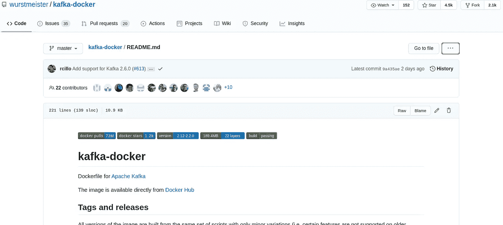
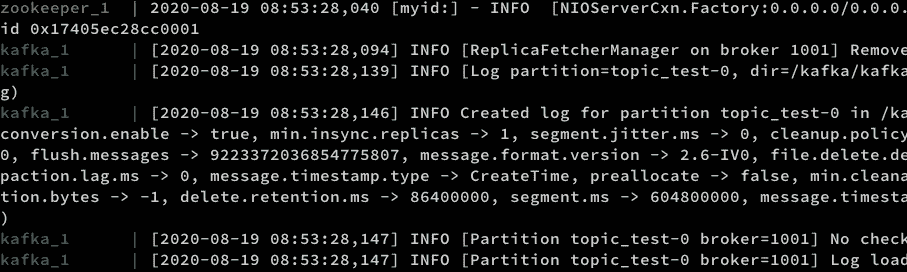

# Apache Kafka: Docker 容器和 Python 中的例子

> 原文：<https://towardsdatascience.com/kafka-docker-python-408baf0e1088?source=collection_archive---------2----------------------->


罗斯·索科洛夫斯基在 [Unsplash](https://unsplash.com?utm_source=medium&utm_medium=referral) 上的照片

## 如何使用 Docker 安装 Kafka 并在 Python 中产生/消费消息

A **pache Kafka** 是一个流处理软件平台，最初由 LinkedIn 开发，2011 年初开源，目前由 Apache Software Foundation 开发。是用 Scala 和 Java 写的。

汇流流简介

# 卡夫卡的关键概念

Kafka 是一个分布式系统，由**服务器**和**客户端**组成。

*   一些服务器被称为**代理**，它们构成了存储层。其他服务器运行 **Kafka Connect** 以事件流的形式导入和导出数据，从而将 Kafka 与您现有的系统持续集成。
*   另一方面，客户端允许您创建读取、写入和处理事件流的应用程序。客户可以是生产者**或消费者**。生产者向 Kafka 写入(产生)事件，而消费者从 Kafka 读取并处理(消费)事件。

服务器和客户端通过高性能的 TCP 网络协议进行通信，并且完全解耦，互不可知。

但是什么是**事件**？在 Kafka 中，事件是一个有键、值和时间戳的对象。或者，它可以有其他元数据头。你可以把一个事件看作一个记录或一条信息。

一个或多个事件被组织在**主题**中:生产者可以编写不同主题的消息/事件，消费者可以选择读取和处理一个或多个主题的事件。在 Kafka 中，您可以配置一个主题的事件应该保留多长时间，因此，它们可以在需要时被读取，并且在消费后不会被删除。

消费者以自己的速度消费一个主题的事件流，并可以提交其位置(称为**偏移**)。当我们提交偏移量时，我们设置了一个指向消费者使用的最后一条记录的指针。

在服务器端，主题被划分和复制。

*   出于可扩展性原因，主题被**分区**。它的活动分散在不同的卡夫卡经纪人那里。这允许客户同时从/向许多代理读取/写入。
*   为了可用性和容错性，每个主题也可以被复制。这意味着不同数据中心的多个代理可能拥有相同数据的副本。

关于卡夫卡如何工作的详细解释，请查看其[官网](https://kafka.apache.org/)。

介绍够了！让我们看看如何安装 Kafka 来测试我们的示例 Python 脚本！

# 使用 Docker 安装 Kafka

作为数据科学家，我们通常会发现 Kafka 已经安装、配置好了，随时可以使用。为了完整起见，在本教程中，让我们看看如何安装一个 Kafka 实例进行测试。为此，我们将使用 [Docker Compose](https://docs.docker.com/compose/install/) 和 [Git](https://git-scm.com/downloads) 。如果没有安装，请在您的系统上安装它们。



图片作者。卡夫卡 docker 知识库。

在您的工作目录中，打开一个终端并克隆 Apache Kafka 的 docker 映像的 GitHub 存储库。然后更改存储库文件夹中的当前目录。

```
git clone https://github.com/wurstmeister/kafka-docker.git 
cd kafka-docker/
```

在 **kafka-docker** 中，创建一个名为**docker-compose-expose . yml**的文本文件，包含以下内容(您可以使用您最喜欢的文本编辑器):

```
version: '2'
services:
  zookeeper:
    image: wurstmeister/zookeeper:3.4.6
    ports:
     - "2181:2181"
  kafka:
    image: wurstmeister/kafka
    ports:
     - "9092:9092"
    expose:
     - "9093"
    environment:
      KAFKA_ADVERTISED_LISTENERS: INSIDE://kafka:9093,OUTSIDE://localhost:9092
      KAFKA_LISTENER_SECURITY_PROTOCOL_MAP: INSIDE:PLAINTEXT,OUTSIDE:PLAINTEXT
      KAFKA_LISTENERS: INSIDE://0.0.0.0:9093,OUTSIDE://0.0.0.0:9092
      KAFKA_INTER_BROKER_LISTENER_NAME: INSIDE
      KAFKA_ZOOKEEPER_CONNECT: zookeeper:2181
      KAFKA_CREATE_TOPICS: "topic_test:1:1"
    volumes:
     - /var/run/docker.sock:/var/run/docker.sock
```

现在，您已经准备好使用以下命令启动 Kafka 集群:

```
docker-compose -f docker-compose-expose.yml up
```

如果一切正常，你应该会看到动物园管理员和卡夫卡的日志。



图片作者。动物园管理员和卡夫卡的日志。

万一你想停下来，就跑吧

```
docker-compose stop
```

在 kafka-docker 文件夹中的一个单独的终端会话中。

关于 Kafka docker 的连通性的完整指南，请查看[这是 wiki](https://github.com/wurstmeister/kafka-docker/wiki/Connectivity) 。

# Python 中的生产者和消费者

为了用 Python 为 Kafka 创建第一个生产者/消费者，我们需要安装 Python 客户机。

```
pip install kafka-python
```

然后，用下面的代码创建一个名为 **producer.py** 的 Python 文件。

```
from time import sleep
from json import dumps
from kafka import KafkaProducerproducer = KafkaProducer(
    bootstrap_servers=['localhost:9092'],
    value_serializer=lambda x: dumps(x).encode('utf-8')
)for j in range(9999):
    print("Iteration", j)
    data = {'counter': j}
    producer.send('topic_test', value=data)
    sleep(0.5)
```

在上面的代码块中:

*   我们已经创建了一个 KafkaProducer 对象，它连接到我们的本地 Kafka 实例；
*   我们已经定义了一种方法来序列化我们想要发送的数据，将它转换成 json 字符串，然后编码成 UTF-8；
*   我们每 0.5 秒发送一个事件，主题名为“topic _ test**”**，迭代的计数器作为数据。除了 couter，你可以发送任何东西。

现在我们准备启动生成器:

```
python producer.py
```

该脚本应该每半秒钟打印一次迭代次数。

```
[...]
Iteration 2219
Iteration 2220
Iteration 2221
Iteration 2222
[...]
```

让生产者终端会话保持运行，并在一个单独的名为 **consumer.py** 的 Python 文件中用下面几行代码定义我们的消费者。

```
from kafka import KafkaConsumer
from json import loads
from time import sleepconsumer = KafkaConsumer(
    'topic_test',
    bootstrap_servers=['localhost:9092'],
    auto_offset_reset='earliest',
    enable_auto_commit=True,
    group_id='my-group-id',
    value_deserializer=lambda x: loads(x.decode('utf-8'))
)for event in consumer:
    event_data = event.value
    # Do whatever you want
    print(event_data)
    sleep(2)
```

在上面的脚本中，我们定义了一个 KafkaConsumer，它联系服务器“localhost:9092”并订阅主题“topic_test”。由于在生产者脚本中消息是 jsonfied 和编码的，这里我们通过使用 value_deserializer 中的 lambda 函数对其进行解码。此外，

*   **auto_offset_reset** 是设置 OffsetOutOfRange 错误时重置偏移量的策略的参数；如果我们设置了“最早”，那么它将移动到最早的可用消息，如果设置了“最新”，那么它将移动到最近的消息；
*   **enable_auto_commit** 是一个布尔型参数，表示是否会在后台定期提交偏移量；
*   **group_id** 是**加入的消费群的名称。**

在循环中，我们每 2 秒钟打印一次事件的内容。除了打印，我们可以执行任何任务，比如将它写入数据库或执行一些实时分析。

此时，如果我们跑

```
python consumer.py
```

我们应该收到类似于以下内容的输出:

```
{'counter': 0}
{'counter': 1}
{'counter': 2}
{'counter': 3}
{'counter': 4}
{'counter': 5}
{'counter': 6}
[...]
```

Python 生产者/消费者类参数的完整文档可以在[这里](https://kafka-python.readthedocs.io/en/master/apidoc/modules.html)找到。

现在你已经准备好用 Python 写卡夫卡了！

# 参考

*   [https://kafka.apache.org/](https://kafka.apache.org/)
*   [https://github.com/wurstmeister/kafka-docker](https://github.com/wurstmeister/kafka-docker)
*   [https://kafka-python.readthedocs.io/en/master/index.html](https://kafka-python.readthedocs.io/en/master/index.html)
*   [https://medium . com/big-data-engineering/hello-Kafka-world-the-complete-guide-to-Kafka-with-docker-and-python-f788e 2588 CFC](https://medium.com/big-data-engineering/hello-kafka-world-the-complete-guide-to-kafka-with-docker-and-python-f788e2588cfc)
*   [https://towardsdatascience . com/Kafka-python-explained-in-10-line of-code-800 E3 e 07 dad 1](/kafka-python-explained-in-10-lines-of-code-800e3e07dad1)

联系人:[LinkedIn](https://www.linkedin.com/in/shuyiyang/)|[Twitter](https://twitter.com/deltarule)