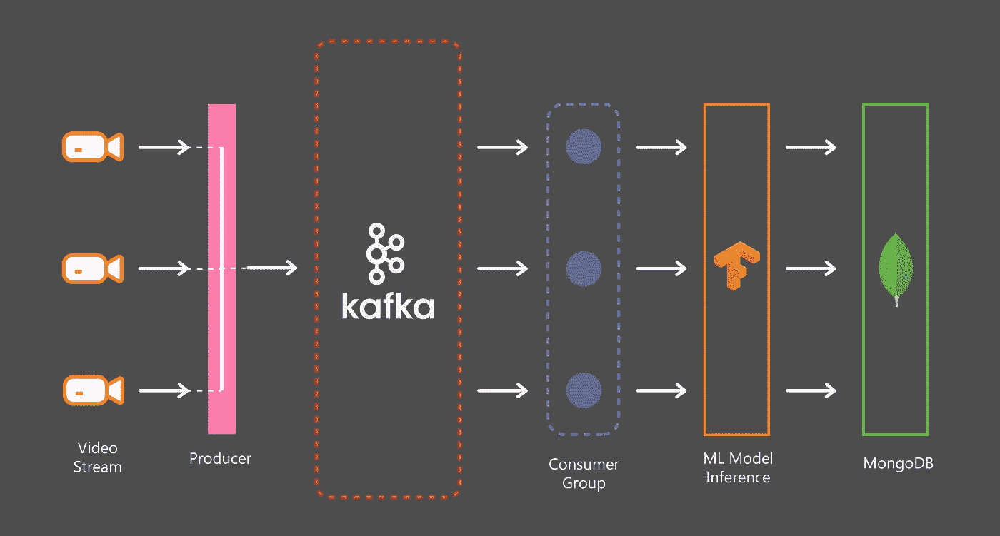
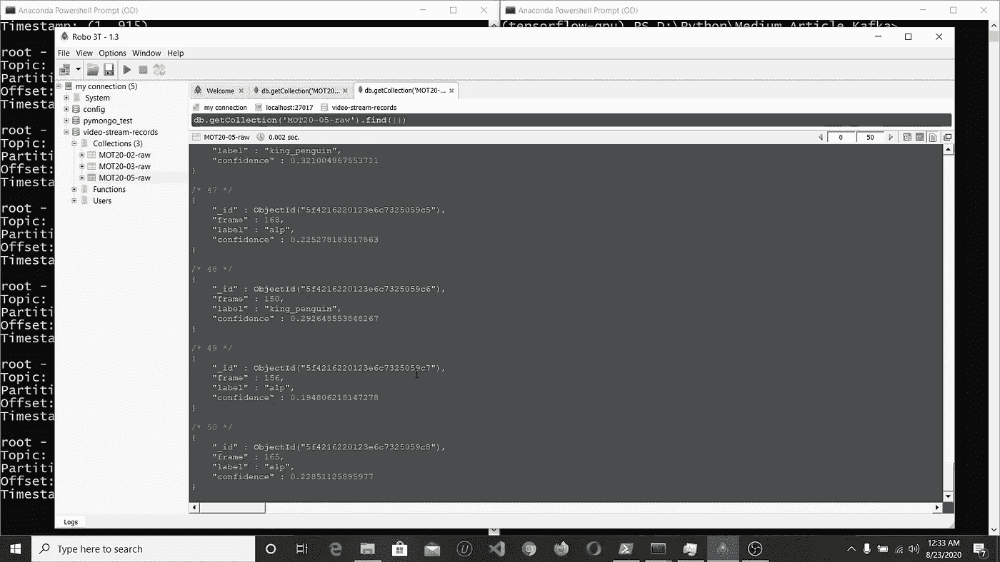

# 卡夫卡在行动:用 Python 和融合的卡夫卡构建分布式多视频处理管道

> 原文：<https://towardsdatascience.com/kafka-in-action-building-a-distributed-multi-video-processing-pipeline-with-python-and-confluent-9f133858f5a0?source=collection_archive---------7----------------------->

## 实时大规模数据处理和机器学习。



我们将会建造什么

# 介绍

试图通过建立一个项目来学习任何主题是一种有趣而直观的方式来加强我们的理解。在这篇文章中，我们将通过这样做来探索卡夫卡。

## 我们将会建造什么

想象一下这样一个场景，我们有多个来源生成视频流，我们需要近乎实时地处理和存储数据(如上图)。卡夫卡是这种情况下的完美契合。

## 先决条件

1.  对卡夫卡有基本的了解会有所帮助，但是如果你觉得舒服，你可以随时随地探索和学习。
2.  你需要在你的系统中安装 [docker](https://docs.docker.com/engine/install/) ，因为我们将使用它来运行应用程序，然而，安装软件包的二进制版本也可以。

# 我们开始吧

## 开始卡夫卡

我们将使用夏羽·马瑞克的惊人项目[kafka-stack-docker-compose](https://github.com/simplesteph/kafka-stack-docker-compose)在 Docker 中运行 Kafka。首先，您需要克隆回购:

```
git clone [https://github.com/simplesteph/kafka-stack-docker-compose.git](https://github.com/simplesteph/kafka-stack-docker-compose.git)
```

然后，根据集群配置，您可以运行所需的 docker-compose 文件。在本文中，我们将保持简单，用一个 zookeeper 和一个 kafka 服务器运行一个集群。假设您已经启动了 Docker，运行:

```
cd kafka-stack-docker-compose
docker-compose -f zk-single-kafka-single.yml up
```

我们现在已经通过两个简单的步骤启动了 Kafka 集群！

## 正在启动 MongoDB

我们将使用 MongoDB 来存储处理后的数据。同样，我们将使用 Docker 来运行 MongoDB。首先，我们需要创建一个`docker volume` ，这个将帮助我们在磁盘中持久保存数据，即使我们停止并移除容器。要创建体积管路，请执行以下操作:

```
docker volume create data-mongodb
```

`data-mongodb` 是我们卷的名称。接下来，我们将启动 MongoDB 服务器实例，并在其上挂载`data-mongodb`卷。运行:

```
docker run -v data-mongodb:/data/db -p 27017:27017 --name mongodb -d mongo
```

这将自动提取 MongoDB 映像并启动容器。

好吧！现在我们已经有了 Kafka 和 MongoDB，让我们开始研究这个项目。

# 卡夫卡在行动

我们将要使用的代码可以在这个 [repo](https://github.com/wingedrasengan927/Distributed-Multi-Video-Streaming-and-Processing-with-Kafka) 中找到。将 repo 克隆到工作区中。

```
git clone [https://github.com/wingedrasengan927/Distributed-Multi-Video-Streaming-and-Processing-with-Kafka.git](https://github.com/wingedrasengan927/Distributed-Multi-Video-Streaming-and-Processing-with-Kafka.git)
```

接下来安装必要的依赖项。最好为项目创建一个单独的虚拟环境，然后安装。

```
cd Distributed-Multi-Video-Streaming-and-Processing-with-Kafka
pip install -r requirements.txt
```

## 卡夫卡主题

我们要做的第一件事就是创造一个卡夫卡式的话题。要创建主题运行:

```
python create_topic.py
```

创建卡夫卡主题

这里我创建了一个名为`multi-video-stream`的主题，复制因子为 1 和 3 个分区。您可以试验复制因子和分区数量，但是要记住相应地更改`Admin Client`(第 6 行)中的服务器配置，还要注意副本的数量不能超过集群中服务器的数量。

## 卡夫卡制片人

Producer 应用程序从视频中读取帧，并将它们发布到 Kafka 主题。让我们浏览一下代码。

生产者应用

在开始时，我已经提到，我们将与多个来源产生视频流。我们需要一种在本地环境中模拟这种情况的方法。我们可以通过使用并发性并在一个线程中处理每个视频来做到这一点。

Kafka Producer 是线程安全的——我们可以创建单个 Producer 实例，并在多个线程间共享它。

在上面的代码中，我将所有的函数打包成一个类，当我们实例化这个类时，我们创建了一个 Kafka Producer。

方法`publishFrame`负责从视频中读取帧并将它们发布到卡夫卡主题。我们在这里使用`opencv`进行视频操作。在对 produce 方法的调用中，我们传递了以下参数:

*   **主题:**我们要将数据发送到的主题的名称。请记住，我们之前已经创建了主题。
*   **值:**这是实际的视频帧数据，被序列化为字节。
*   **on_delivery:** 生产方法是异步的。它不会等待确认消息是否已经传递。我们传入一个回调函数，该函数记录关于所产生的消息或错误(如果有的话)的信息。[回调](https://www.confluent.io/blog/introduction-to-apache-kafka-for-python-programmers/?utm_medium=sem&utm_source=google&utm_campaign=ch.sem_br.brand_tp.prs_tgt.confluent-brand_mt.mbm_rgn.india_lng.eng_dv.all&utm_term=%2Bconfluent%20%2Bpython&creative=&device=c&placement=&gclid=EAIaIQobChMI3a-A2o_86wIVVz5gCh1yEAx2EAAYASAAEgLFIvD_BwE)作为调用`poll`或`flush`方法的副作用被执行和发送。
*   **时间戳:**给出数据时间属性信息的值。注意，这里我传递的是帧数，而不是绝对时间，因为它更相关。
*   **headers:** Headers 包含我们想要发布到主题的任何关联元数据。请注意，回调函数不会记录标头。

还要注意，我们每三帧发布一次，每一帧后等待一段时间。这是因为在现实世界中，我们以特定的 *fps* 从源获得帧，并且在每个连续帧之间没有太多的信息差异，尤其是在机器学习的背景下。这也有助于减少 Kafka 服务器上的负载。

`start`方法将每个视频映射到一个线程，并发运行应用程序。

要启动 Producer 应用程序，将您的视频放入`video`文件夹，在第 47 行相应地更改扩展名，然后运行:

```
python producer_app.py
```

这将同时开始向 Kafka 主题发布视频帧。您应该会看到关于所记录的生成消息的信息。

现在让我们看看另一面。

## 卡夫卡消费者

消费者应用程序订阅 Kafka 主题来接收数据。我们通过图像分类模型对数据进行推理，然后将结果存储到 MongoDB 数据库中。让我们浏览一下代码。

消费者应用

消费者在一个消费者群体中运作。组中的每个消费者从独占分区读取数据。如果一个组中的消费者数量超过了分区的数量，一些消费者将处于非活动状态。

在我们的消费者应用程序中，我们有多个属于同一个组的消费者同时从 Kafka 主题中读取数据。注意，与生产者不同，消费者不是线程安全的，每个线程需要有一个单独的消费者实例。

我们用`run`方法完成从接收数据到处理和存储数据的所有操作。首先，我们对来自主题的数据进行轮询，如果没有错误并且消息有效，我们将继续进行进一步的处理。

注意，消费者从主题中一次轮询一批消息，并将它们存储在内部缓冲区中，并从那里读取。

一旦我们收到消息，我们就对它进行解码，从中提取时间戳和元数据，并将其附加到一个数组中。

## **批量操作**

如果你观察，我们不是一个接一个地处理消息，而是批量处理数据并对数据执行操作。这提高了效率和吞吐量。

一旦数据批次形成，我们就将其传递给图像分类模型，在我们的情况下，该模型是在 ImageNet 上训练的 ResNet50 模型。该模型每帧输出标签及其相应的置信度。我们只挑选最上面的标签和它的置信度并存储它。

接下来，我们将获得的结果插入 MongoDB 数据库。数据在数据库中的组织方式是，我们将每个视频作为一个集合，在每个集合中，我们都有包含该帧信息的记录或文档。该文档具有帧号、帧标签和置信度作为其字段，使得查询数据变得容易。此外，请注意，正如我们之前讨论的那样，我们正在向数据库中执行批量插入。

在这之后，我们完成了数据的处理，我们想把同样的事情告诉卡夫卡。Kafka 使用偏移量来跟踪消费者轮询的数据记录的位置，因此即使消费者倒下了，Kafka 也能够从它停止的地方读回来。我们希望如何提交偏移量以及遵循哪种交付语义由我们决定。这里，我们在数据处理完成后提交偏移量。这遵循了*至少一次*交货的语义。

**注意:**因为我们手动提交偏移量，所以在配置文件中我们必须将`enable.auto.commit`属性设置为`False`

**注意:**在*至少一次*交付语义中，如果消费者停止使用或处理出错，消息有可能被再次处理。为了避免重复的消息，我们必须维护幂等系统。例如，在我们的例子中，我们确保将一个惟一的文档插入到一个集合中，这样即使再次处理一个消息，数据库中也不会有任何重复。

好吧，让我们回到代码上。要运行消费者应用程序，请在第 108 行设置主题，在第 124 行更改视频名称(注意:这些名称必须与我们通过生产者发布的视频名称相匹配，并且这些名称也将是数据库中的集合名称)，确保消费者的数量不超过第 128 行中的分区数量，然后运行:

```
python consumer_app.py
```

如果您同时启动生产者应用程序和消费者应用程序，它看起来会像这样并排:

左:制片人；右图:消费者

还可以可视化存储在 MongoDB 中的数据。 [Robo3T](https://robomongo.org/download) 是一个很好的工具:



在 Robo3T 中可视化文档

# 在生产中部署

生产中的事情会变得更加复杂。幸运的是，我们在云平台上有托管服务，如谷歌云发布/订阅(T1)或 T2 亚马逊 kine sis(T3)，这让我们的工作变得更容易。最好在生产中使用它们。

此外，在本文中，我们没有讨论生产者和消费者的配置，但是基于用例对它们进行调优是非常重要的。例如，在某些情况下，延迟可能是高优先级，我们可能不关心数据丢失或数据顺序，而在其他情况下，数据可能被赋予高优先级。需要相应地配置生产者和消费者。

对于生产中的机器学习，最佳实践是使用 [Tensorflow 服务 API](https://www.tensorflow.org/tfx/guide/serving) ，而不是在消费者应用中初始化模型。

此外，最好使用云中的托管数据库来存储数据。

# 结论

这让我们走到了尽头！Kafka 正在大量的项目中使用，并且还在继续增长。这一点非常重要。下面我提到了一些额外的资源，可以帮助你加深对卡夫卡的了解。

希望这篇文章是有帮助的。如果您有任何反馈或想与我取得联系，请在*ms.neerajkrishna@gmail.com 给我留言。*

在[推特](https://twitter.com/WingedRasengan)上连线吧！

# 额外资源

*   夏羽·马瑞克在《我的世界》上的精彩课程
*   汇合者拥有关于卡夫卡的惊人的文档和博客。