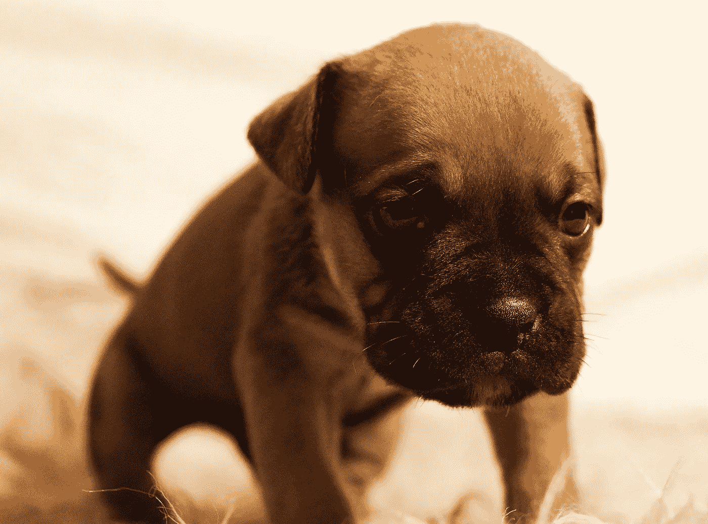
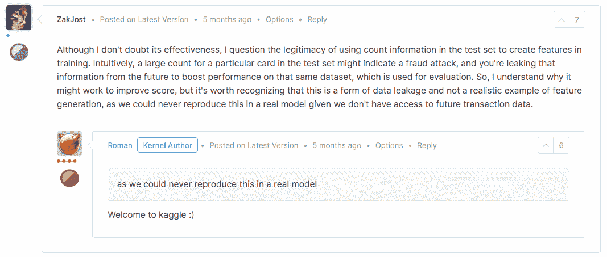
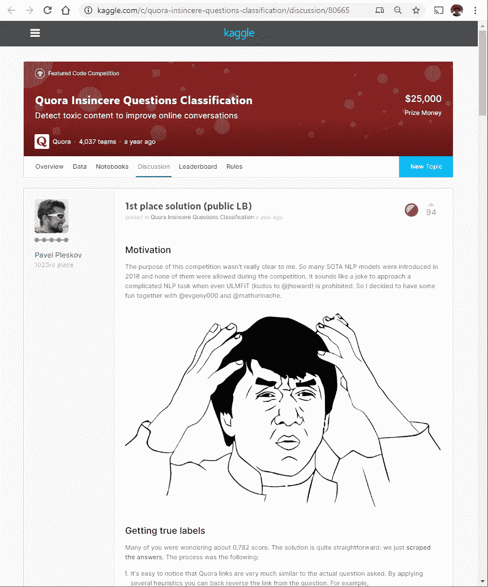
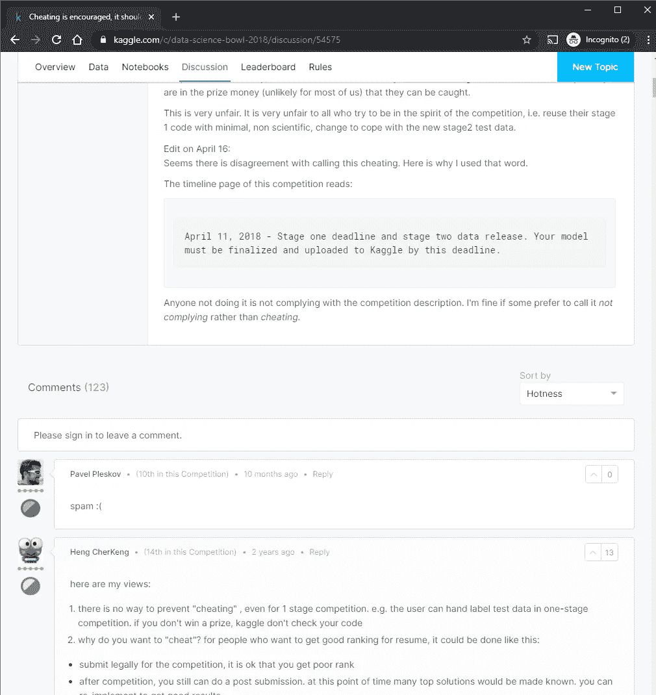
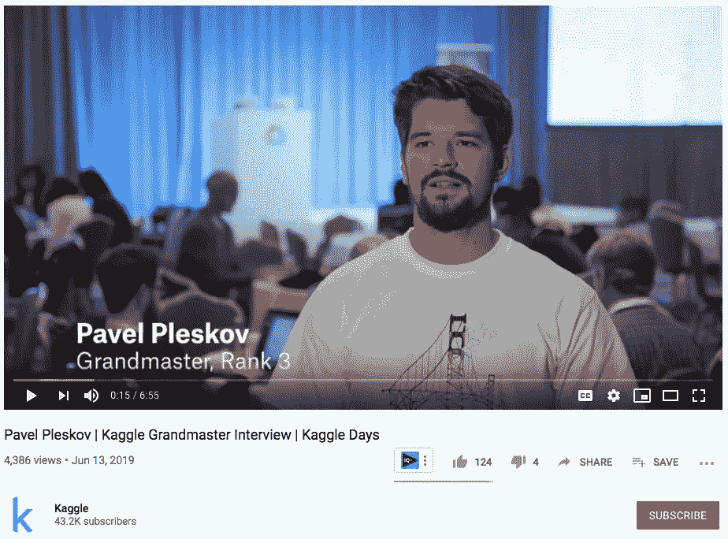

# Kaggle 第一名得主作弊，10，000 美元奖金宣布不可收回

> 原文：<https://towardsdatascience.com/kaggle-1st-place-winner-cheated-10-000-prize-declared-irrecoverable-bb7e1b639365?source=collection_archive---------3----------------------->

## 一个团队如何获得私人数据，构建一个假的人工智能模型，并从一个收养被忽视的宠物的平台上获得资金

骗子们从一个收养无家可归和被忽视的宠物的平台 Petfinder.my 上偷东西。像素图像

Kaggle 刚刚[宣布](https://www.kaggle.com/c/petfinder-adoption-prediction/discussion/125436)第一名队伍 Bestpetting【1】，因作弊被取消 Petfinder.my 比赛资格。该团队爬上宠物收养网站收集私人排行榜答案，并将这些数据隐藏在他们的提交材料中，以赢得 2019 年 4 月 9 日的第一名。一等奖从 25，000 美元的奖金池中拿出 10，000 美元。在这篇文章中，你会发现 Kaggle 的背景，其竞争的黑暗面，以及相关资源的链接。

## 链接

*   [对用于编码和解码混淆答案的代码的分析](https://www.kaggle.com/bminixhofer/how-bestpetting-cheated)
*   [竞赛页面](https://www.kaggle.com/c/petfinder-adoption-prediction/overview)
*   [关于 reddit 的进一步讨论](https://www.reddit.com/r/MachineLearning/comments/emus6a/n_kaggle_petfindermy_contest_first_place_winner/)

# 什么是卡格尔比赛

Kaggle(谷歌的子公司)是一个围绕比赛建立的在线社区，旨在建立机器学习模型。该平台的奖金高达 150 万美元，吸引了形形色色的追随者。此类竞赛提供了一个数据集，以及将用于决定获奖作品的指标。竞争者分析给定的数据，构建模型以匹配期望的结果，并提交他们的结果(通常与他们的代码一起)。为了防止作弊，机器学习比赛包括没有标记的数据，并在两个阶段使用:

*   当比赛结束时，数据集的“私人”部分(竞争者仅拥有未标记的数据)用于选择获胜者。这些数据理想地代表了模型在从未见过的数据上的表现。
*   为了在比赛期间对参赛者进行排名，团队提交的内容将根据“排行榜”专用数据集的一部分进行评分。像“私人”测试数据一样，竞争对手也有这些数据，但没有标签。仅针对排行榜指标进行优化的团队往往会因为不适合数据集的“私有”部分而失败。

# 用私人数据作弊

这种竞赛形式的结果是，如果一个团队获得了私有测试数据集的真实答案，那么它就一定会赢。作弊团队制作的模型将是无效的，使比赛无效。

在这种情况下，作弊者将私人答案和提交的答案打包在一起。其他攻击可能更难检测。其中一种方法是使用完整的数据集优化超参数，创建一个似乎巧合地更有效的模型。也许作弊团队选择了一种更容易被发现的方法，因为他们根本没有能力创建一个值得登上排行榜的模型，或者他们太厚颜无耻了。

缓解这些问题的方法是将私有数据完全排除在竞争之外。提交的内容必须包括提供 API 来生成预测的代码。这也将防止竞争者知道特征在私人和排行榜数据中的分布。

# 卡格尔的黑暗面

Kaggle 竞赛有许多潜在的问题。我在一次检测信用卡欺诈的比赛中偶然发现了一个例子。一个流行的模型正在使用来自未来的信息进行训练，这将使它在实践中无法使用——银行没有水晶球。许多模型以产生更高分数的方式使用数据集，但是使模型对竞赛组织者无用。这些模特仍然可以赢得比赛，因为他们没有违反任何规则。

卡格尔模型中不切实际的一个例子

由于这些漏洞和潜在的无用结果，竞赛组织者必须格外警惕和小心他们的数据和规则。有些要求在多轮比赛中获胜，有些则在大量的顶级作品中平均分配奖金。

# 惯犯

这不是帕维尔第一次违背卡格尔比赛的宗旨，或者被指控作弊。看来卡格尔过去没有谴责和采取这些策略。

帕维尔·普莱斯科夫承认在另一场比赛中刮伤。

一个[谴责 Kaggle](https://www.kaggle.com/c/data-science-bowl-2018/discussion/54575) 作弊的帖子，Pavel Pleskov 评论为“垃圾邮件”。

这些疑虑不仅仅被卡格尔忽略了，从卡格尔制作的采访中可以看出，帕维尔是一位著名的大师。

# 结果

除了被剥夺他的奖金并被禁止进入 Kaggle 平台，我还联系了帕维尔的雇主 H2O.ai，请他发表评论。这是英格丽·伯顿的回答:

> 今天早些时候，我们已经知道了这个情况。他不再隶属于 H2O.ai，立即生效。我们还将联系 Petfinder.my，看看我们如何帮助他们。

我没有找到关于费多尔·多布里扬斯基的进一步信息，他也被禁止进入 Kaggle。根据 Kaggle 的调查，他们选择不禁止 Narek Maloyan。

# 卡格尔更光明的未来

Kaggle 一直是推动机器学习成为可能的巨大力量。获奖的作品通常会展示最佳的工具和实践，并激发人们发明新的技术。尽管不切实际的模型和作弊伤害了竞赛组织者、Kaggle 品牌和整个生态系统，但好处和潜力远远大于坏处。

也许这是 Kaggle 新篇章的标志。如果他们想重建对平台及其社区失去的信任，他们还有很多事情要做。推动可重复、公平和有用的模型构建竞赛，正是机器学习所需要的。让我们希望我们得到它。

[ [pixabay 图像](https://pixabay.com/photos/tunnel-urban-light-underground-1214555/)

[1]最佳团队包括:[帕维尔·普莱斯科夫](https://www.linkedin.com/in/ppleskov/)、[纳雷克·马洛扬](https://www.linkedin.com/in/narek-maloyan-80664715a/)和费多尔·多布里扬斯基。

编辑 2020–06–05—pet finder . my 于 2020–01–28 宣布 [Bestpetting 团队发布道歉并返还被盗资金](https://www.kaggle.com/c/petfinder-adoption-prediction/discussion/125436#731014)。