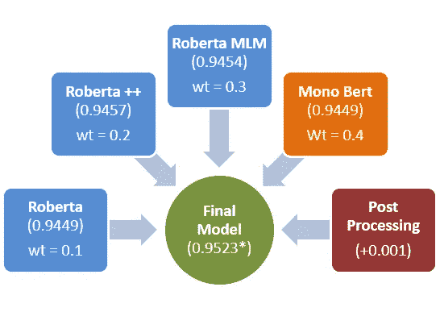
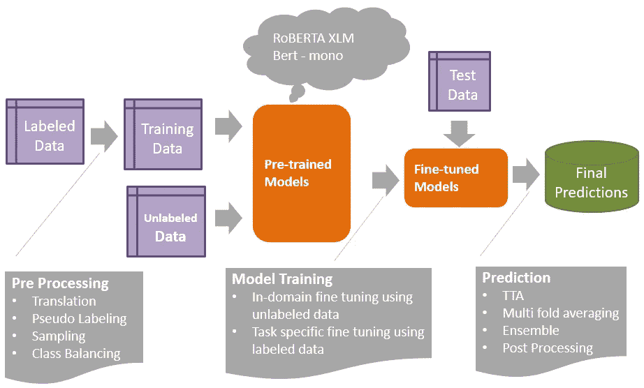

# Kaggle 第三名解决方案— Jigsaw 多语言毒性评论分类

> 原文：<https://towardsdatascience.com/kaggle-3rd-place-solution-jigsaw-multilingual-toxic-comment-classification-e36d7d194bfb?source=collection_archive---------23----------------------->

## 方法、知识和代码

我最近参加了 Kaggle 的[拼图多语言毒性评论分类](https://www.kaggle.com/c/jigsaw-multilingual-toxic-comment-classification)挑战赛，我们的团队(ACE 团队)在最终的排行榜上获得了第三名。在这篇博客中，我描述了问题陈述，我们的方法，以及我们从竞赛中学到的东西。我还在博客末尾提供了我们全部代码的链接。

# 问题描述

比赛的目标是检测在线互动期间用户评论中的毒性(例如粗鲁、不尊重或威胁)。这是一个非常现实的问题，因为最近社交媒体上的钓鱼和仇恨越来越多。

该问题被设置为一个普通的文本分类问题，其中人们必须预测(文本)评论有毒的概率，并根据 [ROC AUC](http://en.wikipedia.org/wiki/Receiver_operating_characteristic) 指标对提交的内容进行评估

问题中最有趣的部分是——必须用 6 种不同的语言来识别毒性，其中 3 种语言根本没有训练数据，其余 3 种语言的训练数据也很少。

该比赛由谷歌公司 [Jigsaw](https://jigsaw.google.com/) 组织，该公司开发工具来处理在线内容中的毒性、虚假信息、骚扰和激进化等问题。这是 Jigsaw 举办的第三次毒性检测竞赛(尽管是第一次多语言竞赛)。

# 为什么问题具有挑战性？

检测毒性不仅仅是检测文本中的辱骂性词语。作为一个例子，考虑下面的评论，它没有任何辱骂的话，但仍然是有毒的

> 我只想找点乐子，扫兴船长。我猜你年轻的时候从来没有生活过。那可能有 100000000000000000 岁了

除此之外，如果你试图解决跨多种语言的问题，它会变得相当棘手。

# 解决方案概述

上图高度概括了我们最终解决方案的各个组件，以及它们各自的得分(ROC)和权重，最终得分为 0.9523。

最终的解决方案是以各种方式训练的不同基础模型的混合。上图中的“罗伯塔”代表从罗伯塔·XLM 架构派生的模型，而单声道 Bert 代表根据特定语言的文本预先训练的 Bert 基础模型。

# 技术概述

下面的流程图提供了我们解决方案的高级技术概述。我将在接下来的部分分享各种细节

# **训练数据/预处理**

我们在竞赛中使用以下数据集进行模型训练:

*   由组织者从过去的比赛中提供的有标签的英语数据
*   每种目标语言的标记英语数据的翻译版本
*   组织者以目标语言提供的小型验证数据
*   [打开字幕数据](http://opus.nlpl.eu/OpenSubtitles-v2018.php)，使用[伪标签生成标签](https://www.kaggle.com/cdeotte/pseudo-labeling-qda-0-969)
*   带有伪标签的测试数据集*

使用分层抽样从上述项目中准备列车数据，以确保等级平衡。

将标记的英文数据翻译成目标语言有助于缺少目标语言的标记数据，但不如目标语言本身的数据好，因为翻译过程去除了文本的一些微妙之处，而这些微妙之处有时对检测毒性很重要。

# 预训练模型

自 2018 年以来，基于 Transformer 架构的预训练(迁移学习)模型在 NLP 中非常流行。从概念上讲，它们是在大量(万亿字节)文本数据上训练的深度学习模型，因此它们学习语言(单词、文本)的非常好的数字表示。这些表示在各种下游任务中很有用。你可以在我的[早期](/recent-advancements-in-nlp-2-2-df2ee75e189)博客中阅读更多关于变形金刚和转移学习的细节

罗伯塔·XLM 是谷歌的伯特在架构方面的变体，预先接受了 100 多种语言的培训，是比赛中的主力。它的表现出人意料地好，甚至在其他语言上只有英语训练数据的情况下也表现不错。

除了上面描述的多语言模型，我们还使用了针对感兴趣的特定语言预先训练的 Bert 模型。正如人们所预料的那样，与多语言模型相比，这些单语模型对于它们被训练的单种语言表现得更好(对于给定的模型容量，每种语言的性能随着我们增加语言的数量而下降)。但是这种方法在实践中稍显逊色，因为如果处理大量语言，在生产中维护特定于语言的模型会很麻烦。

# 模特培训

这是很多艺术和经验发挥作用的地方。我们使用各种策略进行模型训练:

*   **多阶段训练:**在逐渐变难的任务上训练模型，在刚刚标记的英语数据上进行示例训练，然后逐渐移动到更难的任务，示例伪标签，然后在验证数据上进行最后一轮(时期)训练，因为这接近于测试数据
*   **针对特定领域数据的无监督训练:【RoBERTa 等庞大的语言模型通常是在新闻、维基百科等通用数据集上训练的——这可能与你的特定任务数据的内容/结构/词汇有很大不同。虽然获得标记数据总是一个昂贵的提议，但通常有更大的未标记数据(在这种情况下只是原始文本数据)的可用性，这些数据可用于预训练。这有助于稍后进行特定任务监督训练时的表现**
*   **多重平均**:将我之前描述的所有不同类型的数据集放在一起的训练样本数量达到了数百万。我们观察到，模型在训练期间很快饱和，并在大约 200，000 个样本后停止改善。我们使用数据的随机子集训练各种模型，并使用这些模型对测试数据集的预测进行平均

# 预测和混合/集成

众所周知，混合各种不同模型的预测往往优于潜在的单个模型预测，并且通常是改善最终预测的最佳方式。

如“解决方案概述”中所述，我们的最终解决方案融合了 4 个模型系列的预测。我们在每个家庭内训练了多倍模型(对不同数据子集的训练)最终得到大约 30(！！)奇款。

我们对每个系列内的多倍预测进行了直接平均，并对不同系列模型的预测进行了加权平均。我们没有真正的质量数据集，底层模型看不到，来提供整个家庭的权重，所以我们使用一些直觉，领导委员会的反馈和实验来确定这些权重。

测试时间增强(TTA)是一种技术，在这种技术中，我们不仅对测试示例进行预测，还对它的一些变体进行预测，以获得更好的最终预测。我们在一些底层模型中采用了这种技术，它给了我们一个小小的提升，下面是它的工作原理:

*   对测试数据集中的原始注释进行预测
*   对原始评论的各种语言翻译进行预测
*   对原始评论及其翻译的预测进行加权平均

# 五金器具

深度学习模型在 GPU 上运行比在 CPU 上运行快得多已经不是什么秘密，但是[谷歌的 TPU](https://cloud.google.com/tpu) 甚至比 GPU 还要快。它们在内存(允许更大的批量)和速度(允许快速实验)方面都是非凡的，并使训练过程不那么痛苦。

我们在比赛期间广泛使用了 Kaggle 和 Google Colab 提供的免费 TPU 配额来训练我们的模型。

# 密码

这是到我们完整代码的链接