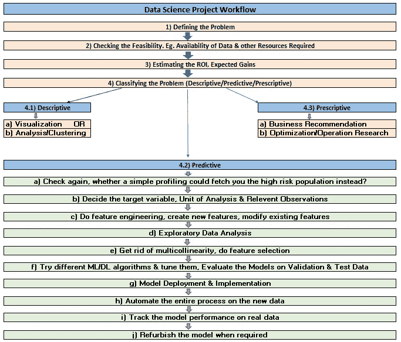
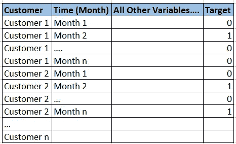
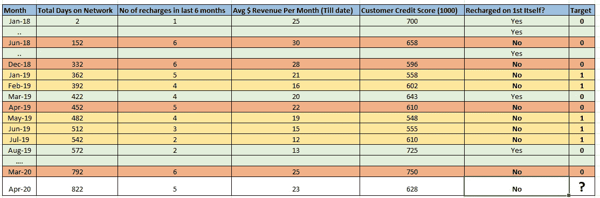
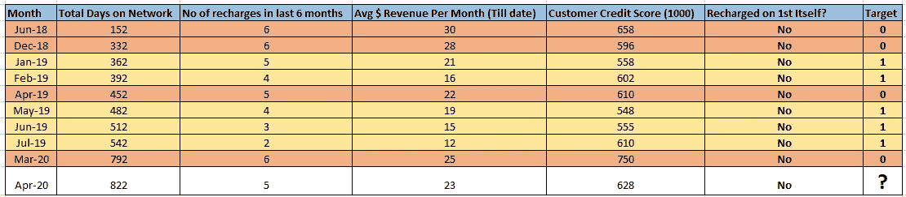
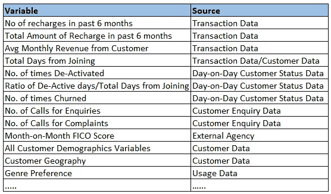
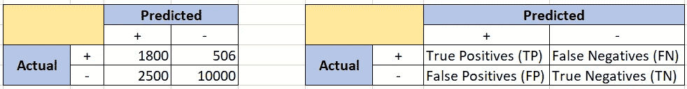

# ka ggle/学术与现实世界数据科学分析

> 原文：<https://towardsdatascience.com/kaggle-academic-vs-real-world-data-science-analytics-b4c08fed580c?source=collection_archive---------37----------------------->

(初学者 40 分钟阅读。文末免费指导链接)

> “被《哈佛商业评论》、IBM 等公司的报告所吸引，我将职业生涯转向了数据科学。我已经完成了数据科学的整个在线专业。我擅长 Python。我已经建立了像……这样的机器学习模型。…在我的 Kaggle 项目中。我非常擅长构建 ML 模型。尽管数据科学有很多机会，但我仍然发现很难找到第一份工作。为什么招聘人员对雇佣有相关实习/工作经验的数据科学家更感兴趣？”

如果这些是你问自己的问题，你今天来对地方了。现实世界中的数据科学与技术课程和学术项目所教授的完全不同。这是唯一的原因，也是为什么招聘人员希望你在招聘前在个人资料中加入过去的数据科学实习/经验。拥有强大的数据科学技术背景总是有帮助的，但现实世界的经验更是锦上添花。

时代广场:纽约市(演员表:Self)

在本文中，我们将使用一个非常常见的客户流失(客户保留)建模分析问题来理解学术项目和现实项目之间的差异。如果你擅长讲故事，你或许可以在简历中展示一个学术项目，作为一个真实世界的行业赞助项目，并在下一次面试中显得更有前途。

图一

**分析流程:(针对客户流失预测数据科学项目)**

**1)定义问题:**

**卡格尔:**

阅读客户流失的问题陈述。浏览各列以了解数据。跳入数据中。

**现实世界:**

管理层的问题陈述非常含糊。我们必须最后确定我们正在处理的到底是什么问题。在项目的后期过程中，问题陈述不能改变。

首先，我们需要定义客户流失。流失可能是永久流失，也可能是临时流失(其中客户会在一定时间后返回),具体取决于领域。

流媒体服务提供商(如网飞)有暂时的流失现象。我们需要定义一个停用天数的阈值，称之为流失。比如说 D+15，D+30(D+X =停用后的天数)。这个定义需要大量的头脑风暴、领域知识以及最终管理层的批准。

在暂时搅动问题中，可能发生订户搅动多次的情况。而在永久性流失问题中，客户永远不会回来。暂时的和永久的流失有不同的方法。

任何流失项目的问题陈述将是识别高风险流失客户并试图留住他们。

2)检查可行性。例如，所需数据和其他资源的可用性:

**卡格尔:**

必须足够可行，才能上传到这个平台上。所有的数据集都是可用的。不需要外部数据，没有外部数据可能会使问题变得不可行。

**真实世界:**

解决这个问题可行吗？我们是否拥有所需的数据和资源？有可能实现吗？

我们能想到一些可能导致客户流失的因素吗，包括客户人口统计、客户产品特征、外部变量？这些因素的数据可以利用吗？

如果模型准备好了，有可能实现吗？(可能不总是)。

实施的成本是多少？我们真的获利了吗？

例如，对于贷款流失(余额转移)的银行领域问题，即使我们使用机器学习获得了高风险客户，因为所有贷款条款都是固定的，所以你无法为客户提供任何东西来留住他/她。即使利率是可变的，并且联系客户告知他们有资格获得更低的利率，所有的误报都会导致银行的巨大损失。因此，在这种情况下，做客户流失建模可能没有意义。

**3)估算 ROI，预期收益:**

**卡格尔:**

不需要。没问过。

**现实世界:**

解决这个问题值得吗？

对于像流失这样的预测建模项目，关联每个真阳性、真阴性的近似收益和每个假阳性和假阴性的损失，我们可以估计 ROI。它包含了执行项目、实施项目等的所有费用。如果投资回报率更低，这个项目就没有意义。

**4)问题分类:**描述性/预测性/规定性:预测性

【Kaggle 和现实世界:

由于我们预测客户流失的可能性，这是一个预测分析项目**。**如果问题是确定哪种产品的流失率最高，那么它就是一个描述性分析项目，如果问题是找到流失率最低的最佳销售价格，那么它就是一个说明性分析项目。为了能够选择必要的工具和资源，将问题分类到合适的箱中是很重要的。

**4.2)预测:**

让我们直接讨论预测分析，因为我们正在处理客户流失建模。

**a)再检查一下，简单的特征分析是否能让你找到高危人群？**

**卡格尔:**

这不是我们被要求提交的。

**现实世界:**

用目标变量客户流失对每个变量进行二元可视化，我们可以知道每个变量对客户流失的影响。使用一些重要的变量，我们可以获得高风险的概况/特征，并使用简单的 SQL 查询找到它们的提升。例如，年龄在 30-35 岁之间、居住在纽约市、年份为 3 年的客户流失的可能性是其他客户的 2.6 倍。找到一些高风险的特征并只针对它们，可以节省我们在机器学习上投入的时间和资源。在进入机器学习之前，我们需要比较这两种方法的投资回报率。

**b)决定分析单位、目标变量和要包含的行**

**卡格尔:**

每行的主键是分析单位。我们希望找到每一行的预测。目标变量列已经可用。因此，分析单位和目标变量都被设置为包括在模型库中。

**真实世界:**

让我们讨论一下流媒体服务公司(比如网飞)的临时流失问题。

我们必须问一个问题，我们到底在预测什么？这并不像看起来那么简单。我们只是预测客户流失的可能性吗？令人惊讶的不是。概率随着时间而变化。客户 A 在 2020 年 1 月流失的概率可能不同于 2019 年 10 月。我们预测客户在特定的**时间**流失的概率。我们希望找到导致客户流失的高风险特征，而不是导致客户流失的高风险客户。因此，模型库中的一行将对应于某一时刻的客户简档。如果我们以月为单位考虑时间，则对于同一客户，模型库将有“n”个条目/行，其中“n”是客户的年份(以月为单位的网络年龄)。因此，

分析单位= {客户，时间(月)}

目标变量的定义应该与第 1 部分的问题陈述中的定义完全相同。假设我们定义了:失活+15 天作为目标变量(流失)

表 1:理解分析单元

在这种情况下，模型库中的行不应该只表示最新的客户数据，还应该表示与时间(这里是月)相关的客户数据。

我们举个例子。

我在 2018 年 1 月加入了流媒体订阅。**充值日期为每月 1 日(假设不是自动充值)。**

**如果我在 1 日之前没有充值，我将从 2 日起被取消激活。如果我在那个月的 15 号之前没有充值，我会被认为在那个月被“搅了”。**

**因此**，**目标变量也可以定义为，**

**一个月内搅动=“停用至一个月的 15 日”**

**表 2:每月 2 日的我的数据和每月最后一天的目标变量**

比如，我在 2019 年 1 月搅拌，2019 年 3 月返回，2019 年 5 月再次搅拌，2019 年 8 月返回。如果我停用(4 月 1 日不充值)，2020 年 4 月我会流失的概率有多大？

这是我的数据行在模型库中的样子。它由我每月的数据组成。同样，所有客户都有历史数据。因此，我们预测的是客户在特定时间流失的可能性。

仅选择相关的观察结果:

在选择要包含在模型库中的观测值之前，我们应该考虑一下模型部署。比方说，该公司正计划给高风险客户打电话，向他们提供折扣以留住他们。他们也想给活跃客户打电话吗？没道理。他们只想给在月 1 日没有充值的客户打电话，这些客户目前已经停用，以防止他们在 D+15(流失)后再次充值。话虽如此，我们只想找到一个去激活的客户流失的概率，而不是活跃的客户。这使得我们从模型库中排除了在当月 1 日进行充值的那些月份的客户资料(客户一直处于活动状态),仅考虑停用情况。(这是使用“第一次充电”变量确定的)

**表 3:样本客户(me)在模型库中的最终行**

**c)手动进行特征工程，创建新特征，修改现有特征**

**卡格尔:**

除了要素编码之外，从现有要素创建新要素、修改现有要素的范围较小。

**现实世界:**

现实世界的问题完全依赖于特征工程。没有填鸭式的特征。我们必须从多个来源获取数据，将其转换为可用的形式，并从中创建新的功能以包含在模型库中。这需要大量使用数据操作、连接。等等。与 Python/R 相比，NoSQL SQL 更适合执行此任务。在流媒体服务的流失预测问题中，我们可以创建如下变量:

表 4:变量和来源

我们必须有创造性。这与其说是科学，不如说是艺术。我们必须了解这个领域，以便能够创建新的变量。

我们也可以将多个变量组合成一个新的变量。或者修改现有变量以增加其预测能力。

**d)探索性数据分析**

**卡格尔:**

几个图来理解 Python/R 上的数据，查看分布。等等。没有演示要点，专注于更好地调整模型。

**现实世界:**

管理层想要一个带有切片器的仪表板，显示所有的变量关系。他们不会相信你给他们展示了多少形象化的东西。每次都会请求许多特别报告。交流结果是这项工作的重要组成部分，如果没有充分的探索性数据分析和数据挖掘，这是不可能的。一般来说，像 Excel，Tableau，PowerBI 等工具。在 EDA 行业中使用。

**e)去除多重共线性，进行特征选择:**

【Kaggle 和现实世界:

两者都涉及平等的工作。

**f)尝试不同的 ML/DL 算法，在验证和测试数据上评估模型:**

**卡格尔:**

尝试很多算法。做超参数调整。使用最复杂的算法。切换到 DL。你所要做的就是尽量减少误差。注重准确性！！超越记分牌。

**现实世界:**

准确很重要，但钱更重要。努力使投资回报最大化(后面会讲到)。建立一个能带来更多利润的模型。管理层不会理解和批准暗箱操作。使用简单的可解释算法，如逻辑回归、分类、树、正则化等。避免深度学习。

**ghij)模型部署和实施、自动化、跟踪和更新:**

**卡格尔:**

项目结束了。只需上传结果。专注于记分牌。

**现实世界:**

如果模型没有正确实现，预测就没有用。制定模型部署策略需要大量的头脑风暴和领域专业知识。要联系多少人？怎么联系？联系谁？什么时候联系？预期收益是否超过实施成本？

让我们以银行贷款的客户流失模型为例。机器学习给我们每个客户下个月流失(余额转移)的概率。

*要联系多少人口？*

针对多少高风险客户？我们需要设置一个增益最大的概率阈值。

要设置一个概率阈值，我们必须考虑与 TP、FP、TN、FN 相关的成本停在收益最大的概率。

回报=每个 TP 和 TN 的预期利润-每个 FP 和 FN 的预期损失

*如何联系？*

交流方式。用什么来留住他们？较低的利率，或任何其他好处。

*联系谁*？

我们是否只考虑流失概率来确定目标人群？我们还必须包括这种变动带来的财务损失。客户流失的可能性很低，但如果流失，损失会很大，必须联系他。

*什么时候联系？*

EMI 付款日期前几天？紧接着？或者任何时候。

*预期收益是否超过实施成本？*

如果向高风险客户提供较低的利率来留住他们，假阳性将会给银行造成巨大损失。我们还有足够的利润吗？如果没有，一切都是徒劳。

在所有这些都完成之后，在需要的时候，自动化模型来对新数据进行评分。这是通过使用一组在云上定期运行的 python 脚本来生产模型代码来实现的。通常，每个月都会对客户进行评分。一个月后，我们需要跟踪模型性能，计算我们为公司节省了多少。可以使用各种方法，如测试和控制、A/B 测试来跟踪实际新数据的模型性能。实施部分似乎比预测建模部分更具挑战性。如果模型的性能开始每月逐渐下降，这可能是因为自变量和因变量之间的关系随时间而变化。这个模型需要翻新。在高度动态的情况下，模型经常需要翻新。

希望你能感受到现实世界中的事情有多复杂。

注意:本文无意批评学术课程或 Kaggle 平台。

感谢读者的耐心。

参考:

自己

注意:我正在完成数据科学的硕士学位，想在美国找一份数据科学分析的全职工作。感谢任何线索。

【https://www.linkedin.com/in/kashyap-bhuva/ 号

kbvbhuva@gmail.com