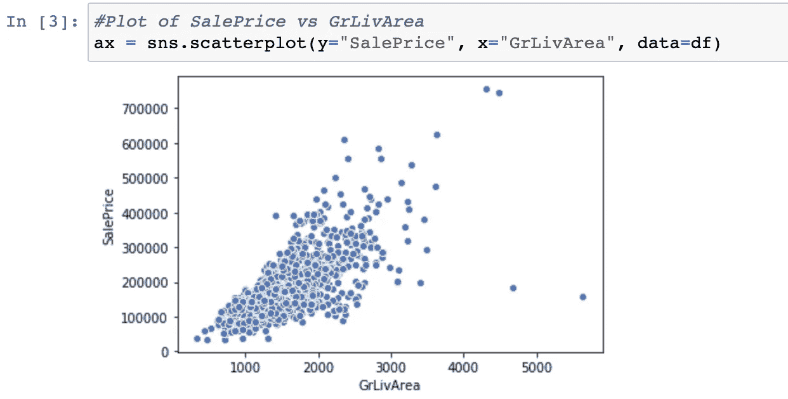
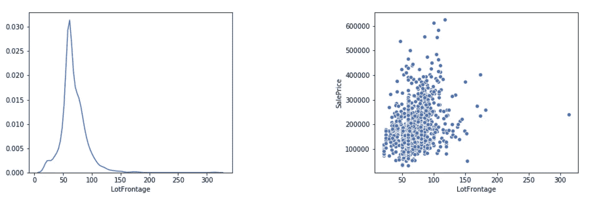
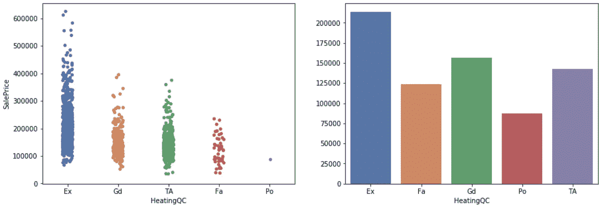
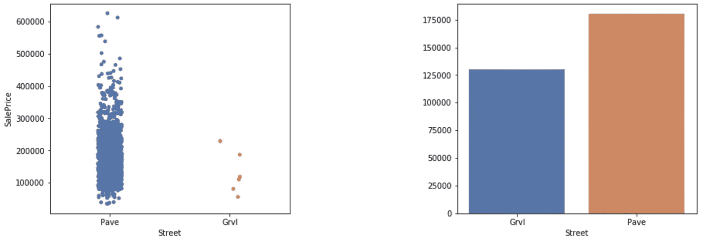
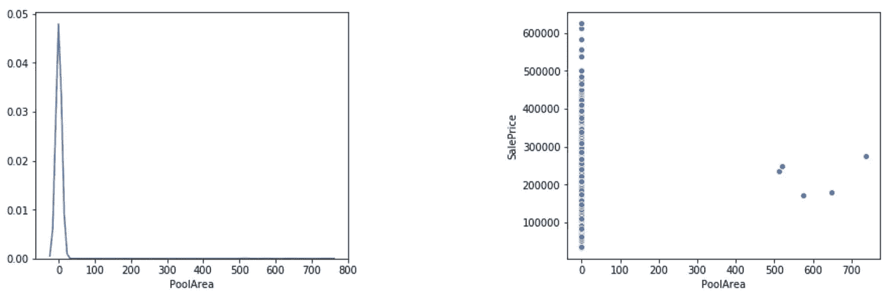
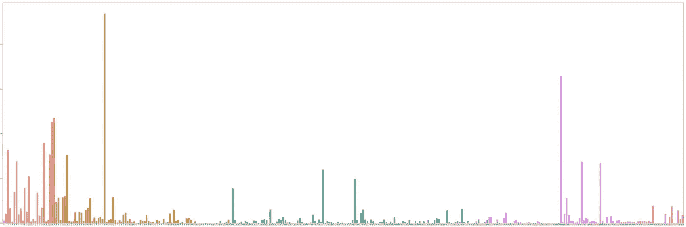
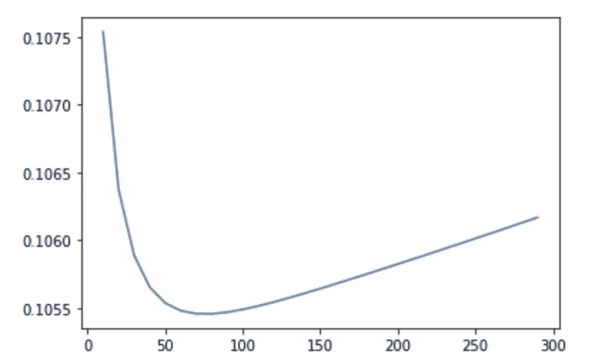

# Kaggle 基础知识:我的第一个数据科学挑战演练

> 原文：<https://towardsdatascience.com/kaggle-basics-walkthrough-of-my-first-data-science-challenge-9bf898dc0182?source=collection_archive---------48----------------------->

## 初学者的 Kickstarter 包！

罗纳尔多·德·奥利维拉在 [Unsplash](https://unsplash.com?utm_source=medium&utm_medium=referral) 上的照片

新冠肺炎·疫情的爆发迫使全世界都不得不改变他们的生活方式，整天呆在室内。有了从通勤和郊游中节省下来的所有额外时间，我决定去追求一些我以前不可能去做的事情。其中一个是**卡格尔**。

在我之前的所有项目中，我都做过视觉数据集，所以想尝试一些不同的东西。我想了解完整的流程，从数据清理开始，到各种转换，到特征选择，最后是机器学习建模。为了做到这一点，我拿起了一个带有大量数据集的初级挑战: [**房价:高级回归技术**](https://www.kaggle.com/c/house-prices-advanced-regression-techniques/overview) **。**我设定了低于 1k 的目标(~前 20%)。

正如预期的那样，我 90%的时间花在了数据清理和特征工程上，剩下的 10%花在了将机器学习模型应用于这些方面。我明白了**“了解你的数据”有多重要**。在没有任何数据工程的情况下，盲目地把它喂给 SOTA 模型只会让你走得更远。我不得不阅读许多博客和 Kaggle 笔记本，但我虔诚地遵循的是 [this](https://www.kaggle.com/agodwinp/stacking-house-prices-walkthrough-to-top-5\) 。在这一篇中，我将用非常简单的词语和例子来概述我所遵循的过程，以便像我这样的初学者可以知道从哪里开始。

作为参考，这是我的笔记本，里面有完整的代码，这样你就可以跟着解释走了

*数据清理和特征工程*:[https://github . com/Shikhargupta/ka ggle _ house _ pricing/blob/master/Feat _ engg . ipynb](https://github.com/Shikhargupta/kaggle_house_pricing/blob/master/Feat_Engg.ipynb)

*特征重要性和建模*:[https://github . com/Shikhargupta/ka ggle _ house _ pricing/blob/master/ensemble . ipynb](https://github.com/Shikhargupta/kaggle_house_pricing/blob/master/Ensemble.ipynb)

# 埃姆斯住宅数据集

在 [Unsplash](https://unsplash.com?utm_source=medium&utm_medium=referral) 上由 [Breno Assis](https://unsplash.com/@brenoassis?utm_source=medium&utm_medium=referral) 拍照

在进入这个过程之前，让我们先了解一下正在讨论的数据集。它有 80 列(特征),每一列描述房子的一个特定方面(例如，邻居、公用设施、屋顶类型等)。)在决定其价格(目标变量)时可能起作用，也可能不起作用。它由总共 2920 个观察值组成，其中 1460 个将用于拟合(*训练数据*)，其余的用于确定你的模型执行得有多好(*测试数据*)。我们的目标是通过考虑特征(可能不是全部)来尽可能准确地预测房屋的销售价格。我建议你通过[数据描述](https://www.kaggle.com/c/house-prices-advanced-regression-techniques/data)来习惯每个字段的含义。评估的标准是预测值的对数和观察销售价格的对数之间的 [*均方根误差(RMSE)*](https://en.wikipedia.org/wiki/Root-mean-square_deviation) 。分数越低，你的模型预测越好！

# 数据清理(异常值和 NAN)

在 [Unsplash](https://unsplash.com?utm_source=medium&utm_medium=referral) 上[创意交流](https://unsplash.com/@thecreative_exchange?utm_source=medium&utm_medium=referral)的照片

首先，我们将清理数据集，以避免在将它输入到模型中时出现任何错误或差异。

> 永远记住，最终目标是训练我们的机器学习模型，数据应该以同样的方式准备。请注意我们执行的任何操作最终可能会提高或降低回归器/分类器的效率。

例如，一个 **NAN** 字段的出现可能会使训练例程抛出一个错误。我们预测的另一个杀手可能是一个 [**离群值**](/ways-to-detect-and-remove-the-outliers-404d16608dba) 。我们的住房数据是手工收集和存储的，很容易出现人为错误。一个明显的大(20 间卧室)或小(10 平方。制成 LotArea)的观察可能会使我们的模型向错误的方向摇摆，从而影响我们的分数。我们要么需要去掉这些数据点，要么适当地估算这些值。

就 Ames Housing 数据集而言，我们在离群值方面做得很好。作者已经在[论文](http://jse.amstat.org/v19n3/decock.pdf)中指出了可疑的异常值，我已经在这个图中显示出来了

带有 *GrLivArea > 4000* 的数据点是异常高销售价格和 LivArea 的异常值，应被删除。虽然没有提到其他任何东西，但我发现“GarageYr”这一特征有一处不一致，它描述了车库在房子中建造的年份。这个值是 *2027* ，这是一个遥远的未来。我没有摆脱观察，而是把它归因于模式。在此之前，我通过检查“GarageType”属性来确保房子*有车库。在做出任何改变之前，了解你的数据是很重要的，所以要注意这些微小但重要的方面。*

对于南，我绘制了一个图表，显示了至少具有其中一个特征的所有特征。然后我逐一分析它们，并决定如何处理丢失的值。他们中的大多数都被那个特征的模式所取代，但是也有一些特殊的情况，就像这样-

在没有地下室的情况下，我们可以将地下室平方英尺的缺失值估算为 0

# 特征工程

照片由 [Isaac Smith](https://unsplash.com/@isaacmsmith?utm_source=medium&utm_medium=referral) 在 [Unsplash](https://unsplash.com?utm_source=medium&utm_medium=referral) 上拍摄

这无疑是这个过程中最重要也是最耗时的部分。我的方法是一次拿一个。)并应用变换。这听起来可能很麻烦，但是请相信我，这将大有帮助。我的方法是[用不同的图表将](/complete-guide-to-data-visualization-with-python-2dd74df12b5e)形象化(seaborn 给了你漂亮的图表！)并以此为基础做出我的决定(放弃或保留它们以及任何更改)。这将是运用你分析能力的好时机。这里没有火箭科学，数据集非常直观(卧室数量越多，价格越高)且符合逻辑。我将用几个大类的例子来解释我所做的。

**多项式**

如果你计划回归一个巨大的数据集，线性不应该是唯一的方法。某些特征可能与目标变量有某种关系，这种关系不能用单一程度来表示。因此，我精心挑选了 *10* 个最相关的变量(从相关矩阵中)，创建了它们的平方、立方和平方根版本，并将其添加到数据集。

**连续特征**

这些是像 LotArea、GarageArea、1stFlrSF 等具有连续值的。对于这类特性，我的策略是用销售价格(我们的目标变量)绘制它们的分布图和散点图。这是“空地”的一个片段

左图:分布图；右图:销售价格散点图

散点图显示，地段面积对销售价格的影响可能不太显著，但它确实存在，我们会保留它。左图显示了这种特征分布的正偏斜程度。*永远记住，分布越接近正态，你的预测模型表现得越好。*所以，总是尝试[转换](https://becominghuman.ai/how-to-deal-with-skewed-dataset-in-machine-learning-afd2928011cc)你的数据，使其更正常-y. [通常用来这样做的技术](/understanding-feature-engineering-part-1-continuous-numeric-data-da4e47099a7b)是——对数转换和宁滨。我要在这里找根木头。

一些特征可能看起来是连续的，但是当转换成分类的时候会更适合。例如，与年份相关的特征(房屋建造的年份、房屋改造的年份等。).此外，其他不可或缺的功能，如卧室的数量，游泳池的数量，车库可以容纳的汽车。如果转换成绝对的，它们都会更有意义，我也是这样做的。

**分类特征**

所有非连续变量都是分类变量。我在这里遵循的做法是使用带状图和每个类别的平均销售价格来可视化特征。让我们以*加热质量控制*(加热质量)为例:

左:Stripplot 右:平均

第一个让我看到每个类别中房屋的数量，并指出任何差异(我们将在后面看到如何做到)。第二个帮助我决定是否将它作为一个有序的特征(用一个整数替换每个类别)或者创建[虚拟变量](https://pandas.pydata.org/pandas-docs/stable/reference/api/pandas.get_dummies.html)。这个例子很明显是有序的(例如最高的评级和最高的平均价格等等)，所以我们将用有序的整数来代替它们。 [**箱线图**](/understanding-boxplots-5e2df7bcbd51) 也是可视化数据的有效方法。

**掉落(无用)特性**

我们希望保持我们的特征空间尽可能密集，以从我们的模型中获得最大的效率。因此，我们试图去掉那些我们认为对目标变量贡献不够大的特征。我遇到了一些，这里有一些例子。

街道:通往物业的道路类型

带状图显示，大多数房屋的街道类型为“ *Pave* ”,而“ *Grvl* 的数量可以忽略不计。这一特征在所有房价中几乎保持不变，因此对目标贡献不大。我们可以放弃这个功能。

公摊面积:*公摊面积平方英尺*

类似地，对于 *PoolArea* ，大多数观察值为 0(几乎所有的房子都没有游泳池)，因此在预测中对我们没有太大帮助。我们可以放弃。

# 特征重要性

即使在对所有特征进行了广泛的分析之后，一些多余的特征也可能会被肉眼所忽略。我们将使用 XGBoost 内置的 feature importance [函数](/be-careful-when-interpreting-your-features-importance-in-xgboost-6e16132588e7)来进一步识别无关紧要的列，并在拟合我们的模型之前删除它们。让我们首先获得转换后所有 324 个特性的索引。

与销售价格相关的功能的重要性。相当一部分是零。

我们可以看到，我们的许多功能对确定销售价格没有贡献，因此我们将删除它们。删除得分为 0 的特性后，我们的数据集从 *324* 列减少到 *218 列！*

# 机器学习建模

奥马尔·弗洛雷斯在 [Unsplash](https://unsplash.com?utm_source=medium&utm_medium=referral) 上拍摄的照片

最后，我们开始这一切的部分。坦率地说，我们 90%的工作已经完成。如果你有一个结构良好的密集数据集，建模将是一件轻而易举的事。我准备了一个最著名的回归模型的列表，我想用这些模型来拟合我的数据(在本节的后面列出)。然后，我将测试数据分成测试集和验证集。我在测试集上训练模型，并对验证进行评估。这有助于我直观地看到哪个型号的性能更好。这里是 XGBoost 回归器的一个例子。

如果你注意到，我对销售价格进行了对数变换，因为它给出了更好的分布。在得到结果的同时，我通过取值的指数将价格转换回原来的比例。

**参数调谐**

每个回归模型都有自己的一组参数，这些参数对它所依据的数据集高度敏感。如果你想要高度优化的结果(你做到了！)，那么必须有一组性能最佳的参数。传统的方法是使用 [GridSearchCV](https://scikit-learn.org/stable/modules/grid_search.html) 进行网格搜索，但这需要相当大的计算能力。如果你无法访问 GPU，最好避免使用它(我的 MacBookPro 花了 7 个多小时进行 XGBoost，仍然可以完成搜索)。另一种方法是做一个“**参数扫描**，其中我们通过改变一个参数来评估我们的训练，而保持其他参数不变。这要求人们对可能适合我们正在扫描的参数的值的范围有一个公平的想法。下面是一个为 RidgeRegressor 求α的例子。

alpha~75 给出了最低的 RMSE，并且是该数据集的最佳可能值

**合奏**

所以到目前为止，我们有来自个体回归模型的分数。但是，如果我们可以权衡所有模型的预测，并得到一个综合结果，这不是更好吗？每个型号都有自己的特色。有些人更擅长从数据中提取某些信息，有些人更容易受到其他信息的影响。如果我们“咨询”各种模型，然后得出最终预测，那就更好了。这被称为[组装](/simple-guide-for-ensemble-learning-methods-d87cc68705a2)。在这种情况下，我们通过训练数据训练我们的所有模型，并在预测时合并结果。这种组合可以是任何值—所有值的平均值、加权平均值等。我使用了加权平均值选项，并根据各个模型在验证集上的表现来决定权重。这是代码。

# 结论

虽然在表面上试验不同的模型可能会给你好的结果，但重要的是要理解背后的数学，以便将来你可以通过推理选择回归变量。此外，我的方法肯定不是解决房价问题的最佳方法，你可以设计你自己的方法，所以，继续努力吧！