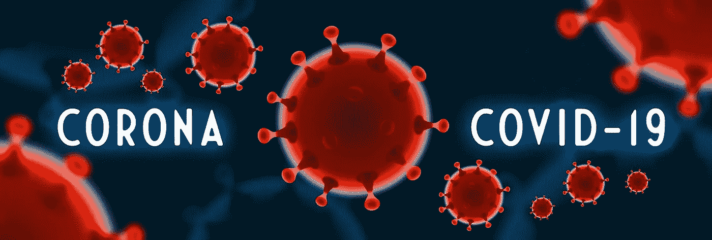
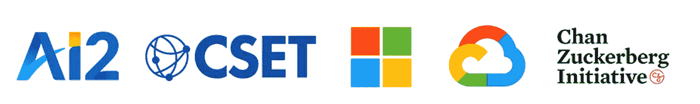
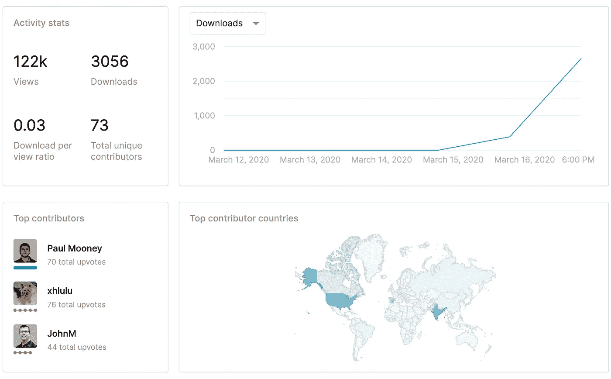

# Kaggle 发布了 CORD-19——新冠肺炎上的人工智能挑战

> 原文：<https://towardsdatascience.com/kaggle-released-cord-19-an-ai-challenge-on-the-covid-19-50d657378ff4?source=collection_archive---------26----------------------->

图片来自 [Pixabay](https://pixabay.com/?utm_source=link-attribution&utm_medium=referral&utm_campaign=image&utm_content=4930541) 的 [Vektor Kunst](https://pixabay.com/users/iXimus-2352783/?utm_source=link-attribution&utm_medium=referral&utm_campaign=image&utm_content=4930541)

## 找出人工智能在这场国际危机中可以帮助解决的关键任务。

由新型冠状病毒(即新型冠状病毒)引起的冠状病毒疾病 2019，通常缩写为新冠肺炎，在过去 3 个月里已经成为疫情，蔓延到国际上超过 100 个地方，包括许多欧洲国家和美国。截至今天(2020 年 3 月 17 日)，美国有超过 4000 例病例和 75 例死亡，预计这些数字在接下来的一周左右会上升，使这种呼吸系统疾病的预防和治疗成为国家层面的首要任务。

为了帮助解决这个问题，来自领先人工智能研究所的研究人员和领导者，包括[艾伦人工智能研究所](https://allenai.org/)和[微软](https://www.microsoft.com/en-us/)，以及联邦政府机构(即[国家医学图书馆](https://www.nlm.nih.gov/))进行了广泛的合作，结果发布了关于新冠肺炎、新型冠状病毒和其他种类冠状病毒的学术文献的新冠肺炎开放研究数据集(CORD-19)。

CORD-19 数据组件的主要合作者

## Kaggle & CORD-19

这个数据集可以在 Kaggle 的网站上找到，任何人工智能研究人员都可以通过下面的链接公开访问。人工智能领域的研究人员不会对 Kaggle 感到陌生——这是一个由数据科学家和机器学习研究人员组成的在线社区。

 [## 新冠肺炎开放研究数据集挑战(CORD-19)

### AI2 大学、CZI 大学、MSR 大学、乔治城大学、美国国家卫生研究院和白宫的人工智能挑战

www.kaggle.com](https://www.kaggle.com/allen-institute-for-ai/CORD-19-research-challenge) 

作为谷歌公司的一部分，Kaggle 因组织各种机器学习和数据科学挑战而闻名，包括当前的一项——新冠肺炎开放研究数据集挑战，或简称为 CORD-19 挑战。

CORD-19 数据集包含**超过 29，000 篇文章，其中 13，000 篇有全文**。所有这些文章都与冠状病毒的研究有关，如病例报告、传播途径、环境因素和治疗策略探索。然而，并非所有这些文章都不是机器可读的，因此很难利用人工智能工具来提取有用的信息，以帮助我们抗击这种传染病。

幸运的是，艾伦人工智能研究所的研究人员努力工作，帮助人工智能研究人员将这一庞大文献的内容转化为机器可读的形式*，这使得使用机器学习方法进行数据和文本挖掘成为可能。*

## *关键科学问题*

*美国 [NASEM](https://www.nationalacademies.org/) 和世卫组织的新兴传染病和 21 世纪健康威胁常设委员会确定了应对这场国际危机至关重要的 10 个科学问题。*

*这些问题包括研究病毒的传播和潜伏，感染新冠肺炎的风险因素，病毒的起源，以及治疗这种疾病的正确医疗方法。*

*挑战任务的完整列表可以在 Kaggle 的网站上找到。*

*每项任务的获胜者将获得 1000 美元的奖金。获胜的提交材料是根据评估标准得分最高的材料。*

## *结束语*

*这个 CORD-19 已经吸引了 122，000 次浏览和超过 3，000 次下载。70 多名研究人员为这一挑战做出了贡献。尤其是最新的日下载量已经超过 2000。*

*我希望更多的人工智能研究人员能够帮助应对这一挑战。*

**

*CORD-19 挑战的当前活动*