# SQL 中的巨大竞争

> 原文：<https://towardsdatascience.com/kaggle-titanic-competition-in-sql-78ae3cd551ce?source=collection_archive---------42----------------------->

## 探索性数据分析和特征工程


# 介绍

没有什么比通过简单的行动来学习新的东西或使一项技能更上一层楼更强大的了。在本文中，我将使用 SQL (Postgres)进行探索性分析，并为我的机器学习模型创建一个转换后的特征训练集。

虽然 Python 或 R 是当前数据科学和机器学习的事实语言，但拥有 SQL 的坚实基础有时会帮助您更快地迭代，并允许您快速浏览您的数据。归根结底，我们处理的大部分数据都存在于关系数据库中。能够流畅地编写 SQL 查询将允许您轻松地处理数据，并快速开始您的分析。

# 目标

虽然 Python 将是我的首选方法，但我想看看我是否能在 SQL 中完成所有的探索性分析和特性工程。我的目标是展示 SQL 对于一个人的工作流是多么强大和补充。尽管 SQL 的一个明显限制是数据的本地可视化能力，但是您仍然可以通过快速编写查询和输出结果来获得巨大的收益。我们开始吧！

# 我的设置

*   macOS Mojave 版本 10.14.6
*   PostgreSQL 12.2
*   [pgAdmin 4.21](http://www.pgadmin.org) (SQL web 查询工具)
*   [psql](https://www.postgresql.org/docs/12/app-psql.html) (终端访问数据库和表格)

在我的后续文章中，我用 Python 完成了我的监督分类模型，并分享了我在 Kaggle 的公共领导力板上获得的最高分。[看看这里！](https://medium.com/@dolee_12121/kaggle-titanic-competition-model-building-tuning-in-python-12f4f74436b5)

[](/kaggle-titanic-competition-model-building-tuning-in-python-12f4f74436b5) [## Kaggle 泰坦尼克号竞赛:Python 中的模型构建和调优

### 最佳拟合模型、特征和排列重要性以及超参数调整

towardsdatascience.com](/kaggle-titanic-competition-model-building-tuning-in-python-12f4f74436b5) 

# 探测

我对泰坦尼克号沉没的研究表明，在运送乘客上救生艇时，妇女和儿童比其他人更优先。这个概念将在我如何分组和分析 Kaggle 数据集的过程中发挥重要作用。

此外,[还讨论了](https://www.kaggle.com/c/titanic/discussion/177536)是将训练和测试数据集分开，还是将它们结合起来用于特征工程和选择。在大多数情况下，前者有助于避免数据泄露。

通常的做法是将测试数据集放在一边，忘记它，只使用训练数据集来估算和设计特征。对于这个练习，我决定将训练和测试结合起来，这样我就有更多的数据来预测存活率。这是一个固定的宇宙，我们不期望新的数据流入预测管道。

首先，我从 Kaggle 下载了 train.csv 和 test.csv 文件，并将这些文件导入到我在 Postgres 数据库中创建的两个表中。接下来，我将这两个表结合起来，创建了我的第一个工作表(titanic_train_test_raw)。

为了将记录插入到我的表中，我在终端上通过键入“ *psql postgres”打开 psql。*这是 PostgreSQL 命令行工具。我运行了以下两个 psql 复制命令，将 CSV 文件插入到我的表中。

```
\copy titanic_train_raw from ‘file/path/train.csv’ delimiter ‘,’ csv HEADER;\copy titanic_test_raw from ‘file/path/test.csv’ delimiter ‘,’ csv HEADER;
```

为了更好地理解数据，我计算了训练集中每个可用特性的 survival_rate。我没有在这里分享整个输出，因为我将在整篇文章中一点一点地分享它们。然而，这让我对哪些特性值得深入挖掘，以及每个特性的相对重要性有了一个清晰的认识。

**1。缺失值**

让我们更仔细地看看丢失的值，看看哪些潜在的特性需要估计，或者由于稀疏性而被丢弃。缺失值的计算是通过组合训练和测试数据来完成的。因为测试数据没有幸存目标特征，所以组合的幸存列有 31.93%的值缺失。还有年龄、舱位、票价、上船分别少了 20.09%、77.46%、0.08%、0.15%。

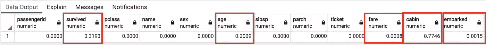

**2。总体存活率**

从训练数据集中，我计算了存活百分比和未存活百分比。在训练数据中的 891 名乘客中，只有 38.38%的人幸存。此外，这个分析让我看到目标类并不是太不平衡——大约是 60%/40%的比例。

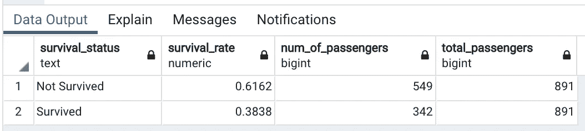

**3。按性别和年龄分列的存活率**

与男性乘客相比，女性乘客生还的可能性最高。仅从性别来看，培训数据告诉我们，女性的存活率约为 74.2%，而男性为 18.89%。

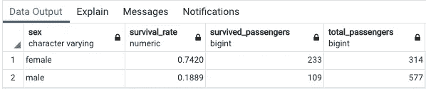

使用纯 SQL，我创建了 10 个 bin(age _ cohort)来对不同的年龄进行分组。我不打算对年龄组进行任何精确的划分，因此容器的数量是任意的，但是创建足够多的容器来查看相关的模式。最关键的信息之一从这个观点中浮现出来。虽然在所有年龄组中女性的存活率仍然很高，但 9 岁或更小的男性的存活率接近 60%(数据输出中的第 9 行)。单就性别而言，男性的存活率低于 20%，但通过对年龄组的数据进行切片，我们看到男性的一个亚组具有相对较高的存活率——儿童。

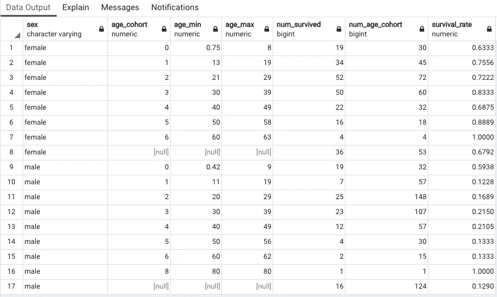

**4。按票价和每位乘客的平均票价生存**

为了快速了解与生存相关的票价，我使用了一个窗口函数，将乘客平均分成 6 个箱，并创建了统计数据以进行更仔细的检查。这是一种快速且不实用的宁滨方法，因为相同的票价金额可能会落入不同的箱中，如 fare_min 和 fare_max 所示。

乍一看，随着票价变得更贵，存活率似乎会上升。与此同时，fare_mean 和 fare_stddev 从 bin 5 跳到 bin 6。最高的 fare_max 价格为 512.3292 美元，最低的 fare_min 价格为 0 美元。票价栏有些杂音。持续持有的是，女性存活率远高于男性。基于 fare_grouping 属性，女性存活率比男性高 2 倍—9 倍(survival_ratio)。

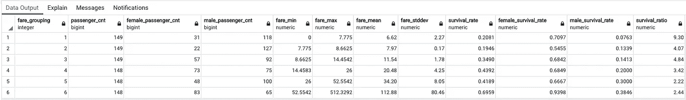

我很快发现票价代表的是机票的总成本，而不是每位乘客的票价。比如机票 PC 17755，有四个乘客。卡德扎是一个富裕的家庭，和他们的两个雇员沃德小姐和勒苏雷先生一起乘坐头等舱旅行。

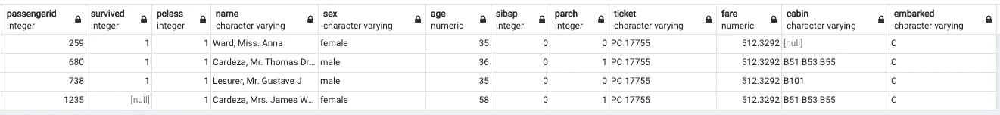

为了了解每张机票的成本，我用每张机票上的乘客总数除以票价金额，并按 Pclass 对平均值进行分组。在检查票证功能时，我看到了家庭、混合组和附加到单个票证的个人。因此，使用每张机票上的乘客人数产生了较小的标准差，并给了我信心，这将提供相对更准确的每位乘客的平均票价，而不是使用其他 Kaggle 人常用的[SibSp(兄弟姐妹和配偶)+ ParCh(父母和子女)+ 1 (PassengerId)]。

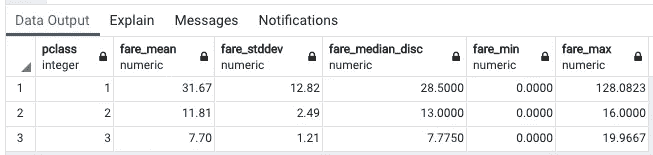

平均而言，头等舱每位乘客的票价约为 32 美元，二等舱约为 12 美元，三等舱约为 8 美元。这种平均去除了原始票价特征中的相当多的噪声。并且 fare_mean 看起来与 Pclass 高度相关。因此，Pclass 和 fare_per_passenger 这两个特性可能是多余的。稍后，我们可能希望在模型构建期间删除其中的一个。

**5。基于来自原始名称特征的标题的生存**

有 17 个独一无二的称号，有的存活率很高；然而，大多数都不常见。训练数据中只有两个乘客的标题是少校，一个乘客的标题是 Sir。为了使每个分组对建模具有相关性和影响力，我将不常用的头衔分成四类——先生、夫人、小姐和主人——从而创建了一个 title_grouping 特性。比如 Mlle，是 Mademoiselle 的缩写，卷成 Miss。

题主之所以有意思，是因为它的存活率比较高，而且在训练数据中也有不少。在此期间，男孩被授予这一头衔，直到他们成年。现在我们有了一种方法，当所有的女孩和女人都被归入“夫人”或“小姐”时，我们可以使用“头衔分组”来识别男孩。

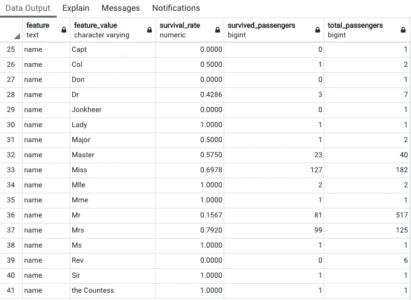

我按每个标题 _ 分组计算了存活率，数字很能说明问题。通过把男孩从男性群体中分离出来，男性的存活率下降了。相比之下，男生的存活率将近 60%。在最终的训练数据集准备工作中，我将把这个特性编码成数值。

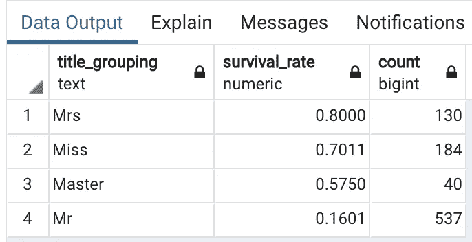

**6。基于是女人还是孩子的生存**

我偶然看到克里斯·德奥特的[文章](https://www.kaggle.com/cdeotte/titanic-using-name-only-0-81818)，是关于他基于用姓氏和头衔对乘客进行分组而创建的一个名为“女人-孩子-团体”的功能。本质上，它关注的是群体生存。考虑到这一点，我创建了一个二元特征来标记每位乘客是男是女。is_woman_child = 1 表示所有妇女和儿童，而 is_woman_child = 0 表示所有成年男子。对于 title_grouping 来说，这个标志可能是多余的，并且可能导致模型过拟合，但是让我们看看这是如何实现的。

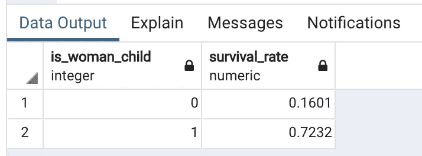

**7。基于舱室水平面(又名甲板)的生存**

我为此做的一些读数显示，大多数三等舱乘客位于 F 和 g 舱层。因此，更仔细地查看客舱层是有意义的，尽管 77%的值丢失了。我假设较低的客舱高度会降低乘客的生还几率。


[RMS*泰坦尼克号*船中部](https://commons.wikimedia.org/wiki/File:Titanic_cutaway_diagram.png)剖面图

在做了一些分析后，我观察到当乘客属于较低阶层和较低客舱等级时，存活率会下降。我使用 Pclass 和 apollowed 创建了一个逻辑来近似每个乘客的客舱级别，我将在特性工程部分对此进行更深入的探讨。

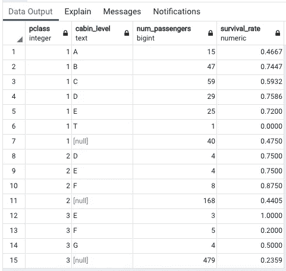

单独着手不会告诉你一个生存的故事，如下所示，但我相信它可以用来创建新的功能，将具有相对更高的预测能力。泰坦尼克号最初停靠在英国的南汉普顿，然后前往法国的瑟堡。最后，在驶往纽约之前，在爱尔兰的皇后镇停留。

> 顺便提一下，有两名乘客丢失了上船值，但我查找了这些乘客，他们都在英格兰的南汉普顿登船。

我假设登船位置和船舱所在的甲板(船舱级别)之间存在关联。换句话说，每个登机地点都有一组特定的客舱，并且有某种组织形式，根据登机地点，客舱将首先被填满。因此，举例来说，如果你有一张以 F 开头的三等舱船票，F 代表船舱所在的甲板，你最有可能从英国的南汉普顿登船。

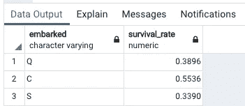

# 特征转换和工程

现在，我已经了解了原始的训练特征，并对乘客存活率有了更好的了解，是时候巩固我们的发现，并开始整合优化的训练数据集以进行模型拟合了。

**1。is _ one _ family/is _ mix _ group/is _ alone**

**假设:**我假设同一个票号定义了一起出行的乘客。此外，我还假设，如果一个人是一张机票上的唯一乘客，那么这个乘客就是一个单独的旅行者，同时可能有其他家庭成员或亲戚乘坐不同的机票旅行。因此，我根据从原始姓名特征中提取的票号和姓氏对乘客进行分组。

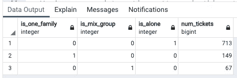

这种假设是有代价的，但是我假设这包含了大多数的团队场景。以这种方式划分组的主要目的是概括船上的人口。

*   如果给定的机票有多个乘客的单个姓氏，则认为是一个家庭，其中 1 为真，0 为假(is_one_family)。这主要是为了标记一起旅行的家庭。因此，如果乘客是单个机票系列的一部分，则该标志被标记为 1。
*   如果给定的机票有多个姓氏和多个乘客，这将被标记为混合组(is_mix_group)。例如，票号 1601 有 7 个不同的姓氏。总共有 67 张票附有两个或两个以上的姓氏。我这里只展示前 12 名的门票。

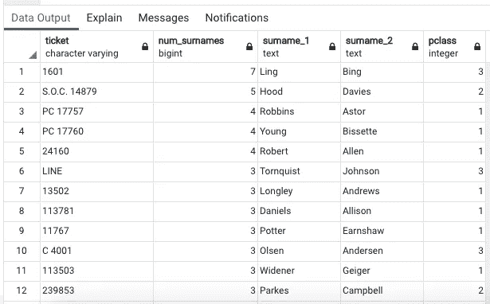

*   如果给定的机票只有一个姓和一个乘客，这是一个单独旅行的乘客(is_alone)。仔细看看男性人口，单独旅行的成年男性乘客的存活率最低(15.57%)，相比之下，有家庭的成年男性(17.46%)和有家庭的男孩(57.5%)。

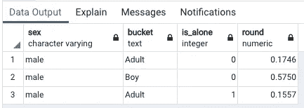

一眼看去，没有家庭或属于混合群体的成年男性乘客生还几率最低。我们确实在这个输出中看到了一些有趣的模式。和家人一起旅行的男性乘客存活率最高。最有可能的是，这些男性乘客是男孩。下面我来验证一下。

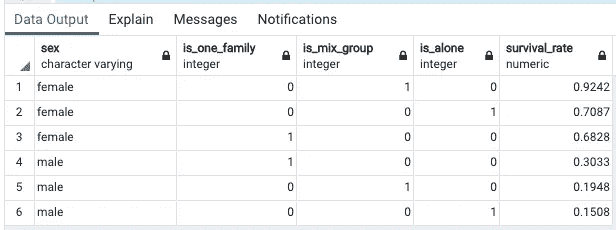

当我把男孩从男性人口中分离出来时，情况就清楚多了。男孩的存活率比成年男子高。

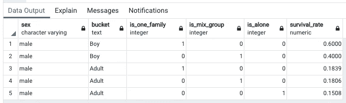

**2。家庭规模**

为了确定每个乘客的家庭规模，添加 SibSp、ParCh 和当前乘客(+1)是合乎逻辑的。然而，根据机票号码和姓氏来确定最大家庭规模比在乘客层面定义更有意义。

我坚持家庭一起旅行的假设，在这种情况下，在同一张机票上。因此，SibSp、ParCh 和 current passenger 的总和(表示家庭规模)与一个票号和姓氏相匹配。我创建了一个映射 SQL 子查询，其中如果您有相同的机票号码和姓氏，那么家庭规模(SibSp + ParCh + 1)将被映射到乘客。

一旦把逻辑放在一起，我就按照家庭规模和 Pclass 来看平均存活率。相对较大的家庭存活率较低。可以大致推断，如果你是一个大家庭的一员，你就死了。还有，你一个人就死了。由于四人或四人以上的机票屈指可数，很难一概而论大团体的生存。然而，根据现有的数据，值得看看家庭规模在预测存活率方面是否有一定的相对重要性。

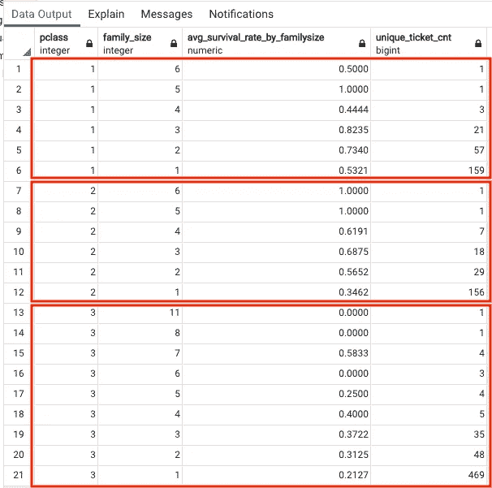

**3。建立第一个合并特征表:titanic_train_test_raw_v2**

我现在正在整理我的第一个基于以上所有发现的合并表。在这一步中，我将加入新的特性并转换现有的特性，以便更好地使用模型。以下是所有新增内容和增强功能的列表。

*   将性别特征编码为女性= 1，男性= 0
*   从姓名特征中提取姓氏
*   添加标题分组功能，我在前面分享过
*   添加 is_woman_child 要素
*   从客舱特征中提取客舱级别(甲板)
*   将装载特征编码为 S = 0，C = 1，Q = 2
*   添加基于票号和姓氏的 family_size 特征
*   添加 is_one_family、is_mix_group 和 is_alone 特征
*   通过将票价除以在每张票上找到的乘客 Id 的数量，添加 fare_per_passenger 功能

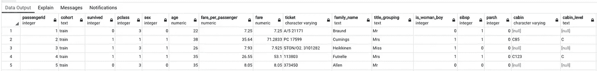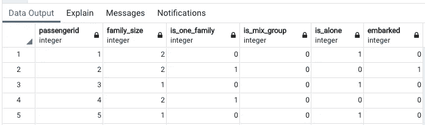

**4。建立第二个合并特征表:titanic_train_test_raw_v3**

使用前面创建的一些特性，我创建了第二个统一表(v3 ),以添加更多特性并进行额外的更改。在使用 SQL 时，最好以这种方式构建多个表，因为它有助于保持事物的有序性，并通过使用更小的块使 SQL 更具可读性。

*   **年龄缺失值:**填写缺失的年龄值(第 11 行&第 44–52 行)。我按照 Pclass、性别和 title_grouping 对数据进行分组，计算每个分组的平均年龄。我选择了平均值，而不是中间值，因为两组数字是相似的。我还计算了平均值的标准差来检查可变性。
*   另外，我创建了一个名为 Age_bucket 的特性(第 12 行)。我决定将连续的年龄变量放入 7 个容器中。由于年龄要素包含估计平均值，因此最好将其转换为分类要素，以最大限度地减少连续要素中的噪声。
*   **Fare_bucket &票价缺失值:**在我的探索性分析中，我计算了每个乘客每个舱位等级的平均票价，很明显，价格与舱位等级密切相关。我用与每个乘客的 Pclass 相关联的 fare_per_passenger 来填充缺失的票价值。同时，我创建了 5 个箱来创建分类特征。
*   **Title_grouping:** 该特性中的四个文本字符串标签被转换为数值。(主机= 0，夫人= 1，小姐= 2，先生= 3)
*   **Cabin_level&Cabin level missing values:**我填充缺失的 cabin_level 值的方法是通过 Pclass、Embarked 和 Cabin _ level(其中 Cabin 不为空)来计算所有乘客。接下来，我将附属于 Pclass、Embarked 和 cabin_level 的乘客数量按降序排列，对于 Pclass + Embarked 的每个组合，我将抓取附属于它的乘客数量最高的 cabin_level。

这是构建 titanic_train_test_raw_v3 表的子查询。

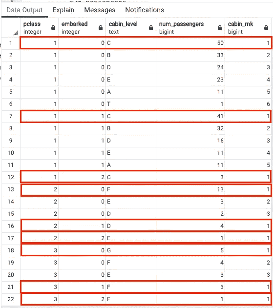

*如果 Pclass = 1，apolled = 0，那么 cabin_level = C.*

*如果 Pclass = 1 且 Embarked = 1，则 cabin _ level = c。*

*如果 Pclass = 1，apolled = 2，那么 cabin _ level = c。*

*如果 Pclass = 2 且 Embarked = 0，则 cabin _ level = f。*

*如果 Pclass = 3 且 Embarked = 0，则 cabin _ level = g。*

*以此类推！*

**5。构建“妇女-儿童-群体”修改逻辑**

我继续尝试用 SQL 做一些修改来重新创建克里斯·德奥特的特征。我将回顾我所做的，在我的后续文章中，我将测试该特性的影响和重要性。

*   首先，每个乘客的头衔被标为男人、女人或男孩。与此同时，所有男性头衔都被贴上了“非群体”的标签，因为女性和儿童被赋予了生存的优先权。
*   接下来，我计算了每个乘客的姓氏频率。此频率查看整个数据集，而不是票证级别。并且任何姓氏频率为 1 或更少的乘客(如果有的话)被标记为“noGroup”因此，家庭中的妇女和儿童优先于独自旅行的妇女。
*   在这个阶段，基于更新的姓氏特征，使用训练数据的幸存目标特征来计算幸存概率。在这一点上，大多数姓氏已经改变为“noGroup”，因此，所有乘客的生存将使用这个更新的姓氏特征来概括。

*   最后，使用标题和姓氏 _ 生存，我创建了一个新的二进制标志，标题 _ 姓氏 _ 生存。当最终的训练和测试数据集被创建时，这个逻辑被合并。我创建了两个表来捕捉每一个——titanic _ train _ ml _ features _ v 0 和 titanic_test_ml_features_v0。

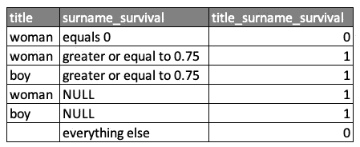

*   ML 训练数据集:titanic_train_ml_features_v0

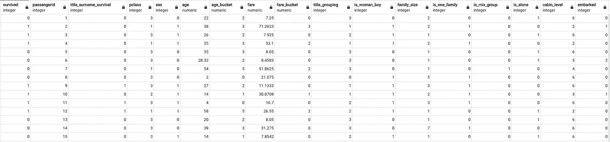

*   ML 测试数据集:titanic_test_ml_features_v0(与训练数据集相同，只是缺少幸存特征。)

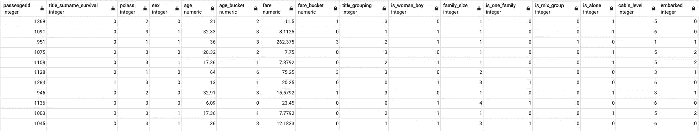

# 摘要

这篇文章提供了相当多的信息。我使用纯 SQL 进行了探索性分析和特性工程。我利用 GROUP BY、窗口函数、聚合函数、子查询、WITH 子句、HAVING 子句和其他 SQL 技术来分割数据。


约书亚·阿拉贡在 [Unsplash](https://unsplash.com?utm_source=medium&utm_medium=referral) 上拍摄的照片

下一步是导出最终的训练和测试数据集，以便使用 Python 进行分析。在我的后续文章中，我将使用 Python 测试不同的 ML 模型，了解特性的重要性，并使用 RandomizedSearchCV 和 GridSearchCV 调优所选的模型。最后，我会将我的预测提交给 Kaggle，看看我在其他条目中的排名如何！

## 以下是我在后续文章中所涉及内容的概述:

> [标题:《Kaggle 泰坦尼克号大赛:模型搭建&Python 中的调优】](https://medium.com/@dolee_12121/kaggle-titanic-competition-model-building-tuning-in-python-12f4f74436b5)

*   导入库
*   准备训练和测试数据帧
*   相关系数矩阵
*   创建辅助函数:输出模型统计信息
*   多重拟合模型和最佳拟合模型
*   创建助手功能:输出 RF 特征重要性排序
*   具有随机森林特征重要性、排列重要性和层次聚类的特征选择
*   随机森林分类器
*   GridSearchCV:随机森林分类器
*   结论:最新结果和最终想法

如果您有任何问题、意见或反馈，请告诉我。谢谢！