# Kaggle 泰坦尼克号竞赛:Python 中的模型构建和调优

> 原文：<https://towardsdatascience.com/kaggle-titanic-competition-model-building-tuning-in-python-12f4f74436b5?source=collection_archive---------24----------------------->

## 最佳拟合模型、特征和排列重要性以及超参数调整


保罗·比昂迪在 [Unsplash](https://unsplash.com?utm_source=medium&utm_medium=referral) 上的照片

# 背景

我用 SQL 进行了初步的探索性分析和特性工程。在我的上一篇文章中，我展示了 SQL 在研究关系数据库中的数据时是多么强大。对于更多的上下文，可能值得在阅读本文之前检查一下，尽管这不是必需的。你可以在这里找到文章！

[](/kaggle-titanic-competition-in-sql-78ae3cd551ce) [## SQL 中的巨大竞争

### 探索性数据分析和特征工程

towardsdatascience.com](/kaggle-titanic-competition-in-sql-78ae3cd551ce) 

我将使用之前在*“Kaggle Titanic Competition in SQL”*文章中准备的训练/测试数据集来预测乘客存活率。

# 概观

*   导入库
*   准备训练和测试数据帧
*   相关系数矩阵
*   创建辅助函数:输出模型统计信息
*   多重拟合模型和最佳拟合模型
*   创建助手功能:输出 RF 特征重要性排序
*   具有随机森林特征重要性、排列重要性和层次聚类的特征选择
*   随机森林分类器
*   GridSearchCV:随机森林分类器
*   结论:最新结果和最终想法

# 导入库

```
import numpy as np 
import pandas as pd
import seaborn as sns
import matplotlib.pyplot as plt
%matplotlib inlinefrom sklearn.linear_model import LogisticRegression
from sklearn.ensemble import RandomForestClassifier
from sklearn.linear_model import Perceptron
from sklearn.linear_model import SGDClassifier
from sklearn.tree import DecisionTreeClassifier
from sklearn.neighbors import KNeighborsClassifier
from sklearn.svm import SVC, LinearSVC
from sklearn.naive_bayes import GaussianNBfrom sklearn.pipeline import make_pipeline
from sklearn.preprocessing import StandardScaler
from sklearn.model_selection import RandomizedSearchCV, GridSearchCV
from sklearn.model_selection import cross_val_score
from sklearn.model_selection import cross_val_predict
from sklearn.metrics import confusion_matrix
from sklearn.metrics import precision_score, recall_score, roc_auc_score
```

# 准备培训和测试数据帧

使用 Pandas，我将 CSV 文件作为数据帧导入。如果你读过我的“[*Kaggle Titanic Competition in SQL*](https://medium.com/@dolee_12121/kaggle-titanic-competition-in-sql-78ae3cd551ce)”一文，train_df.info()的结果集应该看起来很熟悉。对于模型训练，我从 15 个特征开始，如下所示，不包括 Survived 和 PassengerId。

```
train_df = pd.read_csv(‘file/path/data-train.csv’)
test_df = pd.read_csv(‘file/path/data-test.csv’)
```

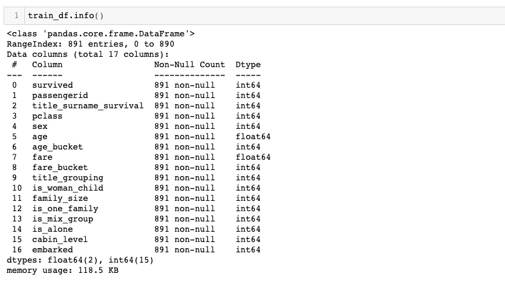

# 相关系数矩阵

作为第一步，我使用 Pandas 和 Seaborn 中内置的 [corr 函数](https://pandas.pydata.org/pandas-docs/stable/reference/api/pandas.DataFrame.corr.html)创建了一个成对相关矩阵来可视化数据。它以默认方法计算*皮尔逊* *相关系数*(线性关系)。我还使用了 *Spearman* 和 *Kendall* 方法，这两种方法在 pandas.DataFrame.corr 中都有

所有的结果看起来都差不多。相对而言， [*斯皮尔曼的* *等级-顺序相关性*](https://en.wikipedia.org/wiki/Spearman%27s_rank_correlation_coefficient) 方法，其测量单调关系，在这里可能是最好的，而无需深入研究不同类型特征的相关性和关联性的概念。一个警告是, *Spearman* 将把名词性特征视为序数特征。

只是作为一个旁注，在这一点上，我所有的特征都已经转化为由二进制(二分法)、序数(分类和有序)、名词性(分类和不有序)和连续特征组成的数值。我想快速了解哪些特征是相互关联的，以及明显特征之外的重要程度。

如果我要更深入地探究这个练习的细节，那么我们还需要讨论分类特征之间的关联以及二元和连续特征之间的相关性。在测量两个标称特征之间的关联时，我们将不得不深入到 [*克莱姆氏 V*](https://en.wikipedia.org/wiki/Cram%C3%A9r%27s_V) 或*皮尔森的* *卡方检验*。然而，在我看来，这应该是获得初始基线读数的足够好的方法。如果我错过了什么，请随时告诉我。


你可以在这里找到[。](https://pandas.pydata.org/pandas-docs/stable/reference/api/pandas.DataFrame.corr.html)

我生成了相关系数热图，并注意了 0.8 到 1.0 相关范围内的绝对值。这些相关性阈值是任意的，稍后我将查看各种阈值来确定什么最有效。

```
train_corr = train_df.drop(columns=["survived", "passengerid"]).corr(method='pearson')
plt.figure(figsize=(18, 12))
sns.set(font_scale=1.4)
sns.heatmap(train_corr, 
            annot=True, 
            linecolor='white', 
            linewidth=0.5, 
            cmap='magma');
```


皮尔逊

在使用 0.8 作为我的皮尔逊相关阈值对这些数字进行深入研究后，我发现了这些对(如下所示；df_corr 的输出)是高度相关的。稍后，我将利用 Spearman 和其他方法为我的最终模型选择重要的特性。

```
# Pearson’s correlation analysis using an arbitrary correlation threshold (absolute values)corr_threshold = 0.8
train_corr_abs = train_corr.abs()feature_1 = []
feature_2 = []
corr_coeff = []
for col in train_corr_abs:
    for idx, val in enumerate(train_corr_abs[col]):
        if ((val >= corr_threshold) and (val < 1)):
            feature_1.append(col)
            feature_2.append(train_corr_abs[col].index[idx])
            corr_coeff.append(val)df_corr = pd.DataFrame({‘feature_1’: feature_1, 
                        ‘feature_2’: feature_2, 
                        ‘corr_coeff’: corr_coeff})
df_corr
```

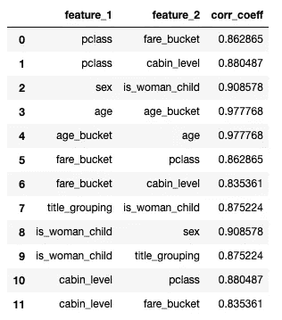

来自 df_corr 的结果；输出包含重复项。

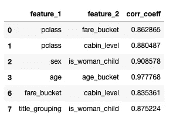

重复项被删除，剩下六个高度相关的配对。

识别出高度相关的对后，这种分析将有助于以后处理任何回归或线性模型。高度多重共线性会导致要素或系数估计值对模型中的微小变化变得敏感。这也会影响[非线性模型](https://scikit-learn.org/stable/auto_examples/inspection/plot_permutation_importance_multicollinear.html)。

底线是多重共线性特征可能会创建一个无效的模型，并且对特征重要性的理解可能会有偏差。我不打算把精力放在具有轻度多重共线性的配对上。现在，我将暂时搁置这个问题，到时候再直接解决这个问题。

```
train_corr = train_df.train_df.drop(columns=["survived",       "passengerid"]).corr(method='spearman')
plt.figure(figsize=(18, 12))
sns.set(font_scale=1.4)
sns.heatmap(train_corr, 
            annot=True, 
            linecolor=’white’, 
            linewidths=0.5, 
            cmap=’magma’)
```


斯皮尔曼

```
train_corr = train_df.drop(columns=["survived", "passengerid"]).corr(method='kendall')
plt.figure(figsize=(18, 12))
sns.set(font_scale=1.4)
sns.heatmap(train_corr, 
            annot=True, 
            linecolor=’white’, 
            linewidths=0.5, 
            cmap=’magma’)
```

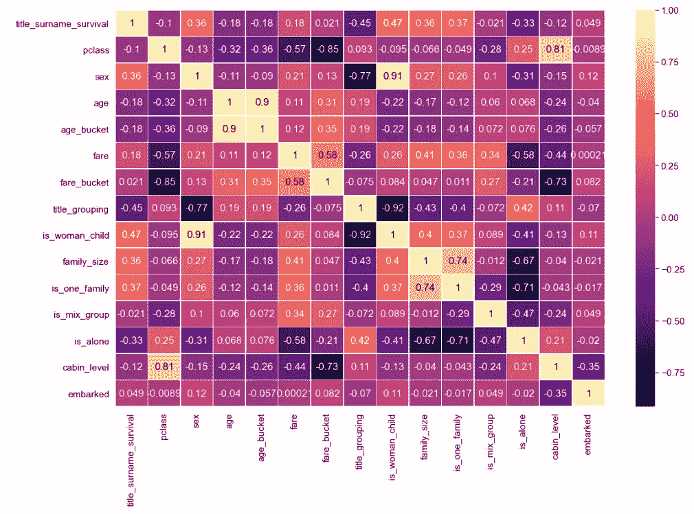

肯德尔

# 创建辅助函数:输出模型统计信息

首先，我通过拟合 X_train 和 y_train 来训练九个不同的模型。为了加快我的工作流程，我创建了一个输出模型性能和诊断指标的函数，以快速查看数字并确定哪个模型可能工作得最好。这些度量在函数的 docstring 中列出。

此外，我定义了一个管道对象(下面的第 27 行),其中包含一个缩放器和一个估算器的实例。在使用随机森林的少数情况下，我不会缩放 X_train 和 X_test，因为没有必要这样做。

# 多重拟合模型和最佳拟合模型

助手函数有三个参数。首先，它需要一个字典，将模型的名称(字符串)作为键，将模型类实例化作为值。其次，它需要特征训练数据集(X_train ),最后需要目标类数据(y_train)。让我们检查结果！

随即，随机森林和决策树以 98.54%的准确率脱颖而出。我知道决策树倾向于过度拟合，所以我并不太惊讶。另一方面，随机森林是决策树的集合，旨在通过采用要素和行的随机子集来创建决策树森林并对预测结果进行投票，从而最大限度地减少过度拟合。这个随机过程产生了一个更好的模型，具有更高的偏差和更低的方差。

仔细观察，使用 Kfold 为 10 的交叉验证的准确性分数对于随机森林和决策树产生了 84.07%和 81.3%的更真实的分数。其他脱颖而出的模型还有 KNN、SVM、逻辑回归和线性 SVC，都获得了可观的分数。高标准偏差表明模型可能无法用新数据很好地概括，所以我也注意到了这一点。

让我们仔细看看精度和召回。在这种情况下，最大限度地提高精确度和召回率是有意义的，F1 的高分就表明了这一点。虽然有一个精度-召回权衡，相对较高的精度[TP/(TP+FP)]给了我正面预测的准确性。相比之下，相对较高的召回率[TP/(TP+FN)]给出了模型正确检测到的实际阳性率的%。回忆也称为真阳性率(TPR)和敏感度。此外，我想要 ROC 曲线下的高 AUC。结果，我把列表缩小到四个模型——随机森林、KNN、逻辑回归和线性 SVC。

最终，我选择了 random forest，尽管其他模型的分数稍好一些。在我看来，这些细微的差别可以忽略不计。目标是在特征选择过程中利用随机森林的基于杂质的特征重要性和排列重要性。


# 创建助手功能:输出 RF 特征重要性排序

为了使用随机森林快速输出特性重要性排序，我创建了一个助手函数来完成这项工作。它输出一个 Pandas 数据框，其中包含按等级顺序排列的要素名称及其对应的要素重要性分数。

# 具有 RF 特征重要性、排列重要性和层次聚类的特征选择

## **迭代 1**

回到相关系数矩阵，有五对标记为高度相关或彼此关联。使用 X_train 和 X_test 定义的所有特性，如下所示，我检查了 RF 的特性和排列重要性的结果。我还使用了层次聚类和 Spearman 的相关矩阵来辅助特征选择。

```
X_train = train_df.drop([“survived”, “passengerid”], axis=1)
y_train = train_df[“survived”]
X_test = test_df.drop([“passengerid”], axis=1)rf_base = RandomForestClassifier(n_estimators=100, random_state=0)
rf_base.fit(X_train, y_train)n = len(X_train.columns)
importance_scores = rf_base.feature_importances_
rf_feature_ranking(n, importance_scores)
```

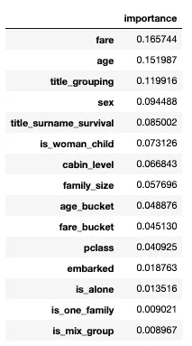

随机森林特征重要性

RF 的特性重要性是衡量什么特性是重要的一个坚实的开端，但并不总是给出一个明确的重要性视图，并且可能会产生误导。RF 特征重要性的潜在机制是有偏差的。它往往高估了某些特征的重要性，例如连续或高基数分类特征。简而言之，对决策树森林中的每个特征的杂质减少进行平均，然后基于该平均值对特征进行排序。这里有一个好的[读](https://link.springer.com/article/10.1186/1471-2105-8-25)这个和[这个](https://explained.ai/rf-importance/)和[这个](https://stackoverflow.com/questions/15810339/how-are-feature-importances-in-randomforestclassifier-determined)！

共线特征也将是一个问题。因此，仅利用基于杂质的特征重要性的 RF 平均下降不会显示全貌，必须是更好地理解特征重要性的许多工具之一。

在这一点上，我关心的是共线特征。因此，我利用排列重要性和层次聚类来确定哪些特性是相关的。从概念上讲，在排列重要性中，它使用验证集计算要素的基线精度。接下来，它置换单个列/特征的所有值，并使用测试数据集测量相对于基线精度的变化。这将对每个特征重复。

在我的研究中，我在 Scikit-Learn 的[网站](https://scikit-learn.org/stable/auto_examples/inspection/plot_permutation_importance_multicollinear.html)上看到了一篇关于这个特定主题的内容丰富的文章。我将利用这里找到的代码，完成我的特性选择过程。此外，我将依靠*领域知识*和*引导试错法*来看看什么样的特性组合会有最好的结果。


排列重要性相对来说比特征重要性更可靠，尽管前者也会受到共线特征的影响，并会增大受影响特征的重要性。来自两个初始视图的一个令人满意的建议是，is_alone、is_mix_group 和 is_one_family 不会给模型增加太多价值。

对于层次聚类，树状图上的 y 轴代表接近度或相异度。随着它越来越接近 0，聚类特征之间的距离越来越近，表示相关性/关联性。在这次迭代中，我检查了所有低于 1.5 的聚类——这是一个任意的阈值。这里使用的代码块也可以在 S [cikit-Learn 的网站](https://scikit-learn.org/stable/auto_examples/inspection/plot_permutation_importance_multicollinear.html)上获得。

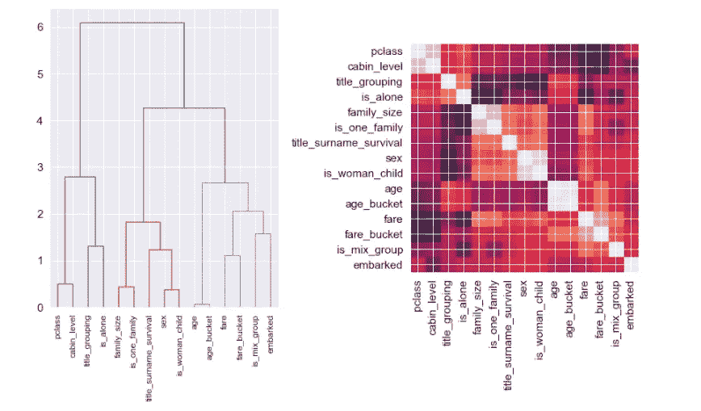

左边是树状图，右边是斯皮尔曼相关矩阵

使用树状图，我仔细观察了具有两个特性(例如，pclass 和 cabin_level)的较小集群，并试探性地确定了哪些特性可能需要删除。我决定放弃 age，因为它与 age_bucket 高度共线，是一个连续的特性。此外，我决定去掉 sex 和 fare，因为它们的相关特征对模型的贡献是一样的。因此，在下一次迭代中总共删除了 7 个特征——年龄、性别、票价、单身、组合和家庭

计算特征和排列重要性

生成层次聚类和 Spearman 相关矩阵

## 迭代 2

让我们来看看更新后的结果。在这个迭代中，我使用了 9 个特性，它们代表了新的 X_train 和 X_test。

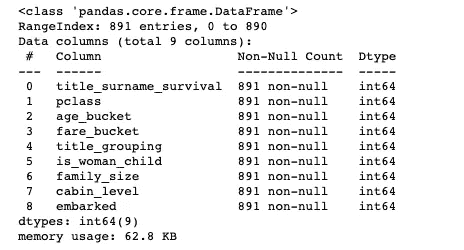

X_train.info()

我使用了 *output_model_stats* 函数来比较性能指标和原始随机森林指标。迭代 2 指标附加到“rf_base —迭代 2”索引。总的来说，该模型的性能比具有所有功能的模型稍差。最有可能的是，第一个随机森林模型是过度拟合的(相对较低的偏差和较高的方差),在此阶段不应引起关注。


记住 X_train 只包含 9 个特性，如上图。

基于更新的特征和排列重要性排序，apollowed 在两者中都非常接近于零。我决定在下一次迭代中放弃这个特性。

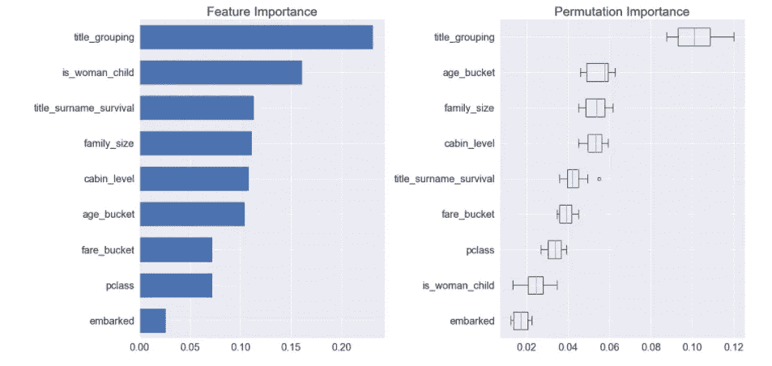

我决定放弃 fare_bucket 和 age_bucket。在我看来，用于创建票价桶的平均每位乘客票价计算很可能没有足够的数据来很好地概括，并且票价异常值在训练数据中挥之不去。

在使用排列重要性观察了 age_bucket 相对于 pclass 和 is_woman_child 的排名后，类似的逻辑思维落到了 age _ bucket 上。同时，fare_bucket 和 age_bucket 相互关联。我的直觉告诉我，保留这些特征最有可能减少偏差，增加方差。因此，模型的泛化能力会降低。

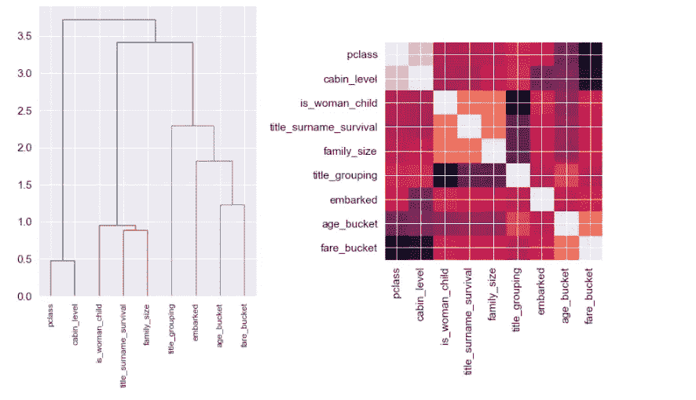

如树状图所示，0.5 下左起的第一个集群由 pclass 和 cabin_level 组成。pclass 和 cabin_level 之间的距离非常近，Spearman 的相关矩阵显示这些是相关的。我犹豫要不要放弃 pclass 或 is_woman_child，因为在我的探索性分析中，这两个特征都显示出与乘客存活率高度相关。

随机森林的[随机性](https://blog.datadive.net/selecting-good-features-part-iii-random-forests/#:~:text=Random%20forest%20feature%20importance,impurity%20and%20mean%20decrease%20accuracy.)创建根节点和分裂以创建内部节点和叶节点会减少共线要素的影响，但不会完全减少。在我看来，在这个使用随机森林的场景中同时使用这两个共线的特征并没有坏处。

## 迭代 3

在这个阶段，更新的 X_train 和 X_test 数据集包含 5 个特征，我推断这 5 个特征是最相关的。

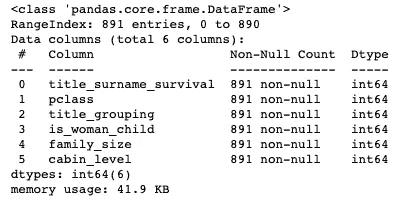

X_train.info()

接下来，我输出了性能指标(“rb_base —迭代 3”)，并将它们与早期的结果进行了比较。accuracy_cv_score 高于前两次迭代。精确度提高了很多，这意味着在模型检测到的所有阳性(TP + FP)中发现了更多的真阳性(TP)。这是一个好迹象。正如预期的那样，召回率略有下降，这意味着该模型在实际真阳性(TP + FN)中检测真阳性(TP)的能力有所下降。F1 评分从第 2 次迭代开始改善，ROC 曲线下的 AUC 上升至新高。


在仔细研究了特性重要性、排列重要性和 Spearman 相关矩阵的树状图之后，我决定用这些特性来生成我的第一个 Kaggle 提交文件。此时，我并不关心一对相关的特性。

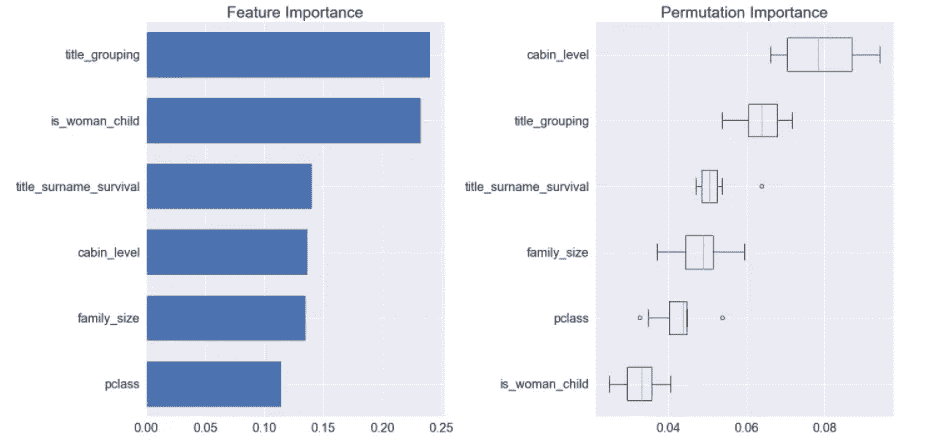

我用带 X_test 的训练好的模型输出预测的 y_test (y_pred_base)。我创建了我的提交文件，并提交给 Kaggle。我可以用这个提交获得 80.382%的准确率。我认为这是一个相当可观的分数。

```
rf_base = RandomForestClassifier(n_estimators=100, random_state=0)
rf_base.fit(X_train, y_train)
y_pred_base = rf_base.predict(X_test)df_output = pd.concat([test_df[‘passengerid’], y_pred_df], axis=1, sort=False)
df_output = df_output.rename(columns={“passengerid”: “PassengerId”})
df_output.to_csv(‘gender_submission.csv’, index=False)
```

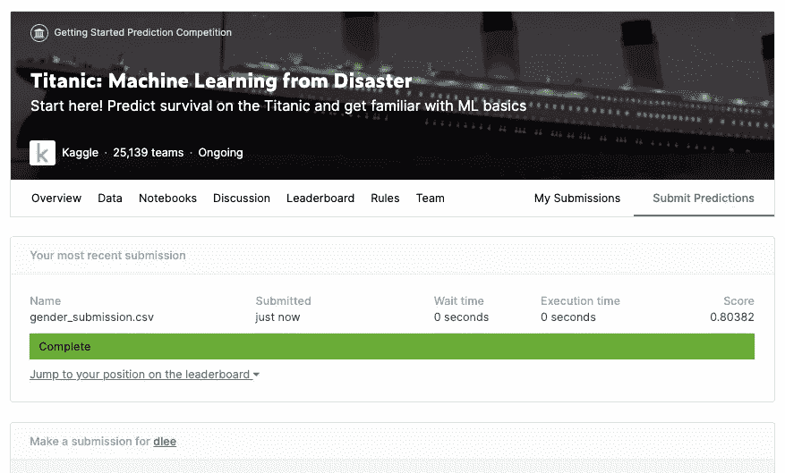

# 随机森林分类器

在 Scikit-Learn 的文档[页面](https://scikit-learn.org/stable/modules/generated/sklearn.model_selection.RandomizedSearchCV.html)中可以找到对 RandomizedSearchCV 的很好的解释。了解 Python 面向对象的方法很好。Scikit-Learn 中的模型类对象包含参数、属性和方法。

> 用于应用这些方法的估计器的参数通过对参数设置的交叉验证搜索来优化。
> 
> 与 GridSearchCV 相反，不是所有的参数值都被尝试，而是从指定的分布中采样固定数量的参数设置。尝试的参数设置的数量由 n_iter 给出。
> 
> 如果所有参数都以列表形式显示，则进行无替换取样。如果至少有一个参数作为分布给出，则使用替换抽样。强烈建议对连续参数使用连续分布。"

我主要关注 rs_grid 变量下面列出的 6 个超参数。关于所有参数的详细概述，文档[页面](https://scikit-learn.org/stable/modules/generated/sklearn.ensemble.RandomForestClassifier.html)包含了大量信息。

## 随机森林超参数

*   **n_estimators:** 这代表了森林中决策树的数量。默认值设置为 n_estimators=100。
*   **标准:**该功能测量分割的质量。例如，年龄是可以作为根节点的特征。基于分裂标准，它分裂成内部节点和叶节点，直到当一个分支达到最低 gini 杂质时树停止生长(缺省设置为 gini，第二个选项是信息增益的熵)。
*   **max_features:** 寻找最佳分割时要考虑的随机特征子集的数量。
*   **max_depth:** 树的最大深度。如果没有，则扩展节点，直到所有叶子都是纯的，或者直到所有叶子包含少于 min_samples_split 样本。
*   **min_samples_split:** 拆分内部节点所需的最小样本数。
*   **min_samples_leaf:** 一个叶节点所需的最小样本数。任何深度的分裂点只有在左和右分支的每一个中留下至少 min_samples_leaf 训练样本时才会被考虑。

## 随机搜索 CV 参数

*   **估计器:**模型类实例化，用于对最佳参数进行随机搜索。
*   **param_distributions:** 以参数名(`str`)为关键字的字典，以及要尝试的分布或参数列表。
*   **n_iter:** 被采样的参数设置的数量。
*   **cv:** 决定交叉验证的拆分策略。
*   **详细:**控制详细程度；详细度越大，输出/日志消息越长。
*   **random_state:** 伪随机数生成器状态，用于从可能值列表中随机均匀采样，而不是从 scipy.stats 分布中随机均匀采样。
*   **n_jobs:** 并行运行的作业数量。除非在`[joblib.parallel_backend](https://joblib.readthedocs.io/en/latest/parallel.html#joblib.parallel_backend)`上下文中，`None`表示 1。`-1`指使用所有处理器。

随机搜索用了大约 5 分钟，使用了我所有的处理器能力(n_jobs=-1)。param_distributions 包含 8，232 种设置组合(7*2*2*7*7*6)。对于我的随机搜索，我将 cv 设置为 5，这等于分层折叠的数量。因此，如果我从 GridSearchCV 开始，总共将尝试 41，160 个参数设置或拟合。这将需要很长时间来运行。然而，使用 RandomizedSearchCV，它从所有可能的设置中采样 n_iter=200，从而在这种情况下将任务或拟合的数量降低到 1000。以下是这次随机搜索的最佳超参数值。


RandomizedSearchCV 的最佳参数属性


通过设置 verbose=3，您会得到一个关于正在发生的事情的很好的输出。

让我们比较一下我之前的测试结果。accuracy_cv_score 增加了大约 1.1%，accuracy_cv_stddev 下降到大约 4%。准确率也有所提高(91.47%)，而召回率有所下降。F1 的整体成绩有所提高。AUC 分数稳定在 89%。利用我目前所学的知识，目标是在一个较小的设置集上运行网格搜索，并测量[增量](https://scikit-learn.org/stable/auto_examples/model_selection/plot_randomized_search.html#sphx-glr-auto-examples-model-selection-plot-randomized-search-py)。


# GridSearchCV:随机森林分类器

GridSearchCV 类似于 RandomizedSearchCV，除了它将基于定义的模型超参数集(GridSearchCV 的 param_grid)进行穷举搜索。换句话说，它将从上面经过所有的 41，160 次拟合。然而，我正在利用以前的经验，减少每个超参数的值列表。关于 GridSearchCV 参数的详细概述，请看文档[页](https://scikit-learn.org/stable/modules/generated/sklearn.model_selection.GridSearchCV.html)。

> “用于应用这些方法的估计器的参数通过在参数网格上的交叉验证网格搜索来优化。”


GridSearchCV 中的 best_params_ attribute


详细=3

总的来说，除了 AUC 略有上升之外，没有太大的改善。无论如何，这证明了调整正确的超参数集和覆盖广泛的设置可以提高模型预测。因此，学习利用 RandomizedSearchCV 和 GridSearchCV 成为机器学习工作流的重要部分。但是，您还需要知道您希望在调优过程中投入多少时间和精力，因为增益可能很小。


作为最后一步，我生成了更新的提交文件并提交给 Kaggle。即使进行了超参数调优，对于这组特性和这组优化的超参数，我的分数仍然保持在 80.382%。

# 结论

## 最新结果

通过反复试验和扩展超参数设置，我达到了当前 80.861%的站立得分，根据 Kaggle 的说法，这属于前 6%。在我看来，这是一个相当坚实的分数。


## 最后的想法

*   这个项目强化了特征工程是强大的观点。用于预测存活率的六个特征中有五个是工程特征，它们捕捉了原始特征不能捕捉的信息。
*   此外，对主题有足够的背景知识(阅读关于泰坦尼克号的内容)是有帮助的，这在探索性分析阶段很有帮助。
*   花足够的时间探索(切片和切块)数据有助于建立直觉，这有助于特征工程、聚合和分组数据集。
*   当这些部分就位后，网格搜索和随机搜索等技术有助于逐步改进模型。
*   最后，我相信我们不能轻易忽视领域知识和机器学习中的引导试错法的重要性。这些可以被创建成输入，并且模型可以帮助量化它们的重要性。

请随时分享您的意见、反馈和/或问题。如果你对探索性分析和特性工程感兴趣，可以看看我的第一篇文章——“SQL 中的[*ka ggle Titanic Competition*](/kaggle-titanic-competition-in-sql-78ae3cd551ce)”感谢阅读！

[](/kaggle-titanic-competition-in-sql-78ae3cd551ce) [## SQL 中的巨大竞争

### 探索性数据分析和特征工程

towardsdatascience.com](/kaggle-titanic-competition-in-sql-78ae3cd551ce) 

# 资源

如果你正在寻找关于机器学习、数据分析和提高 Python 编程技能的好参考书，我推荐这三本书。

*   [使用 Scikit-Learn、Keras 和 TensorFlow 进行机器实践学习:构建智能系统的概念、工具和技术第二版](https://amzn.to/2Nse7gx)
*   [用于数据分析的 Python:与 Pandas、NumPy 和 IPython 的数据角力第二版](https://amzn.to/2YE0X6J)
*   [流畅的 Python:清晰、简洁、有效的编程第一版](https://amzn.to/2V9l8r2)