# Kaggle 用户调查仪表板-2019 年

> 原文：<https://towardsdatascience.com/kaggle-user-survey-2019-326e187ff207?source=collection_archive---------11----------------------->

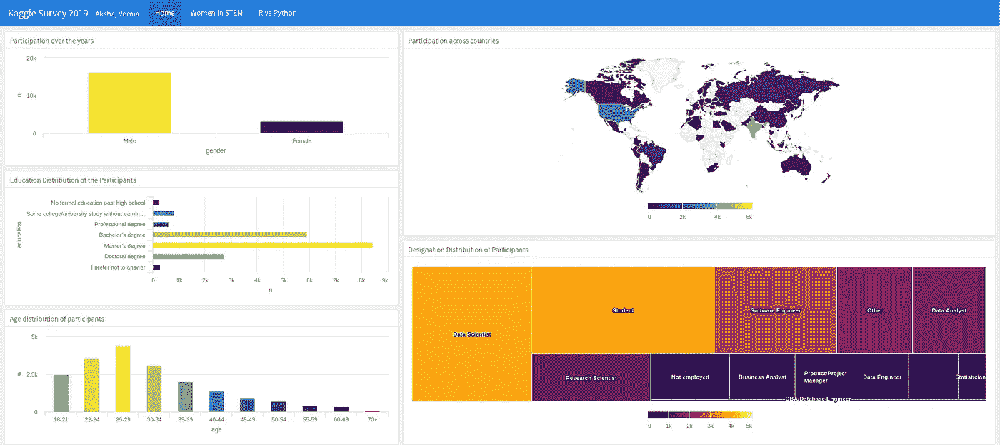

仪表板主页[Image [0]]

使用 R、Flexdashboard 和 Highcharter 库制作的仪表板，用于分析 Kaggle 在 2019 年进行的用户调查。

当我们告别 2019 年时，我想探索和分析数据科学生态系统的状态，特别是女性在数据科学中的参与以及长期的 R vs Python 辩论。那时我偶然发现了 Kaggle 在 2019 年 10 月进行的一项调查，他们在这里提供了[。这是最大的调查之一，有 19，717 份回复。](https://www.kaggle.com/c/kaggle-survey-2019)

在这个仪表板中，我试图分析两个主要主题——

1.  STEM 中的女性。
2.  数据科学中的 R vs Python。

这篇博文分为三个不同的部分——主页、STEM 中的女性和 R vs Python。我将在这里介绍主要的发现。

# 主页

在大约 19 000 名受访者中，大多数是男性。

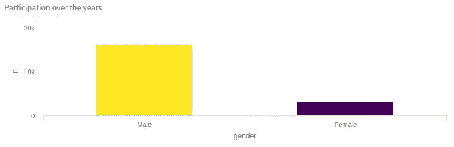

性别分布[图片[1]]

大多数受访者拥有硕士学位。

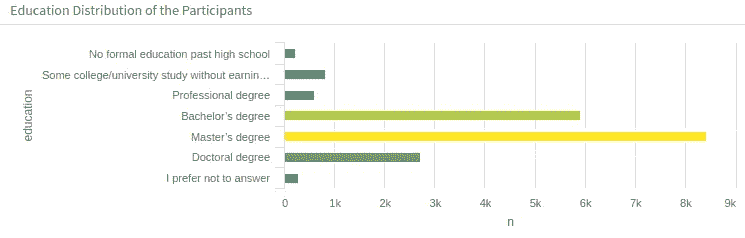

教育分布[图片[2]]

25-29 岁是受访者中最常见的年龄组。

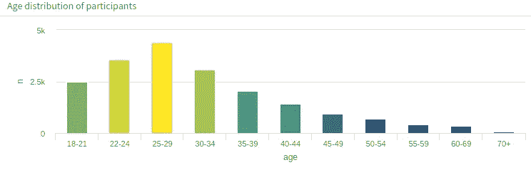

年龄分布[图片 3]

印度的受访者人数最多，其次是美国。

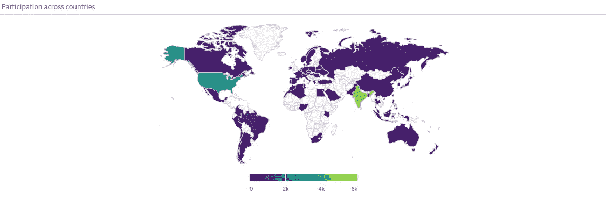

地理分布[图片[4]]

数据科学家和软件工程师是最常见的职业。

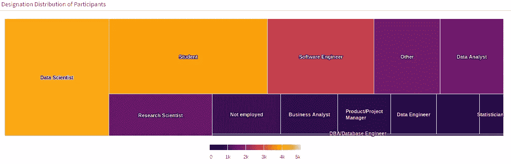

名称分布[图片[5]]

# STEM 中的女性

## 人口统计、教育、职称和工资

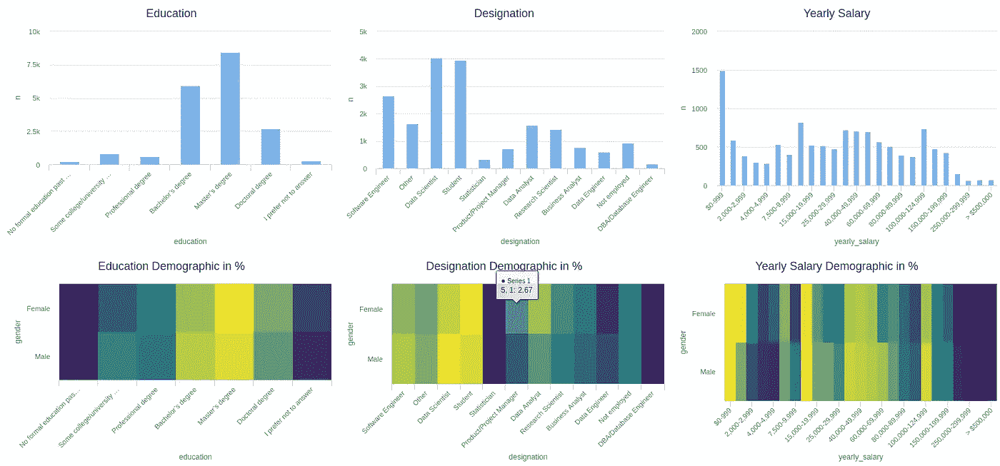

人口统计、教育、职位和薪水图[Image [6]]

**见解** —

*   接近 50%参与调查的人拥有硕士学位。
*   47%的女性受访者拥有硕士学位，而男性为 43%。
*   数据科学和软件工程师是两个最受欢迎的职业。接受调查的学生人数几乎等于数据科学家的人数。
*   24%的学生是女性，而男性为 20%。
*   与男性相比，更多的女性是学生、统计学家、产品/项目经理、数据分析师和研究科学家。
*   与女性相比，更多的男性是数据科学家、软件工程师、DBA/DB 工程师和数据工程师。
*   女性失业率为 6.87%，男性失业率为 4.46%。

## 工作中的机器学习

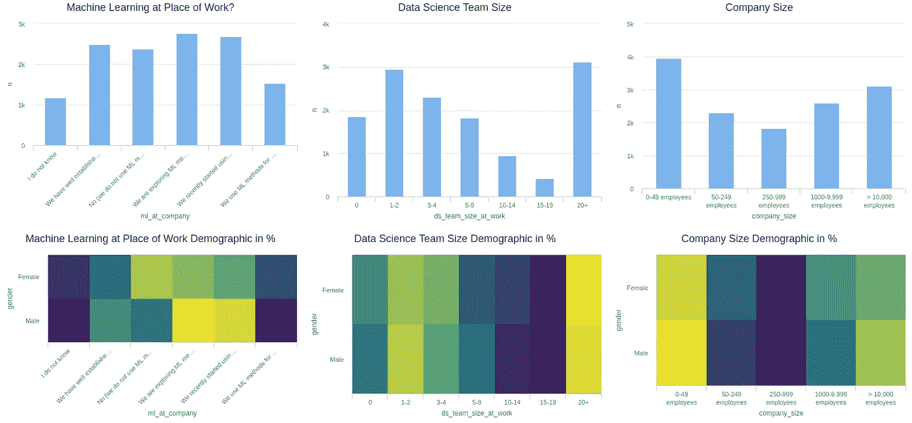

工作中的机器学习图[图片[7]]

**见解**

*   大多数受访者正在探索 ML 模型，并可能在工作中的某一天将模型投入生产。紧随其后的是在过去的两年里将模型投入生产的人数。
*   与男性(18%)相比，更多的女性(20.22%)在工作中不使用 ML。
*   与女性(16.05%)相比，更多男性(19.69%)在工作中拥有成熟的管理团队方法的团队中工作。
*   大多数受访者在规模为 1-2 或 20+ ie 的数据科学团队中工作。要么是小型探索团队，要么是羽翼丰满的团队。
*   与男性(23.08%)相比，更多的女性(24.48%)在 20 人以上的团队中工作。
*   与女性(19.44%)相比，更多男性(22.47%)在 1-2 人团队中工作。

## 数据科学中使用的工具和技术

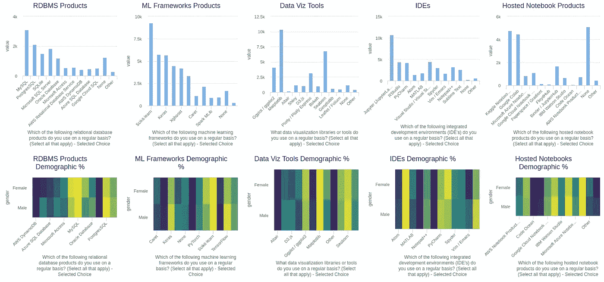

数据科学图中使用的工具和技术[Image [8]]

**见解**

*   MySQL 和 PostgresSQL 是使用最多的 RDBMS 产品。
*   使用 MySQL 的女性(23.51%)多于男性(22.28%)。使用 PostgresSQL 的男性(15.73%)多于女性(13.42%)。
*   Scikit-learn 是迄今为止最受欢迎的 ML 框架，被近 50%的受访者使用。Keras 在受欢迎程度上紧随其后。
*   与男性(22.98%)相比，更多的女性(25.32%)使用 Python 中的 scikit-learn。与男性(2.72%)相比，更多女性(3.52%)使用 Caret(R 中的 ML 库)。
*   男性比女性使用 PyTorch、Tensorflow、Keras 等深度学习框架。
*   Matplotlib 和 Seaborn 是最流行的数据可视化库。第三个是 ggplot2 库。
*   使用 matplotlib 图书馆的男性(34.11%)多于女性(31.47%)。与男性(12.71%)相比，更多的女性(17.41%)使用 ggplot2 图书馆。
*   Jupyter notebook/lab 是最受欢迎的编辑器，被超过 50%的受访者使用。VScode 和 RStudio 紧随其后。
*   Kaggle 内核和 Google Colab 是最受欢迎的托管笔记本服务。

## ML(自然语言处理和计算机视觉)中使用的算法

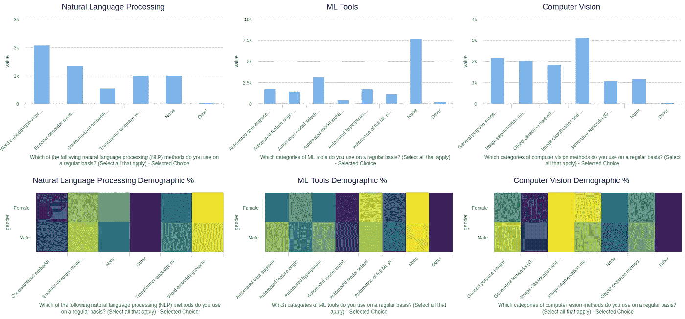

ML (NLP 和计算机视觉)图中使用的算法[图片[9]]

**见解**

*   单词嵌入是最流行的 NLP 技术，其次是编码器解码器模型。
*   自动模型选择是最常用的工具，其次是数据扩充技术。
*   图像分类是最常用的计算机视觉方法。

## 编码经验和建议

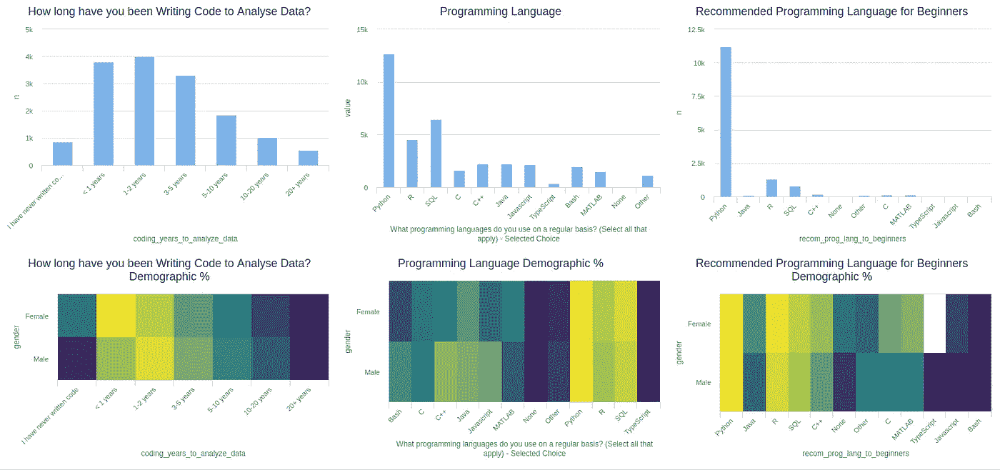

编码体验和建议图[图片[10]]

**见解**

*   近 50%的受访者花了 0-2 年时间编写代码来分析数据。
*   在编写代码以分析数据方面，女性(28.88%)比男性(23.79%)拥有不到 1 年的经验。与女性相比，有超过 1 年编写代码经验的男性更多。
*   Python 是最流行的编程语言，其次是 SQL 和 r。
*   Python 是迄今为止最推荐给初学者的语言，超过 50%的受访者推荐它。r 紧随其后。
*   与女性(73.38%)相比，更多男性(79.8%)推荐 Python。而与男性(8.94%)相比，更多的女性(11.4%)建议进行 R。

## 数据科学媒体和课程平台

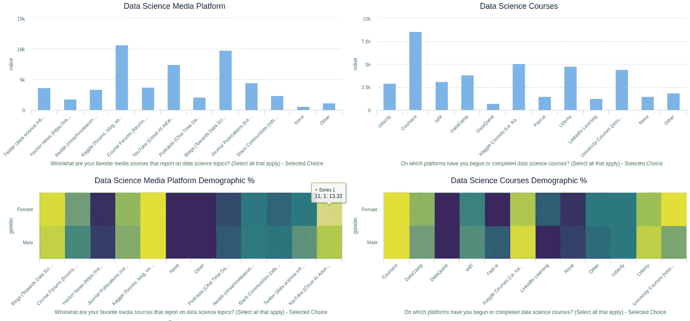

数据科学媒体和课程平台[Image [11]]

**见解**

*   Kaggle 是最受关注的数据科学媒体来源，其次是博客，如走向数据科学。
*   与男性相比，更多的女性使用 Kaggle 和博客内容。
*   Coursera、Kaggle、Udemy 和 University 是最受欢迎的通过课程学习数据科学的来源。
*   通过大学课程学习的女性(13.55%)多于男性(10.77%)。

# R vs Python

## 哪些是最流行的编程语言？

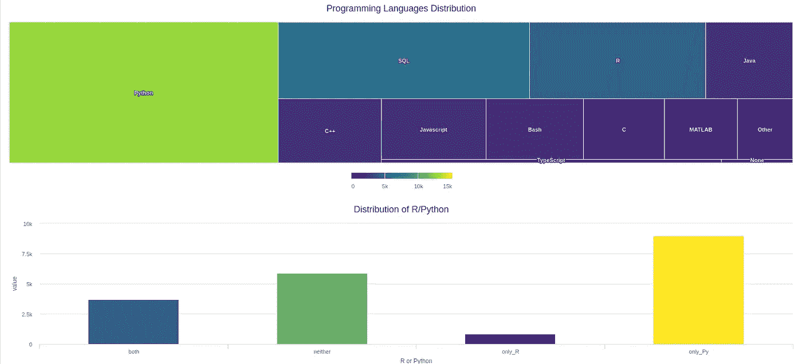

流行编程语言 plot [Image [12]]

**见解**

*   Python 是最流行的编程语言，其次是 SQL 和 r。
*   与使用 r 相比，更多的人只使用 Python。

## R/Python 用在哪里？

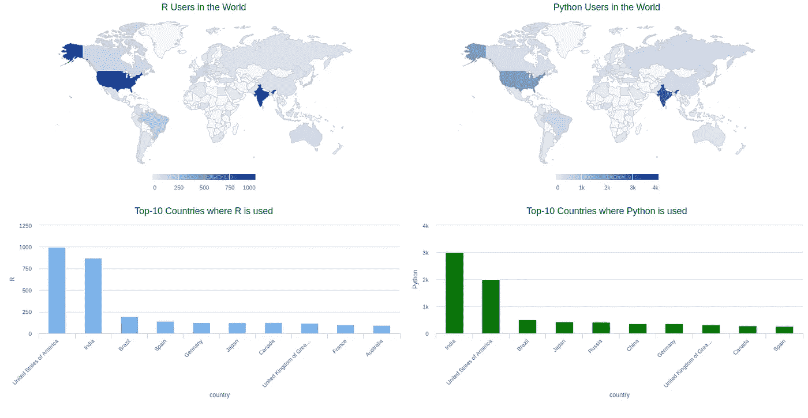

R/Python 世界地图[Image [13]]

**见解**

*   美国和印度是使用 R 和 Python 最多的国家。
*   美国有更多的 R 用户，而印度有更多的 Python 用户。

## 谁在用 R 和 Python？

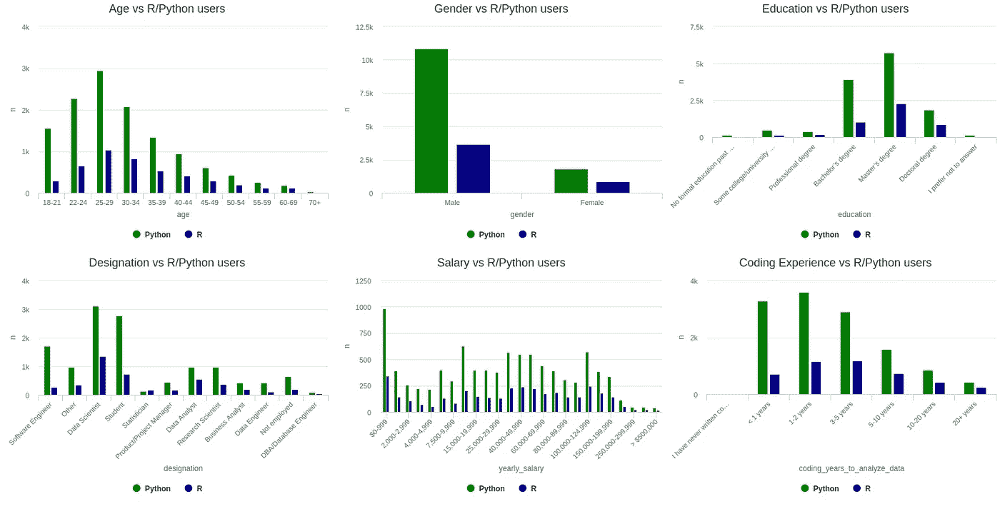

R/Python 人口统计图[Image [14]]

**见解**

*   25-29 岁年龄段的人使用 R/Python 最多。
*   与其他名称相比，数据科学家使用 R 和 Python 最多。软件工程师比 R 用户更多地使用 Python。
*   Python 用户在所有工资范围内都一致地获得更多工资。
*   与 Python 相比，更多的统计学家使用 R。
*   更多有 1-2 年编码经验的人使用 Python，而更多有 3-5 年编码经验的人使用 r。
*   与所有其他教育学位相比，拥有硕士学位的人更多地使用 Python 和 R。

## ML 中使用的算法(NLP、AutoML 和计算机视觉)

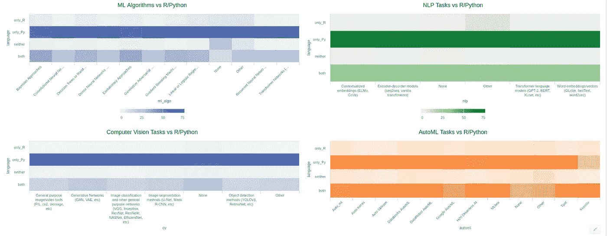

ML (NLP、AutoML 和计算机视觉)图中使用的算法[Image [15]]

**见解**

*   深度学习算法主要由 Python 用户使用。
*   NLP 和计算机视觉领域的大部分工作都是用 Python 完成的。

感谢您的阅读。欢迎提出建议和建设性的批评。:)你可以在 [LinkedIn](https://www.linkedin.com/in/akshajverma7/) 和 [Twitter](https://twitter.com/theairbend3r) *找到我。*您可以在这里查看仪表盘[。](https://rpubs.com/theairbend3r/kaggle-survey-2019-dashboard)

你也可以在这里查看我的其他博客文章。

