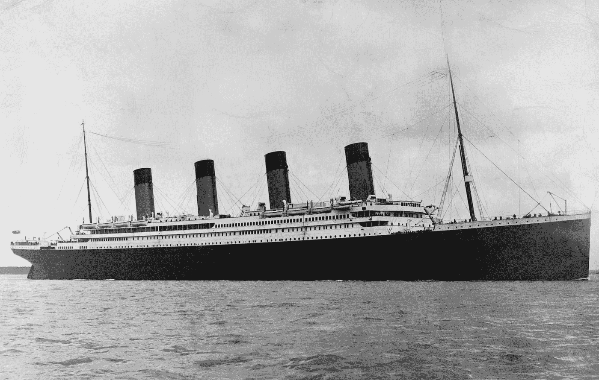
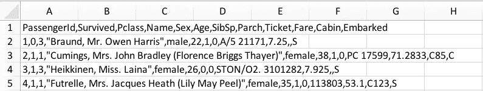
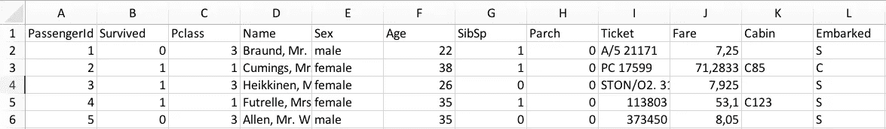
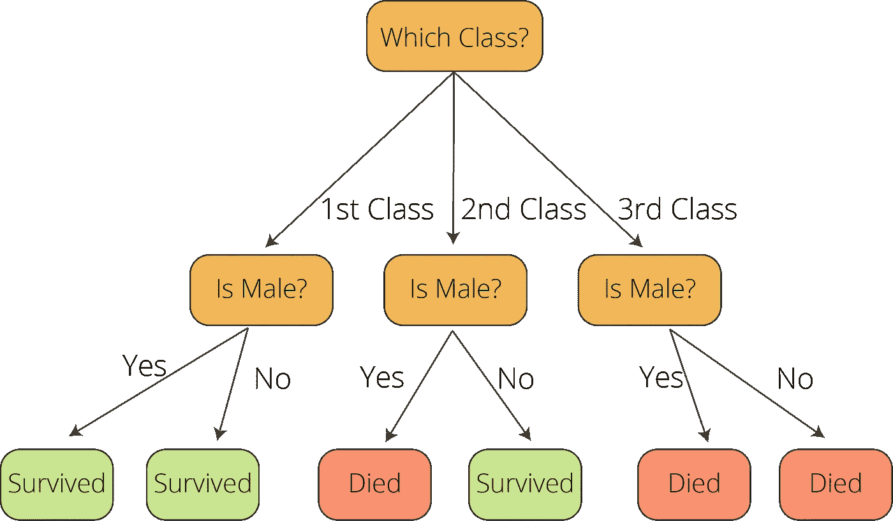

# 10 分钟后卡格尔的泰坦尼克号比赛|第一部分

> 原文：<https://towardsdatascience.com/kaggles-titanic-competition-in-10-minutes-part-i-e6d18e59dbce?source=collection_archive---------25----------------------->

## 机器学习教程| [第二部分→](/kaggles-titanic-competition-in-10-minutes-part-ii-3ae626bc6519) | [第三部分→→](/kaggles-titanic-competition-in-10-minutes-part-iii-a492a1a1604f)

## 使用决策树分类器|机器学习教程，用不到 20 行代码完成您的第一场 Kaggle 竞赛

*既然你正在阅读这篇文章，我确信我们有着相似的兴趣，并且现在/将来会从事相似的行业。那么我们就通过*[*Linkedin*](https://linkedin.com/in/orhangaziyalcin/)*来连线吧！请不要犹豫发送联系请求！*[*Orhan g . Yal n—Linkedin*](https://linkedin.com/in/orhangaziyalcin/)


由 [Florian Olivo](https://unsplash.com/@florianolv?utm_source=medium&utm_medium=referral) 在 [Unsplash](https://unsplash.com?utm_source=medium&utm_medium=referral) 上拍摄的照片

如果你对机器学习感兴趣，你可能听说过 [Kaggle](http://kaggle.com) 。Kaggle 是一个平台，在这里你可以用 Python 和 R 学习很多关于机器学习的知识，做数据科学项目，还可以(这是最好玩的部分)参加机器学习竞赛。比赛会随着时间的推移而改变和更新。目前，《泰坦尼克号:机器从灾难中学习》是平台上的*初学者比赛*。在这篇文章中，我们将用不到 20 行 Python 代码创建一个准备好上传的提交文件。为了能够做到这一点，我们将使用 [Pandas](https://pandas.pydata.org/) 和 [Scikit-Learn](http://scikit-learn.org/stable/) 库。

# 泰坦尼克号和臭名昭著的事故

皇家邮轮泰坦尼克号开始服役时是水上最大的船只，1912 年 4 月 15 日，它在第一次前往美国的航行中与冰山相撞后沉没。航行中有 2224 名乘客和船员，不幸的是，其中 1502 人死亡。这是 20 世纪和平时期最致命的商业海上灾难之一。



图一。[维基百科](https://upload.wikimedia.org/wikipedia/commons/f/fd/RMS_Titanic_3.jpg)上[泰坦尼克号 RMS](https://en.wikipedia.org/wiki/Titanic) 的灰度照片

伤亡人数如此之高的主要原因之一是乘客和船员没有足够的救生艇。虽然运气在事故中幸存下来起了一定作用，但一些人，如妇女、儿童和上层阶级的乘客比其他人更有可能幸存下来。我们将计算这种可能性，以及特定特征对存活可能性的影响。我们将用不到 20 行代码来完成这个任务，并准备好一个提交文件。 *…让我们开始吧！*

# 下载数据

Titanic 数据集是一个开放的数据集，你可以从许多不同的存储库和 GitHub 帐户访问它。然而，从 Kaggle 下载肯定是最好的选择，因为其他来源可能有稍微不同的版本，可能不提供单独的训练和测试文件。因此，请访问此[链接](https://www.kaggle.com/c/titanic/data)下载数据集(Train.csv 和 Test.csv)开始。

通常我们的 Train.csv 文件在 Excel 中是这样的:



表 1。CSV 格式的训练数据集

在将它转换成 Excel 中的表格(数据->文本到列)后，我们得到这样的视图:



表二。文本到列操作后的定型数据集

好多了，对吧！现在，我们可以清楚地看到，我们有 12 个变量。虽然“幸存”变量表示特定乘客是否在事故中幸存，但其余的是关于该乘客的基本信息。以下是变量的简要说明:


表 3。关于训练数据集特征的信息

# 加载并处理培训数据


图二。照片由[印尼 UX](https://unsplash.com/@uxindo?utm_source=medium&utm_medium=referral)在 [Unsplash](https://unsplash.com?utm_source=medium&utm_medium=referral) 上拍摄

我假设您已经安装了 Python 环境。不过，如果你的电脑上没有 Python，你可以参考[这个链接](http://docs.python-guide.org/en/latest/starting/install3/win/)用于 Windows，参考[这个链接](http://docs.python-guide.org/en/latest/starting/install3/osx/)用于 macOS。在确保您的系统上安装了 Python 之后，打开您最喜欢的 IDE，并开始编码！

```
Note that using a [Google Colab Notebook](http://colab.research.google.com) is another option, which does not require local Python3 installation. To have access to the Google Colab Notebook with the full code, consider signing up to [the Newsletter](https://subscribe.to/ogyalcin/) using the slider below.
```

首先，我们将加载训练数据进行清理，并为训练我们的模型做好准备。我们将(I)加载数据，(ii)删除具有空值的行，(iii)选择“Survival”列作为我的响应变量，(iv)删除目前不相关的解释变量，(v)将分类变量转换为哑变量，我们将用 7 行代码完成所有这些:

# 创建模型并训练

为了揭示生存变量和其他变量(或者特征，如果你愿意)之间的关系，你需要选择一个统计机器学习模型，并用处理后的数据训练你的模型。



图 4。泰坦尼克号案例的简化决策树模式(图片由作者提供)

Scikit-learn 为此提供了几种算法。我们将选择决策树分类器，这是一个基本但强大的机器学习算法。得到这个:我们只需要 3 行代码来揭示生存(表示为 y)和选择的解释变量(表示为 X)之间的隐藏关系

# 进行预测并保存结果

在揭示了存活率和所选解释变量之间的隐藏关系后，我们可以为预测阶段准备我们的测试数据。Test.csv 文件与 Train.csv 文件略有不同:它不包含“Survival”列。这是有意义的，因为如果我们知道所有的答案，我们可以伪造我们的算法，并在手写后提交正确的答案(等等！有些人已经这样做了。).无论如何，我们的测试数据在预测阶段需要几乎相同的清理、修饰、准备和预处理。我们将用 5 行代码来实现这一点:

现在我们的测试数据是干净的，并为预测做好了准备。最后，对给定的测试文件进行预测，并将其保存到内存中:

这么容易，对！在保存这些预测之前，我们需要获得适当的结构，以便 Kaggle 可以自动对我们的预测进行评分。还记得吗，我们将 PassengerId 列作为一个单独的数据集保存到内存中(如果您愿意，可以称之为 DataFrame)？现在，我们将把预测数据集分配(或附加)给 PassengerIds(注意，它们都是单列数据集)。最后，我们将从内存中获取数据，并将其保存为 Kaggle 要求的 CSV(逗号分隔值)格式。


图 5。彼得罗·马蒂亚在 [Unsplash](https://unsplash.com?utm_source=medium&utm_medium=referral) 上拍摄的照片

现在您可以访问 [Kaggle 的泰坦尼克号比赛页面](https://www.kaggle.com/c/titanic)，登录后即可上传您的提交文件。

# 你能爬到顶端吗？

肯定不是！我们试图实现一个简单的机器学习算法，让你能够参加一场纸牌游戏比赛。随着您对这些基本代码的改进，您将能够在接下来的提交中获得更好的排名。

# 订阅时事通讯获取完整代码

在本教程的第 2 部分和第 3 部分，我们将实现更高级的方法来提高我们的精度性能。如果你想获得 Google Colab 上的教程代码和我的最新内容，可以考虑订阅邮件列表:✉️

> [立即订阅](http://eepurl.com/hd6Xfv)

# 更新！

该系列的第二部分已经出版，请查看:

[](/kaggles-titanic-competition-in-10-minutes-part-ii-3ae626bc6519) [## 10 分钟后卡格尔的泰坦尼克号比赛|第二部分

### 改进我们的代码，以获得更好的结果，为 Kaggle 的大赛与数据分析和可视化和…

towardsdatascience.com](/kaggles-titanic-competition-in-10-minutes-part-ii-3ae626bc6519) 

该系列的第三部分已经出版，请查看:

[](/kaggles-titanic-competition-in-10-minutes-part-iii-a492a1a1604f) [## 10 分钟后卡格尔的泰坦尼克号比赛|第三部分

### 在 Kaggle 的泰坦尼克号比赛|机器中使用自然语言处理(NLP)、深度学习和 GridSearchCV

towardsdatascience.com](/kaggles-titanic-competition-in-10-minutes-part-iii-a492a1a1604f) 

# 喜欢这篇文章

如果你喜欢这篇文章，可以考虑看看我的其他文章:

[](/image-classification-in-10-minutes-with-mnist-dataset-54c35b77a38d) [## 使用 MNIST 数据集在 10 分钟内完成图像分类

### 利用 TensorFlow 和 Keras |监督深度学习使用卷积神经网络来分类手写数字

towardsdatascience.com](/image-classification-in-10-minutes-with-mnist-dataset-54c35b77a38d) [](/image-noise-reduction-in-10-minutes-with-convolutional-autoencoders-d16219d2956a) [## 使用卷积自动编码器在 10 分钟内降低图像噪声

### 在时尚 MNIST 的帮助下，使用深度卷积自动编码器清洁(或去噪)有噪声的图像

towardsdatascience.com](/image-noise-reduction-in-10-minutes-with-convolutional-autoencoders-d16219d2956a) [](/image-generation-in-10-minutes-with-generative-adversarial-networks-c2afc56bfa3b) [## 利用生成性对抗网络在 10 分钟内生成图像

### 使用无监督深度学习生成手写数字与深度卷积甘斯使用张量流和…

towardsdatascience.com](/image-generation-in-10-minutes-with-generative-adversarial-networks-c2afc56bfa3b) [](/fast-neural-style-transfer-in-5-minutes-with-tensorflow-hub-magenta-110b60431dcc) [## TensorFlow Hub & Magenta 在 5 分钟内实现快速神经风格转换

### 利用 Magenta 的任意图像风格化网络和深度学习，将梵高的独特风格转移到照片中

towardsdatascience.com](/fast-neural-style-transfer-in-5-minutes-with-tensorflow-hub-magenta-110b60431dcc)