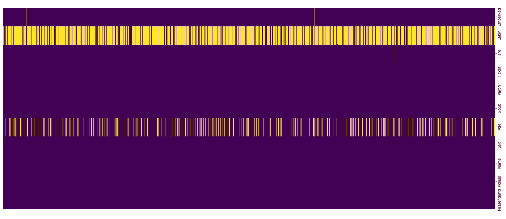

# 10 分钟后卡格尔的泰坦尼克号比赛|第二部分

> 原文：<https://towardsdatascience.com/kaggles-titanic-competition-in-10-minutes-part-ii-3ae626bc6519?source=collection_archive---------17----------------------->

## [←第一部分](/kaggles-titanic-competition-in-10-minutes-part-i-e6d18e59dbce) |机器学习教程| [第三部分→](/kaggles-titanic-competition-in-10-minutes-part-iii-a492a1a1604f)

## 改进我们的代码，通过数据分析和可视化以及梯度推进算法为 Kaggle 的大赛获得更好的结果

在本教程的[第一部分](https://medium.com/@oyalcin/complete-your-first-kaggle-competition-a-k-a-d5ca937a6451)中，我们开发了一个不到 20 行的小 python 程序，让我们得以参加第一届 Kaggle 比赛。

[](/kaggles-titanic-competition-in-10-minutes-part-i-e6d18e59dbce) [## 10 分钟后卡格尔的泰坦尼克号比赛|第一部分

### 使用决策树分类器|机器学习，用不到 20 行代码完成您的第一次 Kaggle 竞赛…

towardsdatascience.com](/kaggles-titanic-competition-in-10-minutes-part-i-e6d18e59dbce) 

然而，由于我们没有进行良好的数据探索和准备来更好地理解数据和构建模型，因此该模型的表现不是很好。在教程的第二部分，我们将使用 [Seaborn](https://seaborn.pydata.org/) 和 [Matplotlib](http://matplotlib.org) 来探索数据集。此外，新的概念将被引入和应用于一个更好的执行模式。最后，我们将在第二次提交中增加我们的排名。


图一。[皇家邮轮泰坦尼克号](https://upload.wikimedia.org/wikipedia/commons/d/d7/Sea_Trials_of_RMS_Titanic%2C_2nd_of_April_1912.jpg)在[维基百科](http://wikipedia.org)上的海试

# 使用 Jupyter 或 Google Colab 笔记本

对于您的编程环境，您可以选择以下两个选项之一: [Jupyter Notebook](https://jupyter.org/) 和 [Google Colab Notebook](http://colab.research.google.com) :

## Jupyter 笔记本

正如在第一部分中提到的，您需要在系统上安装 Python 来运行任何 Python 代码。还有，需要安装 Numpy、Pandas、Matplotlib、Seaborn 等库。此外，您需要一个 IDE(文本编辑器)来编写代码。当然，您可以使用自己选择的 IDE。不过我强烈推荐安装 [Anaconda 发行](https://www.anaconda.com/products/individual)的 Jupyter 笔记本。Jupyter Notebook 利用了 [iPython](http://iPython.org) ，它提供了一个交互式外壳，为测试你的代码提供了很多方便。所以，如果你还没有使用它，你一定要检查一下。

## 谷歌 Colab 笔记本

Google Colab 建立在 Jupyter 笔记本之上，并为您提供云计算功能。不需要完成以上所有步骤，你可以创建一个 [Google Colab](http://colab.research.google.com) 笔记本，它预装了这些库。所以，它更加流线型。比起 Jupyter，我更推荐 Google Colab，但最终还是要看你自己。

# 探索我们的数据

为了能够创建一个好的模型，首先，我们需要探索我们的数据。 [Seaborn](https://seaborn.pydata.org/) ，一个统计数据可视化库，非常方便。首先，让我们记住数据集的样子:


表 1。我们培训数据的前 5 行(按作者列出的表格)

这是你在上面看到的变量的解释:


表二。对变量的解释(表格由作者提供)

所以，现在是时候探索这些变量对生存概率的影响了！

我们的第一个猜想是，一个人的性别(男-女)和他/她的生存概率之间存在相关性。为了能够理解这种关系，我们根据存活和非存活标签创建了男性和女性类别的条形图:


图二。男性和女性的存活数(按作者分列)

正如你在图中看到的，女性比男性有更大的生存机会。因此，性别必须是我们模型中的一个解释变量。

其次，我们怀疑乘客等级和存活率之间也有关联。当我们绘制 Pclass 对抗 Survival 时，我们得到下面的图:


图 3。不同乘客等级的幸存人数(作者提供的数字)

正如我们所怀疑的，乘客级别对一个人的生存机会有很大的影响。看来，如果有人乘坐三等舱旅行，那么他很有可能无法生还。所以 Pclass 对生存概率肯定是有解释力的。

第三，我们还怀疑船上兄弟姐妹的数量(SibSp)和船上父母的数量(Parch)在解释生存机会方面也很重要。因此，我们需要绘制 SibSp 和 Parch 变量与存活率的关系图，我们得到如下结果:


图 4。基于船上兄弟姐妹和父母的幸存人数(作者提供数据)

因此，我们得出这样的结论:随着船上兄弟姐妹数量或船上父母数量的增加，生存的机会也会增加。换句话说，和家人一起旅行的人有更高的生存机会。

我们模型的另一个潜在解释变量(特征)是上船变量。当我们着手对抗生存的阴谋时，我们获得这样的结果:


图 5。基于装载港口的生存统计(作者提供的数据)

很明显，登上南安普敦港的人没有其他人那么幸运。因此，我们也将在我们的模型中包括这个变量。

到目前为止，我们检查了 5 个分类变量(性别、Plclass、SibSp、Parch、apollowed)，似乎它们都在一个人的生存机会中发挥了作用。

现在是时候研究我们的数字变量票价和年龄了。首先，我们希望看到年龄对生存机会的影响。因此，我们绘制年龄变量(seaborn.distplot):


图 6。存活率与年龄的关系图(作者提供的数据)

我们可以看到，18 岁以下的儿童存活率较高，而 18 岁以上、35 岁以下的人，这个比率较低。年龄在生存中起着作用。

最后，我们需要看看票价是否有助于解释生存概率。因此，我们绘制票价变量(seaborn.distplot):


图 7。幸存者与票价的关系图(作者提供的数据)

总的来说，我们可以看到，随着乘客支付的车费增加，生存的机会也增加，正如我们所预料的那样。

我们将忽略三列:Name、Cabin、Ticket，因为我们需要使用更高级的技术将这些变量包含在我们的模型中。为了说明如何从这些变量中提取特征:您可以对乘客的姓名进行标记，并派生出他们的头衔。除了先生和夫人之类的头衔，你还会发现其他头衔，如主人或女士等。当然，这在那天晚上拯救谁的问题上起了作用。因此，您可以利用给定的名称列以及客舱和机票列。

# 检查数据中的空值

空值是我们的敌人！在泰坦尼克号数据集中，我们有一些缺失值。首先，我们将在删除训练数据集的幸存列后合并这两个数据集。

我们需要得到关于空值的信息！有两种方法可以完成这个任务:*。info()* 功能和热图(更酷的方式！).为了能够检测到空值，我们可以使用 seaborn 的热图，代码如下:

这是结果。黄线是缺失的值。



图 8。空值的热图(作者提供的图)

有很多遗漏的年龄和客舱值。“已装船”列中缺少两个值，而“票价”列中缺少一个值。让我们先处理这些。或者，我们可以使用。 *info()* 功能以文本形式接收相同的信息:


图 9。联合泰坦尼克号数据的空值信息(作者提供的图表)

# 读取数据集

由于在[第一部分](/kaggles-titanic-competition-in-10-minutes-part-i-e6d18e59dbce)中已经涉及到，我们将不再讨论数据集的细节。使用下面的代码，我们可以导入 Pandas & Numpy 库并读取 train & test CSV 文件。

从上面我们知道，在训练集和测试集中我们都有空值。我们需要估算这些空值，并分别为模型拟合和预测准备数据集。

# 输入空值

解决数据集中缺失值问题有两种主要方法:丢弃或填充。放弃是简单而天真的出路；虽然，有时它实际上可能表现得更好。在我们的例子中，我们将填充它们，除非我们决定完全删除整个列。

我们的数据集的初始外观如下:


表 3。训练数据集的初始外观(按作者排列的表格)

我们将进行几次[插补](https://en.wikipedia.org/wiki/Imputation_(statistics))和转换，以获得完全数字化的干净数据集，从而能够用以下代码拟合机器学习模型(它还包含[插补](https://en.wikipedia.org/wiki/Imputation_(statistics))):

清理训练数据集的 Python 代码

在训练数据集上运行此代码后，我们得到了以下结果:


表 4。训练数据集的干净版本(按作者列出的表)

没有空值、字符串或类别会妨碍我们。现在，我们可以将数据分成两部分，特征(X 或解释变量)和标签(Y 或响应变量)，然后我们可以使用 [sklearn](https://scikit-learn.org/) 的 [train_test_split()](https://scikit-learn.org/stable/modules/generated/sklearn.model_selection.train_test_split.html) 函数在训练数据集中进行训练测试拆分。

```
**Note:** We have another dataset called *test*. This isn’t very clear due to the naming made by Kaggle. We are training and testing our model using the train dataset by splitting it into *X_train*, *X_test*, *y_train*, *y_test* DataFrames, and then applying the trained model on our test dataset to generate a predictions file.
```

# 创建梯度推进模型和训练


图 10。梯度推进算法的可视化(图片由作者提供)

在第一部分中，我们使用了一个基本的决策树模型作为我们的机器学习算法。另一个众所周知的机器学习算法是[梯度提升分类器](https://scikit-learn.org/stable/modules/generated/sklearn.ensemble.GradientBoostingClassifier.html)，由于它通常优于[决策树](https://scikit-learn.org/stable/modules/tree.html)，我们将在本教程中使用梯度提升分类器。下面分享的代码允许我们导入梯度提升分类器算法，基于它创建一个模型，使用 *X_train* 和 *y_train* DataFrames 拟合和训练模型，最后在 *X_test* 上进行预测。

现在，我们有了预测，也知道了答案，因为 *X_test* 是从列车数据帧中分离出来的。为了能够衡量我们的成功，我们可以使用混淆矩阵和分类报告。您可以通过运行以下代码来实现这一点:

这是输出结果:


图 11。混淆矩阵和分类报告我们的结果(图由作者)

我们获得了大约 82%的准确率，这可以被认为是非常好的，尽管仍有改进的空间。

# **为卡吉尔比赛创建预测文件**

现在，我们有了一个训练有素的工作模型，可以用来预测 ***test.csv*** 文件中乘客的生存概率。

首先，我们将使用以下代码清理和准备数据(与我们清理训练数据集的方式非常相似)。请注意，在以“ids”的名称删除 PassengerId 列之前，我们将它保存为一个单独的 dataframe。

最后，我们可以预测测试数据帧的存活值，并根据需要使用以下代码写入 CSV 文件。

这样你就有了一个新的更好的 Kaggle 竞赛模型。我们在代码中做了一些改进，提高了大约 15–20%的准确性，这是一个很好的改进。正如我上面提到的，仍然有一些改进的空间，准确率可以提高到 85–86%左右。然而，在我看来，记分牌的分数并不十分可靠，因为许多人使用了不诚实的技术来提高他们的排名。

# 这个迷你系列的第三部分

在第三部分中，我们将使用更先进的技术，如自然语言处理(NLP)、深度学习和 GridSearchCV，以提高我们在 Kaggle 的泰坦尼克号比赛中的准确性。

[](/kaggles-titanic-competition-in-10-minutes-part-iii-a492a1a1604f) [## 10 分钟后卡格尔的泰坦尼克号比赛|第三部分

### 在 Kaggle 的泰坦尼克号比赛|机器中使用自然语言处理(NLP)、深度学习和 GridSearchCV

towardsdatascience.com](/kaggles-titanic-competition-in-10-minutes-part-iii-a492a1a1604f) 

既然您正在阅读这篇文章，我相信我们有着相似的兴趣，并且现在/将来会从事相似的行业。那么我们就通过[*Linkedin*](https://linkedin.com/in/orhangaziyalcin/)*来连线吧！请不要犹豫发送联系请求！*[*Orhan g . Yal n—Linkedin*](https://linkedin.com/in/orhangaziyalcin/)

# 订阅时事通讯获取完整代码

如果你想获得 Google Colab 上的教程代码和我的最新内容，可以考虑订阅我的 *GDPR 兼容* [**时事通讯**](http://eepurl.com/hd6Xfv) **！✉️**

> [现在就订阅](http://eepurl.com/hd6Xfv)