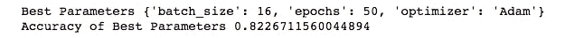

# 10 分钟后卡格尔的泰坦尼克号比赛|第三部分

> 原文：<https://towardsdatascience.com/kaggles-titanic-competition-in-10-minutes-part-iii-a492a1a1604f?source=collection_archive---------30----------------------->

## [←第一部分](/kaggles-titanic-competition-in-10-minutes-part-i-e6d18e59dbce) | [←第二部分](/kaggles-titanic-competition-in-10-minutes-part-ii-3ae626bc6519) |机器学习教程

## 在 Kaggle 的泰坦尼克号竞赛|机器学习教程中使用自然语言处理(NLP)、深度学习和 GridSearchCV

图一。正在 [Unsplash](https://bit.ly/2wdF0N9) 上建造的泰坦尼克号

如果你关注了我关于 Kaggle 的泰坦尼克号比赛(Part-I 和 Part-II)的教程系列，或者已经参加了比赛，你就对整个故事很熟悉了。如果你不熟悉，既然这是后续教程，强烈推荐你去看看这个教程系列的[比赛页面](https://www.kaggle.com/c/titanic)或者 [Part-I](/kaggles-titanic-competition-in-10-minutes-part-i-e6d18e59dbce) 和 [Part-II](/kaggles-titanic-competition-in-10-minutes-part-ii-3ae626bc6519) 。在该系列的第三部分(最终版)中，(I)我们将使用自然语言处理( [NLP](https://en.wikipedia.org/wiki/Natural_language_processing) )技术来获取乘客的头衔，(II)创建一个人工神经网络(ANN 或 RegularNet)来训练模型，以及(III)使用[网格搜索交叉验证](https://scikit-learn.org/stable/modules/generated/sklearn.model_selection.GridSearchCV.html)来调整 ANN，以便我们获得最佳结果。

> 开始吧！

# 背景

## [教程第一部分](/complete-your-first-kaggle-competition-a-k-a-d5ca937a6451)

在这个系列教程中，我们试图保持事情简单，慢慢地清晰地发展故事。在本教程的第 1 部分，我们学习了用不到 20 行代码编写一个 python 程序来参加 Kaggle 的竞赛。事情尽可能保持简单。我们清理了非数字部分，处理了空值，使用 train.csv 文件训练了我们的模型，在 test.csv 文件中预测了乘客的存活情况，并将其保存为 csv 文件以供提交。

 [## 10 分钟后卡格尔的泰坦尼克号比赛|第一部分

### 使用决策树分类器|机器学习，用不到 20 行代码完成您的第一次 Kaggle 竞赛…

towardsdatascience.com](/kaggles-titanic-competition-in-10-minutes-part-i-e6d18e59dbce) 

## [教程第二部分](/improving-our-code-to-obtain-a-better-model-for-kaggles-titanic-competition-c5ba66aed16b)

由于我们在第一部分中没有适当地研究数据集，所以我们在第二部分中使用 Matplotlib 和 Seaborn 重点研究数据研究。我们通过使用聚合函数来估算空值而不是丢弃它们，更好地清理数据，并最终从分类变量中生成哑变量。然后，我们使用 RandomForestClassifier 模型代替 LogisticRegression，这也提高了精度。与第一部分中的模型相比，我们实现了大约 20%的精度提升。

 [## 10 分钟后卡格尔的泰坦尼克号比赛|第二部分

### 改进我们的代码，以获得更好的结果，为 Kaggle 的大赛与数据分析和可视化和…

towardsdatascience.com](/kaggles-titanic-competition-in-10-minutes-part-ii-3ae626bc6519) 

## 教程的第三部分

图二。具有一个隐藏层的人工神经网络图(由作者提供)

我们现在将使用 Name 列来导出乘客的头衔，这在他们的生存机会中扮演了重要的角色。我们还将使用 [Keras](https://keras.io/) 创建一个人工神经网络(ANN 或 RegularNets)来获得更好的结果。最后，为了调整 ANN 模型，我们将使用 GridSearchCV 来检测最佳参数。最后，我们将生成一个新的 CSV 文件进行提交。

# 准备数据集

就像我们在第一部分和第二部分中所做的那样，我将开始清理数据并输入空值。这一次，我们将采用一种不同的方法，并结合两个数据集进行清理和输入。我们已经讨论了为什么我们用第二部分的方法估算空值；因此，我们会直接给你代码。如果你觉得有些操作没有意义，你可以参考第二部分或者下面的评论。[然而，由于我们在第二部分中看到 18 岁以下的人有更大的生存机会](https://cdn-images-1.medium.com/max/800/1*Niln8qOPuuFfEovHCkU_TA.png)，我们应该增加一个新的特征来衡量这种影响。

数据清理和空值插补

# 使用 NLP 导出乘客标题

我们将删除不必要的列，并从上面的分类变量中生成虚拟变量。但是首先，我们需要从“名称”列中提取标题。为了理解我们在做什么，我们将从运行下面的代码来获取前 10 行 Name 列值开始。

命名前 10 行的列值

这是我们得到的结果:

图 3。前 10 行的名称列值(按作者排序)

名称列值的结构如下:

> <last-name>，<title>。<first-name/></title></last-name>

因此，我们需要根据点和逗号分割这些字符串，并提取标题。我们可以通过下面的代码来实现这一点:

拆分名称值以提取标题

一旦我们运行这段代码，我们将有一个标题列，其中包含标题。为了能够看到我们有什么样的标题，我们将运行:

对标题进行分组并获得计数

图 4。唯一书目数量(按作者分列)

似乎我们有四大群体:'*先生，'*夫人，'*小姐，'*老爷*'，以及其他。然而，在将所有其他标题归类为其他标题之前，我们需要注意法语标题。我们需要用下面的代码将它们转换成相应的英文标题:***

**法语到英语标题转换器**

**现在，我们只有军官和皇家头衔。把他们组合成其他人是有意义的。我们可以通过下面的代码实现这一点:**

**将所有非主要头衔合并为其他头衔(包括军官和皇家头衔)**

****

**图 5。最终唯一书目数量(按作者统计)**

# **数据准备的最后一笔**

**现在我们的标题更易于管理，我们可以用下面的代码创建虚拟列并删除不必要的列:**

**数据准备的最后一笔**

# **创建用于训练的人工神经网络**

****

**图 6。具有两个隐藏层的人工神经网络图(由作者提供)**

## **使用标准定标器标准化我们的数据**

**为了得到好的结果，我们必须使用 Scikit Learn 的标准定标器来定标我们的数据。标准缩放器通过移除平均值并缩放至单位方差(即标准化)来标准化要素，这与最小最大缩放器不同。标准化和规格化之间的数学差异如下:**

****

**图 7。标准化与规范化(作者提供的图表)**

**我们将选择 StandardScaler()来缩放数据集，并运行以下代码:**

**扩展训练和测试数据集**

## **建立人工神经网络模型**

**将我们的数据标准化后，我们可以开始构建我们的人工神经网络。我们将创建一个输入层(密集)，一个输出层(密集)，和一个隐藏层(密集)。在每一层之后，直到输出层，我们将应用 0.2 的正则化下降来对抗过拟合。最后，我们将使用 Keras 分类器建立模型，将 GridSearchCV 应用到这个神经网络上。因为我们有 14 个解释变量，所以我们的 input_dimension 必须等于 14。由于我们将进行二进制分类，因此我们的最终输出图层必须为幸存或未幸存分类输出单个值。中间的其他单元是“*试一试*值，我们选择了 128 个神经元。**

**用 Keras 分类器构建人工神经网络**

# **网格搜索交叉验证**

**在构建人工神经网络之后，我们将使用 scikit-learn GridSearchCV 来找到最佳参数，并调整我们的人工神经网络以获得最佳结果。我们将使用下面的代码尝试不同的优化器、时期和 batch _ sizes。**

**基于 Keras 分类器的网格搜索**

**运行这段代码并打印出最佳参数后，我们得到以下输出:**

****

**图 8。最佳参数和精确度**

**请注意，我们没有在 GridSearchCV 中激活交叉验证。如果您想在 GridSearchCV 中添加交叉验证功能，请在 GridSearch 中选择一个 CV 值(*例如，cv=5* )。**

# **用最佳参数拟合模型**

**既然我们找到了最佳参数，我们可以用最佳参数值重新创建分类器，并用以下代码拟合我们的训练数据集:**

**用最佳参数拟合**

**既然我们获得了预测，我们就可以进行最后的操作来准备提交。需要注意的一点是，我们的人工神经网络给出了生存概率，这是一个连续的数字变量。然而，我们需要一个二元分类变量。因此，我们还使用下面的 lambda 函数进行必要的操作，将连续值转换为二进制值(0 或 1 ),并将结果写入 CSV 文件。**

**创建提交文件**

# **恭喜**

****

**图 9。深度学习与旧算法(作者图)**

**你创造了一个人工神经网络来分类泰坦尼克号乘客的幸存者。只要有大量数据，神经网络就被证明优于所有其他机器学习算法。由于我们的数据集仅由 1309 行组成，一些机器学习算法如梯度提升树或具有良好调谐的随机森林可能优于神经网络。但是，对于具有大量数据的数据集，情况并非如此，如下图所示:**

**我会说，泰坦尼克号数据集可能位于旧算法优于深度学习算法的交叉点的左侧。然而，我们仍将达到高于 80%的准确率，大约在自然的准确率水平。**

# **订阅时事通讯获取完整代码**

**既然你正在阅读这篇文章，我相信我们有着相似的兴趣，并且现在/将来会从事相似的行业。那么我们就通过 [*Linkedin*](https://linkedin.com/in/orhangaziyalcin/) *来连线吧！请不要犹豫发送联系请求！*[*Orhan g . yaln—Linkedin*](https://linkedin.com/in/orhangaziyalcin/)**

**如果你想获得 Google Colab 上的教程代码和我的最新内容，可以考虑订阅我的 *GDPR 兼容* [**时事通讯**](http://eepurl.com/hd6Xfv) **！✉️****

> **[现在就订阅](http://eepurl.com/hd6Xfv)**