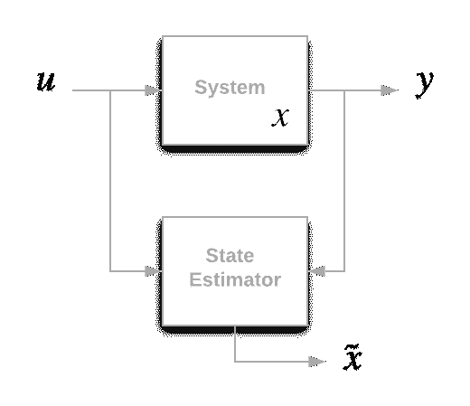
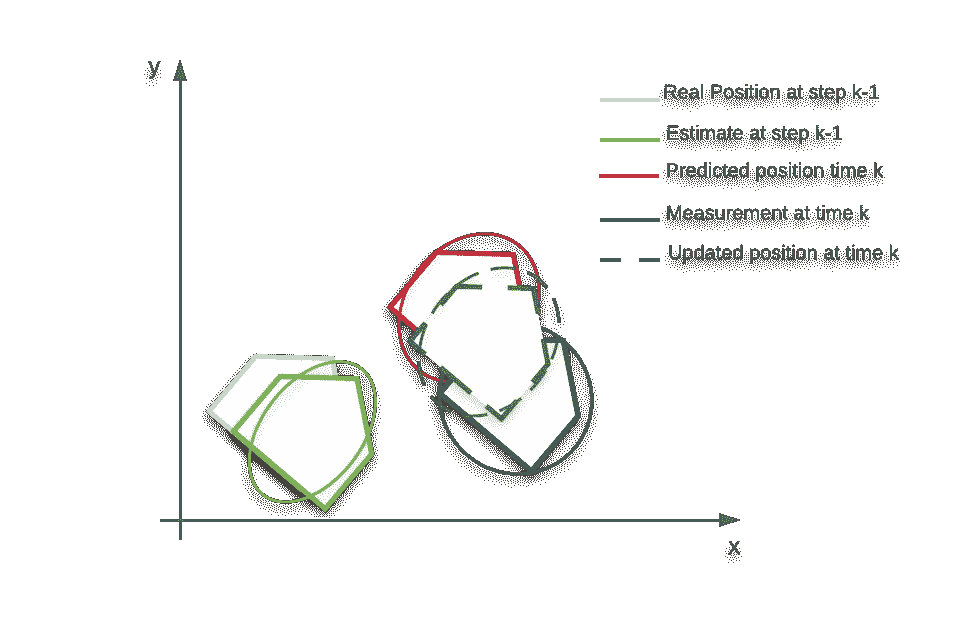
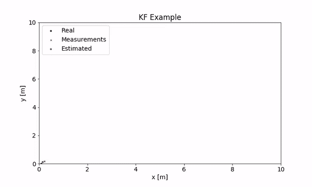

# 软件工程师用卡尔曼滤波器

> 原文：<https://towardsdatascience.com/kalman-filters-for-software-engineers-3d2a05dee465?source=collection_archive---------8----------------------->

## 深入探讨卡尔曼滤波器，有史以来最广泛和最有用的算法之一。

照片由[克莱姆·奥诺杰霍](https://unsplash.com/@clemono2?utm_source=unsplash&utm_medium=referral&utm_content=creditCopyText)在 [Unsplash](https://unsplash.com/s/photos/kalman-filter?utm_source=unsplash&utm_medium=referral&utm_content=creditCopyText) 拍摄

在和我的朋友交谈时，我经常听到:*“哦，卡尔曼滤波器……我通常研究它们，理解它们，然后我就什么都忘了”*。好吧，考虑到卡尔曼滤波器(KF)是世界上最广泛的算法之一(如果你环顾你的房子，你拥有的 80%的技术可能都有某种 KF 在里面运行)，让我们试着一劳永逸地弄清楚它们。

在这篇文章结束时，你将对 KF 的工作原理、背后的想法、为什么需要多种变体以及最常见的变体有一个直观而详细的了解。

# 状态估计

KFs 是所谓的状态估计算法的一部分。什么是状态估计？想象你有一个系统(姑且把它当做一个黑盒)。这个黑匣子可以是任何东西:你的风扇，一个化学系统，一个移动机器人。对于这些系统中的每一个，我们可以定义一个状态。状态是我们想要知道的变量的向量，它可以描述系统在特定时间点所处的“状态”(这就是为什么它被称为状态)。“能描述”是什么意思？这意味着，如果你知道在时间`k`的状态向量和给系统的输入，你就可以知道(使用一些系统工作的知识)系统在时间`k+1`的状态。

例如，假设我们有一个移动的机器人，我们关心知道它在空间的位置(我们不关心它的方向)。如果我们将状态定义为机器人位置`(x, y)`及其速度`(v_x, v_y)`，并且我们有一个机器人如何移动的模型，这将足以精确定位机器人在哪里以及下一个时刻它将在哪里。

所以状态估计算法估计系统的状态。为什么要估计呢？因为在现实生活中，系统的真实状态是外部观察者永远无法了解的。通常，有两种情况:您可以测量状态，但测量受到噪声的影响(每个传感器只能产生一定精度的读数，这可能对您来说不够)或者您无法直接测量状态。例如，使用 GPS 计算上述移动机器人的位置(我们决定将位置作为状态的一部分)，这可能会产生高达 10 米的测量误差，这对于您能想到的任何应用来说可能都不够。

通常，当您进行状态估计时，您可以安全地假设您知道系统的输入(因为它是您给出的)和输出。由于输出是测量的，因此也会受到一定测量噪声的影响。由此，我们将状态估计器定义为一个系统，它接收你想要估计其状态的系统的输入和输出，并输出系统状态的估计。
传统上用`x`表示状态，用`y`或`z`表示输出，`u`为输入，`tilde_x`为估计状态。

系统和状态估计器框图。

# 卡尔曼滤波器

您可能已经注意到，我们已经讨论了一些错误:

*   您可以测量系统的输出，但传感器会产生测量误差
*   你可以估计状态，但是作为一个估计，它有一定的可信度。

除此之外，我说过你需要系统的某种知识，你需要知道系统“行为”的模型(后面会有更多)，你的模型当然不是完美的，所以你会有额外的误差。

在 KFs 中，您使用高斯分布处理所有这些不确定性。高斯分布是一种很好的表示不确定事物的方式。你当前的信念可以用分布的均值来表示，而标准差则表示你对自己的信念有多自信。

穿着 KF:

*   您的估计状态将是一个具有特定均值和协方差的高斯随机变量(这将告诉我们算法有多“信任”其当前估计)
*   您对原始系统输出测量的不确定性将用一个均值为 0 的随机变量和一个特定的协方差来表示(这将告诉我们对测量本身的信任程度)
*   你的系统模型的不确定性将由一个均值为 0 的随机变量和一个特定的协方差来表示(这将告诉我们有多信任我们正在使用的模型)。

我们举几个例子来理解这背后的想法是什么。

1.  **坏模型，好传感器**
    让我们再次假设你想跟踪一个机器人的位置，你在传感器上花了很多钱，它们给你厘米级的精度。另一方面，你对机器人一点也不感兴趣，你谷歌了一下，发现了一个非常基本的运动模型:随机行走(基本上是一个运动仅由噪声给出的粒子)。很明显，你的模型不是真的好，不能真的被信任，而你的测量是真的好。在这种情况下，您可能会用非常窄的高斯分布(小方差)来模拟测量噪声，而用非常宽的高斯分布(大方差)来模拟不确定性。
2.  **坏的传感器，好的模型**
    相反，如果你有坏的传感器(例如 GPS ),但你花了很多时间来为你的系统建模。在这种情况下，您可能会用非常窄的高斯分布(小方差)来模拟模型不确定性，而用非常宽的高斯分布(大方差)来模拟测量噪声。

宽方差与小方差高斯分布。

估计的状态不确定性呢？KF 会根据评估过程中发生的事情来更新它，你唯一要做的就是将它初始化为一个足够好的值。“足够好”取决于你的应用，你的传感器，你的模型，等等。一般来说，KF 需要一点收敛到正确的估计。

# KF 是如何工作的？

正如我们所说，为了让 KF 工作，你需要对系统有“一些了解”(一个“不确定的”，也就是不完美的模型)。尤其是 KF，你需要两种型号:

*   **状态转换模型**:给定某时刻`k`的状态和输入，给出某时刻`k+1`的状态的函数。

*   **测量模型**:给定某一时刻的状态`k`，给出同一时刻的测量值的函数

稍后，我们将看到为什么我们需要这些函数，让我们先看一些例子来理解它们的含义。

**状态转换模型**
这个模型告诉你你的系统如何随时间演化(如果你还记得的话，之前我们提到过一个状态必须足够描述性才能推断出系统随时间的行为)。这很大程度上取决于系统本身以及你对系统的关注程度。如果你不知道如何为你的系统建模，一些谷歌搜索会有所帮助。对于移动的物体(如果以适当的采样率测量)，可以使用恒速模型，假设物体以恒定的速度移动，对于车辆，可以使用独轮车模型等。让我们假设，以某种方式，我们得到了一个模型。我们在这里做了一个重要的假设，这是 KF 工作所必需的:你当前的状态仅仅依赖于先例。换句话说，系统状态的“历史”浓缩在前一个状态中，也就是说，给定前一个状态，每个状态都独立于过去。这也被称为**马尔可夫假设**。如果这不成立，你就不能仅仅用先例来表达当前的状态。

**测量模型**
测量模型告诉你输出(可以测量的)和状态是如何联系在一起的。直觉上，您需要这个，因为您知道测量的输出，并且您想要在估计期间从它推断状态。同样，这种模式因情况而异。例如，在移动机器人示例中，如果您关心位置，并且您有 GPS，则您的模型是身份函数，因为您已经在测量状态的噪声版本。

每个步骤的数学公式和解释如下:

那么 KF 实际上是如何工作的呢？该算法分两步工作，称为预测和更新。让我们假设我们在时间`k`并且我们在那个时间有我们估计的状态。首先，我们使用状态转换模型，我们使估计的状态发展到下一个时刻`(1)`。这相当于说:给定我当前对状态的信念、我拥有的输入和我对系统的了解，我期望我的下一个状态是这样的。这是预测步骤。

现在，由于我们也有了输出和测量模型，我们实际上可以使用真实的测量来“校正”预测。在更新步骤中，我们取期望状态，计算输出(用测量模型)`(2)`，并与实际测量输出进行比较。然后我们以一种“聪明的方式”使用两者之间的差异来修正我们对状态`(3)`的估计。

通常，我们用顶点`-`表示，在校正之前，来自预测步骤的状态估计。 *K* 称为卡尔曼增益。这才是真正的聪明之处: *K* 取决于我们对度量的信任程度，我们对当前估计的信任程度(这取决于我们对模型的信任程度)，并根据这些信息 *K* “决定”用度量对预测的估计进行修正的程度。如果我们的测量噪声与我们对来自预测步骤的估计的信任程度相比是“小”的，我们将使用测量来大量校正估计，如果相反，我们将最小程度地校正它。

*注意:为了简单起见，我写方程时就好像我们在处理正态变量，但是你必须考虑到，在每一步我们都在处理随机高斯变量，因此我们需要通过函数传播变量的协方差，而不仅仅是均值。*

举个例子吧。让我们想象一下，我们正在(再次)跟踪一个机器人的位置。真实位置以灰色显示，在时间`k`我们认为机器人处于绿色位置，估计协方差表示为椭圆(如果您不熟悉这种表示，请看这里的)。粗略地说，从椭圆的形状可以看出，与向前运动方向上的定位相比，我们的滤波器在这一步对横向定位更有信心。在预测步骤之后，我们使用状态转换模型让系统进化，我们认为新的位置是红色的。由于椭圆在横向方向上变得更大，我们现在对新的估计位置不太确定(例如，因为我们不太信任模型)。然后我们读取我们的全球定位系统，我们得到了黑色的位置。利用更新步骤，实际位置估计将是深绿色虚线。如果我们更信任模型(与测量噪声协方差相比更低的协方差)，则估计将更接近红色，或者如果我们更信任测量(与模型不确定性相比更低的噪声测量协方差)，则估计将更接近测量。

KF 算法每一步的实际位置和估计的例子。

# KFs 家族

根据 KFs 使用的模型类型(状态转换和测量), KFs 可以分为两大类:如果模型是线性的，就有线性卡尔曼滤波器，而如果模型是非线性的，就有非线性卡尔曼滤波器。

为什么有区别？假设你的变量是高斯型的，当通过线性函数时，高斯型变量仍然是高斯型变量，如果通过非线性函数，这就不成立。这打破了卡尔曼假设，因此我们需要找到修复它的方法。

历史上，人们发现了两种主要的方法:用模型作弊和用数据作弊。如果你在模型中作弊，你基本上是将当前估计值周围的非线性函数线性化，这样你就把自己带回了工作的线性情况。这种方法被称为**扩展卡尔曼滤波器** ( **EKF** )。这种方法的主要缺点是你必须能够计算出`f()`和`h()`的雅可比矩阵。或者，如果你用数据作弊，你使用你的非线性函数，但是然后你试着“高斯化”(如果这个词存在的话)你做的非高斯分布。这是通过一种称为无味变换的智能采样技术实现的。这种变换允许您用均值和协方差来描述(近似地)分布(只有高斯分布才由前两个矩完全描述)。这种方法叫做**无迹卡尔曼滤波** ( **UKF** )。理论上，UKF 优于 EKF，因为与线性化模型得到的近似相比，无迹变换给出了结果分布的更好近似。在实践中，你必须有相当大的非线性，才能真正看到大的差异。

# KF 在行动

既然说了这么多关于一个带 GPS 的移动机器人，我就针对这个案例做了一个简短的演示(想玩的话可以在这里[找到代码](https://github.com/LorePep/blogposts_code/blob/master/KF_mobile_robot_example.ipynb))。使用[独轮车模型](http://faculty.salina.k-state.edu/tim/robotics_sg/Control/kinematics/unicycle.html)生成机器人运动。用于 KF 的状态转换模型是一个[恒速模型](http://ais.informatik.uni-freiburg.de/teaching/ws09/robotics2/pdfs/rob2-12-tracking.pdf)，其状态包含 x 和 y 位置、转向角及其导数。

机器人正在及时移动(黑色显示的真实位置)，在每一步你都会得到一个非常嘈杂的 GPS 测量，它会给出`x`和`y`(红色)并估计位置(蓝色)。您可以尝试不同的参数，看看它们如何影响状态估计。如你所见，我们可以进行非常嘈杂的测量，并得到真实位置的良好估计。

KF 在行动:一个机器人的真实路径(黑色)是用来自噪音测量(红色)的 KF(蓝色)跟踪的。

# 奖励:卡尔曼增益的直观意义

让我们看看线性 KF 情况下的卡尔曼增益公式，并尝试更深入地了解增益是如何工作的。

其中`P_k`是当前估计状态的协方差(我们对估计有多有信心)，`C`是测量模型的线性变换，使得`y(k) = Cx(k)`和 R 是测量噪声的协方差矩阵。请注意，分数符号并不真正正确，但它使可视化发生的事情更容易。

根据等式，如果 R 变为 0，则我们有:

代入我们定义的算法步骤`(3)`，我们可以看到，我们将完全忽略预测步骤结果，并且我们使用测量模型的逆变换来获得仅来自测量的状态估计。

相反，如果我们非常信任模型/估计，`P_k`将趋向于 0，给出:

因此，我们有一个与预测阶跃输出相同的最终估计。

需要注意的是，我交替使用了“信任模型”和“信任当前估计”。它们并不相同，但它们是相关的，因为我们对预测步骤的估计的信任程度是我们对模型的信任程度的组合(因为预测步骤是仅使用模型完成的)，加上我们对先前过滤步骤的估计的信任程度。

# 额外收获 2:图书馆

有很多很好的在线计算 KFs 的库，这里是我最喜欢的一些。

作为一名围棋爱好者，我将从这个非常好的围棋库开始，它有几个预先实现的模型:

 [## 罗塞姆斯利/卡尔曼

### 为具有非均匀时间的连续时间索引模型实现卡尔曼滤波和平滑的软件包…

github.com](https://github.com/rosshemsley/kalman) 

对于 Python，可以看一下[https://pykalman.github.io/](https://pykalman.github.io/)。

*结论:我们深入了解了什么是状态估计，卡尔曼滤波器如何工作，它们背后的直觉是什么，如何以及何时使用它们。我们介绍了一个玩具(但现实生活中的)问题，并看到了如何用卡尔曼滤波器解决它。然后，我们更深入地了解了卡尔曼滤波器的实际功能。*

干杯！