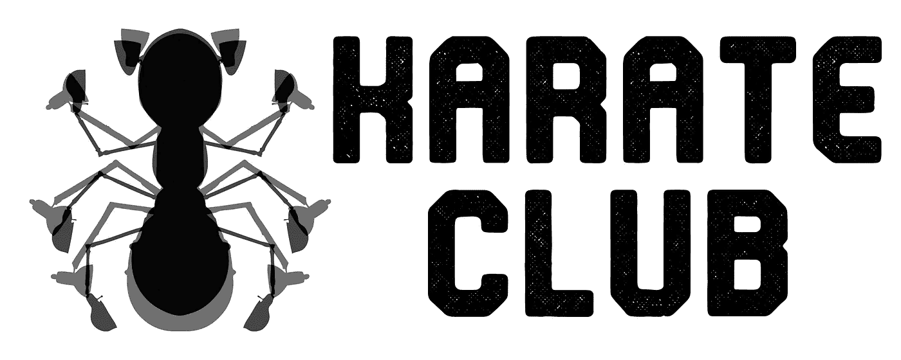
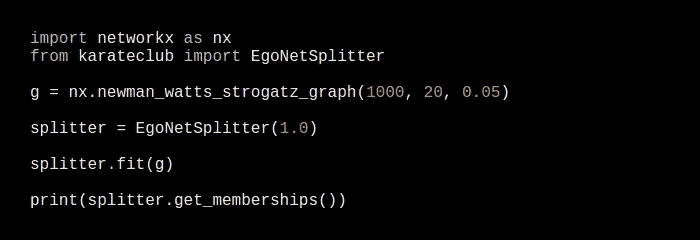
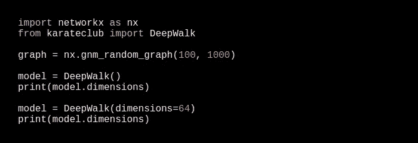
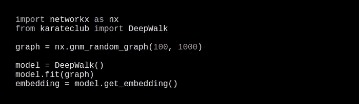
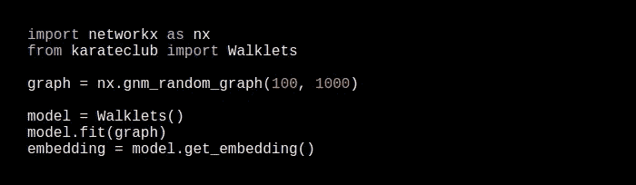
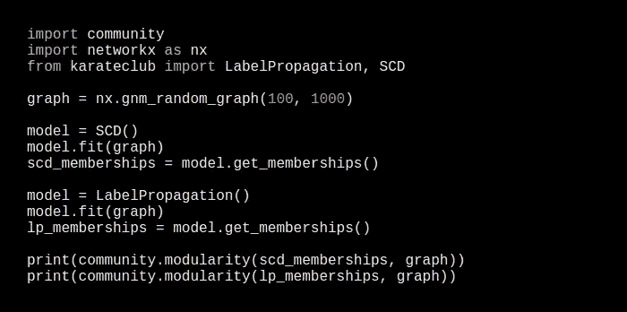

# 空手道俱乐部一个用于图形表示学习的 Python 库

> 原文：<https://towardsdatascience.com/karate-club-a-python-library-for-graph-representation-learning-e70857112476?source=collection_archive---------25----------------------->

## **空手道俱乐部**是一个无监督的机器学习扩展库，用于 NetworkX Python 包。

[*空手道俱乐部*](https://github.com/benedekrozemberczki/karateclub) 由最先进的方法组成，对图形结构化数据进行无监督学习。参见此处的文档[。](https://github.com/benedekrozemberczki/karateclub)简单来说就是小规模图挖掘研究的瑞士军刀。首先，它提供了节点和图级别的网络嵌入技术。第二，它包括多种重叠和非重叠社区检测方法。实施的方法涵盖了广泛的网络科学 *(NetSci，Complenet)* 、数据挖掘 *(ICDM，CIKM，KDD)* 、人工智能 *(AAAI，IJCAI)* 和机器学习 *(NeurIPS，ICML，ICLR)* 会议、研讨会和著名期刊的文章。

## **一个简单的例子**

空手道俱乐部让现代社区探测技术的使用变得相当容易(参见[这里](https://karateclub.readthedocs.io/en/latest/notes/introduction.html)的附带教程)。下面的代码片段在合成图上使用了[重叠社区检测算法](https://www.kdd.org/kdd2017/papers/view/ego-splitting-framework-from-non-overlapping-to-overlapping-clusters)。

# 设计原则

当我们创建空手道俱乐部时，我们使用了面向 API 的机器学习系统设计观点，以便制作一个终端用户友好的机器学习工具。这种面向 API 的设计原则需要一些简单的想法。在本节中，我们将通过适当的示例详细讨论这些想法及其明显的优势。

**封装的模型超参数和检查**

通过使用适当的 Python 对象的构造器来创建无人监管的空手道俱乐部模型实例。这个构造函数有一个默认的超参数设置，允许合理的开箱即用模型使用。简单地说，这意味着最终用户不需要非常详细地理解内部模型机制就可以使用我们框架中实现的方法。我们设置这些默认的超参数来提供合理的学习和运行时性能。如果需要，这些模型超参数可以在模型创建时用构造函数的适当参数化来修改。超参数存储为公共属性，以允许检查模型设置。

我们通过上面的代码片段演示了超参数的封装。首先，我们想用标准的超参数设置为一个由 *NetworkX* 生成的*鄂尔多斯-雷尼图*创建一个嵌入。构建模型时，我们不改变这些默认超参数，我们可以打印尺寸超参数的标准设置。第二，我们决定设置不同数量的维度，因此我们创建了一个新模型，并且我们仍然可以公开访问维度超参数。

**类的一致性和不扩散**

空手道俱乐部中的每个无监督机器学习模型都是作为一个独立的类来实现的，它继承了 ***估计器类*** 。在我们的框架中实现的算法具有有限数量的公共方法，因为我们不假设终端用户对与特定技术相关的算法细节特别感兴趣。通过使用****fit()****方法来拟合所有模型，该方法采用输入(图形、节点特征)并调用适当的私有方法来学习嵌入或聚类。节点和图嵌入由***get _ embedding()***公共方法返回，集群成员通过调用 ***get_memberships()* 检索。****

****

**在上面的代码片段中，我们创建了一个随机图，以及带有默认超参数的**模型，我们使用 public***fit()****方法拟合这个模型，并通过调用 public***get _ embedding()***方法返回嵌入。通过更改模型导入和构造函数，这个示例可以被修改为创建一个[***walk lets***](https://arxiv.org/abs/1605.02115)*嵌入，只需很少的工作—这些修改导致了下面的代码片段。******

******

***看这两个片段， ***API 驱动设计*** 的优势是显而易见的，因为我们只需要做一些修改。首先，必须改变嵌入模型的导入。第二，我们需要改变模型结构，默认的超参数已经设置好了。第三，由 ***DeepWalk*** 和 ***Walklets*** 类提供的公共方法行为方式相同。用 ***fit()*** 学习嵌入，并由 ***get_embedding()返回。*** 当用于特征提取的上游无监督模型表现不佳时，这允许对代码进行快速和最小的改变。***

****标准化数据集摄取**我们将空手道俱乐部设计为在模型拟合时使用标准化数据集摄取。实际上，这意味着具有相同目的的算法使用相同的数据类型进行模型训练。详细地说:**

1.  **基于邻域和结构节点嵌入技术使用单个 ***网络 x 图*** 作为 fit 方法的输入。**
2.  **属性节点嵌入过程以一个 ***NetworkX 图*** 作为输入，特征表示为一个 ***NumPy 数组*** 或一个 ***SciPy 稀疏矩阵*** 。在这些矩阵中，行对应于节点，列对应于特征。**
3.  **图级嵌入方法和统计图指纹以 NetworkX 图 的 ***列表作为输入。*****
4.  **社区检测方法使用一个 ***NetworkX 图*** 作为输入。**

****高性能模型力学****

**图形挖掘算法的底层机制是使用广泛可用的 Python 库实现的，这些库不依赖于操作系统，并且不需要其他外部库的存在，如 ***TensorFlow*** 或 ***PyTorch*** 的存在。空手道社内部的图形表示使用 ***NetworkX*** 。密集线性代数运算用 ***NumPy*** 完成，它们的稀疏对应使用 ***SciPy*** 。隐式矩阵分解技术利用 ***GenSim*** 包，依赖图形信号处理的方法使用 ***PyGSP。*****

****标准化输出生成和接口****

*****空手道俱乐部*** 的标准化输出生成确保了用于相同目的的无监督学习算法总是以一致的数据点排序返回相同类型的输出。这个设计原则有一个非常重要的结果。当某种类型的算法被相同类型的算法替换时，使用上游无监督模型的输出的下游代码不必改变。具体来说，使用我们的框架生成的输出使用以下数据结构:**

1.  *****节点嵌入算法*** (邻域保持、属性化和结构化)调用***get _ embedding()***方法时，总是返回一个 ***NumPy 浮动数组*** 。数组中的行数是顶点数，行索引总是对应于顶点索引。此外，列数是嵌入维数。**
2.  *****全图嵌入方法*** (谱指纹，隐式矩阵分解技术)返回一个 ***Numpy 浮动数组*** 当***get _ embedding()***方法被调用。行索引对应于单个图形在输入图形列表中的位置。同样，列表示嵌入维度。**
3.  *****社区检测程序*** 返回一个 ***字典*** 当***get _ memberships()***方法被调用时。节点索引是关键字，对应于关键字的值是顶点的社区成员。某些图聚类技术创建节点嵌入，以便找到顶点聚类。当调用***get _ embedding()***方法时，这些返回一个 ***NumPy 浮点数组*** 。该数组的结构类似于节点嵌入算法返回的数组。**

**我们通过下面的代码片段演示了标准化的输出生成和接口。我们创建随机图的聚类，并返回包含聚类成员的字典。使用外部社区库，我们可以计算这些集群的模块性。这表明标准化的输出生成使得与外部图形挖掘和机器学习库的接口变得容易。**

****

****限制****

**空手道俱乐部目前的设计有一定的局限性，我们对输入进行假设。我们假设 ***NetworkX*** 图是无向的，由单个 ***强连通分量*** 组成。所有算法都假设节点是用整数连续索引的*，起始节点索引为 0。此外，我们假设图不是多部分的，节点是同质的，边是不加权的(每条边有一个单位权重)。***

***在整个图形嵌入算法的情况下，图形集中的所有图形必须修改先前列出的关于输入的要求。基于 **Weisfeiler-Lehman** 特征的嵌入技术允许节点具有单个字符串特征，可以使用 ***特征*** 键访问该特征。如果没有这个关键字，这些算法默认使用度中心性作为节点特征。***