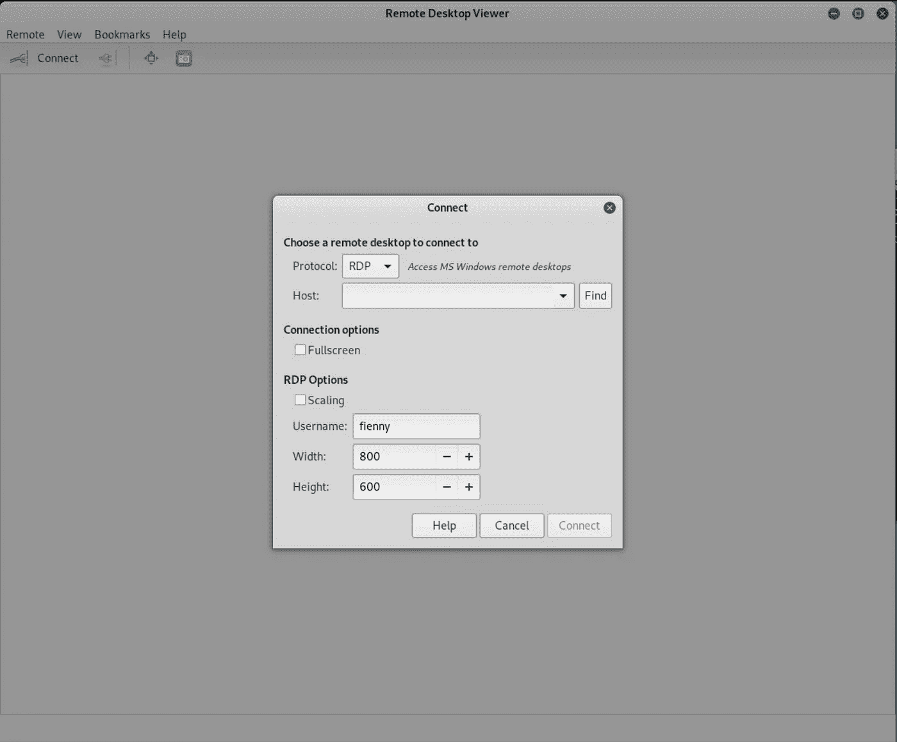
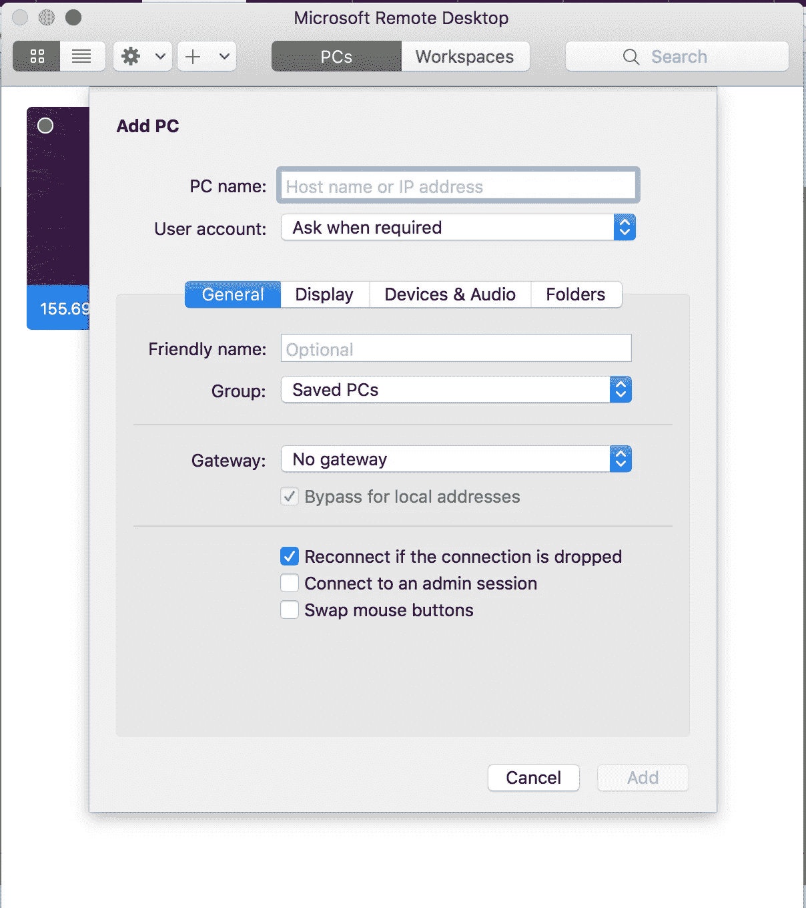
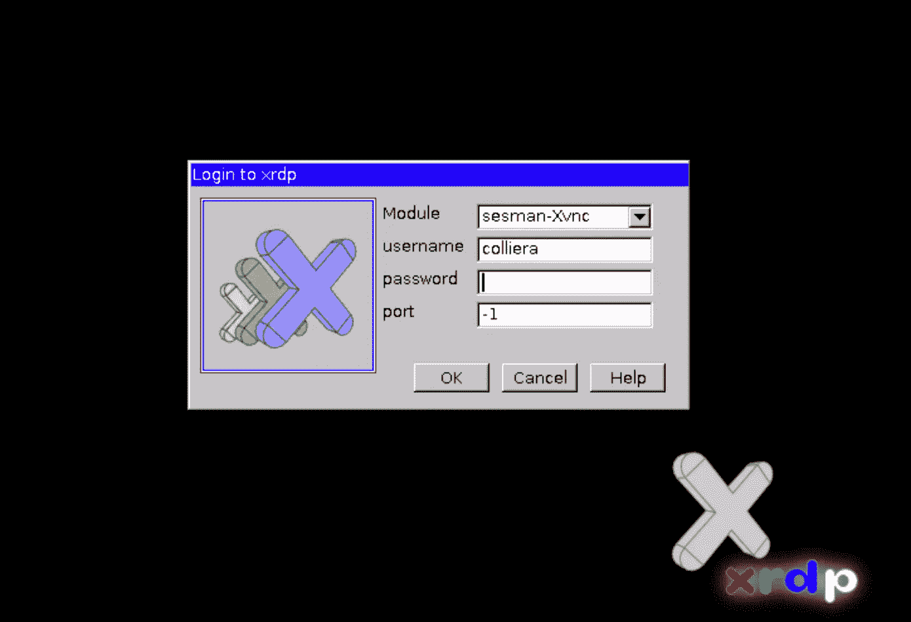
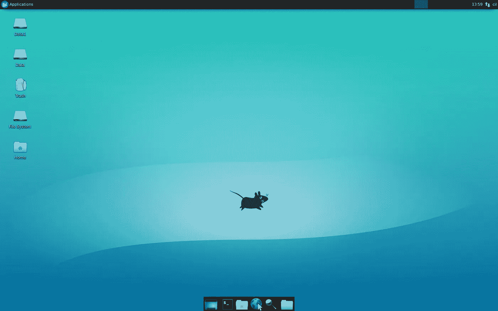
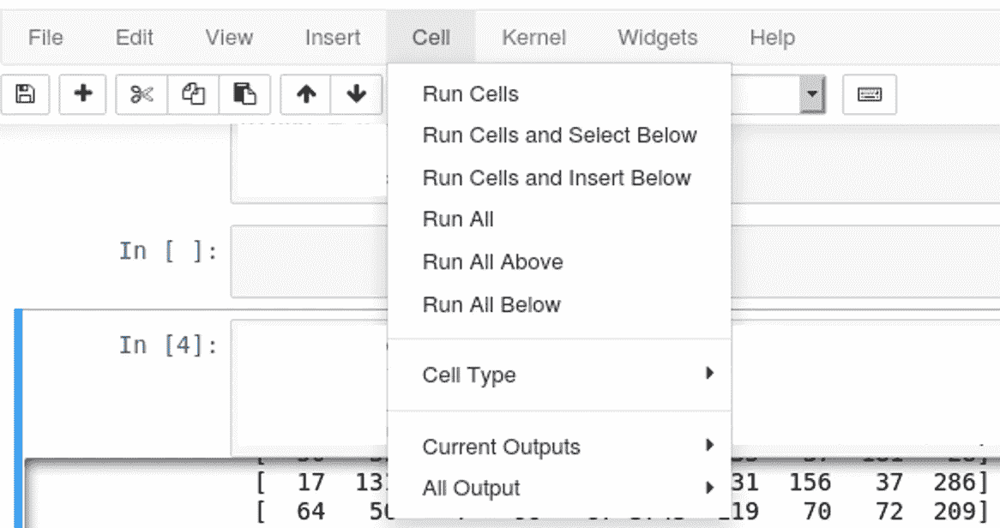

# 保持 Jupyter 笔记本运行，即使浏览器关闭

> 原文：<https://towardsdatascience.com/keep-jupyter-notebook-running-even-after-browser-is-closed-9a1937b7c615?source=collection_archive---------5----------------------->

## 保持 Jupyter 笔记本运行的方法及其缺点

连续几天打开浏览器标签来运行 Jupyter 笔记本文件并不是最令人兴奋的工作。可能会很麻烦。以下是我找到的一些解决问题的方法。每种解决方案都有其优点和缺点，所以不再多说，让我们开始探索每一种解决方案吧！


[安德鲁·尼尔](https://unsplash.com/@andrewtneel?utm_source=medium&utm_medium=referral)在 [Unsplash](https://unsplash.com?utm_source=medium&utm_medium=referral) 上拍照

# **使用 Google Colab**

协作实验室，或简称为“Colab”，允许我们在没有配置和计算资源(如 GPU / TPU)的情况下运行 Python 代码。使用它，我们甚至可以通过在 CLI 命令前添加前缀`%`来运行一些 bash 命令。这种方法的好处是它是免费的，允许从 Drive 或 Github 导入文件/数据集。它与 Google Drive 很好地集成在一起，我们可以编写代码来自动从 Drive 加载一些数据集，并将网络/结果保存到 Drive。

然而，它有几个缺点。首先，它有[有限的计算使用量](https://research.google.com/colaboratory/faq.html#resource-limits)。一旦达到限制，它将停止运行代码，不久之后，文件/变量值将丢失。然而，极限并不是限制性的。我发现这对于在一些数据集上训练神经网络来说已经足够好了，比如[叶子分类](https://www.kaggle.com/c/leaf-classification)数据集。此外，如果您需要更大的计算使用/资源，可以连接到一个本地运行时[。](https://research.google.com/colaboratory/local-runtimes.html)

另一个缺点是你不能关闭浏览器标签太长时间，也就是超过 90 分钟。根据我的经验，这可以通过连接到一个本地运行时[来延长。](https://research.google.com/colaboratory/local-runtimes.html)

最后，当选项卡关闭时，它可能会丢失写入的日志。当您需要将所有日志都写入 Jupyter 笔记本文件时，这可能是一个问题。处理这种情况的一些方法是将输出记录到另一个文件中，或者使用特定的记录器。

# **将其作为 python 脚本运行**

有多种方法可以将 Jupyter 笔记本文件作为 python 脚本运行。

**1。将其转换成 python 文件**

*最简单的*方式是在浏览器中打开 Jupyter 笔记本文件，点击文件>下载为> Python(。py)。之后，我们可以像运行典型的 python 文件一样运行输出文件:

```
python file_name.py
```

但是，记录在 Jupyter 笔记本上的文件会丢失。

**2。直接使用命令提示符运行**

另一种方法是直接使用 CLI 运行 jupyter 笔记本。它将允许我们在整个执行过程中将所有日志记录打印在 jupyter 笔记本文件中。为此，有两种程序可供选择， **runipy** 或 **nbconvert** 。要安装 runipy 或 nbconvert，我们可以使用 **pip/conda** 。

```
# Using pip
pip install ipython
# Using conda
conda install ipython
```

如果我们使用 runipy 并安装了它，要运行 jupyter 笔记本，我们可以键入:

```
runipy MyNotebookFileName.ipynb
```

要将每个单元格的输出保存回笔记本文件，请运行:

```
runipy MyNotebookFileName.ipynb
```

如果我们使用并安装了 nbconvert，要运行 jupyter 笔记本，我们可以键入:

```
jupyter nbconvert --to notebook --execute mynotebook.ipynb
```

对于 [runipy](https://pypi.org/project/runipy/) 和 [nbconvert](https://nbconvert.readthedocs.io/en/latest/execute_api.html) ，在这两个站点中还可以找到其他几个配置选项，如超时、报告生成和输出文件生成。

为了保持这个命令在远程服务器上运行，即使我们与远程服务器断开连接，我们可以配置 **screen** 或 **tmux** ，并在其中任何一个中运行 Jupyter 的命令。

然而，我发现这种方法的一个缺点是缺少向用户显示的日志记录。因此，即使脚本会错误地停止执行，也很难跟踪代码的进度。当我使用这种方法时，我利用 **nvidia-smi** 和 **htop** bash 命令来尝试猜测程序的当前状态。

# **使用远程桌面**到服务器

这是迄今为止我最喜欢的方法。TLDR，它处理了以前方法的所有缺点。它允许我看到代码的进度以及每个单元的输出。即使当我断开连接时，脚本也保持运行。

**1。在服务器上配置远程桌面**

如果服务器已经配置了远程桌面，您可以跳过此步骤。这一步可能是所有步骤中最棘手的一步，尤其是当服务器的操作系统版本过时时。

a.通过 SSH 连接到服务器

b.安装一些软件包

```
sudo apt update
sudo apt install -y ubuntu-desktop xrdp
```

PS:如果你在服务器上没有 sudo 权限，或者，你可以使用`wget`从 Github 安装这个包，然后[从源代码](https://github.com/neutrinolabs/xrdp/wiki#building-from-sources)编译它。如果下载的`xrdp`版本有一些错误或者与操作系统不兼容，你可能也需要这样做来降级`xrdp`的版本。

c.在服务器上编辑 RDP 配置文件`/etc/xrdp/xrdp.ini`。最低配置可能如下所示:

```
[globals]
bitmap_cache=yes
bitmap_compression=yes
port=3389
crypt_level=low
channel_code=1
max_bpp=24

[xrdp1]
name=sesman-Xvnc
lib=libvnc.so
username=ask
password=ask
ip=127.0.0.1
port=ask-1
```

请注意所写的端口，这对于建立连接非常重要。此外，如果您的服务器是 EC2 实例，我们需要适当地编辑安全组，以允许端口`3389`中的入站 TCP 连接。

d.重新启动 xrdp

```
sudo service xrdp restart
```

e.为 RDP 连接安装窗口管理器。这包括更改用户的`.xsession`文件的内容。

```
sudo apt install -y xfce4 xfce4-goodies
echo xfce4-session >~/.xsession
```

**您已经准备好连接了！**💃🏽💃🏽

**2。在您的计算机中设置远程桌面客户端**

这一步将允许您的计算机连接到服务器。根据您电脑的操作系统，操作方法会有所不同。

对于 Linux，安装 **vinagre** 并打开。输入服务器的 IP 地址、用户名和 RDP 端口。然后，单击连接。

对于 Windows 或其他系统，可以使用**远程桌面查看器**完成上述步骤。



我的 Kali Linux 计算机上的远程桌面查看器

对于 Mac，我使用的是**微软远程桌面**。正确填写表格，然后单击添加。



Mac 版微软远程桌面。

之后，系统会提示您输入凭据。让港口保持原样。



xrdp 登录表单

一旦你通过认证，你应该会看到你的桌面。



远程桌面！

**3。在服务器的浏览器中运行 jupyter 笔记本**

这可以通过在终端中键入`jupyter notebook`来完成，这将打开一个浏览器。然后，在浏览器中导航到相应的 jupyter 笔记本文件并将其打开。

单击工具栏上的单元格>全部运行。



然后关闭远程桌面客户端应用程序。切记不要关闭浏览器！😉😉

全部完成！现在，您可以让浏览器在远程桌面上运行，并随时断开连接。您也可以通过重新连接来检查程序的进度。