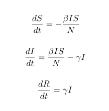
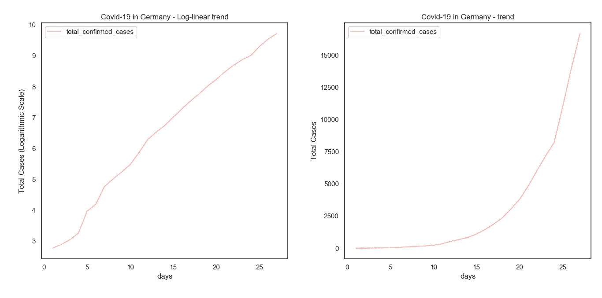
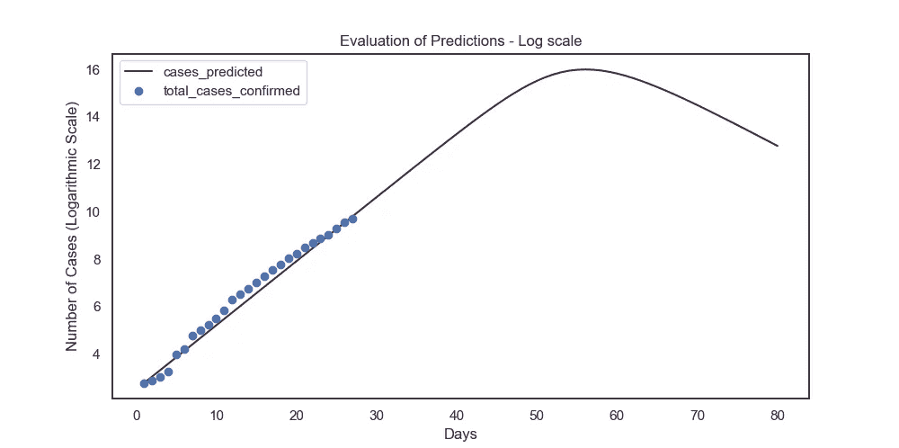
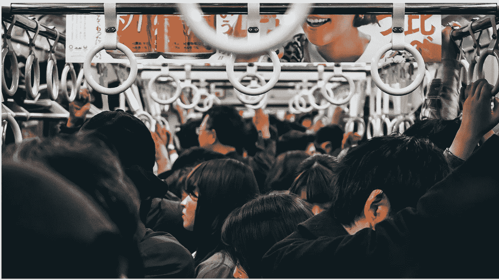
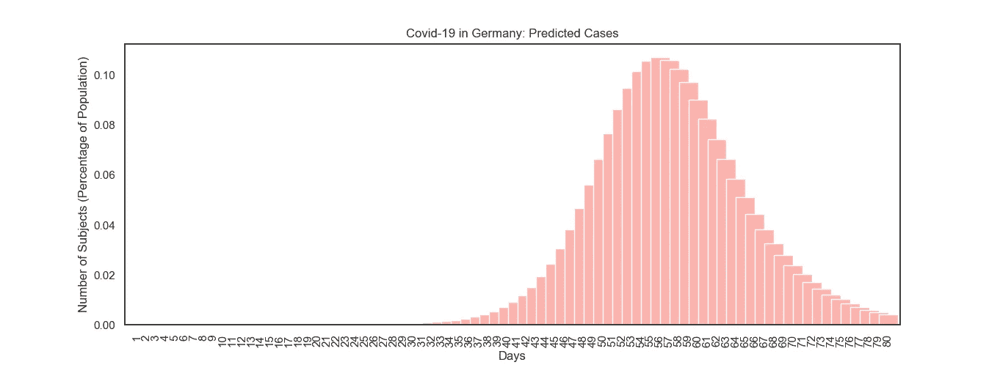
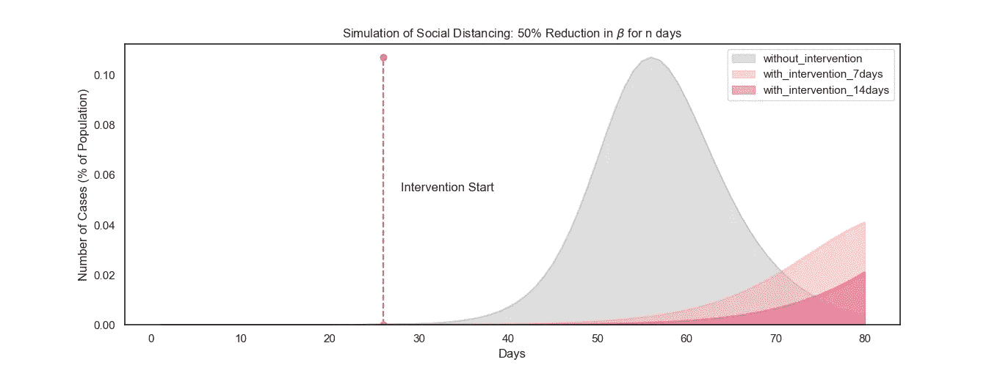
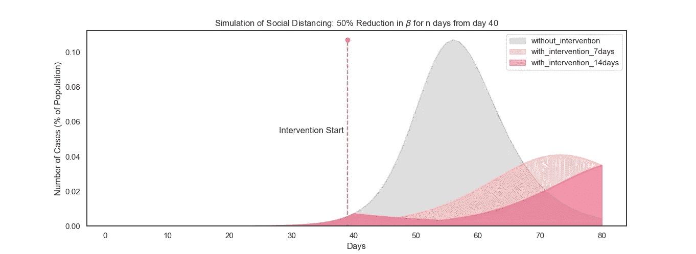

# 请保持距离

> 原文：<https://towardsdatascience.com/keep-your-distance-please-a-case-for-social-distancing-in-troubling-times-ff979f8e91a8?source=collection_archive---------40----------------------->


来自 [Pexels](https://www.pexels.com/photo/person-holding-hand-sanitizer-3962332/?utm_content=attributionCopyText&utm_medium=referral&utm_source=pexels) 的 [Anna Shvets](https://www.pexels.com/@shvetsa?utm_content=attributionCopyText&utm_medium=referral&utm_source=pexels) 的照片

## 乱世中保持社交距离的一个例子

**免责声明:这篇文章无意引起恐慌。无论是流行病学还是数学建模，我都不是专家。下面采用的方法充满了已知的和潜在的假设。这意味着推动社会距离和自我隔离。这是一篇观点文章，而不是公共政策的建议。**

2019 年 11 月:在中国湖北省一个经常被遗忘的城市武汉，人们在潮湿的市场上做着一天的生意，对即将在世界上爆发的浩劫知之甚少。

快进到 2020 年 3 月。

新的一年来了又去，随之而来的是来自中国的关于一种新病原体的第一个故事，这种病原体是世界前所未见的:新冠肺炎。

席卷中国大陆，现在已经遍布全球，几乎就像取自反乌托邦小说。

当它到达我居住的国家印度的海岸时，我不禁感到有点害怕和担心。来自受影响国家的故事是可怕的、沉闷的和绝望的。就在昨天(2020 年 3 月 20 日)，意大利经历了最糟糕的一天，一天之内就有近 700 人死于这种可恶的病毒。

我必须承认，我没有把这种威胁当回事，就像我这个年龄段的许多人一样。在午餐时，在走廊的谈话中，以及在 Whatsapp 上，我们经常听到下面的观点。

> “哦，如果它感染了很多人，那又怎么样……只有 2%的人死亡。这比中东呼吸综合征或 H1N1 甚至普通流感都要低得多。我们为什么要担心这个？”

事后看来，争论中通常被忽视的是受害者的年龄严重混淆了这一点。

统计理论告诉你要小心数字。请谨慎使用这些数字。对数字要有耐心。

你*总是*需要哄着数字给出见解。

年龄越大，死亡率越高。[且在 65 岁以上](https://www.businessinsider.in/science/news/80-of-us-coronavirus-deaths-have-been-among-people-65-and-older-a-new-cdc-report-says-heres-what-it-reveals-about-the-us-cases/articleshow/74701731.cms)显著增高。

新冠肺炎是婴儿潮一代杀手。

就像 20 多岁的普通印度人一样，我童年的大部分夏天都是在祖父母家度过的，我对那些夏天有很多珍贵的记忆。很长一段时间，因为他们的持续存在，我确信他们是不可战胜的。他们会一直在那里。现在，我第一次害怕了。

我非常害怕。

以至于在过去的一周左右，我一直在温习流行病学理论。从梅在 1982 年的论文中引入了基本的再生数 Rₒ，到迪克曼、奥多、汉斯·黑斯特比克和汤姆·布里顿最近的工作，他们形式化了 Rₒ.的定义和性质

这篇文章着眼于采用一种疾病模型，让我们深入了解社会距离和隔离是如何有所帮助的。

确实如此，相当明显。

# 模拟新冠肺炎:疾病不可能(或者是？)

*由于这个系统的数学本质，下面的部分可能会很枯燥。我会尽我所能，尽量保持内容简洁。然而，并不是所有的数学都可以被过滤，所以请原谅我。*

在这一部分中，我们将尝试为德国共享的数据拟合模型。同样的分析可以在其他国家进行，只要数据是公开的，不用担心抽样偏差和代表性偏差。

在这个关键时刻，重申以下事实是至关重要的，即这一分析和研究结果绝不是对现实的准确描述，仅仅因为各种假设在现实生活中变得无效。

最终，这一分析应该会促使读者呆在家里。为做出这样的决定感到骄傲和满意。

在模拟新冠肺炎时，我们不是在模拟个人可能性。我们没有足够的公开数据。我们正在尝试的是在传染病的行为下建立人口模型。

虽然有各种各样的模型( *R: earlyR，EpiEstim* )，但我们将实现的模型是其中最简单的。模型越复杂，内部工作的假设就越多；在当前疫情肆虐、威胁生命的情况下，我不会做出任何我不完全理解的假设。

我们采用的模型称为 SIR 模型。1927 年在《皇家统计杂志》上首次讨论，它是一个动态模型，将人口/军政府分成三大组:

*   **易感**:任何没有被感染但可能被感染的人都被认为是易感者
*   **受感染**:任何感染并传播疾病的个人都被认为是受感染的
*   **移除**:任何因康复、隔离或死亡而不在感染或易感类别的个人被视为移除

这个模型的一个关键假设是感染保证了未来的免疫力。所以像流感这样的疾病不能用 SIR 框架来建模，而水痘和麻疹可以。截至目前，新冠肺炎还没有表现出任何康复病人复发的行为。

此外，我们不做任何假设人口的生命。这些是出生率，以及由新冠肺炎病毒以外的原因导致的死亡率。

从一个群体到另一个群体的运动受一组微分方程支配。



SIR 模型下的状态运动

这些方程很重要，因为它们求解的参数。

β、γ是该模型中最重要的两个元素。

*   β控制着接触率，即每个感染者每天被感染的平均接触次数
*   γ控制每天的清除率或恢复/死亡/隔离人员的比例

在最近的公共政策术语中，

*   β是控制你的**社交距离**的参数(β越低，联系越少)
*   γ控制你的**自我隔离策略**(*γ越高，传染期越短*)
*   总的来说，rₒ=(β/γ)∞*每个原发病例对应的继发病例数*

如果在这篇文章的结尾有什么是你应该记住的，那就是这个。

降低你的贝塔系数，增加伽玛系数。句号。

解了这些方程，你就能理解疾病是如何发展的。

现在，我可以听到你说“*够了，理论…真正的模特在哪里？*

我们提取了德国的数据，因为他们的数据似乎是维护得最好的(由罗伯特·科赫研究所)，通过运行一个简单的 python 脚本，从他们的[维基百科页面](https://en.wikipedia.org/wiki/2020_coronavirus_pandemic_in_Germany)提取数据。其他被考虑的国家有意大利和美国。

*注:印度的数据不完整，人们担心该国的测试是否充分。西班牙某些天的数据不完整。*

抛弃时间序列索引，我们采用从第一天开始的天数表示法。让我们绘制数据。



使用 Python 的`**scipy**` 模块，我们求解常微分方程，得到β和γ的估计值。

```
def SIR(y, t, N, beta, gamma):
    S, I, R = y
    dSdt = -beta * S * I / N
    dIdt = beta * S * I / N - gamma * I
    dRdt = gamma * I
    return dSdt, dIdt, dRdt

def loss(parameters, data, method='l2'):
    size = len(data)
    beta, gamma = parameters
    init_conditions = S_0, I_0, R_0
    t = np.arange(0, size)
    ret = odeint(SIR, init_conditions, t, args=(N, beta, gamma))
    S, I, R = ret.T
    if method == 'l2':
        return np.sqrt(np.mean((I - data) ** 2))
    elif method == 'l1':
        return np.mean(abs(I - data))
    elif method == 'RSS':
        return np.sum((I - data) ** 2)

# optimization using the L-BFGS bounded optimizer
optimal = minimize(
    loss,
    [0.5, 0.5],
    args=(df.total_confirmed_cases.values, 'l2'),
    method='L-BFGS-B',
    bounds=[(0, 1), (0, 1)]
)
```

在对未来 50 天(总计 80 天)做出预测后，让我们评估模型的拟合度。

我们得到的 **RMSE** 为 625， **MAPE(平均百分比误差)**为 *23%。*



考虑到模型拟合不算太差，我们能看出什么？

*   Rₒ = 1.9 ≈ 2
*   β = 0.65
*   γ = 0.35

这与世卫组织估计的 2 比 2.5 略有出入。
德国监测传染病的联邦公共卫生组织罗伯特·科赫研究所(Robert Koch Institute)估计，新冠肺炎的基本生殖数在 [2.4 到 3.3](https://www.dw.com/en/corona-confusion-how-to-make-sense-of-the-numbers-and-terminology/a-52825433) 之间。

常规疾病研究认为，如果 Rₒ > 1，那么这种疾病应该被认为是一种流行病。(*咄*)

那现在怎么办？

# 如何控制 Rₒ？



[照片来自](https://www.pexels.com/@life-of-wu-346525?utm_content=attributionCopyText&utm_medium=referral&utm_source=pexels)[像素](https://www.pexels.com/photo/people-standing-inside-train-3380873/?utm_content=attributionCopyText&utm_medium=referral&utm_source=pexels)吴的生活

如果你还记得上一节提到的，有两种方法可以减少 Rₒ:

*   β必须减少。这更容易分析和模拟。
*   γ必须增加。这更难做到，因为你在和疾病的传染期玩游戏。

但在探讨为什么我们必须降低 Rₒ之前，让我们先画一条大家都很熟悉的曲线。



是的，臭名昭著的珠穆朗玛峰从现在常见的“平坦曲线”的讨论。

让我们评估一下，如果我们采取一种简单的策略来疏远自己，会发生什么。比方说，今天在德国进行了一些社交距离干预，在接下来的 *n 天*中，联系率降低了 50%，之后，更谨慎地降低了 20%。换句话说

*   β = βₒ if t < 21st March, 2020
*   β = 0.5βₒ if t ≥ 21st March, 2020 and t < n days from 21st March
*   β = 0.8βₒ if t ≥ n days from 21st March

Now, we can change *n* 对于各种配置如:7 天，14 天。

当我运行这个模拟时，模型的行为方式让我大吃一惊。



曲线变平了！

如今，这些干预措施中争论最激烈的部分之一是时机。在上述模拟中，我们从当天(即 2020 年 3 月 21 日)开始将联系率降低 50%。在图上，这是第 26 天。

如果这发生在疫情高峰期，比如说第 40 天，接近 2%的人口被感染，会发生什么？



瞧啊。

2%可能看起来不多，但这是针对整个德国人口的。可怜的 2%相当于 160 万人。

因此，在新冠肺炎问题上，早期干预是有益的。

从上面的可视化中可以注意到一点，随着干预的进行和感染人数的下降，易感**的**人数仍然很大。这意味着一旦干预结束，就要更加谨慎。正如上面模拟的那样，β值的轻微下降也会导致感染的显著增加。

这是一个相当简单的策略，只取决于时间。
如果可以获得不同年龄的数据，可以形成针对年龄组和人口统计细分的策略，并以模拟的形式进行测试。

# 摘要

总而言之，

1.  社交距离是好的，但是越早越好。
2.  隔离自己是好的，但是越早隔离越好。
3.  以上两项在当前至少 14 天内都是必须的，以减轻医疗保健系统的压力。

在局势得到控制之前，不值得冒险与人交往。

最后一点，重要的是要指出这个分析纯粹是说明性的。当然，我们使用了实际数据，并使模型与之相适应。但是疾病建模有如此多的细微差别，我没有这方面的专业知识。此外，鉴于此次疫情，考虑到检测的频率，人们对数据的质量提出了质疑。

这些是影响样本的偏差因素，我们必须认识到这一点。

本文中使用的简单 SIR 模型有许多局限性。然而，在我们现在谈论的大规模爆发中，这种简化似乎是可以接受的。

此外，它假设个体之间是同质混合的，这太简单了。例如，我们可以将人口按照他们的位置分成不同的年龄组，并对他们之间的相互作用进行建模。这可能会更真实地反映人口是如何形成的。

同样，为了使曲线变平的效果可视化，我认为一个简单的模型是可以的。

从这里得到的启示并不是模型已经预测了一切，我们都在劫难逃。没有一个模型是正确的。

相反，关注社交距离有多重要。关注自我隔离能有什么帮助。**拉平曲线。**

呆在家里，注意安全。

## 文献和参考资料:

1.  迪克曼、奥多、汉斯·黑斯特比克和汤姆·布里顿。2013.*理解传染病动力学的数学工具*。普林斯顿大学出版社。
2.  W. O .科马克和 A. G .麦肯德里克。1927."对流行病数学理论的贡献."英国皇家学会学报，A 辑 115:700–721。

***编者按:*** [*走向数据科学*](http://towardsdatascience.com/) *是一份以数据科学和机器学习研究为主的中型刊物。我们不是健康专家或流行病学家，本文的观点不应被解释为专业建议。想了解更多关于疫情冠状病毒的信息，可以点击* [*这里*](https://www.who.int/emergencies/diseases/novel-coronavirus-2019/situation-reports) *。*