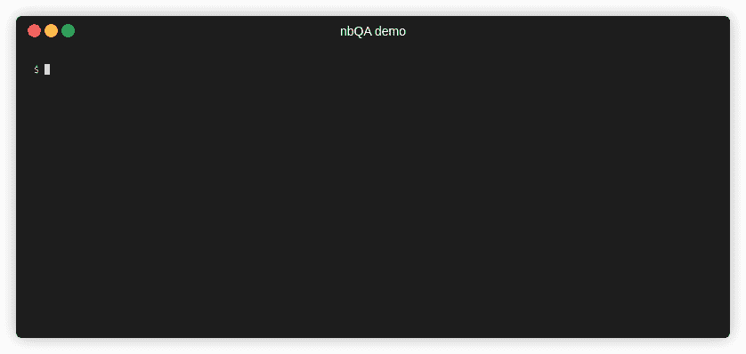

# 使用 nbQA 保持 Jupyter 笔记本的可维护性

> 原文：<https://towardsdatascience.com/keep-your-jupyter-notebooks-maintainable-968c9a5e759c?source=collection_archive---------44----------------------->


由 [Julia Joppien](https://unsplash.com/@vitreous_macula?utm_source=medium&utm_medium=referral) 在 [Unsplash](https://unsplash.com?utm_source=medium&utm_medium=referral) 上拍摄的照片

我们数据科学家喜欢 Jupyter 笔记本:它们支持快速原型制作，让我们用代码讲述故事，并允许我们彻底探索数据集。然而，任何试图将 Jupyter 笔记本套件置于版本控制之下的人都会告诉你，它们真的很难维护。

# 数据科学家喜欢 Jupyter 笔记本电脑…

这有许多原因，例如:

*   实现快速原型制作
*   让你用代码讲故事
*   允许您彻底探索您的数据集

# …但是 Python 代码质量工具没有！

如果我们想使用以下任何一种优秀的工具:

*   `[flake8](https://flake8.pycqa.org/en/latest/)`(风格指南强制执行)
*   `[pylint](http://pylint.pycqa.org/en/latest/)`(建议重构，带来代码味道)
*   `[mypy](http://mypy-lang.org/)`(检查静态类型注释)
*   还有很多很多…

然后，我们需要放弃我们非常喜欢的 Jupyter 笔记本，转而使用 Python 脚本。

# 我们能两全其美吗？

是啊！

`[nbQA](https://github.com/nbQA-dev/nbQA)`允许你在 Jupyter 笔记本上运行任何标准的 Python 代码质量工具。就像你通常在 Python 脚本上运行`flake8`一样:

```
my_script.py:1:1: F401 'pandas as pd' imported but unused
```

`[nbQA](https://github.com/nbQA-dev/nbQA)`允许您在 Jupyter 笔记本上运行它！

```
my_notebook.py:cell_1:1:1: F401 'pandas as pd' imported but unused
```

查看此演示，了解一些示例:



作者图片

# 用作提交前挂钩

如果你使用[预提交，](https://pre-commit.com/)这里有一个例子，告诉你如何编写一个钩子，根据`black`格式化你的笔记本，检查它们是否遵循`flake8`，并用`mypy`对它们进行类型检查:

# nbQA 还能做什么？

查看 [nbQA 文档](https://nbqa.readthedocs.io/en/latest/readme.html)了解如何配置`[nbQA](https://github.com/nbQA-dev/nbQA)`以及它能做什么。

# 再也不要写不可维护的 Jupyter 笔记本了

如果您将`[nbQA](https://github.com/nbQA-dev/nbQA)`集成到您的工作流程中(参见文档中关于如何使用`[pre-commit](https://pre-commit.com/)`或在[持续集成](https://martinfowler.com/articles/continuousIntegration.html)期间使用它的示例)，那么您将能够保留 Jupyter 笔记本的所有优点，而不必牺牲它们的可维护性。