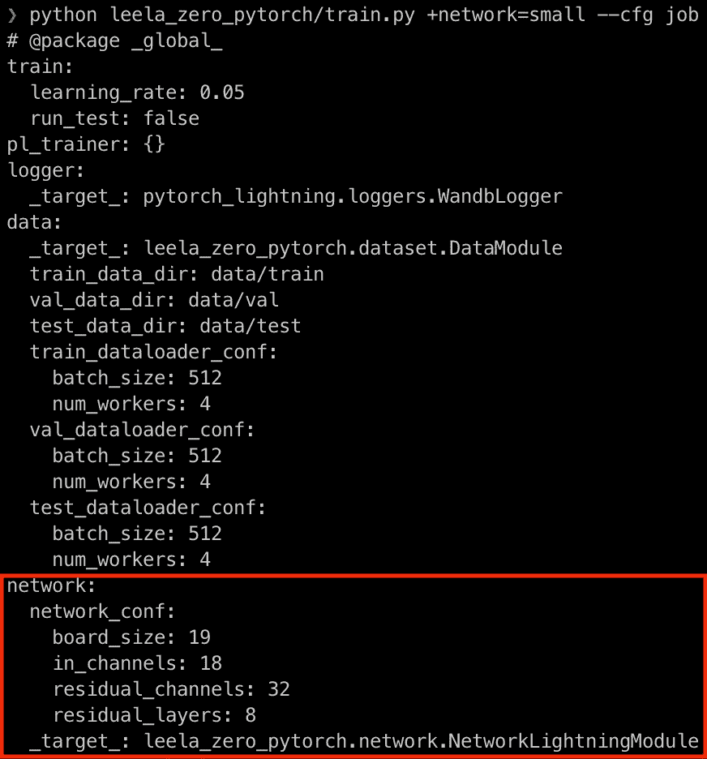

# 跟上 PyTorch 闪电和九头蛇

> 原文：<https://towardsdatascience.com/keeping-up-with-pytorch-lightning-and-hydra-31e8ed70b2cc?source=collection_archive---------19----------------------->

## 我如何使用 PyTorch Lightning 1.1 和 Hydra 1.0 的新特性将我的训练脚本缩减了 50%

努力跟上！— [来源](https://unsplash.com/photos/H30w37gpkro)

*2021 年 02 月 09 日更新:这个故事是关于 PyTorch Lightning 0.9.0 和 Hydra 1.0.0rc4 的。从那时起，他们已经发布了他们的正式生产就绪版本，我也发布了这个故事的第二版***，其中包括了所有最新的变化。我把这个故事留给后人，但请查看第二版***！***

# **介绍**

**上周， [PyTorch Lightning 0.9.0](https://medium.com/pytorch/pytorch-lightning-0-9-synced-batchnorm-datamodules-and-final-api-aae885398a9d) 和 [Hydra 的第四个候选版本 1.0.0](https://github.com/facebookresearch/hydra/releases/tag/v1.0.0rc4) 发布了，充满了新功能和大部分最终 API。我认为这是一个很好的机会让我重温我的边项目 [Leela Zero PyTorch](https://github.com/yukw777/leela-zero-pytorch) ，看看这些新版本是如何融入其中的。在这篇文章中，我将谈论这两个库的一些新特性，以及它们如何帮助 Leela Zero PyTorch。我不会在这里过多地谈论关于 Leela Zero PyTorch 的细节，所以如果你想更多地了解我的副业项目，你可以在这里阅读我以前关于它的博文[。](/training-neural-networks-for-leela-zero-using-pytorch-and-pytorch-lightning-bbf588683065)**

# **PyTorch 闪电 0.9.0**

**对于 PyTorch Lightning 团队来说，这是一个重要的里程碑，因为他们正在努力工作以发布 1.0.0 版本。它引入了许多新特性和一个更接近最终版本的 API。在我们开始之前，如果你想了解更多关于这个版本的信息，请查看官方的[博客文章](https://medium.com/pytorch/pytorch-lightning-0-9-synced-batchnorm-datamodules-and-final-api-aae885398a9d)。如果你想了解更多关于 PyTorch Lightning 的知识，请查看 Github 页面和官方文档。**

## **结果**

**你有没有发现自己重复地实现`*_epoch_end`方法，只是为了从你的`*_step`方法中聚集结果？您是否发现自己在如何正确记录您的`*_step`和`*_epoch_end`方法中计算出的指标时被绊倒了？你并不孤单，PyTorch Lightning 0.9.0 引入了一个叫做`Result`的新抽象来解决这些问题。**

**`Result`、`TrainResult`和`EvalResult`两种。顾名思义，`TrainResult`用于训练，`EvalResult`用于验证和测试。它们的接口很简单:您指定在实例化期间要操作的主要指标(对于`TrainResult`，要最小化的指标，对于`EvalResult`，要检查点或提前停止的指标)，然后您指定要记录的附加指标。让我们看看它们是如何在我的项目中使用的:**

**TrainResult 和 EvalResult 有助于您不重复度量记录。**

**在`training_step()`中，我指定了要最小化的总损耗，并记录了总损耗(也指定要在进度条中显示)、均方误差损耗、交叉熵损耗以及最后的精度(使用 PyTorch Lightning 的新度量包计算，稍后将讨论)。我不需要编写代码来在纪元级别聚合它们，因为`TrainResult`会处理这些。事实上，您可以使用`TrainResult`指定每个指标应该聚合和记录的级别(步骤、时期或两者都有)，它会自动为您处理一切。**

**类似地，在`validation_step()`中，我指定了用于检查点的总损失，并记录总损失、均方误差损失、交叉熵损失和准确性。同样，我不需要编写`validation_epoch_end()`，因为聚合和日志记录是由`EvalResult`处理的。此外，我不需要为`test_step()`重复我自己，只需调用`validation_step()`并为要记录的指标重命名键。**

**得益于`Result`，您可以立即看到我的代码变得更加简单、可读性更好、可维护性更高。你可以在这里了解更多信息[。](https://pytorch-lightning.readthedocs.io/en/0.9.0/results.html#)**

## **韵律学**

**PyTorch Lightning 团队在 0.8 中继续他们的工作，在 0.9.0 中引入了更多的度量实现。PyTorch Lightning 中的每一个指标实现都是一个 PyTorch 模块，并且有其对应的功能，使用起来非常简单灵活。对于我的项目，我决定集成 accuracy 的功能实现，这只是导入它并在适当的`*_step`方法中调用它的问题。**

**函数精度在 training_step()方法中被调用。**

**PyTorch Lightning 现在包含许多其他指标实现，包括高级 NLP 指标，如 BLEU score。你可以在这里阅读更多关于它的[。](https://pytorch-lightning.readthedocs.io/en/0.9.0/metrics.html)**

## **照明数据模块**

**PyTorch Lightning 的另一个棘手问题是处理各种数据集。直到 0.9.0，PyTorch Lightning 对如何组织你的数据处理代码保持沉默，除了你使用 PyTorch 的[数据集](https://pytorch.org/docs/stable/data.html#torch.utils.data.Dataset)和[数据加载器](https://pytorch.org/docs/stable/data.html#torch.utils.data.DataLoader)。这无疑给了您很大的自由，但也使您很难保持数据集实现的整洁、可维护和易于与他人共享。在 0.9.0 中，PyTorch Lightning 在`LightningDataModule`中引入了一种新的组织数据处理代码的方式，封装了数据处理中最常见的步骤。它有一个简单的接口，有五种方法:`prepare_data()`、`setup()`、`train_dataloader()`、`val_dataloader()`和`test_dataloader()`。让我们回顾一下它们在我的项目中是如何实现的，以理解它们的作用。**

*   **`prepare_data()`:该方法适用于任何在主流程中必须完成的事情，然后再派生出分布式培训的子流程。下载、预处理或保存到磁盘等任务是这种方法的理想选择。需要注意的一点是，在这里设置的任何状态都不会被带到分布式培训中的子流程，因此您应该注意不要在这里设置任何状态。在我的项目中，我依赖 Leela Zero 来预处理 Go sgf 文件，所以我决定跳过实现这个方法，但是我可以在技术上实现这个方法中的预处理步骤。**
*   **setup():该方法用于分布式培训的每个子流程中必须完成的任何事情。您应该构造实际的 PyTorch `Datasets`并在这里设置任何必要的状态。在 Leela Zero PyTorch 中，我初始化了我的`Datasets`，它从磁盘读入数据，并将其转换为张量，并保存为状态。**
*   **`*_dataloader()`:这是你初始化`DataLoaders`进行训练/验证/测试的地方。在我的例子中，我简单地使用在`setup()`中构建的数据集以及在`LightningDataModule`初始化期间传递的配置来初始化`DataLoaders`。**

**现在，只需要将`LightningDataModule`转换成`trainer.fit()`和`trainer.test()`就可以了。您也可以想象这样一个场景，我为不同类型的数据集(比如国际象棋游戏数据)实现了另一个`LightningDataModule`,培训师也会同样接受它。我可以更进一步，使用 Hydra 的对象实例化模式，在各种数据模块之间轻松切换。**

# **九头蛇 1.0.0rc4**

**1.0.0rc4 使 Hydra 更加接近其 1.0.0 正式版本。它包含许多错误修复和一些重要的 API 更改，使该库更加成熟和易于使用。在我们开始之前，如果你想了解更多关于九头蛇的信息，请查看[官方网站](https://hydra.cc/)以及[官方文档](https://hydra.cc/docs/next/intro)！**

## **@hydra.main()**

**您可以将这个装饰器添加到任何接受 OmegaConf 的`DictConfig`的函数中，Hydra 将自动处理您脚本的各个方面。这本身并不是一个新特性，但是我最初决定不使用这个特性，因为它接管了输出目录结构和工作目录。我实际上使用了 Hydra 的实验性 Compose API 来解决这个问题，我将在后面讨论。然而，在与 Hydra 的创建者 [Omry](https://medium.com/u/18354ccdb814?source=post_page-----31e8ed70b2cc--------------------------------) 交谈后，我意识到这不仅不是推荐的方法，而且我还失去了 Hydra 提供的一些很酷的功能，如命令行界面的自动处理、自动帮助消息和 tab 补全。此外，在使用一段时间后，我发现 Hydra 的输出目录和工作目录管理非常有用，因为我不必在 PyTorch Lightning 端手动设置日志目录结构。你可以在 [Hydra 的基础教程](https://hydra.cc/docs/next/tutorials/basic/your_first_app/simple_cli)中读到更多关于这个装饰者的内容。**

## **打包指令**

**在 Hydra 0.11 中，配置只有一个全局名称空间，但在 1.0.0 中，您可以使用 package 指令在不同的名称空间中组织配置。这允许您保持 yaml 配置文件的平整和整洁，没有不必要的嵌套。让我们来看看 Leela Zero PyTorch 的网络规模配置:**

**“@package _group_”表示此配置应在当前组下，在本例中为“网络”。**

****

**网络大小配置已按规定添加到“网络”下。请注意“board_size”和“in_channels”来自数据配置(composition！)**

**如您所见，包指令使您的配置更易于管理。你可以在这里阅读更多关于包指令及其更高级的用例[。](https://hydra.cc/docs/next/advanced/overriding_packages)**

## **实例化对象**

**Hydra 提供了一个特性，可以根据配置实例化一个对象或调用一个函数。当您希望您的脚本有一个简单的接口在各种实现之间切换时，这是非常有用的。这也不是一个新功能，但它的界面在 1.0.0rc4 中有了很大的改进。在我的情况下，我使用它在网络大小、训练记录器和数据集之间切换。我们以网络规模配置为例。**

**“大”、“巨型”和“小型”网络的配置**

**基于所选配置实例化网络。请注意，您可以传入额外的参数来实例化()，就像我在这里对 cfg.train 所做的那样。**

**`NetworkLightningModule`对其`__init__()`、`network_conf`和`train_conf`接受两种说法。前者从配置中传入，后者在`instantiate()` ( `cfg.train`)中作为额外参数传入。你所要做的就是在命令行中输入`+network={small,big,huge}`来选择不同的网络大小。您甚至可以想象通过用不同的`_target_`创建一个新的配置，并在命令行中传递配置名，来选择一个完全不同的架构。不需要通过命令行传递所有的小细节！你可以在这里阅读更多关于这个模式的信息[。](https://hydra.cc/docs/next/patterns/instantiate_objects/instantiate_objects_overview)**

## **撰写 API**

**尽管 Hydra 的 Compose API 不是编写脚本的推荐方式，但它仍然是编写单元测试的推荐方式，并且非常有用。我用它来为主培训脚本编写单元测试。同样，这并不是一个新特性，但是 Hydra 1.0.0rc4 确实为使用 Python 的上下文管理器的 Compose API 引入了一个更干净的接口(`with`语句)。**

**您可以使用 Hydra 的 Compose API 轻松编写配置字典。它有助于保持单元测试的整洁和易于调试。**

**你可以在这里阅读更多关于 Compose API [的内容，以及如何在这里](https://hydra.cc/docs/next/experimental/compose_api)使用它进行单元测试[。](https://hydra.cc/docs/next/advanced/unit_testing)**

## **未使用的功能:结构化配置和变量插值**

**Hydra 1.0.0rc4 中还有很多其他特性我没有利用，主要是因为我还没有足够的时间来集成它们。我将讨论本节中最大的一个问题——结构化配置。**

**结构化配置是 1.0.0 中引入的一个主要新特性，它利用 [Python 的 dataclasses](https://docs.python.org/3/library/dataclasses.html) 来提供运行时和静态类型检查，这在应用程序变得复杂时非常有用。我可能会在将来有时间的时候整合它们，所以请继续关注另一篇博文！**

# **结论**

**我的新旧训练脚本。行数从 56 增加到 28。五折优惠！**

**自从我写了关于 Leela Zero PyTorch 的第一篇博文以来，Hydra 和 PyTorch Lightning 都引入了许多新的特性和抽象，可以帮助您极大地简化 PyTorch 脚本。正如你在上面看到的，我的主要训练脚本现在只有 28 行，而以前是 56 行。此外，训练管道的每个部分，神经网络体系结构，数据集和记录器，都是模块化的，易于交换。这使得迭代更快，维护更容易，重现性更好，让您可以专注于项目中最有趣和最重要的部分。我希望这篇博文对你“跟上”这两个了不起的库有所帮助！你可以在这里找到 Leela Zero PyTorch 的代码。**