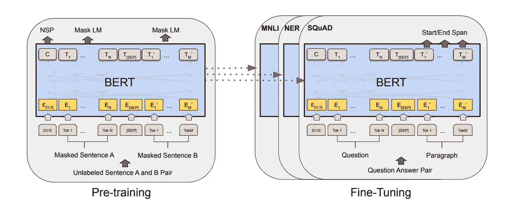
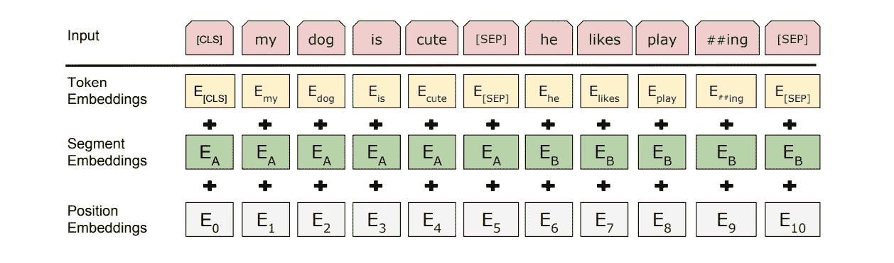
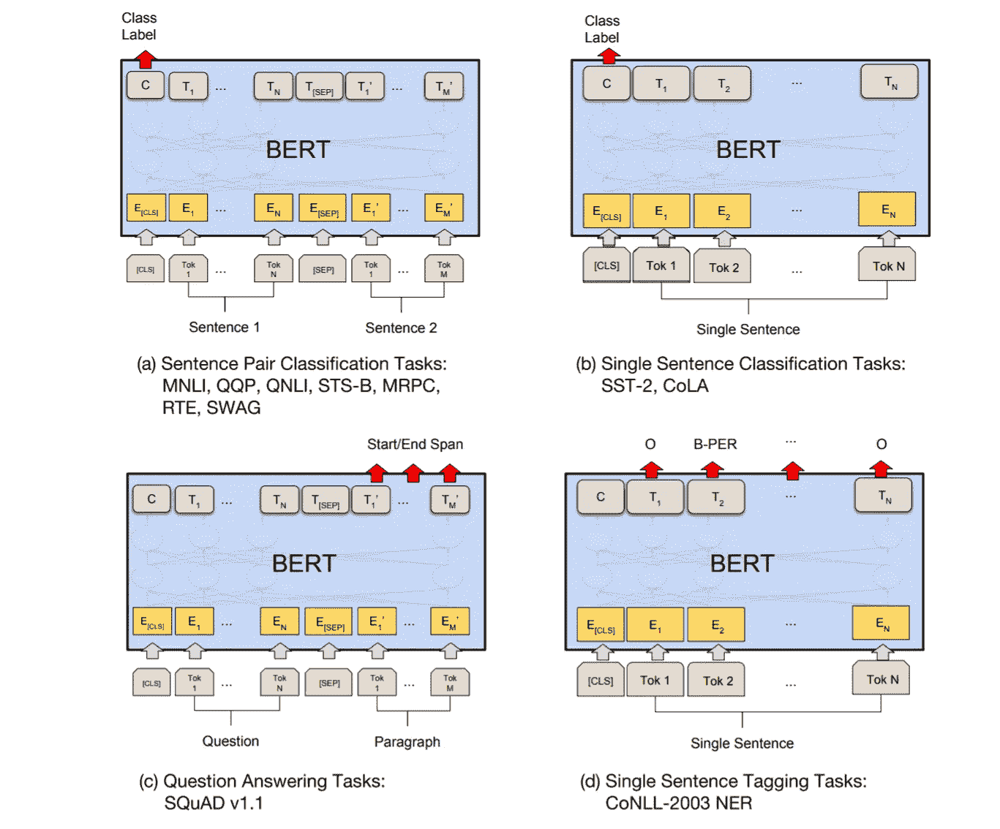
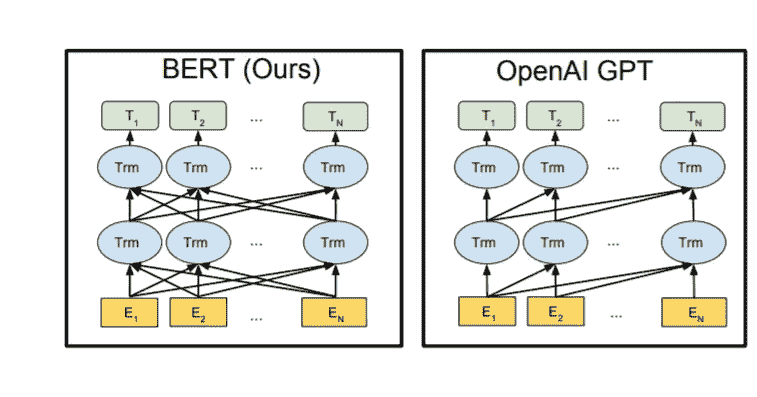

# 跟上贝茨

> 原文：<https://towardsdatascience.com/keeping-up-with-the-berts-5b7beb92766?source=collection_archive---------12----------------------->

## NLP 镇最受欢迎的家庭

莱昂纳多·大久保俊郎在 [Unsplash](https://unsplash.com?utm_source=medium&utm_medium=referral) 上的照片

如果你稍微关注一下 NLP 世界，或者甚至是 ML 新闻，你最有可能遇到 Google 的 BERT 模型或者它的一个亲戚。如果您还没有并且仍然偶然看到这篇文章，那么让我荣幸地向您介绍 BERT——强大的 NLP 怪兽。

# 伯特是什么？

BERT 代表***B****I directional****E****n coder****R****表示来自****T****transformers*，是 Google 的一个语言表示模型。它使用两个步骤，预训练和微调，为广泛的任务创建最先进的模型。

它与众不同的特点是跨不同下游任务的统一架构——这些是什么，我们将很快讨论。这意味着相同的预训练模型可以针对各种最终任务进行微调，这些最终任务可能与训练的任务模型不相似，并给出接近最先进的结果。

BERT 由两个步骤组成。来源:[论文](https://arxiv.org/abs/1810.04805)。

正如你所看到的，我们首先在预训练任务上同时训练模型。一旦预训练完成，同一模型可以针对各种下游任务进行微调。请注意，单独的模型针对特定的下游任务进行了微调。因此，单个预训练模型可以在微调后生成多个下游任务特定模型。

# 伯特建筑

简单来说就是 ***一堆变压器的编码器*** 。你可以在[我之前的文章](/transformers-89034557de14)中详细了解变形金刚。或者，如果你已经对它有了一些模糊的想法，请查看[这个](https://peltarion.com/knowledge-center/documentation/modeling-view/build-an-ai-model/blocks/bert-encoder)绝对是 BERT 中使用的编码器块的 3D 炸弹图。说真的，你不能错过这个！

 [## 变形金刚(电影名)

### 或者我喜欢称之为类固醇引起的注意。💉💊

towardsdatascience.com](/transformers-89034557de14) 

现在让我们来看看一些我们都不会记得的数字，但是如果没有它们，我们的理解会感到不完整，所以这里什么都不说:

**L** =层数(即堆栈中的#个变换器编码器块)。
**H** =隐藏大小(即 *q，k* 和 *v* 向量的大小)。
**A** =关注头数。

*   ***伯特基*** : L=12，H=768，A=12。
    总参数=110M！
*   ***伯特大号*** : L=24，H=1024，A=16。
    总参数=340M！！

## 什么使得它是双向的？

我们通常通过在一些不相关的任务上训练它来创建语言模型，但是这些任务有助于开发对模型中单词的上下文理解。这种任务通常包括预测下一个单词或彼此非常接近的单词。这种训练方法不能扩展并用于双向模型，因为它会让每个单词间接“看到自己”——当你从相反的方向再次接近同一个句子时，你已经知道会发生什么了。一个数据泄露的案例。

在这种情况下，模型可以轻易地预测目标单词。此外，我们不能保证该模型，如果经过完全训练，在某种程度上已经学会了单词的上下文含义，而不仅仅是专注于优化琐碎的预测。

那么伯特是如何做到双向预训练的呢？它通过使用一个称为屏蔽 LM 的过程来实现这一点。稍后会有更多的细节，所以请继续读下去，我的朋友。

# 预训练伯特

BERT 模型在以下两个无监督的任务上被训练。

## 1.掩蔽语言模型(MLM)

此任务启用模型的深度双向学习方面。在此任务中，随机屏蔽(用[*MASK*token 替换)一定百分比的输入标记，模型尝试预测这些屏蔽的标记，而不是整个输入序列。然后，来自该模型的预测标记被馈送到词汇表上的输出 softmax 中，以获得最终的输出单词。

然而，这在预训练和微调任务之间产生了不匹配，因为后者在大多数下游任务中不涉及预测屏蔽词。这通过我们如何屏蔽输入令牌的微妙变化得以缓解。

大约 15%的单词在训练时被屏蔽，但是所有被屏蔽的单词都不会被[*MASK*token 替换。

*   80%的时间用[ *屏蔽*令牌。
*   10%的时候用随机代币。
*   10%的时间，未改变的输入令牌被屏蔽。

## 2.下一句预测(NSP)

LM 并不直接捕捉两个句子之间的关系，而这种关系在许多下游任务中是相关的，例如[问答(QA)和自然语言推理(NLI)](/evaluation-of-an-nlp-model-latest-benchmarks-90fd8ce6fae5) 。通过对二值化 NSP 任务的训练，该模型被教导句子关系。

在这个任务中，选择了两个句子——A 和 B——进行预训练。

*   50%的时间 B 实际上是 a 后面的下一句话。
*   50%的时间 B 是从语料库中随机抽取的句子。

## 培训——输入和输出。

该模型同时在上述两个任务上被训练。这是通过输入和输出的巧妙运用而成为可能的。

## 输入

伯特的输入表示。来源:[论文](https://arxiv.org/abs/1810.04805)。

该模型需要接受单个句子或明确打包在一个标记序列中的两个句子的输入。作者注意到“句子”可以是连续文本的任意跨度，而不是实际的语言句子。一个[SEP]标记用于分隔两个句子，以及使用一个学习过的片段嵌入来指示一个标记作为片段 A 或 b 的一部分。

*问题#1:* 所有的输入都是在一个步骤中馈入的——与顺序馈入输入的 RNNs 相反，模型 ***不能保持输入令牌的排序*** 。每种语言的词序都很重要，无论是语义上还是句法上。

*问题#2:* 为了正确执行下一个句子预测任务，我们需要能够 ***区分句子 A 和 B*** 。固定句子的长度可能限制太多，并且是各种下游任务的潜在瓶颈。

这两个问题都是通过向我们的原始令牌添加包含所需信息的嵌入并将结果用作我们的 BERT 模型的输入来解决的。以下嵌入被添加到令牌嵌入中:

*   ***片段嵌入*** :它们提供了特定标记所属句子的信息。
*   ***位置嵌入*** :它们提供了单词在输入中的顺序信息。

## 输出

如何同时预测两个不同任务的产出？答案是通过使用不同的 FFNN + Softmax 层，该层建立在来自最后一个编码器的输出的顶部，对应于期望的输入令牌。我们将最后一个编码器的输出称为最终状态。

第一个输入令牌总是一个特殊分类*【CLS】*令牌。对应于该令牌的最终状态被用作分类任务的聚集序列表示，并被用于下一句预测，其中它被馈送到预测标签“ *IsNext* 或“ *NotNext* ”的概率的 FFNN + Softmax 层。

对应于[ *MASK* ] tokens 的最终状态被输入 FFNN+Softmax，以从我们的词汇表中预测下一个单词。

# 微调伯特

通过交换适当的输入或输出，可以对各种下游任务进行微调。在一般情况下，为了训练特定于任务的模型，我们向现有的 BERT 添加一个额外的输出层，并对结果模型进行微调——所有参数，端到端。增加输入/输出层而不改变 BERT 模型的一个积极结果是，只需要从头开始学习最少数量的参数，使得过程快速、成本和资源高效。

为了让你了解它的速度和效率，作者声称，从完全相同的预训练模型开始，论文中的所有结果在*单云 TPU* 上最多可以在*1 小时*内复制，在 GPU 上最多可以在*几小时内复制。*

在各种下游任务上微调 BERT。来源:[论文](https://arxiv.org/abs/1810.04805)。

在句子对分类和单句分类中，对应于[ *CLS* 记号的最终状态被用作进行预测的附加层的输入。

在 QA 任务中，在微调期间引入了开始(S)和结束(E)向量。问题作为句子 A 输入，答案作为句子 b 输入。单词 *i* 作为答案区间开始的概率计算为 T *i* (对应于第 *i* 个输入标记的最终状态)和 S(开始向量)之间的点积，后面是段落中所有单词的 softmax。端跨采用类似的方法。
从位置 *i* 到位置 *j* 的候选区间的得分定义为 S T *i* + E T *j* ，以 *j* ≥ *i* 的最大得分区间作为预测

# GPT——远房表亲

伯特是产生这些突破性成果的唯一模型吗？不是。OpenAI 的另一个模型，叫做 GPT，已经在网上引起了轰动。

但是很多人没有意识到这两个模型有一个共同点，那就是这两个模型都重用了一个 Transformer 组件。如前所述 **BERT 将变压器的编码器部分**作为其构建模块。同时， **GPT 使用变压器的解码器部分**作为其构建模块。

来源:[论文。](https://arxiv.org/abs/1810.04805)

请注意，由于编码器的双向自我关注，BERT 中的双向连接。与此同时，GPT 的连接只是单向的，从左到右，由于解码器的设计防止查看未来的预测——更多信息请参考[变形金刚](/transformers-89034557de14)。

# 伯特一家

如果我们不把一些工作得很好的东西拿来，并试图重新创造或修改它，那就不是 21 世纪了。伯特建筑也不例外。以下是一些最流行的变体:

*   [**阿尔伯特**](https://arxiv.org/abs/1909.11942) 由谷歌和更多-本文描述了参数减少技术，以降低内存减少和提高 BERT 模型的训练速度。
*   [**罗伯塔**](https://arxiv.org/abs/1907.11692) 脸书——本文认为最初的 BERT 模型训练不足，并表明经过更多的训练/调整，它可以超越最初的结果。
*   [**ERNIE**](https://arxiv.org/abs/1904.09223) :百度通过知识整合增强表示——受 BERT 掩蔽策略启发，学习通过知识掩蔽策略增强的语言表示，包括实体级掩蔽和短语级掩蔽。
*   [**蒸馏伯特**](https://arxiv.org/abs/1910.01108)——使用 Huggingface 模型蒸馏的较小伯特。

你可以在 [the GLUE 排行榜](https://gluebenchmark.com/leaderboard)查看更多伯特风格的模特。

# 结论

1.  BERT 是一个堆叠变压器的编码器模型。
2.  它有两个阶段——预训练和微调。
3.  预训练是计算和时间密集型的。
4.  然而，它独立于它最终完成的任务，因此相同的预训练模型可以用于许多任务。
5.  GPT 和伯特没什么不同，是一个堆叠变压器的解码器模型。
6.  伯特有许多变种。

# 参考文献+推荐阅读

*   [变压器](/transformers-89034557de14)——如果您想更深入地了解上述编码器/解码器架构。
*   论文——很容易阅读，而且他们也稍微阐述了一些实际的细节。值得一读。
*   [杰伊·阿拉玛的博客](http://jalammar.github.io/illustrated-bert/)。
*   [官方 GitHub 回购。](https://github.com/google-research/bert)
*   [更多 BERT 车型](/2019-year-of-bert-and-transformer-f200b53d05b9)。

> 我很高兴你坚持到这篇文章结束。🎉我希望你的阅读体验和我写这篇文章时一样丰富。💖
> 
> *尽请查看我的其他文章* [*这里*](https://medium.com/@ria.kulshrestha16) *。*
> 
> *如果你想联系我，我会选择*[*Twitter*](https://twitter.com/ree_____ree)*。*