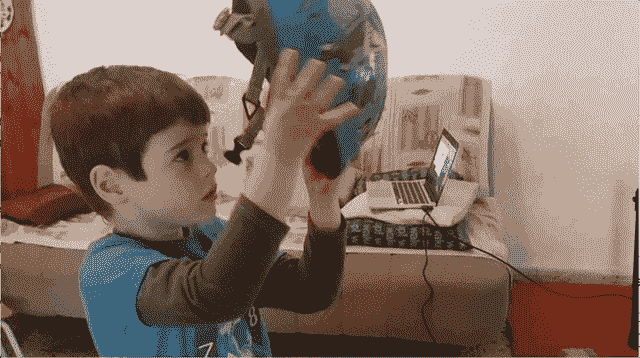
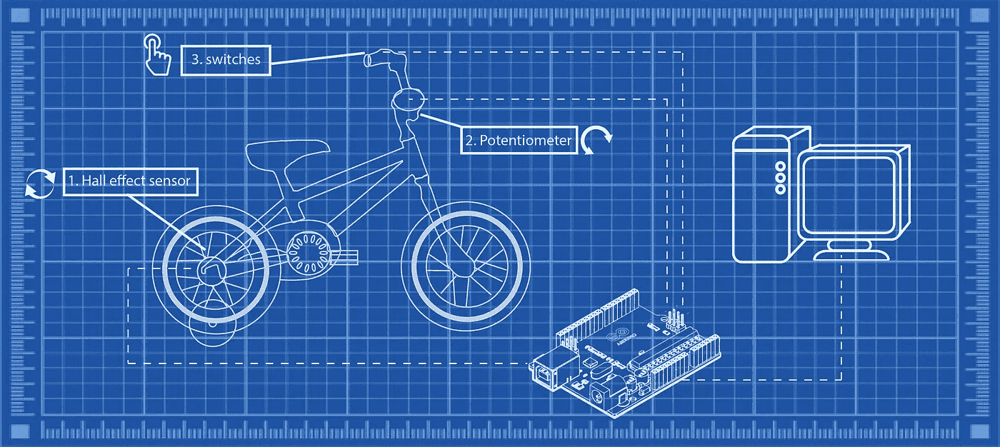
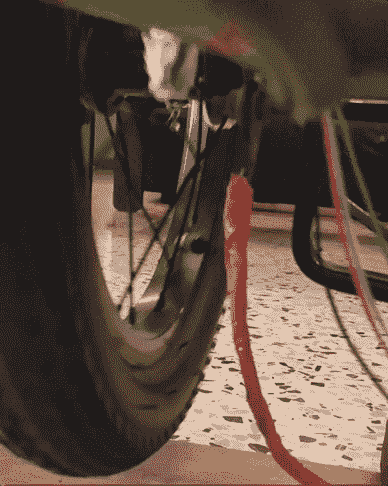
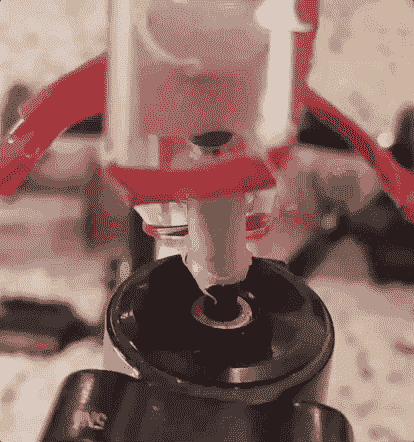
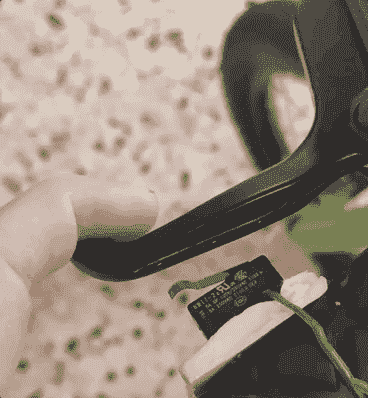
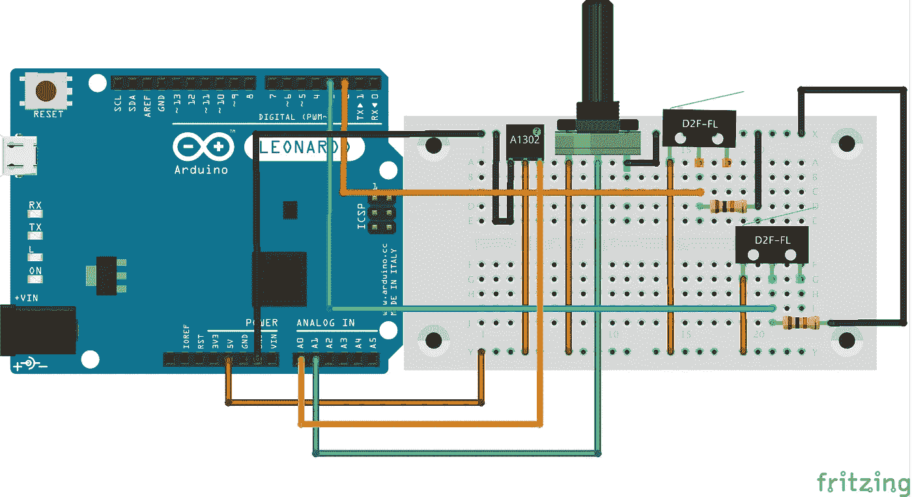
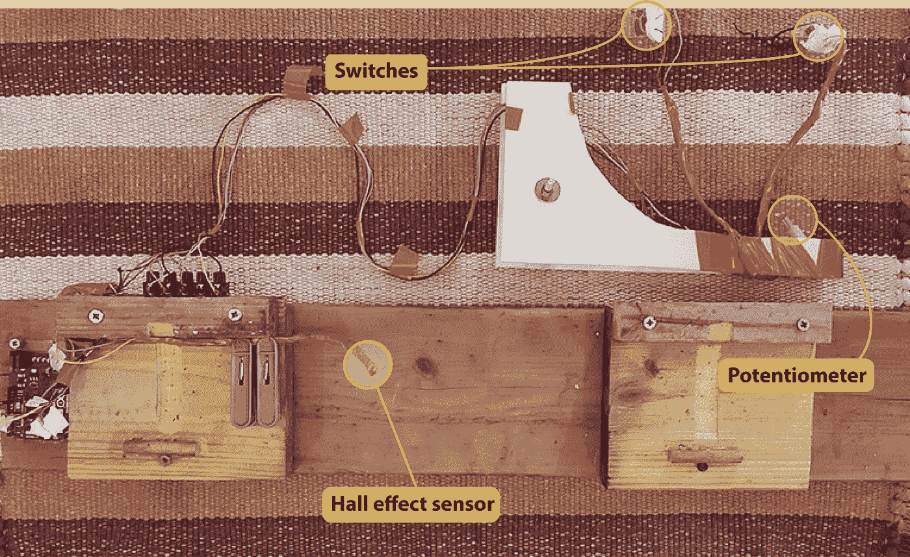

# 把你的孩子的自行车变成键盘，让他们在隔离期间保持活跃

> 原文：<https://towardsdatascience.com/keeping-your-kids-in-shape-during-quarantine-by-turning-their-bicycle-into-a-keyboard-e1f8a34fac2e?source=collection_archive---------59----------------------->

## 在这个简短的教程中，我将带你了解将任何自行车变成类似街机的电脑游戏控制器的过程。

尽管没有树立健康生活方式的最佳榜样，我和妻子还是努力吃绿色食品，避免太多垃圾食品，保持身材。另一方面，我们 5 岁的孩子对任何体育活动都不感兴趣，除非这能让他更接近他的(我的……)iPad。

通常情况下，这个问题可以通过做一个孩子来部分解决，这包括大量的跑步，爬山，摔倒…还有最近的骑自行车！但不幸的是，随着新冠肺炎·疫情的出现，我们真的做不到这些。

所以，我把他的自行车变成了键盘。

现在，他可以一边玩他最喜欢的电脑游戏，一边锻炼身体！在这篇短文中，我将带你经历建造你自己的*键盘自行车*的过程。



# 基础:

第一步是通过让后轮自由旋转而不接触地面，并允许车把自由转动，将自行车变成室内训练自行车。如果你的孩子被向前推，你不应该进行以下步骤。

旋转踏板时，有许多方法可以让自行车保持在原位。将自行车悬挂在天花板上，在车轮下的地板上挖洞等等。我个人用训练轮来支撑车尾，但这是你发挥创造力的地方，更重要的是，**要负责**。我有意避免谈论我实现这一部分的太多细节(你可以从本文中的各种图片和 gif 中得到一个很好的想法……)，因为确保自行车的安全使用是你的责任。

# 这个计划



在将自行车固定好以便可以在适当的位置踩踏之后，我们将连接传感器来捕捉后轮的旋转、车把的位置和一些用于额外控制的按钮(这些可以在以后轻松编程以映射任何键盘按键)。来自所有传感器的数据将被 Arduino 捕获和转换，Arduino 将充当键盘，并将击键发送到运行(很可能是赛车)游戏的计算机。

# 五金器具

我们必须使用一块可以作为 USB 键盘的板。我用的是 [Arduino 莱昂纳多](https://store.arduino.cc/arduino-leonardo-with-headers)。

我使用了 3 种传感器:
**1** 。 [**A1302 霍尔效应传感器**](https://www.allegromicro.com/en/products/discontinued-product-archive/a1301-2) —该传感器在接近磁场时会改变其输出电压。我们将使用它将后轮的旋转转换为向前按键。
**2。** [**10K 欧姆线性电位器**](https://www.sparkfun.com/products/9939) —用于将车把方向转换为左/右键。
**3。** [**微动开关**](https://www.sparkfun.com/products/13013) —用作额外控制器。我强烈建议使用这种类型的开关(限位开关),不要使用一些花哨的按钮。这些开关非常灵敏，而按钮有时对孩子来说很难按下。

# 连接零件

## 霍尔效应传感器

通过将磁铁放在后轮上，并将传感器靠近(尽可能靠近而不接触车轮)，我们可以在磁铁经过传感器时感应到车轮的旋转。我使用了两个等间距的磁铁(即大约 180 度)。



**用于连接磁体的尖端-**

你可能会找到一个更优雅的解决方案，但我在这里使用的是用塑料包装缠绕磁铁，就像糖果包装一样(我指的是上面 gif 中看到的随着轮子旋转的白色斑点)。然后使用松散的两端将磁铁绑在车轮的辐条上，并用热胶固定。

为了让传感器(这是指 gif 中的红色垂直杆，传感器本身位于其末端)尽可能靠近车轮，我将它安装到一根软线上(我使用了一些重型电线，但任何可以弯曲并保持其位置的电线都可以)。

## 电位计

电位计需要连接到车把的枢轴点。在那一点上应该有一个内六角扳手的套筒。我使用了一个合适的驱动位，并将其连接到电位计。最初，我的计划是将两部分焊接在一起，但驱动位的可焊性很低(没有)。最后，我拿了一根短吸管(在下面的 gif 中以紫色显示),从两侧粘上电位计和驱动器位，并注入热胶，将所有东西粘在一起。它像岩石一样坚固。



至于把电位计固定在自行车车架上，你还是需要发挥创意。我的解决方案(可以在预告片 gif 和文章结尾的图片中看到，显示了从自行车上拆下的所有组件)是基于制作一个有机玻璃“臂”来固定电位计，可能不适用于您孩子的自行车。这个想法很简单，电位计需要和把手一起旋转。尽管很简单，但实施起来可能相当具有挑战性…

## 开关

我把其中一个开关放在(冗余的)前轮刹车杆后面，另一个放在不冗余的后轮刹车杆后面，断开这个刹车，这样通过踩刹车来压开关，感觉很自然。



再说一次，我不承担任何责任。如果你觉得你在第一部分做的支撑不够坚固，担心阻碍和/或断开刹车，你可以，也应该把按钮放在别的地方。没有对错，只要舒服安全就好。我把自己限制在两个按钮上，但是你显然可以在板子允许的范围内尽可能的高。

# 接线



# 关于提前思考的一个注记。

在完成*键盘自行车版本 1.0* 后，我开始改进它，确保我可以轻松地断开所有组件，并尽快重新组装它们，这需要一些调整，如果我一开始就想到这一点，就可以避免。我花了将近 *2 个小时*升级到*键盘自行车版本 2.0* ，但是现在用*不到一分钟*就可以组装/拆卸。



另一点要记住的是什么是固定板的最佳位置。我不经意地把它放在了我儿子上下自行车的一侧。回想起来，我应该选择另一边…

# 密码

如硬件部分所述，*键盘自行车*设置由 3 种传感器组成:霍尔效应传感器、电位计和按钮。我将分别解释每个组件的代码。

## 霍尔效应传感器

当车轮旋转且磁铁经过传感器时，霍尔效应传感器被“激活”,导致输出电压发生变化。对于这一部分，每当电压的绝对变化超过某个阈值(`hall_effect_threshold`)时，我就打开键(在我的情况下是前进键)。然后我让它一直开着，开始倒数一定的时间(`drive_decay_const`)。这允许调整你从每个“尖峰”得到的运动量。增加`drive_decay_const`的值以获得更多的移动。

## 电位计

在这里，我们基本上试图将转动车把的“模拟”运动转换成“二进制”的左或右点击。如果你只是想做一些小的调整，连续的按压就太戏剧化了，所以转动的量需要用“点击量”来表示。我是通过在设定的时间间隔(`interval`)激活和取消旋转运动来做到这一点的，这样旋转车把超过某个阈值，就会开始间歇地按压。此外，当按钮被激活时，我增加了一个延迟，这个延迟随着转动的次数而增加。因此，对于更高角度的转弯，按钮将被按下更长的时间(即，每次点击将更长)，从而导致更积极的转弯。另外，注意我在设置时初始化了`pot_center`。这对于电位计从插座上断开的情况很有帮助。不用重新定位中心，你只需重置棋盘，中心就会被重置。

## 开关

这里没什么特别的。只需更换激活的钥匙，以满足您的需求。这里的代码是为了玩 [SuperTuxKart](https://supertuxkart.net/Main_Page) ，这是一个很棒的儿童赛车游戏，但这辆自行车显然可以适应许多其他游戏。我们也用它来演奏《我的世界》，效果很好。

```
/*
bicycle_keyboard
*/#include "Keyboard.h"
const int hall_effect_threshold = 1      // threshold for hall effect sensor.
const int turn_threshold = 35;           // threshold for detecting a left/right movement. 
const int drive_decay_const = 100;       // drive_decay speed of car (larger => slower decreasing / faster car)
const int turn_decay_const = 0.75;       // multiplier for intensity of turn. higher value => sharper turns. 
const char button_1_val = ' ';           // value for button 1
const char button_2_val = 'n';           // value for button 2
const long interval = 200;               // interval for allowing not allowing turns.
const int button_1 = 2;                  // button_1 pin 
const int button_2 = 3;                  // button_2 pin
int pot_center = 500;                    // center point for potentiometer. this value is being reset in setup.
int prev_hallSensorValue = 0;            // initial value for sensor
const int delay_time = 1;                // delay between reads
int drive_decay = 0;                     // initial drive_decay value
unsigned long previousMillis = 0;        // initial value
bool allow_turn = true;                  // allow turn is a boolean to only allow turns every passing interval 
int turn_amount = 0;                     // initial value
void setup() {
  Serial.begin(9600);
  Keyboard.begin();
  pinMode(button_1, INPUT);
  pinMode(button_2, INPUT);
  pot_center = analogRead(A1);
}
void loop() {
  unsigned long currentMillis = millis();
  int hallSensorValue = analogRead(A0);
  int pot = analogRead(A1);//  Serial.println(hallSensorValue);
//  Serial.println(pot);  delay(delay_time);        // delay in between reads for stability  // DRIVE:
  if (abs(hallSensorValue- prev_hallSensorValue) >1){
    prev_hallSensorValue = hallSensorValue;
    Keyboard.press(KEY_UP_ARROW);
    drive_decay = drive_decay_const;
  }
  else{
    if (drive_decay <= 0){
        Keyboard.release(KEY_UP_ARROW);
        }
    else{
      drive_decay -=1;
      }
    }if (allow_turn==true){//TURN RIGHT
  if (pot < pot_center - turn_threshold) {
    Keyboard.press(KEY_RIGHT_ARROW);
    } 
// TURN LEFT
  if (pot > pot_center + turn_threshold){
    Keyboard.press(KEY_LEFT_ARROW);
  }}
    if (currentMillis - previousMillis >= interval) { // interval has passed
    previousMillis = currentMillis;
    turn_amount = abs(pot-pot_center);    // switch allow turn state:
    if (allow_turn == true) {
      if (turn_amount > turn_threshold){
          delay(turn_amount); //keep button pressed longer the more aggressive the turn.
        }
      allow_turn = false;
    } else {
      allow_turn = true;
      }
     // release the turn keys:
      Keyboard.release(KEY_RIGHT_ARROW);
      Keyboard.release(KEY_LEFT_ARROW);
    }  //check buttons
  if (digitalRead(button_1) == HIGH){
    Keyboard.press(button_1_val);
    }
   else{
     Keyboard.release(button_1_val);
    }  if (digitalRead(button_2) == HIGH){
    Keyboard.press(button_2_val);
    }
   else{
     Keyboard.release(button_2_val);
    }
}
```

# 摘要

最后，我希望我很好地解释了如何制造*键盘自行车*。如果你选择建立一个，而发现我还没有，不要犹豫，发表评论或给我发消息。