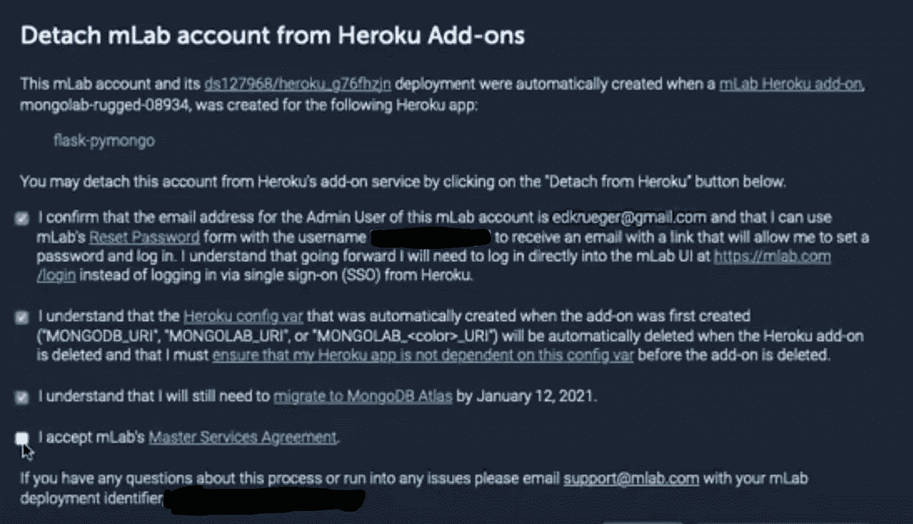

# 保留您的 mLab MongoDB 实例:从 Heroku 分离。

> 原文：<https://towardsdatascience.com/keeping-your-mlab-mongodbs-detaching-from-heroku-173b5c97c715?source=collection_archive---------32----------------------->

## [实践教程](https://towardsdatascience.com/tagged/hands-on-tutorials)

## 如何在 2020 年 11 月 10 日通过从 Heroku 分离 mLab 来保存你的数据不被删除。

*By:* [*爱德华克鲁格*](https://www.linkedin.com/in/edkrueger/) *和* [*道格拉斯富兰克林*](https://www.linkedin.com/in/douglas-franklin-1a3a2aa3/) *。*

约翰·巴克利普在 Unsplash 上拍摄的照片

如果您使用 mLab 托管的 MongoDB 实例作为 Heroku 附加组件，请花些时间通过分离它来迁移它。分离不需要迁移或对应用程序代码进行任何更改，您的环境变量将保持不变。你仍然需要在 2021 年 1 月 12 日之前迁移，那时 mLab 作为一个整体关闭并终止所有实例。

这是因为 MongoDB 在 2018 年收购了 mLab，并已决定结束服务，以让用户将数据库迁移到 MongoDB Atlas。

我们在 2020 年 7 月 10 日首次发送的电子邮件中收到了这一通知。邮件称，2020 年 11 月 10 日之后，Heroku 将不再支持 mLab 插件。这将导致任何依赖 mLab 的应用程序无法运行，并删除存储在 mLab 上的所有数据。

以下是这封邮件的副本:

> 亲爱的 Heroku 客户:
> 
> 我们发现您是以下安装了 mLab MongoDB 附加组件的应用程序的所有者或合作者。请注意，这可能是部分列表。
> 
> 弗拉斯克-皮蒙戈
> 
> mLab 团队已选择停止此附加组件。**mLab MongoDB 插件将于 2020 年 11 月 10 日从所有 Heroku 应用中移除**。

有许多解决方案可以让我们的软件在云中运行。最简单的是我们将在本文中深入研究的，从 Heroku 附加组件中分离我们的 mLab 帐户。我们可以稍后处理迁移，并将写一篇包含一些选项的文章。我们会在准备好的时候更新文章。

# 指南:从 Heroku 分离 mLab

**步骤 1:登录 mLab 并进入确认屏幕。先别确认！**

在 Heroku 上，查看您想要修改的应用程序，然后单击 mLab 插件。这应该会带你到 mLab 的网站。单击帐户。在这里你可以找到右上角的“脱离 Heroku”按钮。这将使您进入下面看到的协议页面。先别确认！

请注意这里的三个要点:

1.  你仍然需要在 2021 年 1 月 21 日之前迁移到 MongoDB atlas。换句话说，这种分离是暂时的，我们将在明年一月迁移。
2.  您的电子邮件地址将成为 mLab 的管理员帐户，您可以通过电子邮件重置密码来重置您的密码。不幸的是，事实并非如此。在写这篇文章的时候，重置邮件里的 URL 把你带到了一个非功能性的页面。
3.  其次，当您从 Heroku 分离时，您的 Heroku 配置变量可能会被自动删除。**在你完成这个过程之前，**确保你的应用不依赖于任何`MONGO*_URI`变量，如果需要的话保存它们。您可能需要重置它们。

协议页面

**第二步:从你的 Heroku 配置变量中获取 URI 并保存它**

要检查您的应用程序对`MONGO*_URI`变量**，**的使用情况，请转到 Heroku.com，然后转到您的应用程序，再转到设置，然后检查您的配置变量。在我们的例子中，我们发现了`MONGODB_URI`。然后，我们将变量保存在一个文本文件中，以便与我们的 mLab 用户名和部署标识符(位于复选框页面的底部)一起妥善保管。将这些数据保存在文本文件中可以作为备份，以防在此过程中丢失。

这是加倍重要的，因为如果你有同样的问题，密码重置我做的，你也可能无法登录到您的 mLab 管理面板发现 URI。您将需要这些信息来保持您的应用程序正常工作，并在将来进行迁移。

**步骤 3:完成 mLab 的分离，接受条款**

回到我们在第一步中找到的确认页面。这一次，继续接受条款并确认。

现在，您的 mLab 帐户不再与 mLab Heroku 附加组件相关联。

单击分离后，可能需要一段时间才能在 Heroku 端删除配置变量。现在是从我们的 Heroku 项目中删除附加组件的好时机。

不要注销 mLab，因为您可能无法重新登录。

**步骤 4:删除 Heroku 端的 mLab 插件**

为此，请单击应用下的“配置加载项”。然后单击 mLab 横幅最右侧的下拉菜单，并选择删除附加组件。

从 Heroku 删除 mLab MongoDB

确认附加组件删除并将其移除。

**步骤 5:仔细检查连接字符串在 mLab 端没有改变，如果它被删除，则获取保存的 URI 并将其设置为 Heroku 配置变量**

现在我们回到 mLab，看看连接字符串在 mLab 方面是否仍然有效。这可以在 home →MongoDB Deployments 下看到。选择数据库并查看字符串。它与你保存在文本文件中的匹配吗？如果是这样的话，你不需要做任何事情。如果已经更改，请确保在 Heroku config vars 下更新该变量。

**第六步:重新部署应用**

接下来，您将在 Heroku 上重新部署应用程序。您应该能够通过应用程序访问您的数据库，并通过分离看到持久化的数据。

# **大功告成！**

再一次，这是保持你的数据库在 2020 年 11 月 10 日之后的十分钟快速修复。我们将在后面的文章中进一步研究迁移选项。