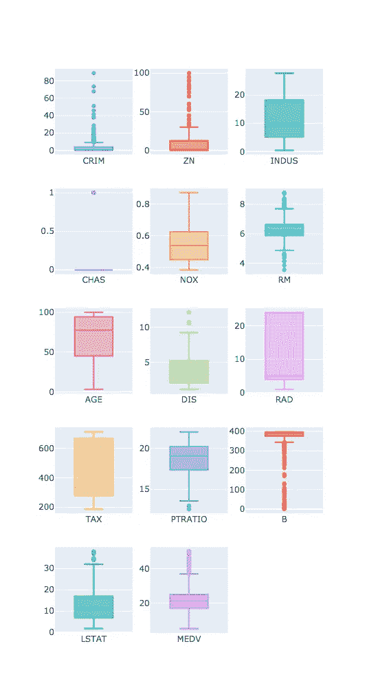
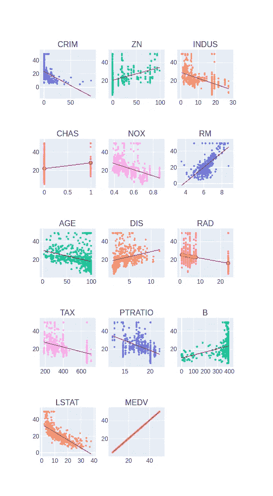
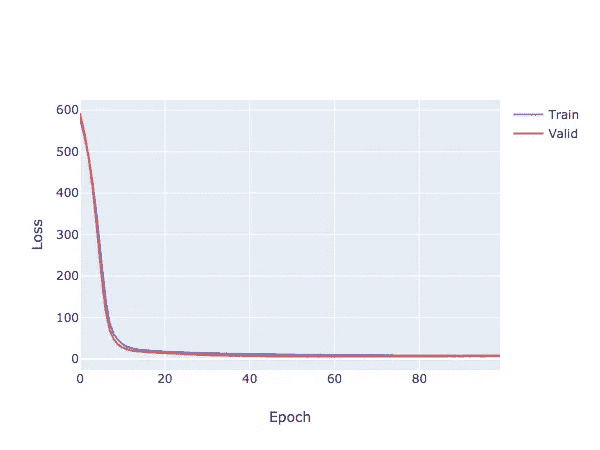
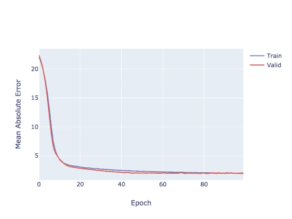
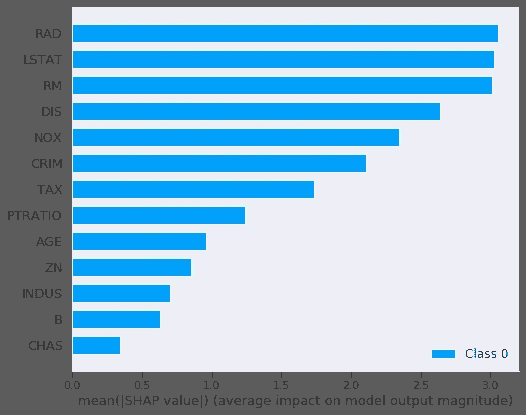

# Keras 101:一个简单的(和可解释的)用于房价回归的神经网络模型

> 原文：<https://towardsdatascience.com/keras-101-a-simple-and-interpretable-neural-network-model-for-house-pricing-regression-31b1a77f05ae?source=collection_archive---------11----------------------->

TL；DR:使用带有神经网络的波士顿数据集预测房价，并采用 SHAP 值来解释我们的模型。完整的笔记本可以在这里找到[。](https://github.com/rodrigobressan/keras_boston_housing_price)

在本帖中，我们将介绍一些数据探索的基础知识，并使用 Keras 构建一个模型，以帮助我们预测波士顿(MA)地区某栋房屋的销售价格。作为这个模型在现实世界中的一个应用，你可以想象成为一个真正的国家代理人，寻找一个工具来帮助你履行日常职责，至少对我来说，与直觉相比，这听起来相当不错。

在这个练习中，我们将使用 [Plotly](https://plot.ly/python/) 库，而不是老式的 matplotlib，因为它有更多的交互图，这无疑有助于理解数据。我们还将使用 [Scikit-Learn](https://scikit-learn.org/stable/) 和 [Keras](https://keras.io/) 来构建模型，使用 [Pandas](https://pandas.pydata.org/) 库来操作我们的数据，使用 [SHAP 库](https://github.com/slundberg/shap)来为我们训练好的模型生成解释。

# 导入数据集

在本例中，我们将使用包含波士顿数据集的 sklearn.datasets 模块。您也可以使用 keras.datasets 模块，但是这个模块不包含要素的标签，所以我们决定使用 scikit 的模块。让我们也把它转换成熊猫的数据帧，并打印它的头部。

```
from sklearn.datasets import load_boston
import pandas as pdboston_dataset = load_boston()df = pd.DataFrame(boston_dataset.data, columns=boston_dataset.feature_names)
df['MEDV'] = boston_dataset.targetdf.head(n=10)
```

# 探索性数据分析

熟悉数据集是帮助您理解数据并从结果中得出更好的结论和解释的基本步骤。

首先，让我们绘制一些箱线图，这将有助于我们更好地可视化数据分布中的异常和/或异常值。如果你对什么是盒图以及它如何帮助我们更好地可视化我们的数据分布感到困惑，这里有一个来自 Ross (1977)的简短描述:

> *在描述统计学中，箱线图是一种通过四分位数以图形方式描绘数字数据组的方法。箱形图也可能有从箱形图(须状图)垂直延伸的线，表示上下四分位数之外的可变性，因此称为箱形图和箱形须状图。异常值可以绘制为单个点。*

```
from plotly.subplots import make_subplots
import plotly.graph_objects as go
import mathtotal_items = len(df.columns)
items_per_row = 3
total_rows = math.ceil(total_items / items_per_row)fig = make_subplots(rows=total_rows, cols=items_per_row)cur_row = 1
cur_col = 1for index, column in enumerate(df.columns):
    fig.add_trace(go.Box(y=df[column], name=column), row=cur_row, col=cur_col)

    if cur_col % items_per_row == 0:
        cur_col = 1
        cur_row = cur_row + 1
    else:
        cur_col = cur_col + 1 fig.update_layout(height=1000, width=550,  showlegend=False)
fig.show() 
```

这将输出以下箱线图:



这些结果证实了我们最初的假设，即在一些列中有异常值。让我们为每个特征和目标变量绘制一些散点图，以及它们的截距线:

```
from plotly.subplots import make_subplots
import plotly.graph_objects as go
import math
import numpy as nptotal_items = len(df.columns)
items_per_row = 3
total_rows = math.ceil(total_items / items_per_row)fig = make_subplots(rows=total_rows, cols=items_per_row, subplot_titles=df.columns)cur_row = 1
cur_col = 1for index, column in enumerate(df.columns):
    fig.add_trace(go.Scattergl(x=df[column], 
                            y=df['MEDV'], 
                            mode="markers", 
                            marker=dict(size=3)), 
                  row=cur_row, 
                  col=cur_col)

    intercept = np.poly1d(np.polyfit(df[column], df['MEDV'], 1))(np.unique(df[column]))

    fig.add_trace(go.Scatter(x=np.unique(df[column]), 
                             y=intercept, 
                             line=dict(color='red', width=1)), 
                  row=cur_row, 
                  col=cur_col)

    if cur_col % items_per_row == 0:
        cur_col = 1
        cur_row = cur_row + 1
    else:
        cur_col = cur_col + 1 fig.update_layout(height=1000, width=550, showlegend=False)
fig.show()
```



从这个初步的数据探索中，我们可以得出两个主要结论:

*   RM(每所住宅的平均房间数)和 LSTAT(人口的较低地位百分比)与目标变量之间有很强的线性相关性，RM 为正相关，LSTAT 为负相关。
*   有一些包含异常值的记录，我们可以对其进行预处理，以便为我们的模型输入更多的规范化数据。

# 数据预处理

在我们进行任何数据预处理之前，将数据分成训练集和测试集是很重要的。我们不应该对我们的数据进行任何类型的预处理，而不应该忘记我们不应该将信息从我们的测试集泄露到其他的测试集中。对于这一步，我们可以使用 scikit-learn 中的 *train_test_split* 方法。在这种情况下，我们将使用 70%的数据用于训练，30%的数据用于测试。我们还设置了一个 random_state 种子，以保证方法的可重复性。

```
from sklearn.model_selection import train_test_splitX = df.loc[:, df.columns != 'MEDV']
y = df.loc[:, df.columns == 'MEDV']X_train, X_test, y_train, y_test = train_test_split(X, y, test_size=0.3, random_state=123)
```

为了向我们的神经网络提供标准化的输入，我们需要执行数据集的规范化。这可以被看作是减少可能由现有特征引起的规模差异的一个步骤。我们通过从数据中减去平均值并除以标准偏差来执行标准化。**再强调一次，为了避免测试集的任何信息泄露，这种标准化只能通过使用训练集的平均值和标准偏差来执行。**

```
mean = X_train.mean(axis=0)
std = X_train.std(axis=0)X_train = (X_train - mean) / std
X_test = (X_test - mean) / std
```

# 建立我们的模型

由于该数据集中呈现的数据量很小，我们必须小心不要创建过于复杂的模型，否则会导致数据过度拟合。为此，我们将采用基于两个密集层的架构，第一个具有 128 个神经元，第二个具有 64 个神经元，两者都使用 ReLU(整流线性单元)激活功能。具有线性激活的密集层将被用作输出层。

为了让我们知道我们的模型是否正确学习，我们将使用均方误差损失函数，并且为了报告它的性能，我们将采用平均误差度量。

通过使用来自 Keras 的汇总方法，我们可以看到我们总共有 10，113 个参数，这对我们来说是可以接受的。

```
from keras.models import Sequential
from keras.layers import Densemodel = Sequential()model.add(Dense(128, input_shape=(13, ), activation='relu', name='dense_1'))
model.add(Dense(64, activation='relu', name='dense_2'))
model.add(Dense(1, activation='linear', name='dense_output'))model.compile(optimizer='adam', loss='mse', metrics=['mae'])
model.summary()
```

# 训练我们的模型

这一步非常简单:用我们的特征和它们的标签来拟合我们的模型，总共 100 个历元，保留 5%的样本(18 个记录)作为验证集。

```
history = model.fit(X_train, y_train, epochs=100, validation_split=0.05)
```

通过绘制损失和平均误差，我们可以看到我们的模型能够学习数据中的模式，而不会发生过度拟合(如验证集曲线所示):

```
fig = go.Figure()
fig.add_trace(go.Scattergl(y=history.history['loss'],
                    name='Train'))fig.add_trace(go.Scattergl(y=history.history['val_loss'],
                    name='Valid')) fig.update_layout(height=500, width=700,
                  xaxis_title='Epoch',
                  yaxis_title='Loss')fig.show()
```



我们训练模型的训练和验证损失。我们可以看到，我们的模型显然能够学习我们的数据模式，而不存在数据过度拟合。

```
fig = go.Figure()
fig.add_trace(go.Scattergl(y=history.history['mean_absolute_error'],
                    name='Train'))fig.add_trace(go.Scattergl(y=history.history['val_mean_absolute_error'],
                    name='Valid')) fig.update_layout(height=500, width=700,
                  xaxis_title='Epoch',
                  yaxis_title='Mean Absolute Error')fig.show() 
```



训练集和验证集的训练和验证平均绝对误差(MAE)。

# 评估我们的模型

为了正确评估我们的模型是否能够在现实世界中工作，我们必须使用我们的测试集来评估它。下面我们通过使用 evaluate 方法以及测试集中的特性和目标来实现。

```
mse_nn, mae_nn = model.evaluate(X_test, y_test)print('Mean squared error on test data: ', mse_nn)
print('Mean absolute error on test data: ', mae_nn)
```

这为我们提供了以下输出:

```
152/152 [==============================] - 0s 60us/step
**Mean squared error on test data:  17.429732523466413
Mean absolute error on test data:  2.6727954964888725**
```

# 与传统方法的比较

首先让我们尝试一个简单的算法，线性回归:

```
lr_model = LinearRegression()
lr_model.fit(X_train, y_train)y_pred_lr = lr_model.predict(X_test)
mse_lr = mean_squared_error(y_test, y_pred_lr)
mae_lr = mean_absolute_error(y_test, y_pred_lr)print('Mean squared error on test data: ', mse_lr)
print('Mean absolute error on test data: ', mae_lr)**Mean squared error on test data: 28.40585481050824
Mean absolute error on test data: 3.6913626771162575**
```

现在使用决策树回归器:

```
tree = DecisionTreeRegressor()
tree.fit(X_train, y_train)y_pred_tree = tree.predict(X_test)mse_dt = mean_squared_error(y_test, y_pred_tree)
mae_dt = mean_absolute_error(y_test, y_pred_tree)print('Mean squared error on test data: ', mse_dt)
print('Mean absolute error on test data: ', mae_dt)**Mean squared error on test data:  17.830657894736845
Mean absolute error on test data:  2.755263157894737**
```

# 打开黑匣子(也就是解释我们的模型)

有时候，对大多数人来说，一个好的结果就足够了，但是有些情况下，我们需要解释我们的模型用来执行预测的主要组件是什么。对于这个任务，我们可以依靠 SHAP 库，它允许我们很容易地创建我们的特性及其对模型输出的影响的概要。我不会深入 SHAP 的细节，但如果你有兴趣了解更多关于它是如何工作的，你可以查看他们的 github 页面或者甚至看一下他们的 T2 论文。

```
import shap
shap.initjs()explainer = shap.DeepExplainer(model, X_train[:100].values)
shap_values = explainer.shap_values(X_test[:100].values)shap.summary_plot(shap_values, X_test, plot_type='bar')
```



从这个简单的图中，我们可以看到对模型输出有影响的主要特征是:

*   LSTAT: %人口的较低地位
*   RM:每个住宅的平均房间数
*   RAD:放射状公路可达性指数
*   DIS:到五个波士顿就业中心的加权距离
*   氮氧化物:氮氧化物浓度(百万分之一)——这可能与该地区的绿化程度有关
*   CRIM:城镇人均犯罪率

这清楚地证实了我们最初的 EDA 分析，其中我们指出 LSTAT 和 RM 特征与模型结果高度相关。

# 结论

在这篇文章中，我们已经表明，通过使用神经网络，我们可以轻松地超越传统的机器学习方法。我们还表明，即使在使用更复杂的模型时，与其他技术相比，我们仍然可以通过使用 SHAP 值来解释我们的模型的结果。

此外，我们需要记住，所探索的数据集可能已经过时，为了更好地反映当前的情况，可以执行一些功能工程(如校正通货膨胀的价格)。

## 参考

波士顿数据集:[https://www . cs . Toronto . edu/~ delve/data/Boston/Boston detail . html](https://www.cs.toronto.edu/~delve/data/boston/bostonDetail.html)

剧情:[https://plot.ly/python/](https://plot.ly/python/)

scikit learn:[https://scikit-learn.org/stable/](https://scikit-learn.org/stable/)

https://keras.io/

熊猫:【https://pandas.pydata.org/】T4

https://github.com/slundberg/shap SHAP 项目页面:

SHAP 论文:[https://papers . nips . cc/Paper/7062-a-unified-approach-to-interpretation-model-predictions . pdf](https://papers.nips.cc/paper/7062-a-unified-approach-to-interpreting-model-predictions.pdf)

工程师和科学家概率统计导论。[https://www . Amazon . com . br/DP/b 007 zbzn 9 u/ref = DP-kindle-redirect？_encoding=UTF8 & btkr=1](https://www.amazon.com.br/dp/B007ZBZN9U/ref=dp-kindle-redirect?_encoding=UTF8&btkr=1)