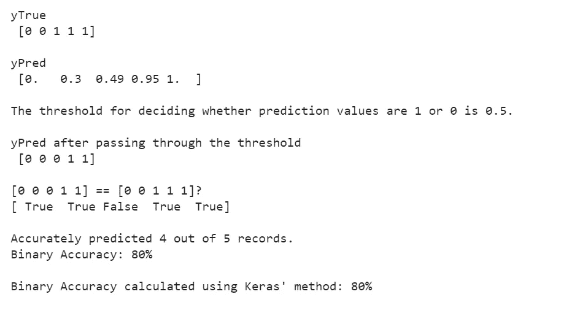

# Keras 的准确性指标

> 原文：<https://towardsdatascience.com/keras-accuracy-metrics-8572eb479ec7?source=collection_archive---------6----------------------->

## 通过在 Python 中运行简单的实验来理解它们

乌古尔·佩克尔在 [Unsplash](https://unsplash.com?utm_source=medium&utm_medium=referral) 上拍摄的照片

# 介绍

Keras 是 Python 的深度学习应用编程接口。它为评估分类器提供了五种不同的准确性指标。本文试图通过实验探索这些指标的组成和计算，从基础层面解释这些指标。

## Keras 提供以下准确度指标

1.  准确(性)
2.  二元精度
3.  分类准确性
4.  TopK 分类准确性
5.  稀疏 TopK 分类准确度

## 对于每个指标，我们运行以下实验

1.  从逻辑上定义和计算准确性——假设。
2.  用 Keras 的方法计算精度。
3.  如果(1)和(2)同时存在，将逻辑定义归于 Keras 的方法。

# 准确(性)

精确度计算预测值(yPred)与实际值(yTrue)相匹配的百分比。

对于一个记录，如果预测值等于实际值，则认为它是准确的。

然后我们通过将准确预测的记录数除以记录总数来计算准确率。

## 密码

## 输出

# 二元精度

二进制精度计算二进制标签的预测值(yPred)与实际值(yTrue)相匹配的百分比。

由于标签是二进制的，yPred 由等于 1 的预测概率值组成。

郑重声明:

1.  如果概率高于阈值，则分配 1，否则分配的值为 0。
2.  如果赋值等于实际值，则认为是准确的。

然后，我们通过将准确预测的记录数除以记录总数来计算二进制精度。

可以调整阈值(默认值= 0.5)来提高二进制精度。

## 密码

## 输出

问题 1。在上面的实验中，当我们将阈值改为(i) 0.4 和(ii) 0.49 时，二进制精度的值是多少？

# 分类准确性

分类精度计算一次性标注的预测值(yPred)与实际值(yTrue)相匹配的百分比。

郑重声明:

1.  我们使用 argmax()确定最大值出现的索引。
2.  如果 yPred 和 yTrue 相同，则认为是准确的。

然后，我们通过将准确预测的记录数除以记录总数来计算分类准确性。

由于分类准确性寻找最大值的索引，yPred 可以是 logit 或预测的概率。

## 密码

## 输出

问题 2。以下数据的分类准确度值是多少？

**提示。上面的 yPred 可能看起来不寻常，因为它有多个 1。但是，Keras 处理它们时不会抛出任何错误，因为当最大值出现多次时，argmax()会返回第一个匹配项的索引。**

# TopK 分类准确性

TopK 分类准确性计算目标(非零 yTrue)在前 K 个预测(yPred)中的记录的百分比。

郑重声明:

1.  我们按照概率值的降序排列 yPred 预测。
2.  如果非零 yTrue 的索引中存在的 yPred 的秩小于或等于 K，则认为它是准确的。

然后，我们通过将准确预测的记录数除以记录总数来计算 TopK 分类准确性。

## 密码

## 输出

**问题 3。**上述实验输出 100%作为 TopK 分类准确率的最小 K 是多少？

# 稀疏 TopK 分类准确度

稀疏前 K 分类准确性计算整数目标(yTrue)在前 K 个预测(yPred)中的记录的百分比。

yTrue 由非零目标的索引(0 到 n-1)组成，而不是像 TopK 分类精度中那样的一次性目标。

郑重声明:

1.  我们按照概率值的降序排列 yPred 预测。
2.  如果非零 yTrue 的索引中存在的 yPred 的秩小于或等于 K，则认为它是准确的。

然后，我们通过将准确预测的记录数除以记录总数来计算稀疏 TopK 分类准确度。

## 密码

## 输出

**问题 4。**上述实验输出 100%作为稀疏 TopK 分类准确率的最小 K 是多少？

# 结论

概括地说，Keras 提供了五种不同的度量来衡量分类器的预测准确性。根据数据的性质，特定的方法可能比其他方法更有帮助，也更相关。看完这篇文章，我希望你能明智地选择一个指标，并准确地解读它。

## 答案

1.  ㈠100%，㈡80%
2.  100%
3.  K = 4
4.  K = 2

更多信息，请参考 [**Keras 的文档**](https://keras.io/api/metrics/accuracy_metrics/) **。**

最后，我想感谢我的朋友萨姆校对了这篇文章。