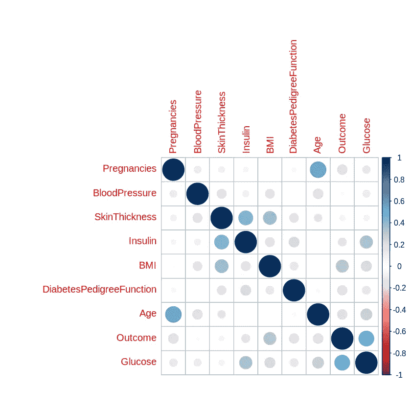
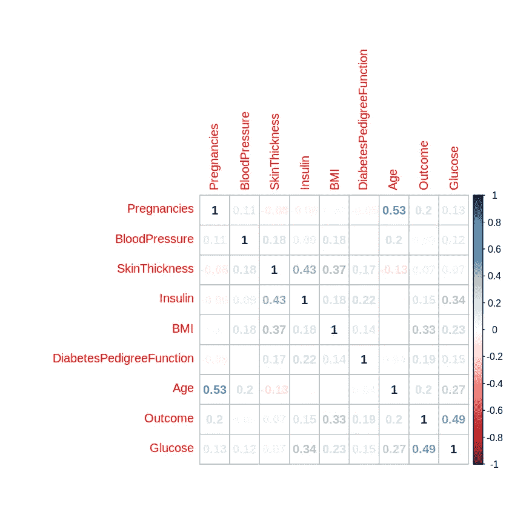
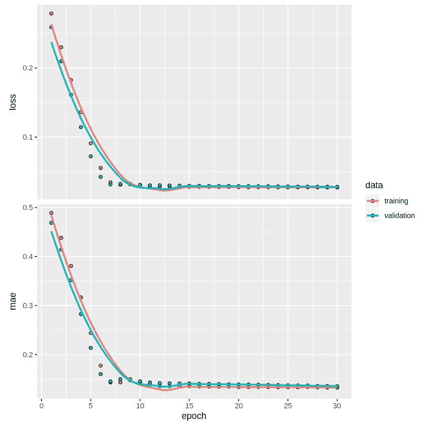
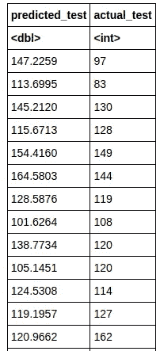

# Keras 和 R:用序列模型预测血糖水平

> 原文：<https://towardsdatascience.com/keras-and-r-predicting-blood-glucose-levels-with-the-sequential-model-596efe89a6b8?source=collection_archive---------22----------------------->

## 这个例子说明了如何使用 Keras 和 R 来实现基于回归的神经网络。

随着 TensorFlow 2.0 的出现， *Keras* 现在是这个版本的默认 API。Keras 用于构建深度学习目的的神经网络。因此，Keras 是对大型数据集进行分析的非常有用的工具。

然而，你知道 Keras API 也可以在 R 中运行吗？

在这个例子中， *Keras* 用于生成一个神经网络，目的是解决 r 中的一个回归问题

具体来说，[皮马印第安人糖尿病数据集](https://www.kaggle.com/uciml/pima-indians-diabetes-database)用于使用相关特征预测患者的血糖水平。

在这方面，本文概述了:

*   R 中的特征选择方法
*   如何在 Keras 中定义顺序模型
*   验证和测试模型预测的方法

# 数据集

在这个例子中，Pima Indians 糖尿病数据集被分成三个独立的数据集。

**训练和验证:** *皮马-印度人-diabetes1.csv* 。原始数据集的 80%是从完整数据集分割出来的。反过来，该数据集的 70%用于训练模型，剩余的 30%用于验证预测。

**测试:** *皮马-印第安人-糖尿病 2.csv* 和*皮马-印第安人-糖尿病 3.csv* 。原始数据集的剩余 20%用作看不见的数据，以确定模型生成的预测在处理全新数据时是否表现良好。 *pima-indians-diabetes2* 包含特征(或自变量)，而 *pima-indians-diabetes3* 包含因变量(血糖水平)。

# 特征选择

特征选择的目的是确定那些对因变量影响最大的特征。

在我们的例子中，有八个特征，其中一些在确定血糖水平时比其他的更重要。

这里使用的两种特征选择方法是:

*   相关图
*   多元线性回归

# 相关图

相关图使我们能够直观地确定:

1.  与因变量高度相关的特征
2.  彼此高度相关的特征

如果某些特征与血糖水平高度相关，那么这表明这些特征在预测血糖水平方面是重要的。具有低相关性的特征被指示为不重要。

然而，彼此高度相关的特征将表明这些特征中的一些是多余的(因为它们实际上试图解释相同的事情)。

这是第一个相关图:

```
M <- cor(diabetes1)
corrplot(M, method = "circle")
```



我们可以看到**胰岛素**和**结果**变量与**葡萄糖**变量特别相关，而**年龄**和**怀孕**和**胰岛素**和**皮肤厚度**之间也有相关性。

但是，我们可以更详细地了解并获得每个特征的特定相关系数:

```
corrplot(M, method = "number")
```



# 多元线性回归

多元线性回归的目的是:

1.  在解释因变量时，确定每个特征的系数的大小和性质。
2.  确定每个特征的重要性或不重要性。

以下是线性回归的结果:

```
Call:
lm(formula = Glucose ~ Pregnancies + Outcome + Age + DiabetesPedigreeFunction + 
    BMI + Insulin + SkinThickness + BloodPressure, data = diabetes1)Residuals:
    Min      1Q  Median      3Q     Max 
-68.709 -18.148  -2.212  15.176  80.950 Coefficients:
                          Estimate Std. Error t value Pr(>|t|)    
(Intercept)              78.401064   6.363612  12.320  < 2e-16 ***
Pregnancies              -0.481865   0.363730  -1.325  0.18575    
Outcome                  25.590805   2.384153  10.734  < 2e-16 ***
Age                       0.527262   0.106097   4.970  8.8e-07 ***
DiabetesPedigreeFunction  0.052534   3.198192   0.016  0.98690    
BMI                       0.318452   0.167106   1.906  0.05718 .  
Insulin                   0.082208   0.009843   8.352  4.8e-16 ***
SkinThickness            -0.202236   0.077372  -2.614  0.00918 ** 
BloodPressure             0.083865   0.058081   1.444  0.14929    
---
Signif. codes:  0 ‘***’ 0.001 ‘**’ 0.01 ‘*’ 0.05 ‘.’ 0.1 ‘ ’ 1Residual standard error: 24.94 on 590 degrees of freedom
Multiple R-squared:  0.362,	Adjusted R-squared:  0.3533 
F-statistic: 41.84 on 8 and 590 DF,  p-value: < 2.2e-16
```

在 5%的水平上，**结果**、**年龄**、**胰岛素**和**皮肤厚度**被认为是显著的。其他特征在 5%的水平上被认为是不重要的。

# 使用 Breusch-Pagan 进行异方差检验

在这种情况下，没有必要对多重共线性进行正式测试，因为相关图显示了彼此高度相关的要素。

然而，可能存在异方差(跨标准误差的不均匀方差)，例如，由于患者的年龄不同。为了检验这一点，进行了 Breusch-Pagan 检验——p 值低于 0.05 表示存在异方差。

```
> bptest(fit) studentized Breusch-Pagan testdata:  fit
BP = 36.585, df = 8, p-value = 1.372e-05
```

由于表明存在异方差，所以运行稳健的回归——特别是使用 Huber 权重。这样做的目的是降低数据集中异常值的价值。

```
> # Huber Weights (Robust Regression)
> summary(rr.huber <- rlm(Glucose ~ Pregnancies + Outcome + Age + DiabetesPedigreeFunction + BMI + Insulin + SkinThickness + BloodPressure, data=diabetes1))Call: rlm(formula = Glucose ~ Pregnancies + Outcome + Age + DiabetesPedigreeFunction + 
    BMI + Insulin + SkinThickness + BloodPressure, data = diabetes1)
Residuals:
    Min      1Q  Median      3Q     Max 
-68.627 -16.842  -1.543  15.576  83.793 Coefficients:
                         Value   Std. Error t value
(Intercept)              78.3319  6.2990    12.4357
Pregnancies              -0.4675  0.3600    -1.2984
Outcome                  25.0513  2.3599    10.6152
Age                       0.5448  0.1050     5.1881
DiabetesPedigreeFunction -0.5482  3.1657    -0.1732
BMI                       0.3297  0.1654     1.9935
Insulin                   0.0925  0.0097     9.4912
SkinThickness            -0.2530  0.0766    -3.3032
BloodPressure             0.0673  0.0575     1.1706Residual standard error: 24.53 on 590 degrees of freedom
```

在 **590** 自由度上，双尾 t 临界值如下:

```
> abs(qt(0.05/2, 590))
[1] 1.963993
```

当 t 统计量> t 临界值时，零假设被拒绝。对此，**结局**、**年龄**、**身体质量指数**、**胰岛素**、**皮肤厚度**的 t 值绝对值大于临界值。

考虑到相关图和多元线性回归的发现，选择**结果**、**年龄**、**胰岛素**和**皮肤厚度**作为分析的相关特征。

# 数据准备

既然已经选择了相关特征，就可以构建神经网络了。在此之前:

1.  最大-最小归一化用于在 0 和 1 之间缩放每个变量。这是为了确保变量之间有一个共同的范围，以便神经网络可以正确地解释它们。

```
normalize <- function(x) {
  return ((x - min(x)) / (max(x) - min(x)))
}maxmindf <- as.data.frame(lapply(df, normalize))
attach(maxmindf)
maxmindf<-as.matrix(maxmindf)
```

1.  训练验证集被分成 70/30。

```
ind <- sample(2, nrow(maxmindf), replace=TRUE, prob = c(0.7,0.3))X_train <- maxmindf[ind==1, 1:4]
X_val <- maxmindf[ind==2, 1:4]
y_train <- maxmindf[ind==1, 5]
y_val <- maxmindf[ind==2, 5]
```

# 顺序模型

现在，定义了顺序模型。四个输入特征(结果、年龄、胰岛素、皮肤厚度)包括在输入层中，该层中定义了 9 个神经元。定义一个具有 60 个神经元的隐藏层，并且定义一个具有 1 个神经元的线性输出层。

正如[法尔哈德·马利克](https://medium.com/fintechexplained/what-are-hidden-layers-4f54f7328263)在本文中所解释的，每层神经元的数量配置如下:

*   **输入层:**输入层的神经元数量计算如下:

`Number of features in the training set + 1`

在这种情况下，由于训练集中有 8 个特征，因此相应地定义了 **9 个**输入神经元。

*   **隐藏层:**定义一个隐藏层，因为单个层适用于处理大多数数据集。隐藏层中神经元的数量确定如下:

```
Training Data Samples/Factor * (Input Neurons + Output Neurons)
```

在这种情况下，将因子设置为 1，该因子的目的是防止过度拟合。因子可以取 1 到 10 之间的值。输入层中有 9 个神经元，输出层中有 1 个神经元，训练集中有 599 个观察值，隐藏层被分配了 60 个神经元。

*   **输出层:**由于这是结果层，输出层默认取值 1。

```
model <- keras_model_sequential() 
model %>% 
  layer_dense(units = 9, activation = 'relu', kernel_initializer='RandomNormal', input_shape = c(4)) %>% 
  layer_dense(units = 60, activation = 'relu') %>%
  layer_dense(units = 1, activation = 'linear')summary(model)
```

以下是输出:

```
Model: "sequential"
________________________________________________________________________________
Layer (type)                        Output Shape                    Param #     
================================================================================
dense (Dense)                       (None, 9)                       45          
________________________________________________________________________________
dense_1 (Dense)                     (None, 60)                      600         
________________________________________________________________________________
dense_2 (Dense)                     (None, 1)                       61          
================================================================================
Total params: 706
Trainable params: 706
Non-trainable params: 0
________________________________________________________________________________
```

该模型现在经过 30 个时期的训练，并基于其损失和平均绝对误差进行评估。假设因变量为区间，则使用均方差来确定预测值和实际值之间的偏差。

```
model %>% compile(
  loss = 'mean_squared_error',
  optimizer = 'adam',
  metrics = c('mae')
)history <- model %>% fit(
  X_train, y_train, 
  epochs = 30, batch_size = 50, 
  validation_split = 0.2
)
```

# 模型评估

预测值和实际值会按比例还原为其原始格式:

```
model %>% evaluate(X_val, y_val)
model
pred <- data.frame(y = predict(model, as.matrix(X_val)))
predicted=pred$y * abs(diff(range(df$Glucose))) + min(df$Glucose)
actual=y_val * abs(diff(range(df$Glucose))) + min(df$Glucose)
df<-data.frame(predicted,actual)
attach(df)
```

以下是输出:

```
$loss
    0.0266957393988254
$mae
    0.132186755537987Model
Model: "sequential"
________________________________________________________________________________
Layer (type)                        Output Shape                    Param #     
================================================================================
dense (Dense)                       (None, 9)                       45          
________________________________________________________________________________
dense_1 (Dense)                     (None, 60)                      600         
________________________________________________________________________________
dense_2 (Dense)                     (None, 1)                       61          
================================================================================
Total params: 706
Trainable params: 706
Non-trainable params: 0
________________________________________________________________________________
```

这是损失和平均绝对误差的曲线图:



该模型产生的损失略高于 2%，平均绝对误差略高于 13%。

*MLmetrics* 库也可用于计算 MAPE(平均绝对百分比误差)。

```
install.packages("MLmetrics")
library(MLmetrics)
MAPE(predicted, actual)
```

验证集的 MAPE 为 **18%** 。增加模型中隐藏层的数量并不能提高 MAPE，因此决定在模型配置中保留一个隐藏层。

# 预测和测试数据

尽管这个模型显示了强大的预测能力，我们的工作还没有完成。

虽然该模型在验证数据上表现良好，但我们现在需要评估该模型在完全看不见的数据上是否也表现良好。

从 pima-indians-diabetes2 加载特征变量，并再次调用 max0min 归一化:

```
normalize <- function(x) {
  return ((x - min(x)) / (max(x) - min(x)))
}maxmindf2 <- as.data.frame(lapply(df2, normalize))
attach(maxmindf2)
```

使用 R 中的预测函数，为葡萄糖变量生成预测:

```
pred_test <- data.frame(y = predict(model, as.matrix(maxmindf2)))
predicted_test = pred_test$y * abs(diff(range(diabetes1$Glucose))) + min(diabetes1$Glucose)
predicted_test
```

然后将预测值与 pima-indians-diabetes 中的实际值进行比较 3:

```
actual_test = diabetes3$Glucose
df2<-data.frame(predicted_test,actual_test)
attach(df2)
df2
```



现在，使用测试值计算平均绝对百分比误差:

```
MAPE(predicted_test, actual_test)
```

计算出 17%的平均百分比误差:

```
0.177895157636775
```

观察到，虽然平均百分比误差略高于使用训练和验证数据计算的误差，但是该模型在测试集上的所有未观察到的观察中预测血糖水平仍然表现良好。

# 结论

在本例中，我们看到:

*   如何在 R 中实现特征选择方法
*   使用 Keras API 构建一个神经网络来分析回归数据
*   使用测试数据的仪表预测精度

非常感谢你的时间！你也可以在 michael-grogan.com 找到更多我的数据科学内容。

*免责声明:本文是在“原样”的基础上编写的，没有担保。本文旨在提供数据科学概念的概述，不应以任何方式解释为专业建议。*