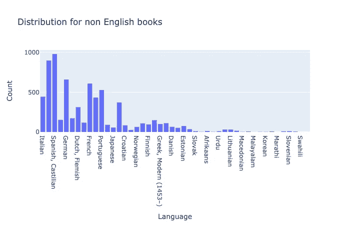

# Keras，告诉我我的书的类型

> 原文：<https://towardsdatascience.com/keras-tell-me-the-genre-of-my-book-a417d213e3a1?source=collection_archive---------25----------------------->

## 利用递归神经网络的能力进行分类。


Shutterstock 上的十亿张照片

对于任何希望深入了解递归神经网络(RNN)如何工作的人来说，我希望这个简单的教程是一个很好的读物！

我们使用的数据集包括我从 GoodReads 收集的书籍描述和流派分类，这是一个使用 RNN 的分类方法解决典型分类问题的很好的例子。对于这个项目，我们将把我们的问题简化为一个二元分类问题，我们将使用 RNN 对全文图书描述进行情感分析！

想想这有多神奇。我们将训练一个人工神经网络如何“阅读”书籍描述并猜测其流派。

由于理解书面语言需要跟踪一个句子中的所有单词，我们需要一个递归神经网络来保存以前出现过的单词的“记忆”，因为它随着时间的推移“阅读”句子。

特别是，我们将使用 LSTM(长短期记忆)细胞，因为我们真的不想太快“忘记”单词——句子中早期的单词会显著影响句子的意思。

GitHub 资源库[这里](https://github.com/ernestng11/predicting-book-genre-with-lstm-model/blob/master/book%20genre%20prediction.ipynb)

这里是我们这个项目需要的一些重要的库——Numpy、Pandas、matplotlib、Plotly 和 Tensorflow。我们将使用 Keras——运行在 TensorFlow(或 CNTK 或 Theano)之上的东西。Keras 允许我们更少地考虑原始模型拓扑，直接投入到简单快速的原型开发中。实验越快，结果越好:)

```
import numpy as np
import pandas as pdimport matplotlib.pyplot as plt
import tensorflow
import plotly.offline as pyoff
import plotly.graph_objs as go
pyoff.init_notebook_mode()
```

让我们首先导入我从好的阅读中收集的数据，看看我们需要处理什么。

```
bookdata_path = 'book_data.csv'
testdata_path = 'book_data18.csv'
book = pd.read_csv(bookdata_path)
test = pd.read_csv(testdata_path)book.columns
```

' book_authors ':作者姓名字符串

' desc 图书':描述字符串

' book_edition ':图书字符串的不同版本

' book_format ':精装/平装字符串

' book_pages ':一本书的页数

“图书评级”:图书评级浮动

' book_rating_count ':评分数 int

' book_review_count ':评论数 int

' book_title ':图书字符串标题

“体裁”:书串的体裁

' image_url ':图书图像 url 字符串

> **数据清理和数据探索**

这一步占用了每个数据科学家的大部分时间。我们查看数据框中的每一列，找出我们可能面临的任何潜在问题。

一些常见问题包括:

1.  缺少值
2.  涉及不同的语言
3.  非 Ascii 字符
4.  无效描述
5.  描述中缺少空格，例如 HelloILike toEat

我建议写下你的数据清理步骤的所有发现，这样你就可以不断地查阅你的笔记，确保你不会错过任何一个步骤！

事不宜迟，以下是我的发现。

1.  语料库中存在多种语言——我是想保留所有语言还是只保留英语描述？我的数据集中的整体语言分布如何？
2.  每本书至少有一个用户定义的流派，我的数据集中有多少流派？流派分布是怎样的？有多少独特的流派？

**1。删除无效格式的描述**

因为我们在预测类型，类型将是我们的标签，而特征将来自每本书的描述。我发现在一些条目中有格式错误——这就是 [langdetect](https://pypi.org/project/langdetect/) 出现的地方。我们将实现一个函数来删除任何具有无效描述格式的行。

```
from langdetect import detectdef remove_invalid_lang(df):
    invalid_desc_idxs=[]
    for i in df.index:
        try:
            a=detect(df.at[i,'book_desc'])
        except:
            invalid_desc_idxs.append(i)

    df=df.drop(index=invalid_desc_idxs)
    return dfbook = remove_invalid_lang(book)
test = remove_invalid_lang(test)
```

## 2.仅获取英文描述

我注意到在我的数据集中涉及到许多语言。为了简单起见，我只想要英文的书籍描述。

```
book[‘lang’]=book[‘book_desc’].map(lambda desc: detect(desc))
test['lang']=test['book_desc'].map(lambda desc: detect(desc))
```

langdetect 允许我们将每个描述映射到一个 ISO 639-1 值，以使我们在过滤掉英文描述时更加轻松。用它！然后，我将从维基百科中检索语言列表及其各自的 ISO 值。

```
lang_lookup = pd.read_html('[https://en.wikipedia.org/wiki/List_of_ISO_639-1_codes')[1](https://en.wikipedia.org/wiki/List_of_ISO_639-1_codes')[1)]
langpd = lang_lookup[['ISO language name','639-1']]
langpd.columns = ['language','iso']def desc_lang(x):
    if x in list(langpd['iso']):
        return langpd[langpd['iso'] == x]['language'].values[0]
    else:
        return 'nil'book['language'] = book['lang'].apply(desc_lang)
test['language'] = test['lang'].apply(desc_lang)
```


从图中可以清楚地看到，绝大多数描述都是英文的。让我们仔细看看其他语言的分布。



用这些一行程序从我们的测试和训练数据集中检索所有的英语书！

```
book = book[book['language']=='English']
test = test[test['language']=='English']
```

## 3.查看所有可用的流派

这就是我们的流派专栏的样子。我们有许多由“|”分隔的用户定义的风格，所以我们必须清理它。

幻想|年轻人|小说

在每个数据科学项目中，了解数据的分布非常重要，最好的方法是绘制图表！我真的很喜欢使用 Plotly 进行数据可视化，但是 matplotlib 和 seaborn 也可以完成这项工作。

这是我的功能，获取每本书的所有流派，并绘制成图表。

```
def genre_count(x):
    try:
        return len(x.split('|'))
    except:
        return 0book['genre_count'] = book['genres'].map(lambda x: genre_count(x))plot_data = [
    go.Histogram(
        x=book['genre_count']
    )
]
plot_layout = go.Layout(
        title='Genre distribution',
        yaxis= {'title': "Frequency"},
        xaxis= {'title': "Number of Genres"}
    )
fig = go.Figure(data=plot_data, layout=plot_layout)
pyoff.iplot(fig)
```


我必须说，大多数书都有大约 5-6 种类型，而且分布非常均匀。

```
def genre_listing(x):
    try:
        lst = [genre for genre in x.split("|")]
        return lst
    except: 
        return []book['genre_list'] = book['genres'].map(lambda x: genre_listing(x))genre_dict = defaultdict(int)
for idx in book.index:
    g = book.at[idx, 'genre_list']
    if type(g) == list:
        for genre in g:
            genre_dict[genre] += 1genre_pd = pd.DataFrame.from_records(sorted(genre_dict.items(), key=lambda x:x[1], reverse=True), columns=['genre', 'count'])
```

上面的代码给了我一个所有流派的字典，以及它们在整个语料库中的总数。让我们进入剧情。

```
plot_data = [
 go.Bar(
 x=genre_pd[‘genre’],
 y=genre_pd[‘count’]
 )
]
plot_layout = go.Layout(
 title=’Distribution for all Genres’,
 yaxis= {‘title’: “Count”},
 xaxis= {‘title’: “Genre”}
 )
fig = go.Figure(data=plot_data, layout=plot_layout)
pyoff.iplot(fig)
```


看那些数量很少的类型是不实际的，因为它对我们来说没有什么价值。我们只想查看代表数据集的顶级独特流派，因此让我们挑选 50 个顶级流派来查看！


如果我们看一下 genre_list 这一栏，如果“小说”至少被列为一种类型，那么这本书就被归类为小说。通过观察，如果一本书在其流派列表中至少有小说，同一列表中的所有其他流派也将与小说密切相关。由此，我可以比较我的数据集中小说和非小说书籍的数量，并将其转化为二元分类问题！

```
def determine_fiction(x):
    lower_list = [genre.lower() for genre in x]
    if 'fiction' in lower_list:
        return 'fiction'
    elif 'nonfiction' in lower_list:
        return 'nonfiction'
    else:
        return 'others'
book['label'] = book['genre_list'].apply(determine_fiction)
test['label'] = test['genre_list'].apply(determine_fiction)
```

## 4.清理文本

下面是我的函数，可以删除任何非 Ascii 字符和标点符号。

```
def _removeNonAscii(s): 
    return "".join(i for i in s if ord(i)<128)def clean_text(text):
    text = text.lower()
    text = re.sub(r"what's", "what is ", text)
    text = text.replace('(ap)', '')
    text = re.sub(r"\'s", " is ", text)
    text = re.sub(r"\'ve", " have ", text)
    text = re.sub(r"can't", "cannot ", text)
    text = re.sub(r"n't", " not ", text)
    text = re.sub(r"i'm", "i am ", text)
    text = re.sub(r"\'re", " are ", text)
    text = re.sub(r"\'d", " would ", text)
    text = re.sub(r"\'ll", " will ", text)
    text = re.sub(r'\W+', ' ', text)
    text = re.sub(r'\s+', ' ', text)
    text = re.sub(r"\\", "", text)
    text = re.sub(r"\'", "", text)    
    text = re.sub(r"\"", "", text)
    text = re.sub('[^a-zA-Z ?!]+', '', text)
    text = _removeNonAscii(text)
    text = text.strip()
    return textdef cleaner(df):
    df = df[df['label'] != 'others']
    df = df[df['language'] != 'nil']
    df['clean_desc'] = df['book_desc'].apply(clean_text)return df
```

只需拨打:

```
clean_book = cleaner(book)
clean_test = cleaner(test)
```

我们现在对每本书都有了一个“干净”的描述！

“胜利会让你出名。输了就意味着必死无疑。”成为

“胜利会让你出名，失败意味着死亡”

> 为模型准备我们的数据

现在有趣的部分来了。书籍描述是我们的预测器，所以我们必须特别注意！我们需要确保每个描述都是相同的格式和长度。

使用固定输入长度可以提高模型训练期间的性能，因为这样可以创建固定形状的张量，从而获得更稳定的权重。因此，我们将进行裁剪和填充——如果原始描述长度比最佳长度短，则将描述裁剪到最佳长度并用空值填充的过程。

*我们如何确定最佳长度？*

绘制描述长度的分布图，并观察最“常见”的描述长度。


哇，这是一个非常倾斜的分布！但是我们知道大多数书的描述长度小于 500。我想画出累积分布函数(CDF ),来观察每一级描述长度的“图书数量”。

```
len_df_bins=clean_book.desc_len.value_counts(bins=100, normalize=True).reset_index().sort_values(by=['index'])len_df_bins['cumulative']=len_df_bins.desc_len.cumsum()len_df_bins['index']=len_df_bins['index'].astype('str')len_df_bins.iplot(kind='bar', x='index', y='cumulative')
```


约 92.7%的记录字数在 277 字以下。因此，我决定将我的最大阈值设置为 250 个单词。我们还需要一个最小阈值，我将把它设置为 6，因为任何少于 5 个单词的描述都不太可能足以确定类型。

## 1.剪辑和填充

对于描述少于 250 个单词的记录，我们将用空值填充它们，而对于描述多于 250 个单词的记录，我们将对它们进行裁剪，只包含前 250 个单词。

RNN 从左到右读取令牌序列，并输出一个预测书是小说还是非小说。这些标记的内存被一个接一个地传递给最终的标记，因此，对序列进行预填充而不是后填充是很重要的。这意味着零添加在令牌序列之前，而不是之后。存在后填充可能更有效的情况，例如在双向网络中。

```
min_desc_length=6
max_desc_length=250clean_book=clean_book[(clean_book.clean_desc.str.split().apply(len)>min_desc_length)].reset_index(drop=True)
```

上面的代码过滤掉了所有少于 6 个单词的描述。

```
vocabulary=set() #unique list of all words from all descriptiondef add_to_vocab(df, vocabulary):
    for i in df.clean_desc:
        for word in i.split():
            vocabulary.add(word)
    return vocabularyvocabulary=add_to_vocab(clean_book, vocabulary)#This dictionary represents the mapping from word to token. Using token+1 to skip 0, since 0 will be used for padding descriptions with less than 200 words
vocab_dict={word: token+1 for token, word in enumerate(list(vocabulary))}#This dictionary represents the mapping from token to word
token_dict={token+1: word for token, word in enumerate(list(vocabulary))}assert token_dict[1]==token_dict[vocab_dict[token_dict[1]]]def tokenizer(desc, vocab_dict, max_desc_length):
    '''
    Function to tokenize descriptions
    Inputs:
    - desc, description
    - vocab_dict, dictionary mapping words to their corresponding tokens
    - max_desc_length, used for pre-padding the descriptions where the no. of words is less than this number
    Returns:
    List of length max_desc_length, pre-padded with zeroes if the desc length was less than max_desc_length
    '''
    a=[vocab_dict[i] if i in vocab_dict else 0 for i in desc.split()]
    b=[0] * max_desc_length
    if len(a)<max_desc_length:
        return np.asarray(b[:max_desc_length-len(a)]+a).squeeze()
    else:
        return np.asarray(a[:max_desc_length]).squeeze()len(vocabulary)
85616
```

我们有 85616 个独特的单词。最后，裁剪和填充步骤的最后一步，标记每个描述。

```
clean_test['desc_tokens']=clean_test['clean_desc'].apply(tokenizer, args=(vocab_dict, max_desc_length))
```

## 2.列车测试分离

当数据集不平衡时，即目标变量(虚构/非虚构)的分布不均匀时，我们应该确保训练-验证分裂是分层的。这确保了目标变量的分布在训练和验证数据集中得到保留。

我们也可以尝试随机欠采样来减少虚构样本的数量，但是，在这种情况下，我将使用分层采样。原因如下。

分层随机样本用于可以很容易分成不同的子群或子集的人群，在我们的例子中，是虚构或非虚构的。我将从每个标签中随机选择与群体规模和人口数量成比例的记录。每个记录必须只属于一个阶层(标签),我确信每个记录是互斥的，因为一本书只能是小说或非小说。重叠的地层会增加某些数据被包括在内的可能性，从而扭曲样本。

分层抽样优于随机欠抽样的一个优点是，因为它使用特定的特征，所以它可以根据用于划分不同子集的内容来提供更准确的图书表示，而且我们不必删除任何可能对我们的模型有用的记录。

```
def stratified_split(df, target, val_percent=0.2):
    '''
    Function to split a dataframe into train and validation sets, while preserving the ratio of the labels in the target variable
    Inputs:
    - df, the dataframe
    - target, the target variable
    - val_percent, the percentage of validation samples, default 0.2
    Outputs:
    - train_idxs, the indices of the training dataset
    - val_idxs, the indices of the validation dataset
    '''
    classes=list(df[target].unique())
    train_idxs, val_idxs = [], []
    for c in classes:
        idx=list(df[df[target]==c].index)
        np.random.shuffle(idx)
        val_size=int(len(idx)*val_percent)
        val_idxs+=idx[:val_size]
        train_idxs+=idx[val_size:]
    return train_idxs, val_idxs_, sample_idxs = stratified_split(clean_book, 'label', 0.1)train_idxs, val_idxs = stratified_split(clean_book, 'label', val_percent=0.2)
sample_train_idxs, sample_val_idxs = stratified_split(clean_book[clean_book.index.isin(sample_idxs)], 'label', val_percent=0.2)classes=list(clean_book.label.unique())sampling=Falsex_train=np.stack(clean_book[clean_book.index.isin(sample_train_idxs if sampling else train_idxs)]['desc_tokens'])
y_train=clean_book[clean_book.index.isin(sample_train_idxs if sampling else train_idxs)]['label'].apply(lambda x:classes.index(x))x_val=np.stack(clean_book[clean_book.index.isin(sample_val_idxs if sampling else val_idxs)]['desc_tokens'])
y_val=clean_book[clean_book.index.isin(sample_val_idxs if sampling else val_idxs)]['label'].apply(lambda x:classes.index(x))x_test=np.stack(clean_test['desc_tokens'])
y_test=clean_test['label'].apply(lambda x:classes.index(x))
```

x_train 和 y_train 将用于训练我们的模型，而 x_val 和 y_val 用于检查我们模型的验证准确性。我们的目标是适度的高训练精度和高验证精度，以确保我们不会过度拟合。

过度拟合是指我们的模型在对他们接受训练的数据进行预测时表现良好，但未能对看不见的数据(验证数据)进行归纳。另一方面，当我们的模型甚至在训练数据上表现糟糕时，就会出现欠拟合。

过度拟合的模型将具有高方差和低偏差，而欠拟合的模型将具有高偏差和低方差。

*误差=偏差+方差*

我们的主要目标是减少误差，而不是偏差或方差，因此最佳复杂度是中间值。

> 模型结构

在这一步，我们的训练数据只是一个数字矩阵，它是我们模型的必要输入。至于我们的 y 标签，现在是 1(虚构)或者 0(非虚构)。

*重述*

概括一下，我们有一堆书籍描述，它们被转换成由整数表示的单词向量，还有一个二元情感分类可供学习。RNN 病会很快发作，为了让事情在我们的小电脑上易于管理，我们将描述限制在它们的前 250 个单词。不要忘记，这也有助于提高我们的模型训练的性能！

*初始化我们的模型*

现在让我们建立我们的神经网络模型！考虑到 LSTM 递归神经网络是多么复杂，用 Keras 做到这一点是多么容易，这真的令人惊讶。

我们将从嵌入层开始，这只是将输入数据转换为更适合神经网络的固定大小的密集向量的一个步骤。您通常会看到这与我们这里的基于索引的文本数据结合在一起。嵌入层帮助我们降低问题的维度。如果我们对词汇表中的单词进行一次性编码，每个单词将由一个向量表示，这个向量的大小等于词汇表本身的大小，在本例中是 85643。由于每个样本将是一个大小为(词汇×记号数量)的张量，即(85643×250)，该层的大小对于 LSTM 来说将太大而不能消耗，并且对于训练过程来说将是非常资源密集和耗时的。如果我使用嵌入，我的张量大小将只有 250 x 250！WAYYY 小一点！

一个热编码将导致一个巨大的稀疏矩阵，而嵌入给我们一个密集的矩阵表示。嵌入长度越高，我们的模型可以学习的表示就越复杂，因为我们的嵌入层学习每个单词的固定长度的“表示”。

接下来，我们只需为 RNN 本身设置一个 LSTM 图层。就这么简单。我们指定 200 来匹配嵌入层的输出大小，并删除项以避免过度拟合，这是 RNN 特别容易发生的。顺便说一下，你可以选择 200 以外的任何数字，它只指定了该层中隐藏神经元的数量。

最后，我们只需要用 sigmoid 激活函数将它归结为最后一层中的单个神经元，以选择我们的二元情感分类 0 或 1。

我将解释为什么我为模型选择了超参数，但是如果你想跳到代码，请随意跳过这一部分！

我们应该使用多少 LSTM 层？*速度-复杂度权衡*

通常 1 层足以发现简单问题的趋势，2 层足以发现相当复杂的特征。对于一系列选择(层数)，我们可以在固定的时期数之后比较我们的模型的准确性，如果我们发现即使在添加更多层之后验证准确性也没有显著变化，我们可以选择最小层数。

**我们应该添加多少隐藏节点到我们的 LSTM 层？**
Ns:训练数据中样本的数量
Ni:输入神经元的数量
No:输出神经元的数量
alpha:缩放因子(指示您希望您的模型有多通用，或者您希望防止过度拟合的程度)

*通式:Ns / [alpha * (Ni + No)]*

**添加脱落层。*精度-防过拟合权衡***

通过在训练期间忽略随机选择的神经元来防止过度拟合，并降低对单个神经元的特定权重的敏感性。这迫使我们的模型展开 it 学习。

**添加密集层**

因为我们有 1 个输出标签来表示小说或非小说，所以我们将有 1 维输出。

**添加激活层**

有许多激活功能可供选择，所以这取决于我们的目标。

在这种情况下，我们希望输出是虚构/非虚构的，因此 Softmax 或 Sigmoid 函数会很好。

Sigmoid 函数基本上输出概率，我们通常会使用 sigmoid 进行二值分类。

Softmax 函数输出介于 0 和 1 之间的值，使得所有输出值的总和等于 1。基本上你得到了每一类的概率，它们的和必然是 1。这使得 Softmax 非常适合多类问题。

您可以使用 Sigmoid 和 Softmax 函数调整激活层超参数，并比较验证精度！我们也可以尝试 reLU，它被广泛使用，因为它计算速度快，效果好。

**选择损失函数、优化器和判断标准**

由于我们面临的是二进制分类问题，二进制交叉熵将与 sigmoid 一起很好地工作，因为交叉熵函数抵消了 Sigmoid 函数两端的平稳段，因此加快了学习过程。

对于优化器，自适应矩估计(adam)已被证明在大多数实际应用中工作良好，并且仅在超参数变化很小的情况下工作良好。r

从整体准确性的角度来判断模型的性能是最容易解释最终模型性能的。

现在我们将实际训练我们的模型。像 CNN 一样，RNN 的资源非常丰富。保持相对较小的批量是让它在你的电脑上运行的关键。当然，在现实世界中，您可以利用安装在集群上的许多计算机上的 GPU 来大大提高这一规模。

*代号*

```
parameters = {'vocab': vocabulary,
              'eval_batch_size': 30,
              'batch_size': 20,
              'epochs': 5,
              'dropout': 0.2,
              'optimizer': 'Adam',
              'loss': 'binary_crossentropy',
              'activation':'sigmoid'}

**def** bookLSTM(x_train, y_train, x_val, y_val, params):
    model = Sequential()
    model.name="Book Model"
    model.add(Embedding(len(params['vocab'])+1, output_dim=x_train.shape[1], input_length=x_train.shape[1]))
    model.add(LSTM(200, return_sequences=**True**))
    model.add(Dropout(params['dropout']))
    model.add(LSTM(200))
    model.add(Dense(1, activation=params['activation']))
    model.compile(loss=params['loss'],
              optimizer=params['optimizer'],
              metrics=['accuracy'])
    print(model.summary())
    model.fit(x_train, 
          y_train,
          validation_data=(x_val, y_val),
          batch_size=params['batch_size'], 
          epochs=params['epochs'])
    results = model.evaluate(x_test, y_test, batch_size=params['eval_batch_size'])
    **return** model

BookModel1 = bookLSTM(x_train, y_train, x_val, y_val, parameters)------ Model Summary ------Model: "Book Model"
_________________________________________________________________
Layer (type)                 Output Shape              Param #   
=================================================================
embedding_2 (Embedding)      (None, 200, 200)          17123400  
_________________________________________________________________
lstm_1 (LSTM)                (None, 200, 200)          320800    
_________________________________________________________________
dropout_1 (Dropout)          (None, 200, 200)          0         
_________________________________________________________________
lstm_2 (LSTM)                (None, 200)               320800    
_________________________________________________________________
dense_1 (Dense)              (None, 1)                 201       
=================================================================
Total params: 17,765,201
Trainable params: 17,765,201
Non-trainable params: 0
_________________________________________________________________Train on 23387 samples, validate on 5845 samples
Epoch 1/5
23387/23387 [==============================] - 270s 12ms/step - loss: 0.3686 - accuracy: 0.8447 - val_loss: 0.2129 - val_accuracy: 0.9129
Epoch 2/5
23387/23387 [==============================] - 282s 12ms/step - loss: 0.1535 - accuracy: 0.9476 - val_loss: 0.2410 - val_accuracy: 0.9013
Epoch 3/5
23387/23387 [==============================] - 279s 12ms/step - loss: 0.0735 - accuracy: 0.9771 - val_loss: 0.2077 - val_accuracy: 0.9357
Epoch 4/5
23387/23387 [==============================] - 280s 12ms/step - loss: 0.0284 - accuracy: 0.9924 - val_loss: 0.2512 - val_accuracy: 0.9334
Epoch 5/5
23387/23387 [==============================] - 293s 13ms/step - loss: 0.0161 - accuracy: 0.9957 - val_loss: 0.2815 - val_accuracy: 0.9290
657/657 [==============================] - 3s 5ms/step
```

我注意到，随着我的纪元从 3 增加到 5，测试精度增加了，但是验证精度降低了。这意味着模型更好地拟合了训练集，但它失去了对新数据进行预测的能力，这表明我的模型开始拟合噪声，并开始过度拟合。让我们改变参数！

```
parameters = {'vocab': vocabulary,
              'eval_batch_size': 30,
              'batch_size': 20,
              'epochs': 2,
              'dropout': 0.2,
              'optimizer': 'Adam',
              'loss': 'binary_crossentropy',
              'activation':'sigmoid'}

**def** bookLSTM(x_train, y_train, x_val, y_val, params):
    model = Sequential()
    model.name="Book Model2"
    model.add(Embedding(len(params['vocab'])+1, output_dim=x_train.shape[1], input_length=x_train.shape[1]))
    model.add(LSTM(200, return_sequences=**True**))
    model.add(Dropout(params['dropout']))
    model.add(LSTM(200))
    model.add(Dense(1, activation=params['activation']))
    model.compile(loss=params['loss'],
              optimizer=params['optimizer'],
              metrics=['accuracy'])
    print(model.summary())
    model.fit(x_train, 
          y_train,
          validation_data=(x_val, y_val),
          batch_size=params['batch_size'], 
          epochs=params['epochs'])
    results = model.evaluate(x_test, y_test, batch_size=params['eval_batch_size'])
    **return** model

BookModel2 = bookLSTM(x_train, y_train, x_val, y_val, parameters)------ Model Summary ------Model: "Book Model2"
_________________________________________________________________
Layer (type)                 Output Shape              Param #   
=================================================================
embedding_3 (Embedding)      (None, 200, 200)          17123400  
_________________________________________________________________
lstm_3 (LSTM)                (None, 200, 200)          320800    
_________________________________________________________________
dropout_2 (Dropout)          (None, 200, 200)          0         
_________________________________________________________________
lstm_4 (LSTM)                (None, 200)               320800    
_________________________________________________________________
dense_2 (Dense)              (None, 1)                 201       
=================================================================
Total params: 17,765,201
Trainable params: 17,765,201
Non-trainable params: 0
_________________________________________________________________Train on 23387 samples, validate on 5845 samples
Epoch 1/2
23387/23387 [==============================] - 337s 14ms/step - loss: 0.3136 - accuracy: 0.8690 - val_loss: 0.1937 - val_accuracy: 0.9305
Epoch 2/2
23387/23387 [==============================] - 332s 14ms/step - loss: 0.1099 - accuracy: 0.9636 - val_loss: 0.1774 - val_accuracy: 0.9341
657/657 [==============================] - 3s 4ms/step
```

我们仅在两个时期内就实现了 96.4%的训练准确率和 93.4%的验证准确率！对于 2 次运行来说，这已经很不错了。我尝试了许多不同的超参数，仅运行 10 个纪元就花了我一个小时，所以…

你自己试试，让我知道你选择了什么参数来获得比我更高的验证准确率！

> 测试我们模型的简单函数

在这部引人入胜的《纽约时报》畅销书《纸与火的女孩》续集中，雷和雷恩逃离了他们在隐秘宫殿中的压抑生活，但很快发现自由需要付出可怕的代价。雷，一个天真的乡下女孩，成为了一名皇家妓女，现在被称为月嫂，一个成功地做了别人做不到的事情的平民。但是杀死残忍的魔王并不是计划的结束——这只是开始。现在，雷和她的战士爱人雷恩必须前往王国，以获得来自遥远的反叛氏族的支持。旅途变得更加险恶，因为有人悬赏要得到雷的人头，还有阴险的怀疑威胁着要把雷和雷恩从内部分开。与此同时，在黑魔法和复仇的推动下，一个消灭叛军起义的邪恶阴谋正在成形。雷会成功地推翻帝制并保护她对任的爱情吗？还是她会成为邪恶魔法的牺牲品？

```
def reviewBook(model,text):
  labels = [‘fiction’, ‘nonfiction’]
  a = clean_text(fantasy)
  a = tokenizer(a, vocab_dict, max_desc_length)
  a = np.reshape(a, (1,max_desc_length))
  output = model.predict(a, batch_size=1)
  score = (output>0.5)*1
  pred = score.item()
  return labels[pred]
```

让我们传入我们的最终模型和样本文本，看看我们的模型是否能够仅仅根据一本书的描述准确地预测它的类型。你觉得上面这本书属于哪种流派？

```
reviewBook(BookModel2,fantasy)
```

小说

很明显在描述中有“恶魔之王”和“黑魔法”!

> 结论

请注意，在第二或第三个时期之后，我们训练时的验证准确性从未真正提高；我们可能只是过度适应了。在这种情况下，早期停止将是有益的。

但是再一次——停下来想想我们刚刚在这里做了什么！一种神经网络，可以“阅读”描述，并根据文本推断这本书是否是小说。它考虑了每个单词的上下文及其在评论中的位置——建立模型本身只需要几行代码！你可以用 Keras 做的事情真是不可思议。

伙计们，希望你们在阅读我的第一篇媒体文章时过得愉快。cheerrrrrrssssssssssssss