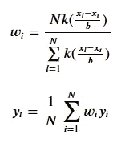
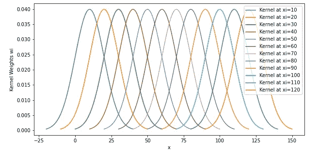
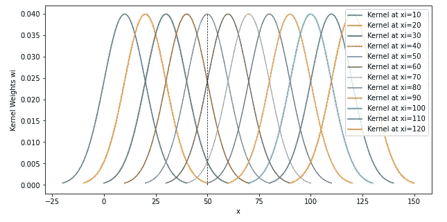
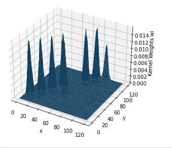

# Python 中从头开始的内核回归

> 原文：<https://towardsdatascience.com/kernel-regression-from-scratch-in-python-ea0615b23918?source=collection_archive---------11----------------------->

## 大家都知道线性回归，但是你知道核回归吗？

机器学习的初学者都是从学习回归的含义和线性回归算法的工作原理开始的。事实上，线性回归的易理解性、可解释性和大量有效的真实世界用例是该算法如此著名的原因。然而，有些情况下线性回归并不适合。在本文中，我们将看到这些情况是什么，什么是内核回归算法，以及它如何适应这种情况。最后，我们将从头开始编写带有高斯核的核回归算法。要阅读本文，需要具备 Python 和 numpy 的基础知识。


由 [Clarisse Croset](https://unsplash.com/@herfrenchness?utm_source=medium&utm_medium=referral) 在 [Unsplash](https://unsplash.com?utm_source=medium&utm_medium=referral) 上拍摄的照片

# 简单回顾一下线性回归

给定形式为 *N* 特征向量 *x* =[ *x* ₁、 *x* ₂、… *，x* ₙ]的数据，该数据由 *n* 个特征和相应的标签向量 *y* 组成，线性回归试图拟合出最佳描述数据的直线。为此，它试图找到直线方程的最优系数 *c* ᵢ， *i* ∈{0，…，n}*y*=*c*₀*+c*₁*x*₁+*c*₂*x*₂+…+*c*ₙ*x*ₙ然后，获得的方程被用于预测新的看不见的输入向量 *x* ₜ.的目标 *y* ₜ

线性回归是一种简单的算法，不能模拟特征之间非常复杂的关系。从数学上来说，这是因为它是线性的，方程的次数为 1，这意味着线性回归总是模拟一条直线。事实上，这种线性是线性回归算法的弱点。为什么？

好吧，让我们考虑一种情况，其中我们的数据不具有直线的形式:让我们使用函数 *f(x) = x 生成数据。*如果我们使用线性回归来拟合该数据的模型，我们将永远不会接近真正的三次函数，因为我们正在寻找系数的方程没有三次项！因此，对于任何不是使用线性函数生成的数据，线性回归都很可能不足。那么，我们该怎么办？

我们可以使用另一种类型的回归，称为多项式回归，它试图找到(顾名思义)多项式方程的最佳系数，该方程的次数为 *n* ， *n* ⪈1.然而，多项式回归带来了另一个问题:作为一名数据分析师，您无法知道方程的次数应该是多少，才能使结果方程最适合数据。这只能通过反复试验来确定，由于在 3 阶以上，使用多项式回归建立的模型难以可视化，所以这变得更加困难。

这就是内核回归的用武之地！

# 什么是内核回归？

看到名字，你可能会问，如果线性回归中的‘linear’是指线性函数，多项式回归中的‘多项式’是指多项式函数，那么‘核’是什么意思？原来，它的意思是一个内核函数！那么，是什么*内核函数呢？简单地说，它是一个相似性函数，接受两个输入，并指出它们有多相似。我们将很快看到在核回归中如何使用核函数。*

现在谈谈内核回归。与需要学习最优参数向量 *c* =[ *c* ₁、 *c* ₂、… *，c* ₙ]的线性和多项式回归不同，核回归是非参数回归，这意味着它通过直接对输入 *x* ₜ.执行计算来计算目标 *y* ₜ

怎么会？

给定数据点( *x* ᵢ， *y* ᵢ)，内核回归通过首先为每个数据点 *x* ᵢ.构建一个内核 *k* 来进行预测然后，对于给定的新输入 *x* ₜ，它使用内核计算每个 *x* ᵢ(由 *x* ᵢ- *x* ₜ给出)的相似性得分；相似性分数充当权重 *w* ᵢ，其表示在预测目标 *y* ₜ.时该内核(以及相应的标签 *y* ᵢ)的重要性然后通过将权重向量 *w=* [ *w* ₁、 *w* ₂、… *、w* ₙ]乘以标签向量 *y=* [ *y* ₁、 *y* ₂、… *，y*ₙ】*来获得预测。*



作者图片:方程中的核回归

现在，可以有不同的核函数，它们产生不同类型的核回归。一种这样的类型是高斯核回归，其中构造的核的形状是高斯曲线，也称为钟形曲线。在高斯核回归的背景下，每个构建的核也可以被视为具有平均值 *x* ᵢ和标准偏差*b*的正态分布。这里，b 是控制曲线形状(特别是高斯核中的高斯曲线的宽度)的超参数。高斯内核 *k* 的方程式如下所示。注意这个等式和高斯(也称为正态)分布的等式之间的相似性。


图片作者:高斯核方程

接下来我们将编写这种类型的内核回归。

# 编码高斯核回归

我们将首先查看一维特征向量的情况，然后将其扩展到 *n* 维。

```
from scipy.stats import norm
import numpy as np 
import pandas as pd
import matplotlib.pyplot as plt
import mathclass GKR:

    def __init__(self, x, y, b):
        self.x = x
        self.y = y
        self.b = b

    '''Implement the Gaussian Kernel'''
    def gaussian_kernel(self, z):
        return (1/math.sqrt(2*math.pi))*math.exp(-0.5*z**2)

    '''Calculate weights and return prediction'''
    def predict(self, X):
        kernels = [self.gaussian_kernel((xi-X)/self.b) for xi in self.x]
        weights = [len(self.x) * (kernel/np.sum(kernels)) for kernel in kernels]
        return np.dot(weights, self.y)/len(self.x)
```

我们为高斯核回归定义了一个类，它在初始化期间接受特征向量 *x、*标签向量 *y* 和超参数 *b* 。在类内部，我们定义了一个函数 *gaussian_kernel()* 来实现高斯内核。你可以看到我们只是把数学方程写成代码。接下来，我们定义函数 *predict()* ，该函数接收目标值需要预测的特征向量 *x* ₜ(代码中称为 *X* )。在函数内部，我们为每个 *x* ᵢ构造内核，计算权重并返回预测，同样通过将数学方程插入代码中。



作者图片:可视化不同的构造内核

现在，让我们传入一些虚拟数据，并查看输出的预测。我们预测 *x* ₜ = 50 的值(出于演示目的，忽略它已经存在于训练数据中)

```
gkr = GKR([10,20,30,40,50,60,70,80,90,100,110,120], [2337,2750,2301,2500,1700,2100,1100,1750,1000,1642, 2000,1932], 10)
gkr.predict(50)
```

这给了我们 1995.285 的输出



作者图片:从图形上，我们可以观察到 x_t = 50 的权重 w_i 是不同核之间的交点的垂线和虚线与 y 轴相交的点

现在，让我们针对 *n* 维特征向量的情况扩展代码。我们需要做的唯一修改是相似性得分计算。我们不是获得 *x* ᵢ和 *x* ₜ之间的差异，而是将 *n* 维情况下的相似性得分计算为它们之间的欧氏距离|| *x* ᵢ- *x* ₜ||。注意，为了处理 n 维向量，我们在需要的地方使用 numpy。

```
from scipy.stats import multivariate_normal

'''Class for Gaussian Kernel Regression'''
class GKR:

    def __init__(self, x, y, b):
        self.x = np.array(x)
        self.y = np.array(y)
        self.b = b

    '''Implement the Gaussian Kernel'''
    def gaussian_kernel(self, z):
        return (1/np.sqrt(2*np.pi))*np.exp(-0.5*z**2)

    '''Calculate weights and return prediction'''
    def predict(self, X):
        kernels = np.array([self.gaussian_kernel((np.linalg.norm(xi-X))/self.b) for xi in self.x])
        weights = np.array([len(self.x) * (kernel/np.sum(kernels)) for kernel in kernels])
        return np.dot(weights.T, self.y)/len(self.x)
```



作者图片:可视化构建的 3D 高斯核

同样，让我们传入一些 2D 虚拟数据并预测 *x* ₜ = [20，40]。

```
gkr = GKR([[11,15],[22,30],[33,45],[44,60],[50,52],[67,92],[78,107],[89,123],[100,137]], [2337,2750,2301,2500,1700,1100,1000,1642, 1932], 10)
gkr.predict([20,40])
```

我们得到 *y* ₜ = 2563.086。

本文的扩展代码(包括可视化代码)可以在 [GitHub](https://github.com/kunjmehta/Medium-Article-Codes/blob/master/gaussian-kernel-regression-from-scratch.ipynb) 和 [Kaggle](https://www.kaggle.com/kunjmehta/gaussian-kernel-regression-from-scratch) 上找到。

# 结论

我们看到了线性回归和多项式回归不能使用的地方和原因，并在此背景下理解了内核回归背后的直觉和工作原理，以及如何将其用作替代方法。我们研究了高斯核回归的细节，并通过简单地插入数学方程来编码，用 Python 从头开始编码。

我很乐意在 Linkedin 上与你联系！

# 参考

[1] A .布尔科夫，[《百页机器学习书》](http://themlbook.com/) (2019)，安德烈·布尔科夫出版。