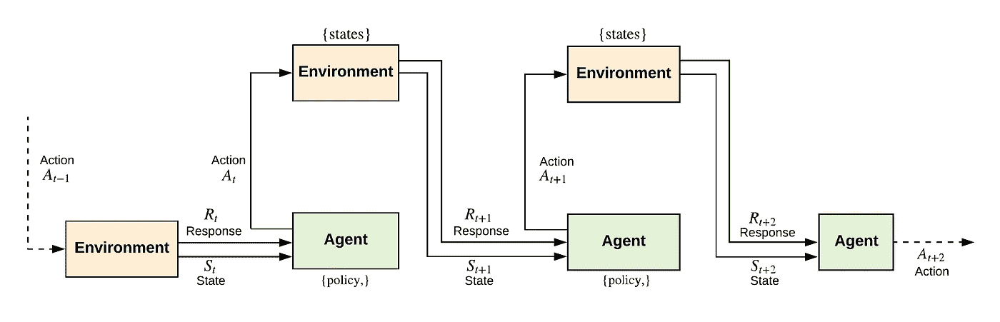

# 现代强化学习的关键概念

> 原文：<https://towardsdatascience.com/key-concepts-of-modern-reinforcement-learning-f420f6603045?source=collection_archive---------32----------------------->

## 强化学习导论

强化学习设置的基本层次包括一个在反馈回路中与环境交互的主体。代理基于在时间`s_{t-1}`从处于前一状态的环境接收的响应，在时间`s_t`为环境的每个状态选择动作。从这个基本设置中，我们已经可以确定强化学习设置中的两个主要组件，即**代理**和**环境**。

**代理-环境接口的递归表示。**在时间步骤`t`，代理接收环境状态的实例`s_t`。然后，代理从状态`s_t`的可用动作集中选择一个动作`a_t`。在下一次迭代中，代理收到一个新的状态实例`s_{t+1}`和一个基于在前一个状态`s_t`中采取的动作`a_t`的即时奖励`r_{t+1}`。

当代理与环境交互时，它学习一个**策略**。策略是一种“习得的策略”,它控制着代理在环境的特定时间`t`选择动作的行为。策略可以被视为从环境的状态到在那些状态中采取的动作的映射。

强化代理的目标是在反馈配置中与环境交互时最大化其长期回报。代理从每个状态-动作循环中得到的响应(代理在环境的每个状态下从一组动作中选择一个动作)被称为奖励函数。**奖励函数**(或简称奖励)是基于代理所做的动作的该状态的合意性的信号。

“有利的”奖励可以指示代理的良好的即时事件(即，状态-动作对)。另一方面,“不利的”奖励可能对代理人来说是一个坏事件。奖励函数对于强化代理所面临的问题是唯一的，并且影响代理所做的最优策略的选择。奖励函数在很大程度上定义了强化学习任务。

另一个关键的部分是一个**值函数**(或者简单的值)的概念。当代理在环境的特定状态下采取行动时，奖励函数向代理传达该状态的直接和内在的合意性。然而，结果可能是，一个有即时高回报的状态可能会导致其他非常不受欢迎的状态。这并不好，因为 RL 代理的目标是最大化长期回报。状态的**价值函数**是通过考虑可能的未来状态和它们的回报函数而得到的当前状态的预期长期合意性。

归根结底，虽然 RL 代理的目标是最大化价值，但奖励是代理在与环境交互时收到的主要信号。评估价值的想法是在代理人与环境相互作用的每个状态下提高奖励的质量。因此，当代理在一个状态中采取行动时，它基于价值估计来这样做，以便它可以转移到具有高价值的新状态，从而导致长期回报。

奖励很容易获得，因为它们本质上是直接从环境中获得的反馈。另一方面，当主体反复与环境交互并收集更多信息时，必须不断地评估值。寻找一种有效的技术来估计值的任务是设计现代强化学习算法的核心。

然而，重要的是要注意，虽然估计值函数已经影响了现代 RL 文献中的许多想法，但强化学习问题仍然可以在不估计值的情况下解决。但是当然，这种方法的效率、适用性和可伸缩性是另外一个讨论。

最后，我们需要一个环境模型来学习强化学习代理的最优策略。环境模型必须以某种方式表示环境的随机性质，并在采取行动时向代理返回下一个状态和响应。拥有一个环境模型在计划中是有用的，在计划中，代理在采取行动之前考虑可能的未来结果。在任何情况下，强化学习系统也可以是初步的试错学习器，正如在学习自动机理论中看到的那样。通过反复试验学习的代理也可以学习环境的模型，并在以后使用它进行计算规划。

# 文献学

*   纳伦德拉，K. S .，& Thathachar，硕士(2012)。学习自动机:导论。快递公司。
*   萨顿和巴尔托(1998 年)。强化学习:导论。麻省理工出版社。

【https://ekababisong.org】最初发表于**。**