# 用 python 做按键驱动分析

> 原文：<https://towardsdatascience.com/key-driver-analysis-in-python-788beb9b8a7d?source=collection_archive---------4----------------------->

## [实践教程](https://towardsdatascience.com/tagged/hands-on-tutorials)

## 回答“是什么驱动了糖果的魅力？”这个问题的指南

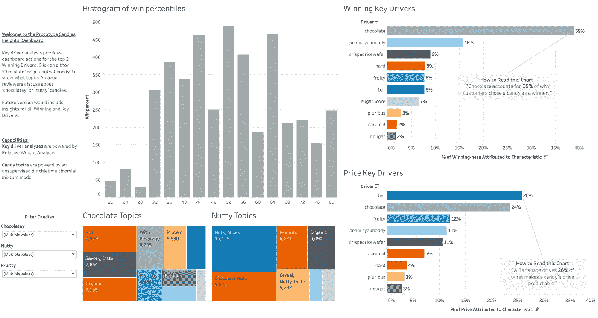

图片由作者提供，仪表盘可用[此处](https://public.tableau.com/profile/bryce.macher#!/vizhome/CandyIntelligenceDashboard/Candiesresearch)

在几年前的一次数据科学采访中，我被要求使用来自我们在 [FiveThirtyEight](https://fivethirtyeight.com/) 的朋友的一个小数据集来建议如何最好地设计一款畅销的糖果。“根据你在这里看到的‘市场调查’，”提示示意道，“建议产品设计团队*一种糖果*的最佳特性，我们可以和品牌糖果一起销售。”

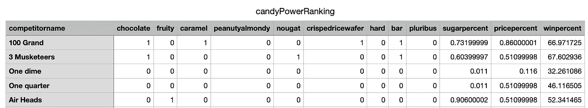

FiveThirtyEight 的原始数据集，可在线获取[点击](https://datahub.io/five-thirty-eight/candy-power-ranking)

作为应用和商业领域的数据科学家，最好的这个词总是用来测试你的商业意识。更环保的数据科学家的一个典型标志是，他们是否在考虑最佳业务成果与最佳机器学习模型。“最佳”是“哪些糖果元素带来最高的*满意度/享受度*？”的平衡以及“哪些糖果元素推动了最高*价格*？”我们基本上是在努力寻找平衡

1.  一种保证能取悦消费者的糖果
2.  占据足够的空间，不仅仅是“山寨、打折 M & Ms”
3.  还经过成本优化，比 M & M 更便宜，从而提高了利润率。

我们在 [FiveThirtyEight 的朋友在试图解决#1 时犯了一个严重的统计错误](https://fivethirtyeight.com/videos/the-ultimate-halloween-candy-power-ranking/)(或两个)。

本教程通过使用适当的统计工具在 python 中进行“关键驱动因素”分析，脱离了 FiveThirtyEight 方法。在这个过程中，我解释了 1)为什么数据科学家和产品策略师应该更加信任我的数据，以及 2)如何以一种赢得信任的方式传达这些结果(参见[我的糖果仪表盘](https://public.tableau.com/profile/bryce.macher#!/vizhome/CandyIntelligenceDashboard/Candiesresearch))。

下面是本文的路线图:

*   方法:线性回归不正确，使用相对权重分析
*   实现:在 python 中进行 RWA 以获得糖果的味道和价格
*   三角测量:为什么企业应该通过三角测量信任 RWA

# 统计第一，ML 第二

让我们通过理解为什么线性回归不是正确的答案…或者至少不是正确的答案来开始我们的统计方法。

FiveThirtyEight 建立了一个多元回归，包括在他们的数据集中捕获的糖果的所有可能特征。重要性是从线性回归的系数中提取的，使用维度的 P 值来定义我们是否可以将其视为可靠。

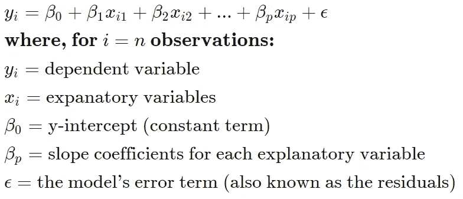

多元回归方程

然而，看看线性回归的方程，我们看到一个非常重要的问题。记住:OLS 回归系数告诉我们自变量的增加是否与因变量均值的增加相关(反之亦然，为负)。但这是衡量数量的标准。

在我们的糖果问题中，如果我们建立一个 OLS 回归来预测糖果棒的中奖情况，并将单位从克改为磅，我们将得到一个高得多的系数。体积除了单位没有改变任何东西。这里的论点可能是你可以标准化你的变量，比如标准化到 0 均值和单位方差。然而，通过归一化，您可能会遇到共线性问题-如果预测值是线性相关的或高度相关的，则 OLS 会变得不稳定，即使对自变量进行了标准化也是如此。

所以我们的工具箱里还需要一个工具。一些可以帮助我们避开关于系数的坏假设的东西。虽然 ML 可能没有答案，但统计学有。

# 相对权重分析和为什么 R2 是真正的绝地

这里，我们将实现代码，告诉我们每个特征/自变量对标准方差(R2)的贡献有多大。在其原始形式中，相对权重分析返回原始重要性分数，其总和等于模型的总体 R2；它的规范化形式允许我们说“特征 *X* 解释了目标变量 *Y* 中方差的 *Z%* 或者，更具体地说，

> “假设让一种糖果受欢迎的关键驱动力在这里被抓住，坚果巧克力是最受欢迎的口味组合。”

相对权重分析依赖于 R2 分解来分配每个预测值的重要性。当独立变量之间的相互关联使得几乎不可能将标准化回归权重作为重要性的衡量标准时，RWA 通过创建相互正交的预测值并在没有多重共线性影响的情况下对其进行回归来解决这一问题。然后，它们被转换回原始预测值的度量。

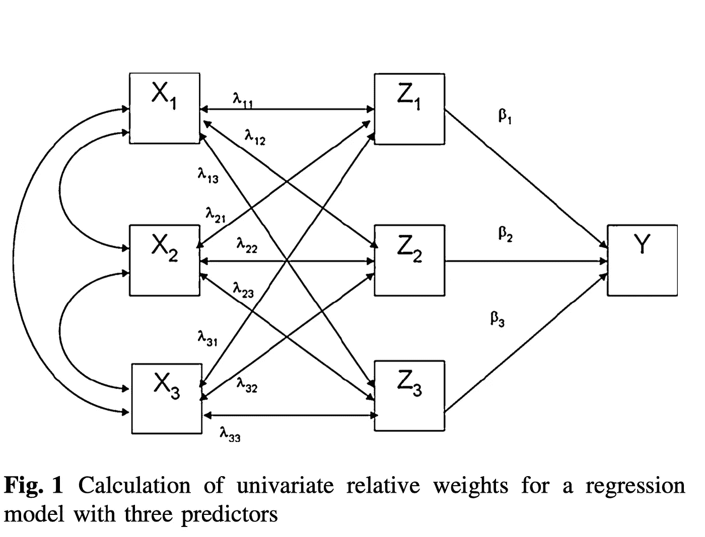

从[到](https://www.researchgate.net/profile/Nicola_Di_Girolamo2/post/Which_is_the_Best_Effect-Size_for_Predictors_in_Multivariate_Logistic_Regression/attachment/59d632e0c49f478072ea1d4a/AS%3A273637431545864%401442251655932/download/Relative+Importance+Analysis%3A+A+Useful+Supplement+to+Regression+Analysis.pdf)的三特征 RWA 示例

我们涉及到多个步骤，我将通过一个 python 脚本来演示，而不是用符号来演示，您将能够使用这个脚本(如果您一字不差地使用这个脚本或派生出您自己的版本，请相信这篇文章！)我假设此时您已经完成了构建逻辑和数学上合理的模型所需的 EDA 和操作。

# 用 Python 实现 RWA

**第一步**:获得所有因变量和自变量之间的相关性。

**步骤 2** :使用相关矩阵上的特征向量和特征值创建正交预测器，创建特征值平方根的对角矩阵。这避免了多重共线性的问题。注意获取对角线索引的 python 技巧。

**第三步**:乘特征向量矩阵及其转置(在 python 中，我们可以用@作为运算符，称为 __matmul__)。这允许我们将 X 视为因变量的集合，将 X 回归到矩阵 Z 上——矩阵 Z 本身是 X 的正交对应物，具有最小的平方误差。为了得到每个独立变量的部分效应，我们将矩阵乘法应用于逆矩阵和相关矩阵。

***注*** :如前所述，上面 coef_yz 的平方和应该加起来就是总 R2！这在下一步中将很重要！

**步骤 4** :然后我们计算相对权重，作为步骤 2 和步骤 3 中矩阵的乘积。标准化后的版本就是 r2 的百分比！

现在，您只需拉上您的功能和这两个列表的拉链，就可以获得每个功能的相对权重，因为它“驱动”(或者，更数学地说，解释与增加相关的差异)了糖果对偶的获胜百分比。

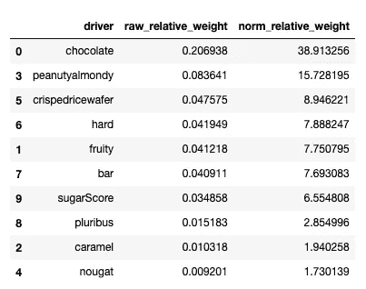

预测胜率的原始和正常相对权重

巧克力和坚果赢得了口味，但我们还没完。我们还必须通过从我们创造的糖果中创造价值来赚钱，以收入减去成本来衡量。使用表中的价格百分位数，我们还可以看看是什么推动了糖果的价格。

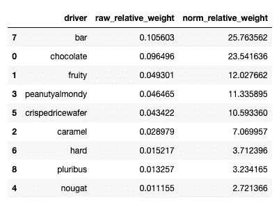

价格百分位预测的原始和正常相对权重

# 向企业传达结果

我们在这里有两个责任:提出建议，并让利益相关者乐于执行这些建议。

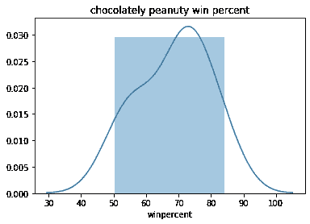

plt 总是一个很好的动态可视化事物的科学方法。对许多利益相关者来说，好的科学和坏的可视化是密切相关的。

**建议 1** :巧克力占了糖果成功的 38%，而花生占了 15%。我们可以通过观察样本中巧克力和花生糖的相对成功率来证实这一点。

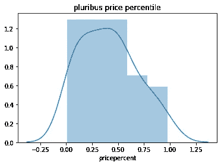

**建议 2** :相对于其他形式，Pluribus 糖果的成本最低(相对重量 3%)，这有助于抵消我们的巧克力和坚果成本。

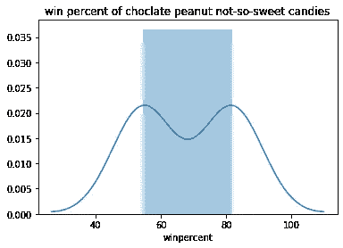

**推荐 3:** 根据我们的数据，**美味的 pluribus chocolatey peanutyalmondy 糖果**尽管性能更高，但并不容易获得。在我们的数据集中只有 2 个被捕获。

通过分析亚马逊杂货数据中的糖果，这些建议可以得到进一步的支持，该数据有 290 万条糖果评论。

虽然在亚马逊的数据中，水果在味道/评论得分上超过了坚果，但它仍然排在前三名。

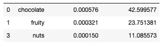

风味在预测亚马逊杂货店约 3M 糖果评论分数中的重要性的相对权重分析

此外，从高销量(>第 50 个百分点)、高排名(> 3 星)的亚马逊巧克力和坚果评论构建的主题模型进一步表明，我们的风味特征是一个成功的决定。

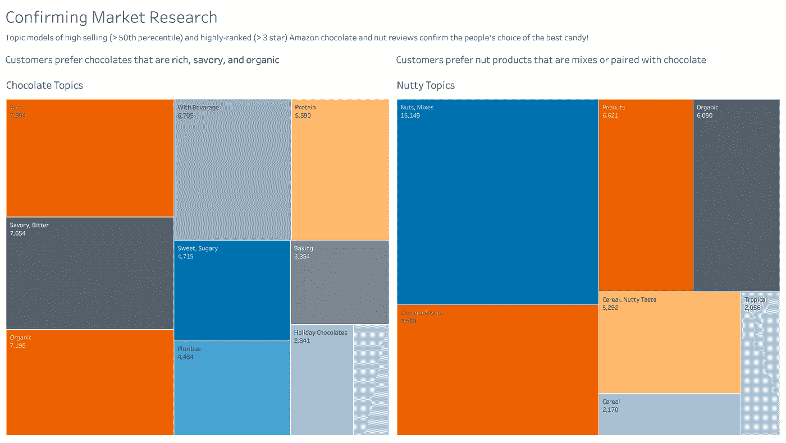

这是洞察交付幻灯片的一个示例。我的幻灯片的最终版本有 5 张幻灯片:首先是建议，然后是 RWA 可视化，然后是确认结果，最后是“这是风险/不确定性所在，以及我们如何试图将其最小化”的幻灯片。

# 结论

事实上，我们可能会认为关键驱动因素分析有点像寻找圣杯，因为有如此多不同的可能混淆的变量，以至于知道拉什么杠杆来驱动我们的目标变量是一种无中生有的尝试。但是我们可以通过放弃传统的(尽管是错误的)线性回归系数的使用，并转向相对权重分析来获得更好的信心。而且，可以肯定的是，这个版本有一些改进——如果你关注 R2 风味概况，并亲自尝试定价，你会发现通过各种数学优化还有改进的空间。

隐藏在这里的是一个关于数据科学家*必须*精通降低商业风险和最大化决策潜力背后的统计学和数学的故事。否则，我们只是解决输入/输出问题的廉价软件开发人员/工程师，这些问题会给企业带来巨大的成本。

对于那些 DS 领导者和经理读者来说，这个例子表明，建立一个不同时拥有面向统计和技术的数据科学家的数据科学团队是一个灾难。为什么？那么，在这种情况下，“我们如何做出最好的糖果？”，是一个统计问题和业务领域问题，不容易用 sklearn API 调用解决。