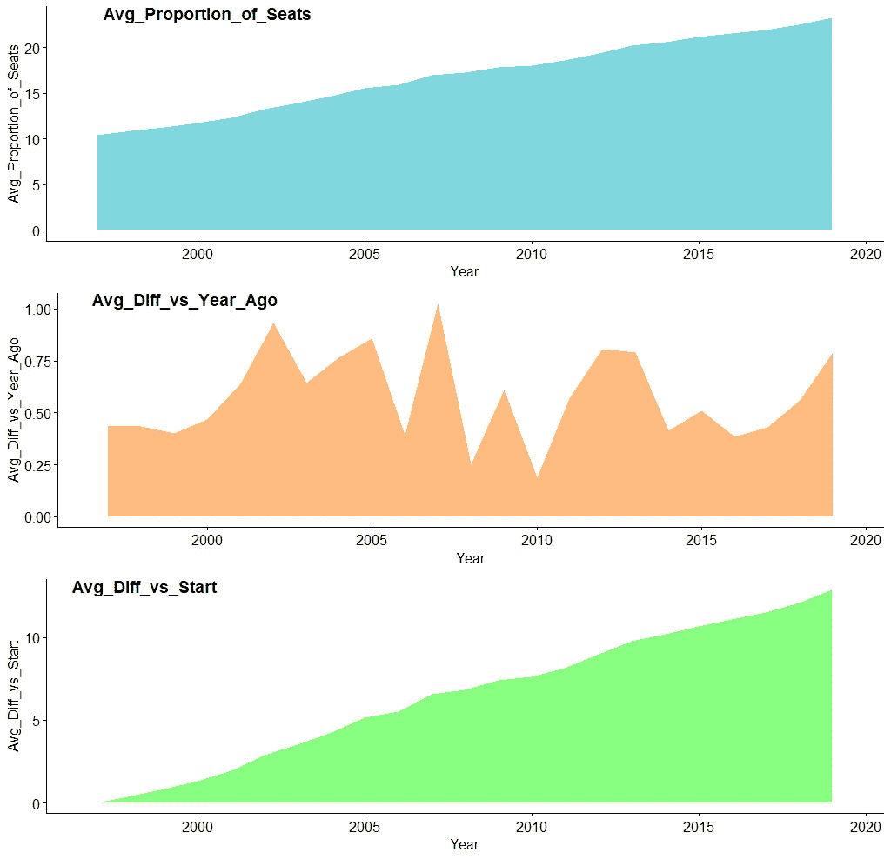

# 通过使用 Tidyverse 挖掘性别平等数据获得的关键见解

> 原文：<https://towardsdatascience.com/key-insights-obtained-by-mining-gender-equality-data-using-tidyverse-e9b80a557c72?source=collection_archive---------48----------------------->

## 确定关键绩效指标，以评估妇女对国家和全球一级决策的贡献。


萨曼莎·索菲亚在 [Unsplash](https://unsplash.com?utm_source=medium&utm_medium=referral) 上的照片

性别不平等是最受关注的领域之一，这促使联合国(UN)制定了**可持续发展目标 5** — *实现性别平等并赋予所有妇女和女童权力*。为了评估当今世界的情况，最好的评估标准之一是根据妇女在领导和决策方面的贡献对国家进行排名。为了在同样的基础上形成见解，可以将*`妇女在国家议会中所占席位的比例(%)`* 视为基石(数据)。其背后的原因是，在当今世界，许多地区的歧视性法律和制度性做法限制了妇女竞选政治职务的能力。系统性不平等、缺乏受教育机会、参与劳动力的选择有限以及对个人自由的许多其他限制，限制了妇女获得追求政治生涯的资源和机会。

## 关于数据

数据来源是[改头换面星期一挑战(2020W30)](https://data.world/makeovermonday/2020w30) 的一部分，并由**世界银行**整理，作为其**世界发展指标数据库**的一部分。数据揭示了全国妇女在国家议会中所占席位的比例(%)(1997-2019 年)。这些数据是*可视化性别平等——viz 5*计划的一部分。

## 探索性数据分析

从数据中获得洞察力的第一步是探索数据。对于这个场景，使用了 [Tidyverse](https://www.tidyverse.org) ，这是在 r 中进行 EDA 的一个关键要素。以下是数据的一瞥:

```
head(Female_Political_Representation)Country.Name  Country.Code Year Proportion of Seats
1      Albania          ALB 1997                  NA
2      Albania          ALB 1998                  NA
3      Albania          ALB 1999          0.05161290
4      Albania          ALB 2000          0.05161290
5      Albania          ALB 2001          0.05714286
6      Albania          ALB 2002          0.05714286
```

对于每个国家，我们都有国家代码、年份(1997-2019)和女性所占席位的比例。从这一瞥中，我们可以看到我们缺少价值观。

让我们检查缺失值是在初始年份还是在随机地点。

```
missing_data <- filter(Female_Political_Representation, is.na(`Proportion of Seats`)) %>% # Filter only Missing values
  group_by(Year) %>%        # Group by Year
  summarise(count = n()) %>% # Count the instances
  arrange(desc(count))       # Arrange in descending order> missing_data
# A tibble: 20 x 2
    Year count
   <int> <int>
 1  1999    31
 2  1997    23
 3  2000    22
 4  2002    17
 5  1998    16
 6  2001    13
 7  2003     6
 8  2013     4
 9  2014     4
10  2017     3
```

正如我们所见，缺失数据是随机分布的。因此，对于插补，我们可以遵循两种方法:

1.  捕捉单个国家的趋势，并将其用于估算该国的缺失年份。
2.  在国家级别使用**向前填充|向后填充**方法估算缺失值。

我更喜欢后一种方法，并通过给出方向“*向下*来使用*填充*的方法

```
Imputed_data <- Female_Political_Representation %>% 
                group_by(Country.Name,Country.Code) %>% # Group at Country Level
                fill(`Proportion of Seats`, .direction = "downup") # Missing Value Imputation  

colSums(is.na(Imputed_data)) # check for completeness
```

## 识别 KPI

插补后的关键目标是确定特定国家如何有效实施对性别问题有敏感认识的议会——妇女有充分参与的自由。可以通过计算妇女席位比例的年同比变化来评估。以下是可以创建的两个指标:

1.  **与前一年的差异:**通过用前一年的值减去特定年份的值来获得。它可以被视为计算**提升**的一种手段——差异越积极，国家就越有可能提高对性别平等的认识。此外，我们可以根据这一指标对国家进行排名。
2.  **差额 vs 起点:**计算当年比例与起点的差额。*公式:比例(2019)-比例(1997)。*差异越大，国家在权力结构和组织中实现性别均衡代表性的进展就越好。

## **生成见解**

使用 *tidyverse* ，我们可以通过使用 *lag* 函数*轻松计算出` ***与一年前*** *`* 的差异。*

```
# difference vs Year Ago Compute (At Country Level) ----KPI1 <- Imputed_data %>% 
         group_by(Country.Name,Country.Code) %>%mutate(Diff_vs_Year_Ago = 
`Proportion of Seats` - lag(`Proportion of Seats`)) %>% 
#Difference vs Year Ago fill(Diff_vs_Year_Ago, .direction = "downup") %>%  
# Missing Value Imputation mutate(`Proportion of Seats` = round(`Proportion of Seats` *100,2),
Diff_vs_Year_Ago = round(Diff_vs_Year_Ago*100,2) 
# Data Standardization)
```

我们可以对国家进行排名，以查看年度水平，哪个国家的进步最大/最小。

```
# Rank the differences at Yearly level ----
Rank1 <- KPI1 %>% 
         group_by(Year) %>% 
         mutate(rank = rank( - Diff_vs_Year_Ago, ties.method = "first"))
```

对于 2019 年(最近一年)，我们可以借助 *ggplot2 和 plotly* 来可视化前 10/后 10 个国家:

```
library(plotly)
# Plot Top 10 Countries
top_10_plot <- Rank1 %>% 
  filter(Year == 2019 & rank < 11) %>% 
  ggplot(aes(x=reorder(Country.Name, `Proportion of Seats`), y= `Proportion of Seats`,fill = Country.Code)) +
  geom_bar(stat="identity")+
  theme_minimal() +
  theme(legend.position = "none")  +
  xlab("Country") + 
  coord_flip()# Convert to plotly
ggplotly(top_10_plot)
```


十大国家(2019 年与 2018 年)

**故事要点:与去年相比，排名前 3 位的国家表明他们增加了超过 10%的席位比例，其中阿联酋以 27.50%的比例高居榜首**

```
# Plot Bottom 10 Countries ----
bottom_10_plot <- Rank1 %>% 
  filter(Year == 2019 & rank >205) %>% 
  ggplot(aes(x=reorder(Country.Name, - Diff_vs_Year_Ago), y= Diff_vs_Year_Ago,fill = Country.Code)) +
  geom_bar(stat="identity")+
  theme_minimal() +
  theme(legend.position = "none")  +
  xlab("Country") + 
  coord_flip()# Convert to plotly
ggplotly(bottom_10_plot)
```


垫底的 10 个国家(2019 年与 2018 年)

**故事要点:与去年相比，所有排名后 10 位的国家都显示出了不到 0%的下降率，其中突尼斯以-8.7 %的下降率高居榜首**

我们可以执行顶部/底部分析的另一个角度是查看国家如何随着时间的推移而演变(*‘差异 _ 对比 _ 起点’*)。我们可以在国家级别进行分组，并使用*‘first’*方法计算每个实例与起始年份的差异。

```
# Difference vs start Compute ----
KPI1 <- KPI1 %>%
  arrange(Year) %>%
  group_by(Country.Name) %>%
  mutate(Diff_vs_Start = `Proportion of Seats` - first(`Proportion of Seats`))# Compute Rank basis at Yearly Basis
Rank2 <- KPI1 %>% 
         group_by(Year) %>% 
         mutate(rank_Diff_vs_Start = rank( - Diff_vs_Start, ties.method = "first"))
```

对于 2019 年(最近一年)，我们可以将前 10 名/后 10 名国家定位如下:

```
top_10_plot1 <- Rank2 %>% 
  filter(Year == 2019 & rank_Diff_vs_Start < 11) %>% 
  ggplot(aes(x=reorder(Country.Name, Diff_vs_Start), y= Diff_vs_Start,fill = Country.Code)) +
  geom_bar(stat="identity")+
  theme_minimal() +
  theme(legend.position = "none")  +
  xlab("Country") + 
  coord_flip()# Convert to plotly
ggplotly(top_10_plot1)
```


前 10 个国家(历史上有所改善)

**故事要点:历史上排名前三的国家，如阿联酋、卢旺达和玻利维亚，表明它们的席位比例增加了 40 %以上，其中阿联酋以 50%的比例高居榜首。**


垫底的 10 个国家(历史上有所改善)

**故事要点:与起点相比，历史上所有垫底的 10 个国家的增长率都呈下降趋势，低于 0%，其中塞舌尔以-6.2 %的增长率高居榜首**

****全球层面的见解—**

从全球绩效的角度来看，我们可以忽略国家/地区，按年度对数据进行分组，并获得修订的 KPI，如下所示:

```
# Global Level Trend ----
Global_Insight <- KPI1 %>% 
                  group_by(Year) %>% 
                  summarize(
                    Avg_Proportion_of_Seats = mean(`Proportion of Seats`),
                    Avg_Diff_vs_Year_Ago = mean(Diff_vs_Year_Ago),
                    Avg_Diff_vs_Start = mean(Diff_vs_Start)

                  )> mean(Global_Insight$Avg_Diff_vs_Year_Ago) # Compute Average Lift
0.5781982##########################################################Year Avg_Proportion_of_Seats
   <int>                   <dbl>
 1  1997                    10.4
 2  1998                    10.8
 3  1999                    11.2 
 ----------------------------------
 4  2017                    21.9  
 5  2018                    22.5  
 6  2019                    23.3
##########################################################
```

此外，我们可以使用这些数据来创建一个面积图，它将展示全球趋势，如下面的代码所示:

```
# Area plot ----# Plot 1
Avg_Proportion_of_Seats_plot <-  ggplot(Global_Insight, aes(x = Year, y = Avg_Proportion_of_Seats)) + 
  geom_area(fill ="#00AFBB", alpha = 0.5, position = position_dodge(0.8))ggplotly(Avg_Proportion_of_Seats_plot)# Plot 2
Avg_Diff_vs_Year_Ago_plot <-  ggplot(Global_Insight, aes(x = Year, y = Avg_Diff_vs_Year_Ago)) + 
  geom_area(fill ="#ff7a00", alpha = 0.5, position = position_dodge(0.8))ggplotly(Avg_Diff_vs_Year_Ago_plot)# Plot 3
Avg_Diff_vs_Start_plot <-  ggplot(Global_Insight, aes(x = Year, y = Avg_Diff_vs_Start)) + 
  geom_area(fill ="#0dff00", alpha = 0.5, position = position_dodge(0.8))ggplotly(Avg_Diff_vs_Start_plot)# Combine 3 plots ----
library(ggpubr)
theme_set(theme_pubr())figure <- ggarrange(Avg_Proportion_of_Seats_plot, Avg_Diff_vs_Year_Ago_plot, Avg_Diff_vs_Start_plot,
                    labels = c("Avg_Proportion_of_Seats", "Avg_Diff_vs_Year_Ago", "Avg_Diff_vs_Start"),
                    ncol = 1, nrow = 3)figure
```



环球之旅(1997- 2019)

**故事要点:我们可以看到，全球级别的席位比例从 10.4% (1997 年)上升到 23.3% (2019 年)，平均每年增长 0.57%**。**此外，Diff_vs_Year_Ago 经历了高峰和低谷，2007 年涨幅最大，2010 年跌幅最小**

## 结束注释

这一洞察生成之旅始于探索和清理数据、标准化数据(缺失值插补)、识别 KPI、创建有效的视觉效果来回答问题，并从中讲述一个有意义的故事。此外， *tidyverse* 可以快速方便地从数据中挖掘见解，这些数据稍后可以集成到 *tableau public* 中，以创建快速的视觉效果和**故事线**，如下所示:


Tableau 公共仪表板([https://public.tableau.com/profile/gaurav.chavan#!/viz home/改头换面 Monday 2020 w30 _ 15961721926540/global journey？发布=是](https://public.tableau.com/profile/gaurav.chavan#!/vizhome/MakeoverMonday2020W30_15961721926540/GlobalJourney?publish=yes)

上图预测表明，到 2030 年**，妇女在政治角色中的比例仅为**27.67%，而不是*联合国*达到 **50%的目标。******

*****链接到***Tableau 公共仪表盘:* [链接](https://public.tableau.com/profile/gaurav.chavan#!/vizhome/MakeoverMonday2020W30_15961721926540/GlobalJourney?publish=yes)*****

*****链接到代码和视觉效果:[链接](https://github.com/Gaurav-Chavan/Tableau_Exercises/tree/master/2020W30)*****