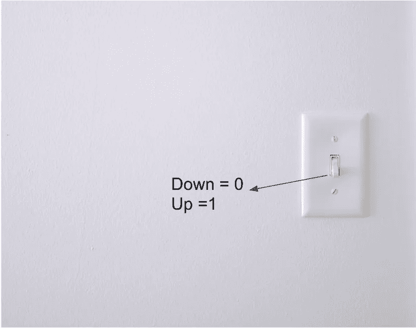
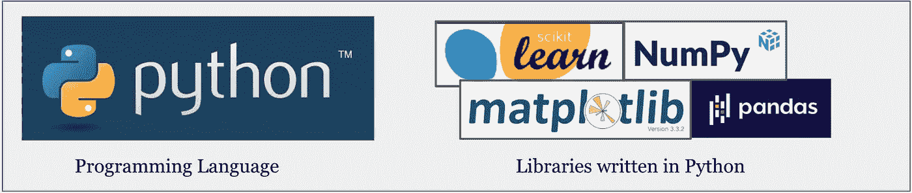
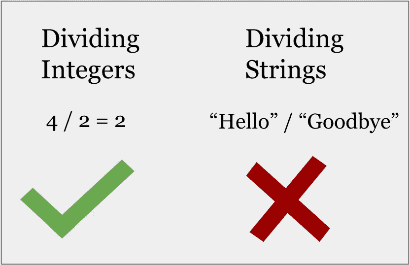
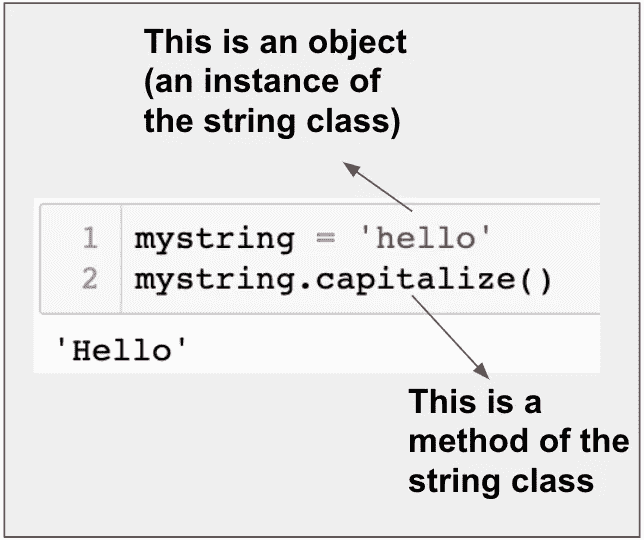
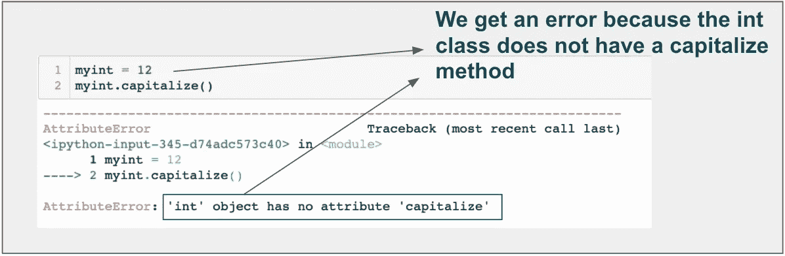
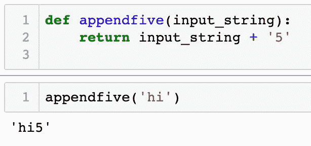
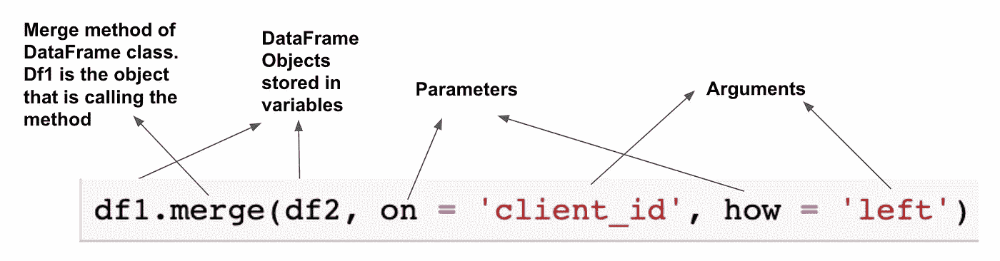

# 熊猫初学者的关键编程概念

> 原文：<https://towardsdatascience.com/key-programming-concepts-for-pandas-beginners-3c038e8ef052?source=collection_archive---------30----------------------->


照片由 [PhotoMIX 公司](https://www.pexels.com/@wdnet?utm_content=attributionCopyText&utm_medium=referral&utm_source=pexels)从 [Pexels](https://www.pexels.com/photo/building-metal-house-architecture-101808/?utm_content=attributionCopyText&utm_medium=referral&utm_source=pexels) 拍摄

如果你刚刚开始使用 Python 或熊猫，欢迎使用。

让我先简短地说几句鼓励的话。

学习编码在开始时可能会感到有点令人生畏，因为有很多未知的东西。

除此之外，有时你周围的人会让你泄气: ***你没有合适的背景……如果你不知道 x，你就做不了 y……开始接触技术的唯一正当途径是获得学位。***

他们错了。

与任何学科一样，编程是一种技能组合，存在于一个范围内。不要相信任何循环论证，如果你不知道如何写代码，你就不能写代码。你唯一需要的是坚持。

你属于。

事实是有很多东西需要学习。这并不总是容易的，需要持续的努力才能达到这个技能范围。

在这篇文章中，我将提供一些基本编程概念的概述，以便当您开始编写 Pandas 代码时，您对正在发生的事情有一个更好的了解。

我会试着把每个概念都带回熊猫图书馆，以便尽可能地让它变得有形。

# 语言与图书馆

简而言之，编程语言是一套规则和惯例，控制我们如何指示计算机做我们想让它做的事情。

不同的编程语言使用不同的词汇或“语法”。

在 python 中，我们可以通过编写以下内容让计算机返回单词“hello world ”:

```
print(“hello world”)
```

在 Java(另一种编程语言)中，我们写道:

```
System.out.println("hello world");
```

在幕后，编程语言从高级词汇，如“print”，一直向下转换到 1 和 0。

我们的计算机可以“理解”1 和 0，因为我们可以用物理状态来表示这些值。

例如，我们可以使用电灯开关。当它打开时，我们可以说它代表数字 1，当它关闭时，它代表 0。



伊莎贝拉和路易莎·菲舍尔的照片

电脑有数十亿个被称为晶体管的微小开关，它们以同样的方式工作。结合在一起，它们编码了你需要的所有数据。

“高级”语言离那些 1 和 0 更远，这意味着从语言到硬件状态需要更多的转换。

“低级”语言更接近于 1 和 0，需要较少的翻译。

这里有一个自然的折衷——高级语言往往更慢，但更容易使用。低级语言往往更快，但更难使用。

另一方面，**库**(又名包)是其他人用编程语言编写的代码，然后整齐地捆绑起来，以便其他程序员可以借用。

Python 是一种编程语言。Pandas 是一个开源软件(即免费的、公开可用的)用 python 编写的数据分析库。



Python 成为数据分析如此受欢迎的选择的原因之一是因为它的开发人员社区已经创建了大量有用的库，包括 Pandas、Numpy、Matplotlib、Scikit-learn 等等。

当我们想要利用这些库中的一个时，我们需要安装代码(一次)并将其导入到我们的文件中(每次我们想要使用它时)。

# 数据类型/类

就其核心而言，编程就是转换数据；将输入转换成输出。

但并不是所有的数据都一样。我们有不同的数据类型，可以用不同的方式使用。

为了进一步说明这一点，让我们比较两种最常用的数据类型——字符串(也称为文本)和整数。

整数可以整除。字符串不能。



4/2=2.但是“你好”/“再见”并不代表什么。

相反，可以大写字符串，但不能大写整数。

因此，区分数据类型的主要因素是与它们相关联的功能。

在 Python 这样的面向对象语言中，我们可以创建自己的数据类型，通常称为类。

类是一个蓝图，它告诉我们可以用我们的数据类型(方法)做什么，以及我们可以存储关于它们的什么信息(属性)。

一个类的单个实例称为对象。

从上面的例子中，我们可以对字符串运行资本化方法:



但不是 int:



Python 有一些内置的数据类型(类),如 int、string、boolean、list 等。

Pandas 也有自己的类，使得数据分析工作成为可能。

Pandas 中最流行的类是 DataFrame，它存储表格数据(像 excel 电子表格)。

设计 DataFrame 类的开发人员编写代码来赋予它所拥有的功能。

例如，我们可以使用“to_csv”方法用数据帧中的数据创建一个 csv 文件:

```
dataframe.to_csv(‘my_df.csv’)
```

同样，这个功能与 DataFrame 类相关联，data frame 类是 Pandas 库的一部分。

通俗地说:别人写了很多代码让你不用。

这就是术语**抽象**的含义——也是编程中最令人敬畏的事情之一。

其他人写了数百万行代码，从 1 和 0，到 python 语言，到 Pandas 库，到 DataFrame 类，到 to_csv 方法。

但是你所要做的就是写一行代码。

# 变量

变量是存储值的容器。

在一些语言中，你需要给一个变量分配一个特定的数据类型(这些被称为静态类型语言)。

在其他语言中，您可以将数据存储在变量中，而无需分配特定的类型(动态类型语言)。

Python 是动态类型的。因此，我们可以直接在变量中存储一个值:

```
my_variable = 5
```

Java 是静态类型的，所以如果我们想将整数 5 直接放入变量中，我们必须声明该变量是整数的容器，而不是任何其他数据类型的容器:

```
Int myVariable = 10
```

我们的变量可以“存储”python 中的任何类。

# 功能

功能是将输入转换为输出的过程。

如果这听起来很熟悉，那应该是。

我们已经讨论过“方法”,它是函数的一种类型。所有的方法都是函数，不是所有的函数都是方法。

关键的区别在于方法被绑定到特定的数据类型/类，而一般的函数没有*。*

如果这令人困惑，一个例子应该可以澄清事情。

当我们想要大写一个字符串时，我们可以调用 capital 方法。这个方法是显式绑定到字符串的。

另一方面，我们可以创建自己的函数，不依赖于特定的类。

假设我们想写一个将数字 5 加到字符串末尾的函数:



现在我们有一些功能不是由 对象调用 ***，而是由*** 用户自定义输入(input_string)调用 ***。***

理论上，字符串*可以*拥有这个方法。但是期望 python 在 string 类的定义中考虑这种任意的任务是荒谬的。

在真正的意义上，函数帮助我们创建可重用的代码，这些代码还没有被我们正在使用的语言或库所考虑。

Pandas 用户最常犯的一个错误是在使用数据执行分析任务时没有利用函数。

这导致了混乱和重复的代码。

混乱和重复的代码更容易出错，也更难维护。

无论是在实践中还是在理论上，当您想要重用您正在编写的代码时，使用函数是最佳实践。

将功能限制在一定范围内也是最佳实践，这样每个功能都执行一个独特且独立的任务。

函数通常有输入，称为“参数”。这些是你的函数代码的组成部分。它们通常会以某种方式用于产生输出。

直到用户(通常是您自己)通过传入值来代替这些参数来运行该函数，否则什么都不会发生。

您传入的值在技术上称为“参数”。

这里有很多单词需要记录，所以让我们以一些示例代码结束，这些代码涵盖了上面讨论的大多数概念:



# 结束语

在这篇文章中，我们介绍了一些最重要的编程概念，以及它们如何应用于 Pandas 库。

如果你想了解更多关于如何开始接触熊猫的知识，请查看我的一些直观指南，并确保在下面订阅。编码快乐！