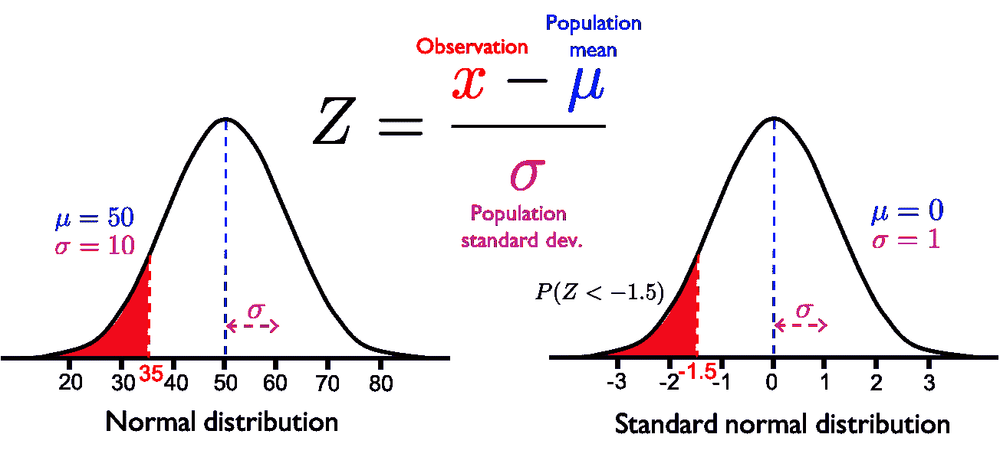
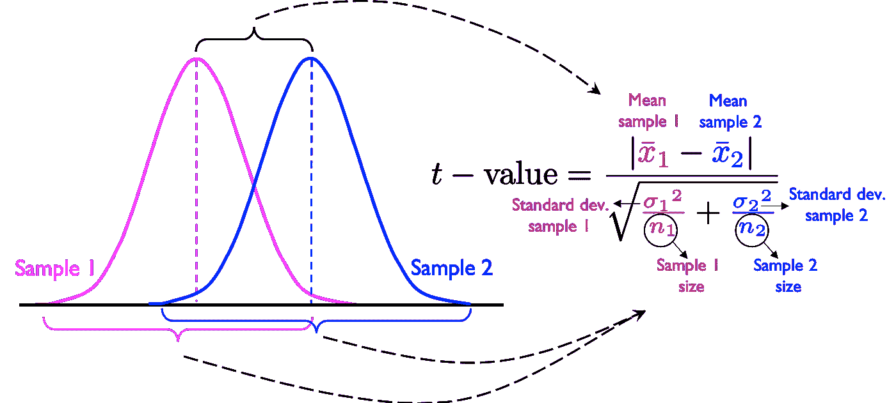
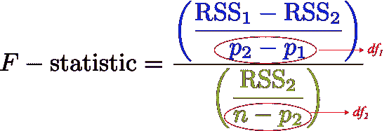
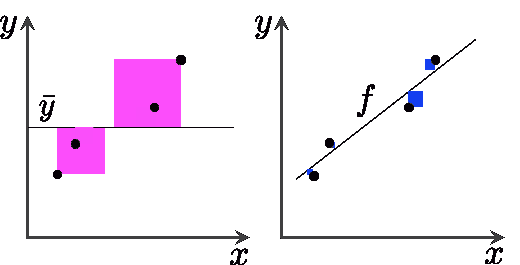
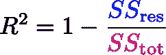
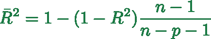

# 数据科学中的关键统计概念

> 原文：<https://towardsdatascience.com/key-statistical-concepts-in-data-science-265cf5126fba?source=collection_archive---------44----------------------->

丹·法雷尔在 [Unsplash](https://unsplash.com?utm_source=medium&utm_medium=referral) 上的照片

## 一些必须知道的统计概念的汇编

如果你在处理数据，你可能经常会遇到*术语*，比如“测试”、“分数”、“值”等等。以字母*开头*，如‘F’，‘P’，‘R’，‘T’，‘Z’等。这篇文章是关于一些在数据科学领域经常遇到的**统计术语/概念的通俗解释。**

## 免责声明:这篇文章不是关于什么？

本文**不是**关于提供全面的解释**，而是对一些关键统计指标的** **简明和高层次的汇编**。下面的每个*概念*都有几篇专门的文章。我将提供几篇这样的文章的链接供你参考。

将涵盖以下主题:

## 1) H_0 和 H_a —假设检验

## 2) P 值

## 3) Z 分数

## 4) t 检验

## 5) F 检验

## 6) R 平方

# 1) H_0 和 H_a —假设检验

简单地说，假设是你想要测试(或验证)的想法(或前提或主张)。例如，喝着咖啡，你开始思考，“纽约州人的平均身高与加利福尼亚州人的平均身高相比如何？”这是你的想法。

[Franki Chamaki](https://unsplash.com/@franki?utm_source=medium&utm_medium=referral) 在 [Unsplash](https://unsplash.com?utm_source=medium&utm_medium=referral) 上拍摄的照片

现在，为了测试你的想法/主张，你需要一些数据。此外，你需要构建一个问题陈述——**一个假设，**为了检验这个假设，你需要一个**假设检验**。更具体地说，你需要设计两个场景——一个支持你的主张，另一个是备选场景。

**一个零假设基本上是现状**(或者默认的建立或普遍接受的价值，正如[这个](https://www.youtube.com/watch?v=VK-rnA3-41c&t=3s)视频很好地解释的那样)。例如，现状可能是两个州的人的平均身高是相等的。这将形成你的**零假设，** **记为 H_0** 。在法庭上，你有起诉和辩护。同样，对于每一个零假设，你都有一个**备选(或替代)假设**(为了测试你的想法/主张)**，记为 H_a** (又名研究假设，因为你需要做一些研究/采样来挑战 H_0)。

阐明了你的无效假设和替代假设后，你现在需要一些数据。当然，测量纽约和加州完整人口的身高是不切实际的。因此，你会为一些人(比如 50 或 100 或更高)收集**样本数据**来测试你的说法。有了样本数据，您将执行一些统计测试，这将在接下来的部分中解释(使用其他等效的示例)。

**更多资料:**

*   [关于假设检验你需要知道的一切—第一部分](/everything-you-need-to-know-about-hypothesis-testing-part-i-4de9abebbc8a)
*   [假设检验完全指南](/a-complete-guide-to-hypothesis-testing-2e0279fa9149)

# 2) P 值

该术语主要用于在假设检验中测量 **结果的**统计显著性。这里， ***P*** 代表“**概率**”。所以，它是一个介于 0 和 1 之间的概率值。你用它来拒绝或支持零假设。****

由[彼得罗·德·格兰迪](https://unsplash.com/@peter_mc_greats?utm_source=medium&utm_medium=referral)在 [Unsplash](https://unsplash.com?utm_source=medium&utm_medium=referral) 上拍摄的照片

与*P*-值密切相关的是**显著性水平**(由希腊字母 alpha 表示)，通常为 0.05(或 5%)。基本就是 100%减去的置信水平[。较高的α水平意味着较低的置信区间，反之亦然。](https://www.statisticshowto.com/p-value/#:~:text=The%20p%20value%20is%20the,value%20of%200.0254%20is%202.54%25.)

**如果 *P* 值小于该显著性水平，则拒绝零假设。**如果*P*-值大于显著性水平，则支持替代假设的支持度**不那么强**，因此，零假设为**未被拒绝**，即替代假设为**未被接受**。

我个人觉得，当“重要性”的意义与“偶然性”定量相关时，P 值更直观。例如，0.01 的*P*-值(实际上是一个很小的值)表示有**仅仅 1%的机会**(概率)您对样本进行的实验结果是“偶然”获得的，或者是由于某种采样误差而“随机”发生的。**换句话说，你可以庆幸你获得的结果确实** **非常显著**。简单地说，**P-值越小，你的结果就越有意义，随机或偶然发生(获得)的可能性就越小。按照这个逻辑，一个高的 P 值，比如 0.7，意味着你的结果有 70%的概率是偶然得到的，这与你进行实验的方式无关。所以，你现在的发现没那么重要了。**

## 我的显著性水平(alpha)是太严格还是太宽松？

**回答:要看手头的问题。想象一下，通过拒绝零假设，你做出了一个错误的决定，也就是说，尽管现在你选择了另一个假设，你拒绝零假设的选择不是一个好的选择。你只是拒绝了它，因为你的 P 值低于 alpha 值。您只是遵循规则(基于您在研究之前设置的 alpha 值)。但是，并不是所有的规则都是好的。**

现在，如果你正在对球员踢点球的平均速度进行假设测试，你必须对 95%的置信区间感到满意，也就是说，为拒绝零假设留出 5%的宽窗口(可以认为是 5%的宽松)，或者为做出错误决定留出 5%的窗口。那很好。 ***这只是踢腿的速度。*** 然而，如果你正在研究一些关键的东西，比如说非侵入性治疗对患者肿瘤的影响，你肯定会想要一个高置信区间，可能是 99.9%，留下 0.1%的显著性水平，即 0.001(把它想象成只有 0.1%宽松；**非常非常严格地与肿瘤分析妥协**。现在你有一个只有 0.1%的小得多的窗口来做出错误的决定(假设这里的“错误”是指拒绝零假设，接受替代假设)。

**关于 *P* 的更多文章-值:**

*   [关于数据科学的 p 值，你应该从头开始了解的一切](https://medium.com/analytics-vidhya/everything-you-should-know-about-p-value-from-scratch-for-data-science-f3c0bfa3c4cc)
*   [数据科学家解释的 P 值](/p-values-explained-by-data-scientist-f40a746cfc8)
*   [为数据科学家简单解释 P 值](/p-value-explained-simply-for-data-scientists-4c0cd7044f14)
*   [P 值的圣杯以及它们如何帮助我们进行假设检验](/holy-grail-for-p-values-and-how-they-help-us-in-hypothesis-testing-bce3d0759604)
*   [P 值，以及何时不用它们](/p-values-and-when-not-to-use-them-92cab8a86304)
*   [假设检验和 P 值的直观解释](/an-intuitive-explanation-of-hypothesis-testing-and-p-values-8391db2c90f)
*   [统计显著性解释](/statistical-significance-hypothesis-testing-the-normal-curve-and-p-values-93274fa32687)

# 3) Z 分数

照片由[марьянблан| @ marjanblan](https://unsplash.com/@marjan_blan?utm_source=medium&utm_medium=referral)在 [Unsplash](https://unsplash.com?utm_source=medium&utm_medium=referral) 上拍摄

a***【Z】*-score(又名标准分数)**告诉你**距离**(下方/左侧或上方/右侧)**多少个标准差，一个观察值是正态分布的平均值**。它既可以取正值，也可以取负值。负的*Z*-分数意味着数据点是均值左侧的 *Z* 标准差，正的*Z*-分数意味着数据点是正态分布均值右侧的 *Z* 标准差，该数据点属于正态分布。

## 在哪里使用 *Z* -score？

一个重要的应用是计算与给定数据点相关的正态曲线下的(概率)面积。 ***什么都没听懂？继续读！***

迪伦·吉利斯在 [Unsplash](https://unsplash.com?utm_source=medium&utm_medium=referral) 上的照片

下面举一个改编自[这个](https://www.youtube.com/watch?v=2tuBREK_mgE)精彩视频的例子。假设你的瑜伽班参与者的年龄遵循正态分布(下图中的左曲线)，平均值为 50(岁)，标准差为 10(岁)。我知道，当你接近退休的时候，你需要瑜伽！

现在，你被问及 35 岁以下参与者的比例(曲线下的红色阴影区域)。要回答这个问题，您必须首先使用下面的公式将**标准化**正态分布，即**均值= 0，标准差= 1 的正态分布**。标准化分布中 x 轴上的值以偏离平均值(0)的标准偏差表示，代表***Z*-分数**。35 年的值现在偏离平均值-1.5 个标准偏差，即*Z*-得分为-1.5。根据定义，***Z*-分数是无单位的**。

正态和标准正态分布示意图(未按比例绘制)。

**于是，求 35 岁以下参与者比例的问题转化为求 *Z* < -1.5 的比例。**现在你要做的就是，查[*Z*-评分表](http://www.z-table.com/)得到 *Z* = -1.5 对应的数值。该值为 0.0668。这是所需的比例(红色阴影区域的面积，其中黑色曲线下的总面积为 1) — 6.68%的参与者。

## Z 分数的一些进一步应用

同样，**您可以使用 *Z* -score 来比较两个或更多数据具有不同刻度的情况。**例如，寻找前 10%的学生，他们参加了两种不同的考试(不同的分数系统)，如 GMAT 和 SAT。

另一个应用是**检测人群/数据集中的异常值**。**如何？**标准化人口分布(如果是正态的)并标记位于*Z*-分数-3 以下和*Z*-分数+3 以上的数据点，因为这些点将超过平均值的标准偏差的 3 倍，即概率为 0.003(99.7%的区域位于正负 3 个标准偏差内)。

**进一步材料:**

*   [Z-分数、标准化和标准正态分布](https://www.youtube.com/watch?v=2tuBREK_mgE)
*   [了解统计学中的 Z 分数](https://medium.com/towards-artificial-intelligence/understanding-z-scores-in-statistics-c94f38fc3cc5)

# 4) t 检验

这是一个**假设检验**(又名[学生的*t*-检验](https://en.wikipedia.org/wiki/Student%27s_t-distribution#History_and_etymology))允许您确定两个研究组/样本之间是否存在**显著的统计差异，其数据点假定为正态分布。**

乔纳森·法伯在 [Unsplash](https://unsplash.com?utm_source=medium&utm_medium=referral) 上拍摄的照片

## 一个例子:

假设你想比较两个不同大陆的人的身高。你取两个独立/不成对的样本，每个大洲的人口各取一个，假设他们是正态分布的。虽然你可以简单地说，你可以比较两个样本的平均值，并说平均值较大的大陆有较高的人。但是样本分布中的方差/分布呢？可以是样本在*上有显著差异。*

*这就是 t 值发挥作用的地方。正如[这个](https://www.youtube.com/watch?v=pTmLQvMM-1M)视频很好地解释的那样，它基本上是**信号**(均值差异)**和噪声**(两个样本内的变化)，如下图所示。两个平均值之间的差值越大，则 *t* 值越高。变化越大， *t* 值越低。*

**

*解释 *t* 值计算的草图(改编自[这段](https://www.youtube.com/watch?v=pTmLQvMM-1M)视频)*

*现在你可以使用这个*t*-假设中的值*t*-测试，你的零假设可能会说两个样本之间没有统计学上的显著差异。如果*t*-值高于临界*t*-值(类似于显著性水平α，在*p*-值的情况下)，则零假设被拒绝(即两个样本在统计上不同)，而支持替代假设。如果 *t* 值低于临界 *t* 值，则不拒绝零假设。*

## *如何选择临界*t*-值？*

*可以使用[*t*-表](http://www.ttable.org/)找到临界值。要使用*t*-表，您需要一个预定义的*p*-值和自由度 *f* ，它就是 *n* -2，其中 *n* 是两个样本中数据点的总数(总样本大小)。使用这两个值( *p* 和 *f* ，可以查找临界*t*-值。*

***进一步材料:***

*   *[使用 Python 和 Numpy 进行 T-test](/inferential-statistics-series-t-test-using-numpy-2718f8f9bf2f)*
*   *统计测试——何时使用哪一种？*
*   *[为初学者和专家讲解的统计分析 t 检验](/the-statistical-analysis-t-test-explained-for-beginners-and-experts-fd0e358bbb62)*

# *5) F 检验*

**

*由[拉尔夫·哈特](https://unsplash.com/@pixelfreund?utm_source=medium&utm_medium=referral)在 [Unsplash](https://unsplash.com?utm_source=medium&utm_medium=referral) 上拍摄的照片*

*为什么 *F* ？这项测试以 R. A. **Fischer** 的名字命名，他发展了这个概念。 *F* 测试广泛用于**比较适合数据集的统计模型**，以确定**哪一个更好地解释或捕捉了独立/目标变量的方差**。*

*测试的一个关键应用是在回归问题的背景下。具体来说，给定一个带有一些参数 *p_* 1 的回归模型(称为**限制模型**)，它允许您确定一个更复杂(更多回归者)的带有 *p_* 2 参数(*p _*2*>*p _*1)的回归模型(称为**非限制模型**)是否是为您的数据建模的更好选择。**

****注意:** *不要把 P1 和 p2 与前面介绍的 p 值混淆。***

**最简单的(最简单的/基本的)受限模型可以是一个简单的、仅截距的模型(例如，你的目标数据的平均值)，具有 *p* _1 = 1。在仅截距模型中，所有回归系数都为零。紧接的下一个有竞争力的、不受限制的模型可以是除截距之外仅具有一个独立特征的模型，即 *p* _2 = 2。同样，您可以将 *p* _1 和 *p* _2 推广到任何值。**

## **使用 f 检验**

**您可以在假设测试的上下文中使用*F*-测试，方法是制定一个空假设 *H* _0，声明“非限制模型的 ***并不比限制模型的*** 好很多。”相应的替代假设 *H_a* ，将是无限制模型 ***明显优于限制模型*** 。**

**在下面的公式中，下标 1 和 2 分别对应于受限和非受限模型，RSS_1 和 RSS_2 作为它们各自的**残差平方和**。显然，分子表明**与无限制模型(模型 2)** 相比，限制模型(模型 1)仍然无法解释多少方差。**

****

**F 统计量的定义。术语(p2—P1)和(n_p2)代表自由度，其中 *n 是样本中数据点的数量。***

**有了 *F* 统计量的计算值，你需要**一个预定义的显著性水平 *p*** (就像上面的 *t* 测试一样；通常 0.05 表示在 95%的置信区间评估 *F* 统计值)。现在，在零假设的假设下，*F*-统计量遵循一个[*F*-分布](https://en.wikipedia.org/wiki/F-distribution)，该分布具有两个自由度作为其两个特征参数。最后，为了测试你的假设(要求)，你查阅[*F*-分配表](http://www.socr.ucla.edu/Applets.dir/F_Table.html)，其中 *df_1* 将是你的第一个自由度， *df* _ *2* 是第二个自由度。对于您预定义的*p*-值，*F*-分配表中 *df* _1 和 *df* _2 的交点将是临界值。**如果你计算的*F*-统计值大于临界值，你拒绝零假设，反之亦然。****

**直观地说，*F*-统计公式中分子的巨大差异意味着非限制模型(模型 2)比限制/简单模型(模型 1)解释了更大的数据方差。**因此，*F*-统计值越高，模型 2 越好，拒绝零假设的机会越大。****

***F* 测试的另一个关键应用是对一组样本进行方差分析(ANOVA ),以确定它们在统计上是否不同。**

****延伸阅读:****

*   **[回归分析的 f 检验](/fisher-test-for-regression-analysis-1e1687867259)**
*   **[F 检验和 ANOVA——虹膜数据集示例](https://medium.com/@rrfd/f-tests-and-anovas-examples-with-the-iris-dataset-fe7caa3e21d0)**

# **6) R 平方**

> **注意:这是**而不是任何称为 r 的变量的平方**。**

****

**由[克里斯迪诺托](https://unsplash.com/@crisdinoto?utm_source=medium&utm_medium=referral)在 [Unsplash](https://unsplash.com?utm_source=medium&utm_medium=referral) 上拍摄的照片**

**它被称为**决定系数**，通常表示为 ***R*** ，读作***R*-平方**。它表明与目标变量平均值的简单基线猜测相比，您的模型拟合得有多好。更准确地说，它测量的是**目标(响应/相关)变量**的变化有多大比例是由您的模型**确定**(捕捉、解释或预测)的。**

**下面的[定义 *R* 的](https://en.wikipedia.org/wiki/Coefficient_of_determination#Definitions)就说清楚了。**

****

**解释 *R* 计算的草图(重绘自 [Wiki](https://en.wikipedia.org/wiki/Coefficient_of_determination#Definitions) )。**

****

## **公式中的两个彩色项是什么？**

**这两项都是方差。所以，第二项基本上是两个方差的比值。**

*   **蓝色项是**残差平方和****
*   **洋红色项是**总平方和**(根据定义，与数据的方差成比例)**

****如果你的模型是一个完美的拟合**，你右边图中的黑色直线将穿过每个数据点，公式中的蓝色项将为零，导致 ***R* = 1** 。如果您的模型 *f* 只是目标变量 *y 的平均值，即基准模型*，您将得到蓝色项等于品红色项，从而得到 *R* = 0。**

**例如， *R* 值为 0.85 意味着您的模型捕捉到了您预测的目标变量中 85%的方差。r *越高*预测越好。然而，更好的预测并不总是意味着更好的模型。你也可以过度拟合。所以要小心！**

****流言终结者:**这篇文章[着眼于 *R* 平方](https://medium.com/@erika.dauria/looking-at-r-squared-721252709098)，解释了为什么低 *R* 平方并不总是坏事，高 *R* 平方也不总是好事。**

****注意:** A **负 *R* 平方**仅仅意味着你的模型比一个简单的平均基线模型更差。 ***是时候检查你的模型了！*****

## **调整后的 R 平方**

**如果你不断地给你的模型增加新的特性，R 的值将总是增加。这样，虽然你会得到越来越好的分数，但你最终可能会过度拟合你的数据。为了避免这种情况，有时使用**调整的 *R* 平方的**。它包括一个依赖于特征(变量/回归量)数量 *p* 和数据点数量 *n* 的惩罚项。**

****

**计算调整后的 R 平方的公式**

****关于 *R* 的更多文章-平方:****

*   **[看 R 平方](https://medium.com/@erika.dauria/looking-at-r-squared-721252709098)**
*   **[一首 R 平方的颂歌](/an-ode-to-r-squared-804d8d0ed22c)**
*   **[WTH 是 R 平方和调整后的 R 平方？](/wth-are-r-squared-and-adjusted-r-squared-7b816eef90d9)**
*   **[R 平方(R)和调整后的 R 平方](https://medium.com/analytics-vidhya/r-square-r%C2%B2-and-adjusted-r-square-63b77d4a6bd7)**

## **结论:**

**这篇文章的目的是让读者对数据科学中最常用的统计方法有一个基本的了解。本文中讨论的测试/概念并不局限于任何特定的领域，而是在它们的框架中是通用的。**

**这就把我带到了这篇文章的结尾。要了解我的文章，请关注我这里的。如果你想让我给这篇文章补充些什么，请随意评论相关的消息来源。**