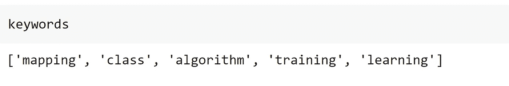
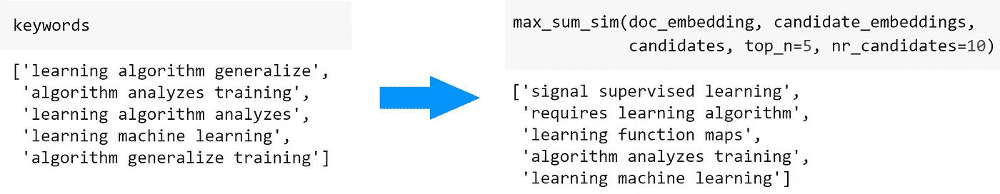
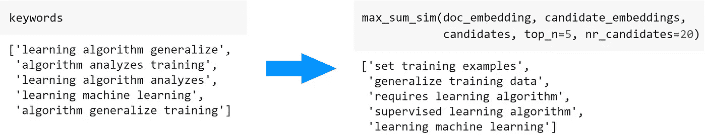
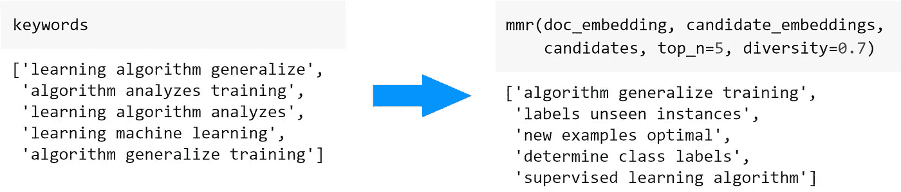

# 用 BERT 提取关键词

> 原文：<https://towardsdatascience.com/keyword-extraction-with-bert-724efca412ea?source=collection_archive---------0----------------------->

## [入门](https://towardsdatascience.com/tagged/getting-started)，NLP

## 一种提取关键词和关键短语的最小方法


由 [Wokandapix](https://pixabay.com/nl/users/wokandapix-614097/) 创作

当我们想要从特定文档中理解关键信息时，我们通常转向**关键词提取**。关键词提取是提取与输入文本最相关的单词和短语的自动化过程。

用[耙](https://github.com/aneesha/RAKE)和[雅克等方法！我们已经有了易于使用的软件包，可以用来提取关键字和关键短语。然而，这些模型通常基于文本的统计属性工作，而不是基于语义相似性。](https://github.com/LIAAD/yake)

伯特进来了。BERT 是一个双向转换器模型，它允许我们将短语和文档转换为捕捉其含义的向量。

> 如果我们用 BERT 代替统计模型会怎么样？

尽管有许多优秀的论文和解决方案使用了 BERT 嵌入(例如， [1](https://github.com/pranav-ust/BERT-keyphrase-extraction) 、 [2](https://github.com/ibatra/BERT-Keyword-Extractor) 、 [3](https://www.preprints.org/manuscript/201908.0073/download/final_file) )，但我找不到一个简单易用的基于 BERT 的解决方案。相反，我决定创建 [KeyBERT](https://github.com/MaartenGr/KeyBERT/) 一种利用 BERT 嵌入的简单易用的关键字提取技术。

现在，这篇文章的主要话题将不是使用 [KeyBERT](https://github.com/MaartenGr/KeyBERT) 而是一个关于如何使用 BERT 创建你自己的**关键词提取模型**的**教程**。

# 1.数据

对于本教程，我们将使用一个关于**监督机器学习**的文档:

```
doc = """
         Supervised learning is the machine learning task of 
         learning a function that maps an input to an output based 
         on example input-output pairs.[1] It infers a function 
         from labeled training data consisting of a set of 
         training examples.[2] In supervised learning, each 
         example is a pair consisting of an input object 
         (typically a vector) and a desired output value (also 
         called the supervisory signal). A supervised learning 
         algorithm analyzes the training data and produces an 
         inferred function, which can be used for mapping new 
         examples. An optimal scenario will allow for the algorithm 
         to correctly determine the class labels for unseen 
         instances. This requires the learning algorithm to  
         generalize from the training data to unseen situations 
         in a 'reasonable' way (see inductive bias).
      """
```

我相信，使用一个读者相当了解的主题的文档有助于你理解产生的关键短语是否有质量。

# 2.候选关键词/关键短语

我们首先从文档中创建候选关键字或关键短语的列表。虽然很多都集中在名词短语上，但是我们将通过使用 Scikit-Learns `CountVectorizer`来保持它的简单性。这允许我们指定关键字的长度，并使它们成为关键短语。这也是一个快速删除停用词的好方法。

我们可以使用`n_gram_range`来改变候选结果的大小。例如，如果我们将它设置为`(3, 3)`，那么得到的候选词将是包含 **3 个关键字**的短语。

然后，变量`candidates`只是一个包含候选关键字/关键短语的字符串列表。

**注意**:你可以用`n_gram_range`创造不同长度的关键短语。然后，您可能不想删除停用词，因为它们会将较长的关键短语连接在一起。

# 3.嵌入

接下来，我们将文档和候选关键字/关键短语都转换成数字数据。我们使用 **BERT** 来达到这个目的，因为它在相似性和释义任务上都显示出了很好的结果。

生成 BERT 嵌入的方法有很多，比如 [Flair](https://github.com/flairNLP/) ， [Hugginface Transformers](https://github.com/huggingface/transformers) ，现在甚至还有 [spaCy](https://nightly.spacy.io/) 的 3.0 版本！然而，我更喜欢使用`sentence-transformers`包，因为它允许我快速创建高质量的嵌入，这对于句子和文档级的嵌入非常有效。

我们用`pip install sentence-transformers`安装包。如果你在安装这个包时遇到问题，那么先安装 [Pytorch](https://pytorch.org/get-started/locally/) 可能会有帮助。

现在，我们将运行以下代码，将我们的文档和候选项转换为向量:

我们是 **Distilbert** ，因为它在相似性任务中表现出了出色的性能，这就是我们对关键词/关键短语提取的目标！

因为 transformer 模型有令牌限制，所以在输入大文档时可能会遇到一些错误。在这种情况下，你可以考虑把你的文档分成几个段落，然后把得到的向量放在一起(取平均值)。

**注意**:有很多[预先训练好的基于 BERT 的模型](https://www.sbert.net/docs/pretrained_models.html)可以用于关键词提取。不过，我会建议你使用`distilbert — base-nli-stsb-mean-tokens` 或`xlm-r-distilroberta-base-paraphase-v1` ，因为它们分别在**语义相似度**和**释义识别**中表现出色。

# 4.余弦相似性

在最后一步，我们希望找到与文档最相似的候选项。我们假设与文档最相似的候选项是表示文档的好的关键字/关键短语。

为了计算候选项和文档之间的相似度，我们将使用向量之间的**余弦相似度**，因为它在高维度中表现得相当好:

就这样了！我们将与输入文档最相似的前 5 个候选项作为结果关键字:



图片由作者提供。

结果看起来棒极了！这些术语看起来肯定像是描述了一个关于监督机器学习的文档。

现在，让我们看看如果将`n_gram_range`改为`(3,3)`会发生什么:


图片由作者提供。

似乎我们现在得到的是**关键词**而不是**关键词**！这些关键短语本身似乎很好地代表了文档。然而，我不高兴的是，所有的关键短语都如此相似。

为了解决这个问题，让我们看看我们的结果的多样化。

# 5.多样化

返回相似的结果是有原因的…它们最能代表文档！如果我们将关键字/关键短语多样化，那么它们就不太可能很好地代表整个文档。

因此，我们结果的多样化需要在关键词/关键短语的准确性和多样性之间取得微妙的平衡。

我们将使用两种算法来使我们的结果多样化:

*   最大和相似度
*   最大边际关联

## 最大和相似度

数据对之间的最大总距离定义为数据对之间的距离最大化。在我们的例子中，我们希望最大化候选项与文档的相似性，同时最小化候选项之间的相似性。

为此，我们选择前 20 个关键词/关键短语，并从这 20 个关键词/关键短语中选择彼此最不相似的 5 个:

如果我们将**设为低** `nr_candidates`，那么我们的结果似乎与我们最初的余弦相似度方法非常相似:



图片由作者提供。

然而，相对较高的**`nr_candidates`将创建更多不同的关键短语:**

****

**图片由作者提供。**

**如前所述，您必须牢记准确性和多样性之间的权衡。如果你增加了`nr_candidates`，那么很有可能你会得到非常多样化的关键词，但是这些关键词并不能很好的代表文档。**

**我建议你保持`nr_candidates`少于你文档中独特单词总数的 20%。**

## **最大边际关联**

**使我们的结果多样化的最后一个方法是**最大边际相关性** (MMR)。在文本摘要任务中，MMR 试图最小化冗余并最大化结果的多样性。幸运的是，一个名为[embe beed](https://arxiv.org/pdf/1801.04470.pdf)的关键词提取算法已经实现了一个版本的 MMR，允许我们使用它来多样化我们的关键词/关键短语。**

**我们首先选择与文档最相似的关键字/关键短语。然后，我们迭代地选择既与文档相似又与已经选择的关键词/关键短语不相似的新候选:**

**如果我们设置一个相对较低的多样性，那么我们的结果似乎与我们最初的余弦相似性方法非常相似:**

****

**图片由作者提供。**

**然而，相对较高的**多样性**分数将创建非常多样化的关键短语:**

****

**图片由作者提供。**

# **感谢您的阅读！**

**如果你像我一样，对人工智能、数据科学或心理学充满热情，请随时在 [LinkedIn](https://www.linkedin.com/in/mgrootendorst/) 上添加我，或者在 [Twitter](https://twitter.com/MaartenGr) 上关注我。**

**本文中的所有示例和代码都可以在这里找到:**

**[](https://github.com/MaartenGr/KeyBERT) [## 马尔滕格尔/凯伯特

### KeyBERT 是一种简单易用的关键字提取技术，它利用 BERT 嵌入来创建关键字和…

github.com](https://github.com/MaartenGr/KeyBERT)**