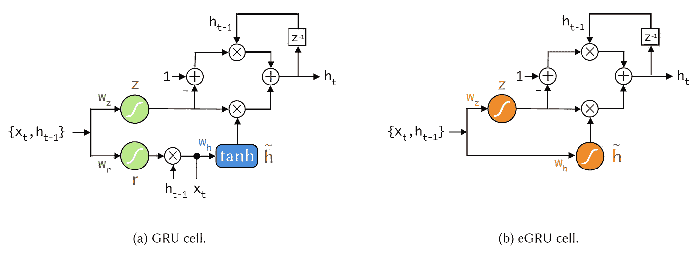
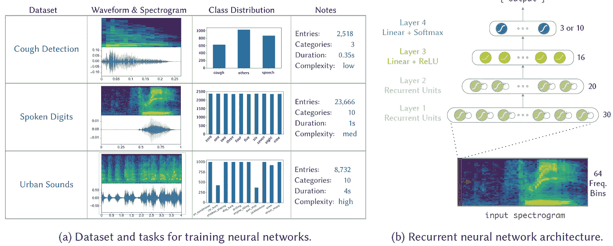
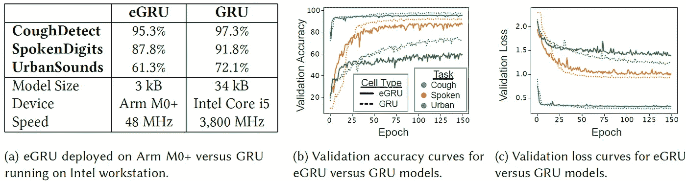

# 如何在手臂皮层上实现咳嗽检测-M0

> 原文：<https://towardsdatascience.com/keyword-spotting-embedded-on-the-arm-cortex-m0-69241f69fde3?source=collection_archive---------25----------------------->

## 小型微控制器中的关键字定位

# 超低功耗 MCU 的挑战

深度神经网络(DNNs)具有无与伦比的提取高级信息的能力(比如，“一个病人在过去的一个小时里咳嗽了几次？”)来自原始传感器数据。

但是 dnn 通常在云中实现，因为它们对于嵌入式微控制器来说太耗费资源了。这让嵌入式系统工程师面临一个令人不安的选择:要么(1)将数据从传感器传输到基于云的神经网络，并付出电池寿命短、延迟差和数据隐私威胁的代价，要么(2)放弃深度神经网络的强大推理能力。

目前针对这一问题的“edge AI”解决方案依赖于重型微处理器和 DSP，但这些器件可能会消耗 0.5 W 至 30 W 的功率。对于一个重量轻、不显眼的用于咳嗽计数的可穿戴设备来说，它们是不切实际的，因为它只有 10 毫瓦的备用功率。

在本文中，我们描述了一些将深度神经网络压缩到资源受限平台中的技巧，如超低功耗 ARM Cortex-M0+微控制器。

# 嵌入式门控循环单元

我们的方法基于嵌入式门控递归单元(eGRU)，它利用了一些修改(见图 1 ),我们现在将依次考虑这些修改。

图 1:示出了(a) GRU 和(b) eGRU 的小区架构的框图。与 GRU 相比，eGRU 省略了重置门 r，并且不需要权重 wr。此外，它用 softsign 变体替代 sigmoid 和 tanh 激活功能。

## 单门机构

eGRU 有一个更新门，但没有复位门。这将模型的占地面积减少了三分之一。现在，如果没有复位门，当出现某些大输入时，eGRU 容易闩锁。这一挑战在反向传播训练期间得到缓解:在每次迭代的正向传递期间，eGRU 状态从均匀随机分布初始化。这迫使 eGRU 在任何新的相关数据出现时丢弃过去的记忆。

## 软设计激活功能

Cortex-M0+没有专用的浮点单元，这使得*软设计*成为传统 GRU*tanh*和 *sigmoid* 激活功能的理想替代品。校正线性单元(ReLU)是更有效的激活函数，但是将 ReLU 与大量量化的权重相结合会破坏网络的性能。因此， *softsign* 是一个很好的妥协:它的饱和属性有助于保持网络性能，它的运行速度比 M0+上的 *tanh* 或 *sigmoid* 快 10 倍以上。

## 重量量化

eGRU 使用 3 位指数量化码存储其权重，从而将网络占用空间减少了 10 倍。

## Q15 定点运算

为了符合 M0+ 32 位架构，eGRU 使用 Q15 16 位定点格式执行所有运算。由于指数权重量化，权重乘法(最常见的运算)被实现为右移运算。这使得速度提高了 20 倍。

# 评估 eGRU

已经在不同复杂度的三个声学事件检测(AED)任务上评估了 eGRU:咳嗽检测、口语数字识别和城市声音识别(见图 2)。

与在工作站上实现的传统 GRU 相比，在 ARM Cortex-M0+上实现的 eGRU 在咳嗽检测上表现相当好，在语音数字任务上稍差。eGRU 在城市声音任务上的表现比传统的 GRU 差得多(见图 3)。

目前，eGRU 对于嵌入在低功率微控制器单元上的短声音事件检测或关键词识别任务是有效的。

图 2: (a)在实验中调查的三个音频事件检测(AED)数据集和任务的总结。咳嗽检测是最容易的，因为样本相对较短，并且它是一个 3 类问题。城市音长 10 倍，由 10 个不同的类别组成。(b)说明用于所有任务的神经网络结构。前两层中的重复单位是 RNN、eGRU 或 GRU 细胞。输入是 FFT 向量序列

图 3:显示嵌入 ARM Cortex-M0+处理器的 eGRU 模型性能的结果。(a)在不同的任务中，M0+上的 eGRU 模型与其在计算机上的完全精确的 GRU 模型相比，表现良好。然而，嵌入式 eGRU 模型是高效的，仅占用 GRU 的 10%大小，并且只需要廉价的整数运算。(eGRU 和 GRU 模型在所有任务中的验证精度曲线。eGRU 比 GRU 需要更长的历元来训练。(c)相应的验证损失曲线。eGRU 模型在短期任务中接近类似的损失

*对来源感兴趣？查看我们的原创研究* [*论文*](https://sites.dartmouth.edu/odame/research/asthma-symptom-monitoring/) *。*

*对茶感兴趣？这件物品与伯爵茶很相配。*